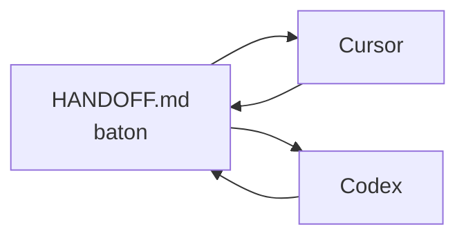
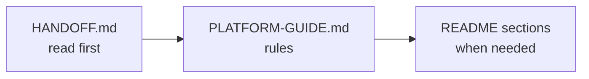

# The Switch Platform Mark 3.2 — Agent Entry Point

## CRITICAL RULE — READ THIS FIRST

Before doing ANY work in this repository:

1. Read **`HANDOFF.md`** for live session state, next steps, blockers — **Priority A** and **Priority C** are **COMPLETE**
2. Read **`docs/ideas/FINAL-PHASE-PLAN.md`** — current MVP closeout record; Priority **E** is deferred scope only unless the operator reopens A, C, or D
3. Read **`PLATFORM-GUIDE.md`** — the single consolidated guide (rules, architecture, modules, launch checklist)
3. Read **`README.md`** sections only when the handoff points to them (build record, launch notes)
4. Read **`PROJECT_RECOVERY.md`** and **`RESTORED_CHATS.md`** if folder or history context is unclear
5. For module work, open the matching section in **`PLATFORM-GUIDE.md` → Module reference**
6. For Mark 3.2 UI/product vision work, read **`docs/design/MARK-3.2-CURSOR-AGENT-BUILD-HANDOFF.md`** after **`UI-UX-MASTERPLAN.md`** — extend the live Fly stack; do not greenfield-replace with Supabase/Vercel unless the operator reopens architecture

Never switch between Cursor and Codex without updating **`HANDOFF.md`**, **`AGENTS.md`**, and pushing committed work first.

### Operator rule — every session

**At session start:** tell Cursor or Codex:

```text
Read HANDOFF.md first.
Then read docs/design/MARK-3.2-CURSOR-AGENT-BUILD-HANDOFF.md for Mark 3.2 vision (extend live repo — do not greenfield Supabase/Vercel).
```

Then read **`PLATFORM-GUIDE.md`** before making changes.

**Before each action:** consult **`HANDOFF.md`**, then **`docs/ideas/FINAL-PHASE-PLAN.md`**, then **`PLATFORM-GUIDE.md`**, then relevant **`README.md`** section.

**After each action — non-negotiable:** after **every** completed action (not only at session end):

1. Update **`HANDOFF.md`** → **Live session state** (What was just completed, What is next, Blockers, Verification last run).
2. Update **`AGENTS.md`** → keep **Operator and agent sync**, **MVP at a glance**, and any **completion records** aligned with HANDOFF. If live state or project story changed, AGENTS **must** be updated in the same pass — no exceptions.
3. Append **`README.md`** → **Ordered Build Record** when routes, modules, or product behavior changed (not for tiny doc-only typo fixes).

**Do not skip `AGENTS.md`.** HANDOFF is the baton; AGENTS is the front door every agent reads next. If they drift, the next session starts wrong.

**Priority C rule (24 June 2026):** Priority **C** is **COMPLETE**. Do not reopen C-1–C-10 unless the operator explicitly requests an exception.

**Priority A rule (26 June 2026):** Priority **A** is **COMPLETE** (A-1 through A-8). Canonical evidence: `release-evidence/2026-06-26-priority-a-canonical-closeout.md`. Strict closeout chain blanks `SWITCH_LAUNCH_VERIFICATION_SECRET`; `verify:live-onboarding` runs afterward as API-assisted regression only (not strict A-4). Browser-authenticated A-4 proof remains in `release-evidence/2026-06-25-priority-a-truth-audit.md`. Priorities **B**, **C**, and **D** are also complete for the current MVP.

**At session end:** run verification, confirm push, refresh **`HANDOFF.md`** and **`AGENTS.md`** if the story changed.

## Document map

| Document | Purpose |
|----------|---------|
| **`HANDOFF.md`** | **Read first** — live state, plain-English story, **dual-agent map**, **MVP at a glance** |
| **`AGENTS.md`** | This entry point — synced with HANDOFF |
| **`PLATFORM-GUIDE.md`** | Rules, architecture, modules, 22-item launch list, MVP modules |
| **`README.md`** | Cumulative product spec, **MVP at a glance**, Ordered Build Record (append only) |
| **`docs/ideas/FINAL-PHASE-PLAN.md`** | **Sole completion roadmap** — current MVP closeout complete; Priority **E** deferred scope only |
| **`docs/ideas/`** | Plan index — prior plans historical |
| **`src/modules/onboarding/README.md`** | Onboarding MVP scope |
| **`docs/MOCK-IDEA-BUILD-REFERENCE.md`** | UI build-from reference |
| **`docs/design/MARK-3.2-CURSOR-AGENT-BUILD-HANDOFF.md`** | Mark 3.2 full product vision + route mapping to live repo |
| **`docs/design/UI-UX-MASTERPLAN.md`** | Live UI implementation constraints (Study Atelier) |

**Dual-agent handoff:** `HANDOFF.md` → **Dual-agent document system** — never switch tools without updating it.

## Dual-agent usage (Cursor + Codex)

| | Cursor Agent | Codex |
|--|--------------|-------|
| **Use for** | UI, API, tests, git, multi-file edits | Planning, review, debugging, service logic |
| **Read first** | `HANDOFF.md` | `HANDOFF.md` |
| **Update before switch** | Live session state + session log | Same |
| **Full map** | `HANDOFF.md` → Dual-agent document system | Same |



## MVP at a glance

**Authoritative sync:** `HANDOFF.md` → **MVP at a glance**. Full history: `README.md` → Mark 3.2 Product Spec / Blueprint.

| Area | MVP today |
|------|-----------|
| **Live** | https://theswitchplatform.com — live on Fly; Priority A proof complete (26 June 2026) |
| **Auth** | One Google/Microsoft sign-in; admin/editor via email allowlists; panel on `/login`, `/account`, `/admin` |
| **Modules** | Exam Engine, Power Grid, Saved Progress, Read Aloud, Dashboard, Timed Assessments, Full GCSE Exams, Results, Recommendations, Accessibility, Access Arrangements, Onboarding |
| **Subjects** | GCSE Maths, English Language, Combined Science; iGCSE Maths |
| **Onboarding** | 8 steps → builds dashboard; secondary school; GCSE (England) + iGCSE; Wales/NI **later** |
| **Polish lane** | **Final Phase** — Priority **C complete** (24 June 2026); Priority **A complete** (26 June 2026) |

---

## Where the full content lives

All of the following are now in **`PLATFORM-GUIDE.md`** (one file):

- Session rules and multi-agent workflow
- Architecture and development rules
- Build priority order
- Design system index and UI checklist
- **Full End-to-End Completion List** (22 items — authoritative)
- Launch verification commands
- All module README content (Exam Engine, Power Grid, Saved Progress, Auth, CMS, etc.)
- Auth and live sign-in operator notes
- Changes 1.0 product direction
- Completion standard

Module folders still contain short **`README.md`** stubs that link back to **`PLATFORM-GUIDE.md`**.

## Source of truth

- Active folder: `/Users/lloydnwagbara/Documents/THE SWITCH 3`
- GitHub: `https://github.com/tech-fresh/the-switch-platform`
- Live site: `https://theswitchplatform.com`
- Do not use `THE SWITCH` or `THE SWITCH 2`

## Quick links

- **Dual-agent handoff** → [`HANDOFF.md` → Dual-agent document system](./HANDOFF.md#dual-agent-document-system-cursor--codex)
- **MVP at a glance** → [`HANDOFF.md` → MVP at a glance](./HANDOFF.md#mvp-at-a-glance-operators--agents)
- Launch checklist → **`PLATFORM-GUIDE.md` → Full End-to-End Completion List** (full 22 items also below)
- Module docs → **`PLATFORM-GUIDE.md` → Module reference**
- Live state → **`HANDOFF.md` → Live session state**
- Build history → **`README.md` → Ordered Build Record**
- UI / active plan → **`docs/ideas/FINAL-PHASE-PLAN.md`** · **`docs/MOCK-IDEA-BUILD-REFERENCE.md`**
- MVP usability plan → **`docs/ideas/MVP-USABILITY-LAUNCH-READINESS-PLAN.md`** · **`docs/LOCAL-LAUNCH-REHEARSAL.md`** · **`docs/MVP-OPERATOR-TRUTH.md`**
- Active redesign track → Areas **1–9 complete** (30 June 2026); operator-requested Mark 4 planning, route audit, Microsoft OIDC runtime restoration, and the current implementation passes on `/dashboard`, `/subjects`, `/`, and `/login` are now documented in `docs/ideas/MARK-4-UI-UX-IMPLEMENTATION-PLAN.md` and `docs/ideas/MARK-4-ROUTE-UX-AUDIT.md`
- Streamline mockup → `/streamlined-mockup` · entry from `/mock-idea-preview`
- **UI masterplan** → **`docs/design/UI-UX-MASTERPLAN.md`**
- **Mark 3.2 build handoff (vision)** → **`docs/design/MARK-3.2-CURSOR-AGENT-BUILD-HANDOFF.md`**
- External prompt pack → **`docs/CHATGPT-PROMPTS-README.md`**

**Current deployment note:** production is Fly-only. Treat `.vercel`, Netlify deploy config, and Vercel Blob persistence as retired unless the operator explicitly asks to restore a historical migration path.

---

## Operator and agent sync (plain English)

**Authoritative live detail:** `HANDOFF.md` → **Live session state** + **Plain-English — what the project is doing**.

**Non-coder summary with diagrams:** `README.md` → **Plain English — what this project is doing**.

This block stays aligned with `README.md` → **Operator and agent sync**. Do not drift.

| Question | Answer |
|----------|--------|
| Is the platform live? | Yes — https://theswitchplatform.com (Fly). Priority A truthful completion **complete** (26 June 2026). |
| What are we doing now? | **Onboarding personalization on `main`** (`d1bb73d` + build fix `1036ef0`). Fly deploy completed for watertight onboarding → dashboard → exams wiring. |
| Lane A — onboarding | **8 steps stay.** They **build the student dashboard**. Secondary school + **GCSE (England)** / **iGCSE** only; Wales/NI **coming later**. |
| Lane B — website | **Complete** — Priority C shipped 24 June 2026 (shell, planner, marketing, recovery). |
| What is next? | Deploy from `main` to Fly (`npm run deploy:fly`), then continue Mark 4 Phase 7 public marketing refinement. |

**Completion snapshot:** A `8/8` complete · B `4/4` complete · C `10/10` complete · D `6/6` complete · overall active plan `28/28` complete (`100%`).



---

## Full End-to-End Completion List (final — do not replace)

**Preservation rule:** This is the **final** launch checklist for this repository. **Do not replace, shorten, or delete** these 22 items. Do not overwrite earlier records in `README.md` or session logs in `HANDOFF.md`. Allowed updates only: mark an item complete or reopen it with date and evidence; append operator notes. Keep this list aligned with the copies in `README.md`, `HANDOFF.md`, and `PLATFORM-GUIDE.md`.

`Final Path Mark 1` = repo, scripts, governance surfaces in place.  
`Final Path Mark 2` = real deployed environment proven end to end with recorded approval.

Do not describe the platform as fully complete unless every item below is complete in the real target environment:

1. Configure the real live auth environment.
   Set `SWITCH_AUTH_MODE=oidc`, `SWITCH_AUTH_SECRET`, `SWITCH_AUTH_BASE_URL`, and one complete live OIDC provider block.
2. Prove the real deployed sign-in flow.
   Verify sign-in, callback, session creation, sign-out, and protected-route access in the live environment.
3. Prove the real deployed sign-up and onboarding flow.
   Verify welcome, learner-role selection, school and year-group capture, qualification-path capture, subject selection across GCSE and iGCSE where supported, accessibility-question capture, SEND and access-arrangement path visibility, guardian invite path, age-or-consent confirmation, UK school-source lookup behaviour, and first dashboard provisioning based on the learner's selected setup in the live environment.
4. Configure the real live persistence environment.
   Set `SWITCH_PERSISTENCE_DRIVER=sqlite` and `SWITCH_DATA_DIRECTORY` to the intended shared live student-data setup.
5. Prove live student-data continuity.
   Verify saved progress, results, account-linked settings, and session continuity across real usage.
6. Prove backup, restore, and recovery.
   Run live backup, restore, and recovery checks for the student-data path.
7. Configure the live CMS and editorial runtime.
   Set `SWITCH_CMS_BACKEND_MODE=live` and confirm the intended writable editorial operating mode.
8. Prove the live editorial workflow.
   Verify review, approval, publish, rollback, and blocked-content handling through the real operating path.
9. Configure live governance recording.
   Set `SWITCH_RECORD_GOVERNANCE=1` and `SWITCH_GOVERNANCE_ENVIRONMENT` for the target release environment.
10. Provide named launch ownership.
   Set `SWITCH_LAUNCH_APPROVER` and `SWITCH_LAUNCH_STOP_AUTHORITY`.
11. Provide governance review notes.
   Set `SWITCH_GOVERNANCE_PRIVACY_REVIEW_NOTE`, `SWITCH_GOVERNANCE_SAFEGUARDING_REVIEW_NOTE`, and `SWITCH_GOVERNANCE_RELEASE_REVIEW_NOTE`.
12. Provide governance sign-off notes.
   Set `SWITCH_GOVERNANCE_PRIVACY_SIGNOFF_NOTE`, `SWITCH_GOVERNANCE_SAFEGUARDING_SIGNOFF_NOTE`, `SWITCH_GOVERNANCE_ALERTS_SIGNOFF_NOTE`, `SWITCH_GOVERNANCE_INCIDENT_SIGNOFF_NOTE`, and `SWITCH_GOVERNANCE_RELEASE_SIGNOFF_NOTE`.
13. Configure the live base URL.
   Set `SWITCH_LIVE_BASE_URL` to the deployed platform URL.
14. Provide live route test access.
   For cookie or OIDC live auth, set `SWITCH_LIVE_STUDENT_COOKIE` and `SWITCH_LIVE_ADMIN_COOKIE`. For `external-header` live auth, set the matching live student and live admin identity environment values required by the walkthrough runtime.
15. Run live launch status verification.
   Execute `npm run verify:launch-status` and confirm the report shows the intended release environment inputs, command order, and any remaining live-only gaps truthfully before the final run starts.
16. Run live readiness verification.
   Execute `npm run verify:live-readiness`.
17. Run live persistence recovery verification.
   Execute `npm run verify:persistence-recovery`.
18. Run the final live walkthrough.
   Execute `npm run verify:live-walkthrough` across dashboard, subjects, assessments, exams, saved progress, results, account, support, and admin.
19. Run the final governance sign-off.
   Execute `npm run verify:launch-signoff`.
20. Run the final launch completion sequence.
   Execute `npm run verify:launch-complete`.
21. Store the release evidence permanently.
   Keep the outputs from launch-status, readiness, recovery, walkthrough, sign-off, and launch-complete as the permanent release record.
22. Confirm system-wide truth matches. **Completed — 23 June 2026 (Fly production); re-confirmed 26 June 2026 (Priority A closeout)**
   Ensure `README.md`, the admin launch view, runtime state, and recorded release evidence all match exactly.
   Plain-English: the notes, admin screen, and live website all tell the same story — no hidden mismatch.

**Completion rule:** Only when all 22 items above are done should the platform be described as fully complete, fully live, and 100% end to end.

**As of 26 June 2026:** all 22 items remain complete on Fly production at https://theswitchplatform.com. Priority A closeout re-confirmed A-6 and A-8. Evidence: `release-evidence/2026-06-26-priority-a-canonical-closeout.md` (canonical); `release-evidence/2026-06-25-priority-a-canonical-closeout.md` and `release-evidence/2026-06-23-final-path-mark-2-item-22-complete.md` (historical).

Re-check item 22 anytime:

```bash
npm run verify:priority-a-closeout
npm run verify:live-truth-match
```

---

## Item 3 completion record (23 June 2026)

- **Status: COMPLETE** on https://theswitchplatform.com
- **Proof:** browser-authenticated production onboarding evidence in `release-evidence/2026-06-25-priority-a-truth-audit.md`
- **Supportive automation:** `npm run verify:live-onboarding` passed as an API-assisted fresh-learner regression check
- **Evidence:** `release-evidence/2026-06-23-final-path-mark-2-item-3-complete.md`
- **UI mockup (visual):** `docs/SENECA-STYLE-ONBOARDING-MOCKUP.md`
- **UI build reference (code from here):** `docs/MOCK-IDEA-BUILD-REFERENCE.md`
- **AI ideas bank (plans + copy):** `docs/MOCK-IDEA-AI-IDEAS.md`
- **Active plan:** `docs/ideas/FINAL-PHASE-PLAN.md`
- **Streamline (historical):** `docs/ideas/STREAMLINE-WEBSITE-PLAN.md`

## Item 3 notes (appended — do not delete)

| Date | Note |
|------|------|
| 23 June 2026 | Shipped: `/onboarding`, API, dashboard gate. Live proof passed — see completion record above. |
| 24 June 2026 | **MVP scope locked:** onboarding **stays** (8 steps); secondary school; **GCSE (England)** + **iGCSE**; Wales/NI **coming later**. Module doc: `src/modules/onboarding/README.md`. |

---

## Priority C completion record (24 June 2026) — AUTHORITATIVE

**Status: COMPLETE — CLOSED.** Study Atelier product finish lane (`docs/ideas/FINAL-PHASE-PLAN.md` → C-1 through C-10).

**Moving forward:** every agent session starts with `HANDOFF.md`. Priorities **A** through **D** are complete for the current MVP. Priority **E** is deferred scope only unless the operator reopens something.

**Architecture gate (must hold for all C work already shipped):**

```
route (thin page) → module service → API route → persistence
```

| Module / surface | Path |
|------------------|------|
| Weekly planner | `src/modules/weekly-planner/service.ts` → `/api/planner/week` |
| Planner dismiss | `src/modules/dashboard/ui-preferences-service.ts` → `/api/dashboard/ui-preferences` |
| Exam focus mode | `src/lib/exams/focus-mode.ts` — lobby in shell; active paper without shell |
| Subject tones | `src/lib/subjects/tone.ts` — catalog-backed, no duplicate subject collection |
| Recovery UI | `src/components/student-route-recovery.tsx` |
| Student shell | `src/components/mock-idea/student-app-shell.tsx` + `requireStudentAppRouteContext()` |

| Item | What shipped |
|------|----------------|
| **C-1** | `StudentAppShell` on `/results`, `/saved-progress`, `/recommendations`, `/accessibility`, `/account` (signed in) |
| **C-2** | Exams **focus mode**: lobby in shell; active paper at `/exams?examId=…&focus=1` without study rail — `src/lib/exams/focus-mode.ts` |
| **C-3** | `/support` as public marketing hub (`PublicMarketingPage`) |
| **C-4** | Marketing chrome on `/`, `/how-it-works`, `/login`, `/support` |
| **C-5** | Planner dismiss persisted per user — `/api/dashboard/ui-preferences` |
| **C-6** | API-backed weekly planner — `src/modules/weekly-planner/`, `/api/planner/week`, dashboard + `/progress` |
| **C-7** | Catalog subject tone chips — `src/lib/subjects/tone.ts` |
| **C-8** | Account in shell when signed in; login on marketing chrome |
| **C-9** | Accessibility route aligned (C-1 shell) |
| **C-10** | Shared recovery UI — `StudentRouteRecovery` on exams, progress, saved-progress empty state |

**Verification:** `npm run lint && npm run type-check && npm run test` — 102/102 passed.

**What is next:** Priority **B** — repo/docs sync. Priority **A** and **C** are **complete**.

**Current A status (26 June 2026):** **COMPLETE** — A-1 through A-8 closed. Canonical evidence: `release-evidence/2026-06-26-priority-a-canonical-closeout.md`. Re-run: `npm run verify:priority-a-closeout` after cookie refresh for new releases.

**Key files for agents**

- Active plan: `docs/ideas/FINAL-PHASE-PLAN.md`
- UI reference: `docs/MOCK-IDEA-BUILD-REFERENCE.md`
- Weekly planner module: `src/modules/weekly-planner/README.md`
- Exam focus mode: `src/modules/exam-engine/README.md`
