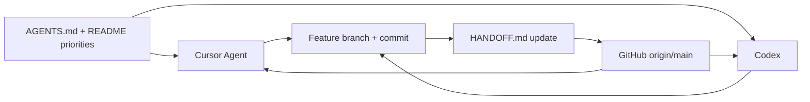

# Session Handoff — The Switch Platform

> **Purpose:** This file is the live handover note between **Cursor Agent** and **Codex**.
> Read it at the start of every session. Update it at the end of every session.
> Do not delete session history — add new entries at the top of the Session Log.

## Golden rule

**Never switch between Cursor and Codex without updating this file first.**

Commit and push to GitHub before switching tools unless a task explicitly requires a local-only commit.

---

## Live session state

Update this section every session.

### Current state

- **Active folder:** `/Users/lloydnwagbara/Documents/THE SWITCH 3`
- **GitHub repo:** `https://github.com/tech-fresh/the-switch-platform`
- **Current branch:** main
- **Last updated by:** Cursor
- **Last updated:** 2026-06-21
- **Last commit:** df20612 — Add HANDOFF.md and consolidate multi-agent workflow in AGENTS.md

### Active task

- **Priority item #:** setup — multi-agent workflow
- **Module:** project-workflow
- **Status:** in progress
- **Branch:** main

### What was just completed

- Created and expanded `HANDOFF.md` with full multi-agent workflow guidance
- Updated `AGENTS.md` with consolidated Multi-Agent Workflow and `HANDOFF.md` references
- Fixed duplicate HANDOFF content in `README.md`
- Updated recovery files for THE SWITCH 3 source of truth

### What is next

- Begin using `HANDOFF.md` at the start and end of every Cursor and Codex session
- Complete remaining workflow setup (`.cursor/rules/` if not yet added)
- Choose the next real product task from build priority #1 (Exam Engine)

### Blockers

- none

### Verification last run

- [ ] `npm run lint`
- [ ] `npm run type-check`
- [ ] `npm run test`
- [ ] `npm run test:smoke` (only if routes changed)
- [ ] `npm run verify:release` (if bigger release or launch-path change)
- [x] Pushed to GitHub

---

## Source of truth

| Item | Value |
|------|-------|
| Active local folder | `/Users/lloydnwagbara/Documents/THE SWITCH 3` |
| GitHub remote | `https://github.com/tech-fresh/the-switch-platform` |
| Do not use | `/Users/lloydnwagbara/Documents/THE SWITCH` or `THE SWITCH 2` |
| Agent rules | `AGENTS.md` |
| Product history | `README.md` (cumulative — append only) |
| Recovery notes | `PROJECT_RECOVERY.md`, `RESTORED_CHATS.md` |
| Session handoff | `HANDOFF.md` (this file) |
| Cursor-only rules | `.cursor/rules/` (when present) |

---

## Document map

| Document | Purpose |
|----------|---------|
| `AGENTS.md` | Architecture, priorities, session rules, completion standard, design system |
| `HANDOFF.md` | Live session state and handover between Cursor and Codex |
| `README.md` | Cumulative product spec, build record, launch notes |
| `.cursor/rules/` | Cursor-specific enforcement mirroring `AGENTS.md` |

---

## Workflow diagram



---

## Session start checklist

Before any code or doc change:

1. Read `AGENTS.md`
2. Read `README.md` → Non-negotiable development rules + Active build priority order
3. Read this file (`HANDOFF.md`) → Live session state + What is next
4. Read `PROJECT_RECOVERY.md` if folder or history context is unclear
5. Read the relevant `src/modules/<module>/README.md`
6. Run `git status` and `git pull origin main` (or checkout the active feature branch)
7. Confirm the task maps to **one module** and one build-priority item
8. Paste the standard session prompt below into the active tool

---

## Session end checklist

Before stopping or switching tools:

1. Run `npm run lint && npm run type-check && npm run test`
2. Run `npm run test:smoke` if routes or pages changed
3. Run `npm run verify:release` for bigger release or launch-path changes
4. Commit with a clear module-focused message
5. Confirm push to GitHub succeeded
6. Update **Live session state** in this file
7. Add a new **Session log** entry at the top
8. Append to `README.md` Ordered Build Record if routes, modules, or behavior changed

---

## Standard session prompt

Copy into Cursor or Codex at the start of each session:

```text
Project: The Switch Platform Mark 3.2
Root: /Users/lloydnwagbara/Documents/THE SWITCH 3
GitHub: https://github.com/tech-fresh/the-switch-platform

Read first:
1. AGENTS.md
2. README.md priorities and non-negotiable rules
3. HANDOFF.md
4. src/modules/<relevant-module>/README.md

Task: [one module only]
This task serves priority #: [number or setup/launch]

Rules:
- Follow build priority order unless explicitly overridden
- One module per session
- API-first: no business logic only in page components
- Use src/lib/server/api.ts wrappers in API routes
- Do not mix exam, progress, content, or access-arrangements logic across modules
- Mobile-first and accessibility-first
- Append README build record if routes/modules/behavior changed

On completion:
- lint, type-check, test
- commit and push
- update HANDOFF.md live session state and session log

Do NOT use THE SWITCH or THE SWITCH 2 folders.
```

---

## Branch and concurrency rules

- Default branch: `main`
- Use `feature/<module>-<short-description>` for focused feature work when requested
- One feature branch per task when branching
- Do not let Cursor and Codex edit the same branch with uncommitted changes
- Commit, push, and update this file before switching tools
- Do not delete rules, routes, modules, or documentation unless explicitly requested

---

## Tool split

| Work type | Preferred tool |
|-----------|----------------|
| Multi-file UI + API + tests | Cursor Agent |
| File edits, refactors, UI changes, code navigation | Cursor Agent |
| Focused module service logic | Codex or Cursor |
| Planning, reviewing, debugging, explaining changes | Codex |
| PRs, repo search, terminal verification | Cursor Agent |
| Design-system UI following Changes 1.0 | Either — follow `AGENTS.md` Design System Index |

---

## Active build priority order

State which priority item each task serves. Do not skip higher-priority work unless explicitly overridden — record the reason here and in the README build record if you do.

1. Exam Engine
2. Power Grid
3. Saved Progress
4. Read Aloud
5. Dashboard
6. Timed Assessments
7. Full GCSE Exams
8. Content Fact-Checking And Editorial Workflow
9. Results
10. Recommendations
11. Accessibility
12. Access Arrangements foundation

Special labels:

- `setup` — project workflow, docs, multi-agent process
- `launch — Final Path Mark 2` — live deployment, auth, persistence, governance verification

---

## Architecture gate

Every change must follow this flow:

```text
UI route (src/app) → thin component → module service (src/modules) → contracts/types → API route (src/app/api) → persistence (src/lib/persistence)
```

Rules:

- Keep modules independent
- No business logic only in `src/app/**/page.tsx`
- API routes use helpers from `src/lib/server/api.ts`
- Do not mix exam logic with progress logic
- Do not mix saved progress with content logic
- Keep Read Aloud separate from revision and quiz logic
- Keep Access Arrangements independent from other modules
- All student progress must auto-save
- Mobile-first UI and accessibility-first design

---

## Module name guide

| If working on… | Module value |
|----------------|--------------|
| Exams | `exam-engine` |
| Progress grid / next steps | `power-grid` |
| Save and resume | `saved-progress` |
| Read aloud | `read-aloud` |
| Home screen | `dashboard` |
| Short timed tests | `timed-assessment` |
| Sign-up / login | `auth` |
| Onboarding | `onboarding` |
| Content / CMS | `cms` or `content` |
| Live launch / deployment | `operations` or `governance` |
| Workflow / docs setup | `project-workflow` |

---

## Status guide

| Status | Meaning |
|--------|---------|
| `not started` | Task identified but work has not begun |
| `in progress` | Actively being worked on |
| `blocked` | Cannot continue until a blocker is resolved |
| `done` | Task complete for this session or slice |

---

## Priority quick reference

| Priority # | Area |
|------------|------|
| 1 | Exam Engine |
| 2 | Power Grid |
| 3 | Saved Progress |
| 4 | Read Aloud |
| 5 | Dashboard |
| 6 | Timed Assessments |
| 7 | Full GCSE Exams |
| 8 | Content Fact-Checking / Editorial |
| 9 | Results |
| 10 | Recommendations |
| 11 | Accessibility |
| 12 | Access Arrangements |

---

## Daily routine

### Start

- [ ] Open `/Users/lloydnwagbara/Documents/THE SWITCH 3`
- [ ] `git pull origin main`
- [ ] Read this file → Active task + What is next + Blockers
- [ ] Read `AGENTS.md` + relevant module README
- [ ] Create or checkout feature branch if needed
- [ ] Paste standard session prompt
- [ ] State which priority # the task serves

### During

- [ ] One module only
- [ ] Match existing codebase patterns
- [ ] UI work: follow `AGENTS.md` Design System Index
- [ ] No cross-module logic mixing

### End

- [ ] `npm run lint && npm run type-check && npm run test`
- [ ] `npm run test:smoke` if routes changed
- [ ] Commit and push to GitHub
- [ ] Update Live session state in this file
- [ ] Add Session log entry
- [ ] Append README build record if product behavior changed

---

## Switching between Cursor and Codex

1. Complete the **Session end checklist**
2. Update **Live session state** — especially What is next and Blockers
3. Add a **Session log** entry naming the tool you are leaving
4. Commit and push
5. Open the other tool on `/Users/lloydnwagbara/Documents/THE SWITCH 3`
6. Run `git pull`
7. Read this file and paste the **Standard session prompt**

---

## Key files to read early

- `AGENTS.md` — rules, priorities, design system, completion standard
- `README.md` — product spec and build history
- `package.json` — scripts and commands
- `src/lib/server/api.ts` — API route wrappers
- `src/lib/persistence/runtime.ts` — persistence mode and storage paths
- `src/modules/exam-engine/service.ts` — highest-priority exam logic
- `src/modules/saved-progress/service.ts` — autosave and progress logic
- `src/modules/power-grid/service.ts` — progress and action summary logic

---

## Completion standard

- Complete each task fully before moving on
- Fix errors found during the task before calling work done
- Do not consider work complete until it builds, runs, and passes the relevant checks
- Verify git push succeeded before reporting completion
- Only change what the task asks for — no silent unrelated refactors

---

## Session log (newest first)

Add a new entry here at the end of every session. Do not delete older entries.

### 2026-06-21 — Cursor — Commit multi-agent handoff workflow

- Branch: main
- Module: project-workflow
- Priority #: setup — multi-agent workflow
- Done: expanded HANDOFF.md, updated AGENTS.md, fixed README duplicates, updated recovery paths
- Next: use HANDOFF.md every session; add `.cursor/rules/`; start priority #1 work
- Commit: pending this session

### 2026-06-21 — Cursor — Expanded HANDOFF.md with full workflow

- Branch: main
- Module: project-workflow
- Priority #: setup — multi-agent workflow
- Done: expanded HANDOFF.md with checklists, priorities, architecture gate, tool split, session prompt, and daily routine; removed duplicate template content
- Next: commit and push to GitHub; begin using file every session; continue workflow setup
- Commit: not committed yet

### 2026-06-21 — Cursor — First HANDOFF fill-in

- Branch: main
- Module: project-workflow
- Priority #: setup — multi-agent workflow
- Done: created HANDOFF.md and filled placeholders with real values
- Next: expand with full workflow guidance
- Commit: not committed yet
</think>


Read