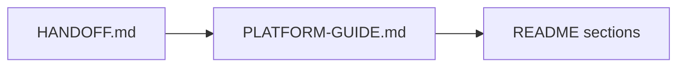

# The Switch Platform — Complete Guide

**Mark 3.2 · Single consolidated reference**

This file merges **`AGENTS.md`**, all **module READMEs**, and the core **README** rules into one place.

| Document | Purpose |
|----------|---------|
| **`HANDOFF.md`** | Live session state — read **first** every session |
| **`PLATFORM-GUIDE.md`** (this file) | Rules, architecture, modules, launch checklist |
| **`README.md`** | Cumulative product history and Ordered Build Record (append only) |
| **`AGENTS.md`** | Short entry point → points here |

**Dual-agent rule:** `HANDOFF.md` is the baton between **Cursor** and **Codex** — read it first; update before switching tools. Full map → [`HANDOFF.md` → Dual-agent document system](./HANDOFF.md#dual-agent-document-system-cursor--codex).

**Active folder:** `/Users/lloydnwagbara/Documents/THE SWITCH 3`  
**GitHub:** `https://github.com/tech-fresh/the-switch-platform`  
**Live site:** `https://theswitchplatform.com`

---

## Operator and agent sync

**Synced with `HANDOFF.md`, `AGENTS.md`, and `README.md`.** Live task detail → **`HANDOFF.md` → Live session state**.

| Question | Answer |
|----------|--------|
| Is the platform live? | Yes — https://theswitchplatform.com (Fly). **Fully complete** on production — Priority A closed 26 June 2026. |
| What are we doing now? | **Priority A complete** (26 June 2026). **Priority C complete** (24 June 2026). **Priority D** is complete too; only deferred Priority E scope remains. |
| Onboarding | **8 steps stay** — they **create the dashboard**. Secondary school; GCSE (England) + iGCSE; Wales/NI **later**. |
| Website polish | **Complete** — Priority C shipped 24 June 2026 (shell, planner, marketing, recovery). |
| Priority C | **Complete — closed.** Do not reopen unless operator requests exception. |

**Completion snapshot:** A `8/8` complete · B `4/4` complete · C `10/10` complete · D `6/6` complete · overall active plan `28/28` complete (`100%`).

### MVP at a glance

| | |
|--|--|
| **Product** | GCSE / iGCSE revision, timed practice, exam readiness, progress |
| **Build priority #1–12** | Exam Engine → Power Grid → Saved Progress → Read Aloud → Dashboard → Timed Assessments → Full GCSE Exams → Editorial → Results → Recommendations → Accessibility → Access Arrangements |
| **Launch subjects** | GCSE Maths, English Language, Combined Science; iGCSE Maths |
| **Onboarding** | 8 steps; `/onboarding` → `/dashboard`; see `src/modules/onboarding/README.md` |
| **Priority C** | **Complete — 24 June 2026** (shell, focus mode, planner, marketing, recovery) |
| **Priority A** | **Complete — 26 June 2026** (A-1–A-8; evidence in `release-evidence/2026-06-25-priority-a-canonical-closeout.md`) |
| **Active work** | **Priority E** — deferred scope only; current MVP completion plan is closed |
| **Key routes** | `/`, `/login`, `/onboarding`, `/dashboard`, `/subjects`, `/exams`, `/assessments`, `/progress` |

Full MVP spec and history → **`README.md` → Mark 3.2 Product Spec** (append only).



---

## Table of contents

0. [Operator and agent sync](#operator-and-agent-sync)
1. [Session rules](#session-rules)
2. [Architecture](#architecture)
3. [Development rules](#development-rules)
4. [Build priority](#build-priority)
5. [Design system](#design-system)
6. [Full End-to-End Completion List](#full-end-to-end-completion-list)
7. [Launch verification commands](#launch-verification-commands)
8. [Module reference](#module-reference)
9. [Shared folders](#shared-folders)
10. [Auth and live sign-in](#auth-and-live-sign-in)
11. [Changes 1.0 product direction](#changes-10-product-direction)
12. [Completion standard](#completion-standard)

---

## Session rules

### At session start

Tell Cursor or Codex:

```text
Read HANDOFF.md first.
```

Then:

1. Read **`HANDOFF.md`** → Live session state, What is next, Blockers
2. Read **`docs/ideas/FINAL-PHASE-PLAN.md`** → current MVP closeout record and any operator-approved Priority **E** expansion item
3. Read **`PLATFORM-GUIDE.md`** (this file) → rules, priorities, modules
4. Read **`README.md`** sections only when the handoff points to them (build record, launch notes)
5. Run `git status` and `git pull origin main`
6. Confirm the task maps to **one module** and either a doc-truth update or an operator-approved Priority **E** expansion item

### Before each action

Consult in order: **`HANDOFF.md`** → **`docs/ideas/FINAL-PHASE-PLAN.md`** → **`PLATFORM-GUIDE.md`** → relevant **`README.md`** section.

### After each action

1. Update **`HANDOFF.md`** Live session state (short bullets)
2. Update **`AGENTS.md`** operator sync / MVP / completion records to match HANDOFF — **non-negotiable** when live state or project story changes
3. Append **`README.md`** Ordered Build Record when routes, modules, or behavior changed
4. Commit and push when the action produced repo changes (unless local-only commit requested)

### At session end

1. Run `npm run lint && npm run type-check && npm run test`
2. Run `npm run test:smoke` if routes or pages changed
3. Commit and confirm push to GitHub
4. Refresh **`HANDOFF.md`** and add a session log entry if needed

### Handoff rule

Never switch between Cursor and Codex without updating **`HANDOFF.md`** and pushing committed work first.

### Tool split

- **Cursor Agent:** file edits, refactors, UI, multi-file work, terminal verification
- **Codex:** planning, reviewing, debugging, focused module logic

### Branch rule

- Default branch: `main`
- Use `feature/<module>-<short-description>` only when requested

---

## Architecture

### Flow

```text
src/app route → thin component → src/modules/*/service.ts → contracts/types → src/app/api → src/lib/persistence
```

### Principles

- Modular MVP · Website first · API first · Future mobile app
- Keep modules independent
- No business logic only in page components
- Use API layer between UI and services
- Mobile-first UI · Accessibility-first design

### Repository map

| Path | Purpose |
|------|---------|
| `src/app` | Website pages and layouts |
| `src/app/api` | API layer |
| `src/modules` | Core business logic by feature |
| `src/lib` | Shared server, repository, API, persistence utilities |
| `src/components` | UI components (no business rules) |
| `src/data` | Seeded catalog and support data |
| `tests` | Node test suite |
| `scripts` | Smoke, release, persistence tooling |

### Key files

| File | Purpose |
|------|---------|
| `src/modules/exam-engine/service.ts` | Highest-priority exam logic |
| `src/modules/saved-progress/service.ts` | Autosave and progress |
| `src/modules/power-grid/service.ts` | Progress and next-action summaries |
| `src/modules/auth/provider.ts` | Auth provider and env logic |
| `src/modules/cms/backend.ts` | CMS runtime and writeability |
| `src/data/mvp-content-catalog.json` | Main seeded content |
| `src/lib/persistence/runtime.ts` | Persistence mode and storage paths |

---

## Development rules

- Keep modules independent
- Do not mix exam logic with progress logic
- Do not mix saved progress with content logic
- Keep Read Aloud separate from revision and quiz logic
- All student progress must auto-save
- Full GCSE exams use official durations
- Manual assessments cannot exceed official durations
- No business logic only in the website frontend
- Use an API layer between frontend and backend services
- Preserve language-ready structure before translation
- Keep Access Arrangements independent from Exam Engine, Timed Assessment, Saved Progress, Read Aloud, and Accessibility
- Saved Progress must store active access arrangement settings
- Do not build complex SEND UI, AI support, or school admin tools until explicitly prioritised
- Guided sign-up must capture learner stage, school, qualification path, and subject setup before the personalised dashboard is ready
- Guardian invite and age-or-consent checks remain part of onboarding architecture
- School selection uses maintained UK school-source links
- Reviewed-only student visibility · Source attribution · Fact-check gates · No silent draft publishing

---

## Build priority

Active order unless explicitly overridden:

1. Exam Engine
2. Power Grid
3. Saved Progress
4. Read Aloud
5. Dashboard
6. Timed Assessments
7. Full GCSE Exams
8. Content Fact-Checking And Editorial Workflow
9. Results
10. Recommendations
11. Accessibility
12. Access Arrangements foundation

**Core MVP surfaces:** Dashboard · Power Grid · Timed Assessments · Exam Engine · Saved Progress · Recommendations · Accessibility · Read Aloud · Access Arrangements · Guided sign-up and onboarding

---

## Design system

### Index

- Primary design: `src/app/globals.css`
- Tailwind: `tailwind.config.ts`
- Global shell: `src/app/layout.tsx`
- Homepage: `src/app/page.tsx`
- Dashboard: `src/components/dashboard-home.tsx`
- Accessibility: `src/app/accessibility/accessibility-experience.tsx`
- Exams: `src/app/exams/exam-experience.tsx`
- Assessments: `src/app/assessments/assessment-experience.tsx`
- Admin/CMS: `src/app/admin/page.tsx`

### Rules

- Read `globals.css` before changing global visual behavior
- Reuse stone, sky, emerald, amber, teal, and rose utility patterns
- Mobile-first layouts; respect accessibility runtime attributes on `html`/`body`
- Extend existing page patterns; do not invent disconnected visual systems

---

## Full End-to-End Completion List

**Final list — do not replace or shorten.** This is the **only** list for judging true 100% completion. **Do not overwrite** earlier build history in `README.md` or session logs in `HANDOFF.md`. Allowed updates only: item status with date/evidence; appended operator notes. Intentionally mirrored in `README.md`, `AGENTS.md`, `HANDOFF.md`, and this file — keep all copies aligned.

`Final Path Mark 1` = repo, scripts, governance surfaces in place.  
`Final Path Mark 2` = real deployed environment proven end to end with recorded approval.

Do not describe the platform as fully complete unless **every** item below is complete in the **real target environment**.

| # | Requirement |
|---|-------------|
| **1** | Configure live auth: `SWITCH_AUTH_MODE=oidc`, `SWITCH_AUTH_SECRET`, `SWITCH_AUTH_BASE_URL`, one complete OIDC provider block |
| **2** | Prove live sign-in: sign-in, callback, session, sign-out, protected routes |
| **3** | Prove live sign-up and onboarding: welcome, role, school/year, qualification, subjects (GCSE/iGCSE), accessibility, SEND/access paths, guardian invite, age/consent, UK school lookup, first dashboard from learner setup |
| **4** | Configure live persistence: `SWITCH_PERSISTENCE_DRIVER=sqlite`, `SWITCH_DATA_DIRECTORY` for shared live student data |
| **5** | Prove live student-data continuity: saved progress, results, account settings, sessions |
| **6** | Prove backup, restore, and recovery for student data |
| **7** | Configure live CMS: `SWITCH_CMS_BACKEND_MODE=live`, writable editorial mode |
| **8** | Prove live editorial workflow: review, approve, publish, rollback, blocked content |
| **9** | Configure governance recording: `SWITCH_RECORD_GOVERNANCE=1`, `SWITCH_GOVERNANCE_ENVIRONMENT` |
| **10** | Named launch ownership: `SWITCH_LAUNCH_APPROVER`, `SWITCH_LAUNCH_STOP_AUTHORITY` |
| **11** | Governance review notes: privacy, safeguarding, release |
| **12** | Governance sign-off notes: privacy, safeguarding, alerts, incident, release |
| **13** | Live base URL: `SWITCH_LIVE_BASE_URL` |
| **14** | Live route test access: `SWITCH_LIVE_STUDENT_COOKIE` + `SWITCH_LIVE_ADMIN_COOKIE` (or external-header equivalents) |
| **15** | `npm run verify:launch-status` |
| **16** | `npm run verify:live-readiness` |
| **17** | `npm run verify:persistence-recovery` |
| **18** | `npm run verify:live-oidc-proof` then `npm run verify:live-walkthrough:real-auth` |
| **19** | `npm run verify:launch-signoff` |
| **20** | `npm run verify:launch-complete` |
| **21** | Store release evidence permanently in `release-evidence/` |
| **22** | Confirm system-wide truth: `README.md`, admin launch view, runtime state, and evidence all match — `npm run verify:live-truth-match` |

### Item 22 record (26 June 2026 — Fly production — Priority A closed)

**Status: COMPLETE** on https://theswitchplatform.com

| Proof | Result |
|-------|--------|
| `npm run verify:live-truth-match` (A-8) | Passed 26 June 2026 |
| `npm run verify:priority-a-closeout` (A-6) | Passed 26 June 2026 |
| Admin launch view | 6/6 environment · 5/5 sign-off · 8/8 evidence |
| Canonical evidence | `release-evidence/2026-06-25-priority-a-canonical-closeout.md` |
| Historical evidence | `release-evidence/2026-06-23-final-path-mark-2-item-22-complete.md` |

**Completion rule:** All 22 items are done in the real target environment with refreshed Priority A proof recorded (26 June 2026). The platform may be described as fully complete, fully live, and 100% end to end.

**Item 3 status (23 June 2026; browser-auth proof strengthened 25 June 2026):** **COMPLETE** — browser-authenticated production proof is recorded in `release-evidence/2026-06-25-priority-a-truth-audit.md`. `npm run verify:live-onboarding` remains API-assisted regression coverage, not the strict A-4 real-auth proof.

### Operator notes

- Live admin access: email allowlist via `SWITCH_AUTH_ADMIN_EMAILS` and `SWITCH_AUTH_EDITOR_EMAILS`
- Sign-in entry: `/login` and `/login?reauth=1`
- Sign-off on Fly may require `fly ssh console` when local Mac lacks `/data`
- Local `.env.local` needs `SWITCH_RECORD_GOVERNANCE=1` to re-run signoff from Mac
- Placeholder cookies do not satisfy item 14

---

## Launch verification commands

Recommended order against the release environment:

```bash
npm run verify:launch-status
npm run verify:persistence-health
npm run verify:live-readiness
npm run verify:persistence-recovery
npm run verify:live-oidc-proof
npm run verify:live-walkthrough:real-auth
npm run verify:launch-signoff
npm run verify:launch-complete
npm run verify:live-truth-match
npm run verify:microsoft-oauth-live
npm run verify:google-oauth-live
```

---

## Module reference

Modules are listed in build-priority order where applicable.

### Exam Engine Module

`src/modules/exam-engine/`

Owns exam mode rules and official exam timing. Access arrangements applied via Access Arrangements module.

- Mock GCSE paper definitions, session creation, question-slot blueprints, variant rotation
- Access-arrangement-aware official duration handling
- Resume via Saved Progress; post-submit review against submitted question set
- Live recovery paths for reload, autosave, submit, fresh-attempt failures
- Tests: `tests/exam-engine-service.test.mjs`
- Does **not** own long-term persistence

### Power Grid Module

`src/modules/power-grid/`

Owns progress calculations and Power Grid level mapping.

- Subject-level readiness summaries, overall progress from exam/assessment activity
- Next-best-action routing: active saved work → review items → revision routes
- Submitted work routes to Results, not back into live attempts

### Saved Progress Module

`src/modules/saved-progress/`

Owns save and resume state. Stores access arrangement snapshots with records.

- Autosave for exam and timed assessment state
- File-backed repository, normalization, safe resume pointers, status transitions
- Framework-neutral overview contract for API delivery
- Owns persistence contracts, not UI

### Read Aloud Module

`src/modules/read-aloud/`

Owns browser SpeechSynthesis integration. Entitlement from access profile.

- Session view models, voice/speed preview, support-aware enablement

### Dashboard Module

`src/modules/dashboard/`

Owns student-home aggregation. Does not calculate exam or progress scores itself.

- Home metrics, route cards, session summaries, subject focus from Power Grid
- Serves `/` and `/dashboard`

### Timed Assessment Module

`src/modules/timed-assessment/`

Owns manual timed assessment attempts. Access arrangements applied before start.

- Definitions, lifecycle types, manual duration with official caps
- Framework-neutral contracts for definitions and resume seeds

### Onboarding Module

`src/modules/onboarding/`

Owns guided sign-up and first-time learner setup (**Full End-to-End Completion List item 3**).

- Progressive `/onboarding` route: welcome, school/year, qualification, subjects, accessibility, guardian invite, consent
- **Secondary school** capture on step 3; **England-only** nation picker during MVP
- **MVP qualification routes:** GCSE (England) and iGCSE — Wales and Northern Ireland GCSE routes deferred (signposted in UI)
- UK school-source links (England active; Scotland, Wales, Northern Ireland reserved for later releases)
- Persists learner profile; gates `/dashboard` until setup is complete
- Dashboard personalisation uses selected subjects and qualification path

Full module scope: `src/modules/onboarding/README.md`

### CMS Module

`src/modules/cms/`

Owns content-source boundaries and editorial workflow architecture.

- Editorial gate summary, review queue, backend adapter for live writable mode
- Source reference visibility before full CMS admin exists

### Content Module

`src/modules/content/`

Owns structured learning-content catalog for MVP.

- Seed catalog, review/publication metadata, student-visible filtering
- Fact-check gates, source attribution, Year 10/GCSE/iGCSE coverage notes
- **Principle:** reviewed-only visibility · no silent draft publishing

### Results Module

`src/modules/results/`

Owns score summaries and post-session interpretation.

- Exam and assessment result summaries, trend mapping, next-step guidance
- **Rule:** score from saved session snapshot, not rebuilt page state

### Recommendations Module

`src/modules/recommendations/`

Owns recommendation contracts and output boundaries.

- Cards from Power Grid and support profile signals
- Shared page-level view model for website and future clients

### Accessibility Module

`src/modules/accessibility/`

Owns accessibility settings and presentation preferences.

- Snapshot from access profile; font, colour, focus, line spacing, TTS mapping
- Entitlements from Access Arrangements module

### Access Arrangements Module

`src/modules/access-arrangements/`

Foundation for SEND and exam access arrangements — no complex SEND UI in MVP.

**Arrangement values:** `EXTRA_TIME_25`, `EXTRA_TIME_50`, `READER`, `SCRIBE`, `REST_BREAKS`, `COLOURED_OVERLAY`, `SEPARATE_ROOM`, `TEXT_TO_SPEECH`, `LARGE_PRINT`

**Service functions:**

- `calculateExamDurationWithAccessArrangements()`
- `getStudentAccessProfile()` / `updateStudentAccessProfile()`
- `applyAccessArrangementsToAssessment()` / `applyAccessArrangementsToExam()`

**API contracts (framework-neutral):**

- `GET /access-profile/:userId`
- `PUT /access-profile/:userId`
- `POST /access-arrangements/apply/assessment`
- `POST /access-arrangements/apply/exam`

Integrates with Exam Engine, Timed Assessment, Saved Progress, Read Aloud, Accessibility.

### Auth Module

`src/modules/auth/`

Owns authentication contracts and user identity boundaries.

- Cookie-backed sessions, OIDC provider abstraction, role-aware authorization
- Unified `/login` for students and admin
- Protected routes redirect to `/login`; errors to `/login?authError=...`

**Microsoft OIDC:** full `SWITCH_OIDC_MICROSOFT_*` block + Azure redirect `{SWITCH_AUTH_BASE_URL}/api/auth/callback`

**Operator helpers:** `npm run setup:microsoft-oauth-live`, `npm run verify:microsoft-oauth-live`, `docs/MICROSOFT_OAUTH_LIVE.md`, `/login/microsoft-guide`

### Subjects Module

`src/modules/subjects/`

GCSE subject contracts and subject-level metadata for the subject entry route.

### Topics Module

`src/modules/topics/`

Topic contracts and subject-to-topic mapping for route composition.

### Revision Module

`src/modules/revision/`

Revision content contracts — not quiz, assessment, or saved progress rules.

### Quiz Module

`src/modules/quiz/`

Quiz question contracts — not exam timing or saved progress rules.

### Support Module

`src/modules/support/`

Trusted support signposting for young people — NHS and established UK charities, urgent-help links.

### Website Guide Module

`src/modules/website-guide/`

Step-by-step route walkthrough for `/how-it-works` — glossary, journey guidance.

### Past Papers Module

`src/modules/past-papers/`

Past paper metadata catalog and source provider definitions.

### Language Module

`src/modules/language/`

Language-ready contracts and future localisation boundaries.

---

## Shared folders

### Lib (`src/lib/`)

Shared framework-agnostic utilities. Business rules stay in modules.

### Components (`src/components/`)

Shared UI components. UI must not contain business rules.

### Data (`src/data/`)

Seed data and static fixtures:

- `mvp-content-catalog.json` — full MVP subject/topic/revision/quiz catalog
- `support-resources.json` — trusted support organisations
- `exam-support-guides.json` — exam stress guide links

---

## Auth and live sign-in

- Live goal: `oidc` mode, full provider block, callback succeeds, session cookie, sign-out, protected routes
- Microsoft and Google are first-class live paths when configured
- Admin access from signed-in email via `SWITCH_AUTH_ADMIN_EMAILS` / `SWITCH_AUTH_EDITOR_EMAILS`
- **June 2026 live proof:** https://theswitchplatform.com · Fly.io · sqlite `/data` · Microsoft OAuth verified

```bash
npm run verify:microsoft-oauth-live
npm run verify:google-oauth-live
npm run verify:live-truth-match
```

---

## Changes 1.0 product direction

Future UI direction (not all built yet):

- **Navigation:** Dashboard · Subjects · Practice · Progress · Planner
- **Dashboard:** hero greeting · Next Best Step · weekly planner · continue area · slim Study Pulse
- **Weekly Reports** page (study time, completion, scores, focus areas)
- **FAQ/Support** accordion page
- **Onboarding:** welcome → school/year → qualification → subjects → accessibility → guardian → consent → personalised dashboard
- **Style default:** Launch Fit

UK school sources: [Get Information about Schools](https://www.get-information-schools.service.gov.uk/) · [Scotland](https://education.gov.scot/parentzone/find-a-school/) · [Wales](https://mylocalschool.gov.wales/) · [Northern Ireland](https://www.eani.org.uk/)

---

## Completion standard

- Complete each task fully before moving on
- Fix bugs found during the task before calling work complete
- Before finishing: no TS errors, no lint errors, no broken imports, patterns match codebase
- Do not mark platform 100% complete until item 22 passes in the real environment
- **`HANDOFF.md`** = live state · **`PLATFORM-GUIDE.md`** = rules · **`README.md`** = build diary (sections only when needed)

### Efficiency

1. Before each action: `HANDOFF.md` → `docs/ideas/FINAL-PHASE-PLAN.md` → `PLATFORM-GUIDE.md` → README section if needed
2. One module, one priority per session
3. One build-record append per session/milestone
4. Student data on production must live in one shared durable place (Fly `/data` sqlite on current live host)
