# The Switch Platform

## Local Restore Notes

If project information appears to have disappeared after switching to local
mode, open these files first:

- `PROJECT_RECOVERY.md`
- `RESTORED_CHATS.md`

The active local project folder is:

`/Users/lloydnwagbara/Documents/THE SWITCH 2`

The local project has been checked against GitHub `origin/main`, and the local
website has been verified with a successful production build.

## Mark 3.2 MVP

This README is now meant to be cumulative.

New product work, requested additions, previews, mockups, routes, modules, and architecture notes should be added to this file without removing the earlier record unless something is genuinely obsolete or incorrect.

### README update rule

- Keep the main product overview and learning outline in place.
- Add new work as appended sections or build-record entries.
- Do not let a new feature section interrupt the opening product explanation.
- Only replace earlier README content when that older content is genuinely wrong or obsolete.

## Mark 3.2 Product Spec

This repository follows the current The Switch Platform Mark 3.2 product spec.

### Architecture direction

- Modular MVP
- Website first
- Future mobile app ready
- API first

### Core MVP scope

1. Dashboard
2. Power Grid
3. Timed Assessments
4. Exam Engine
5. Saved Progress
6. Recommendations
7. Accessibility
8. Read Aloud
9. Access Arrangements foundation

### Non-negotiable development rules

- Keep modules independent.
- Do not mix exam logic with progress logic.
- Do not mix saved progress with content logic.
- Keep Read Aloud separate from revision and quiz logic.
- All student progress must auto-save.
- Full GCSE exams must use official durations.
- Manual assessments must not exceed official durations.
- Mobile-first UI is required.
- Accessibility-first design is required.
- Build for future mobile app migration.
- No business logic should live only in the website frontend.
- Use an API layer between frontend experiences and backend services.
- Preserve a language-ready structure before translation is implemented.
- Treat CMS/Admin as a placeholder MVP module unless it is explicitly prioritised.
- Keep Access Arrangements independent from Exam Engine, Timed Assessment, Saved Progress, Read Aloud, and Accessibility modules.
- Full GCSE Exam Mode must support future access arrangements.
- Timed Assessments must support future access arrangements.
- Read Aloud must integrate with Access Arrangements.
- Accessibility settings must integrate with Access Arrangements.
- Saved Progress must store active access arrangement settings.
- Do not build complex SEND UI until explicitly prioritised.
- Do not build AI support until explicitly prioritised.
- Do not build school administration tools until explicitly prioritised.
- Access Arrangements API contracts must stay framework-neutral until the app stack is chosen.
- Website and future mobile clients must consume Access Arrangements through the API layer rather than duplicating the rules.

### Active build priority order

This is the order the MVP should be pushed forward in unless a new instruction overrides it:

1. Exam Engine
2. Power Grid
3. Saved Progress
4. Read Aloud
5. Dashboard
6. Timed Assessments
7. Full GCSE Exams
8. Content Fact-Checking And Editorial Workflow
9. Results
10. Recommendations
11. Accessibility
12. Access Arrangements foundation

### What this means for current work

- Exam Engine remains the highest-priority product slice.
- Power Grid should turn exam and assessment activity into actionable next steps.
- Saved Progress should behave like a real cross-module autosave and resume system.
- Read Aloud should appear inside real student flows, not only in isolated previews.
- Dashboard should aggregate the higher-priority modules rather than invent separate logic.
- Content should not keep expanding toward student-facing publication without a real fact-check and editorial approval workflow.
- CMS/Admin should stay architectural and placeholder-focused during MVP unless reprioritised.

## Website Preview And App Mockup

The current homepage now presents both the website-first preview and the future app direction from the same modular dashboard data model.

### Website preview


### App mockup


## Ordered Build Record

This section is the running record of what has been requested, added, and committed so far in this MVP.

### 1. Mark 3.2 modular MVP foundation

The project was established around these core rules:

- website first
- future mobile app ready
- API first
- modular services
- accessibility first
- mobile-first UI
- no business logic living only in the frontend

This foundation is still the rule that everything else in the repo follows.

### 2. MVP architecture expansion

The README and repo were expanded to document the product architecture in more detail, including:

- dashboard
- Power Grid
- timed assessments
- full exam engine
- saved progress
- recommendations
- accessibility
- read aloud
- language-ready structure
- auth and account foundations
- CMS/admin placeholder
- access arrangements foundation

This stage also made the service-layer separation clearer so the website, API routes, and future mobile client can all reuse the same product logic.

### 3. Structured topic and revision content foundations

The repo was then expanded to support structured subject and topic content, including:

- subject metadata
- topic mapping
- revision content structures
- quiz prompt structures
- launch-subject coverage for the GCSE MVP

This is the foundation that supports the current `/subjects` learning route.

### 4. JSON content package architecture

The content layer was pushed further into a more explicit structured package shape so the product can work from seeded content rather than scattered page-level copy.

That includes:

- structured content catalog thinking
- clearer topic content packaging
- revision and quiz content organisation
- a more reusable content-serving direction for future CMS or provider updates

### 5. Support architecture with trusted signposting

The product gained a clearer support model that avoids pretending to be counselling or AI wellbeing support.

That work added:

- trusted UK support resources
- urgent-help links
- exam stress guides
- a modular support route
- a safer signposting-first architecture for young users

### 6. Content catalog module and API delivery

The repo now includes a proper content catalog module and delivery route.

Added work includes:

- `src/modules/content`
- `src/data/mvp-content-catalog.json`
- `/api/content/catalog`
- framework-neutral content contracts
- subject, topic, revision, and quiz content being shaped through shared catalog structures

This is a major architecture step because content now has a clearer module boundary instead of being implied across multiple feature files.

### 7. Homepage website preview and app mockup

The homepage was upgraded from a simple dashboard entry to a stronger product-preview surface.

Added work includes:

- a more polished website preview section on the homepage
- a future mobile app mockup panel on the homepage
- the same dashboard-backed data model feeding both surfaces
- a clearer visual demonstration that the product is web first and app ready

This work lives primarily in the shared homepage component and is already part of the running app at `/`.

### 8. README preview images

The README now includes the requested visuals so the repository itself shows what has been built.

Added assets:

- `public/readme/website-preview.svg`
- `public/readme/app-mockup.svg`

Added README showcase sections:

- Website Preview
- App Mockup

These were added so the repo can communicate the current MVP direction even outside the running local app.

### 9. API-first MVP connections and fresh exam attempts

The next pushed stage connected more of the product through internal API delivery and deepened the exam flow.

Added work includes:

- API-first page delivery across dashboard, exams, assessments, results, recommendations, accessibility, support, subjects, account, admin, and saved progress surfaces
- new internal routes for read aloud session and subject experience data
- smarter resume links across Saved Progress and Dashboard
- submitted-state handling for exams and timed assessments
- result and recommendation logic that now distinguishes active work from submitted work
- first-pass exam freshness logic that preserves learning repetition while rotating exact question variants between attempts

This stage matters because it moved more business logic behind shared contracts while also making full exam work feel less stale for active students.

### 10. Content fact-checking and editorial workflow priority

Content quality assurance is now being treated as an active project priority rather than only a later note.

That means one of the next important content-side stages should include:

- explicit fact-check statuses
- internal review and approval stages
- publish gating before student visibility
- source attribution and provider traceability
- a workflow that prevents unreviewed owned content from reaching students

This matters because student trust depends on content quality, not only on product flow and interface quality.

### 11. Guided website walkthrough

The MVP now includes a dedicated guided walkthrough route so students and collaborators can understand how the website is meant to be used.

Added work includes:

- a step-by-step route guide
- clickable actions into the core student flows
- glossary explanations for terms such as autosave, Power Grid, support snapshot, and recommendations
- a standalone API-delivered module so the same guide can later be reused by other clients

This matters because understanding the product flow should not depend on guessing what route names or study signals mean.

## What You Asked To Be Added And Is Now Present

This is the direct checklist version.

### Added to the product

- dashboard-backed homepage
- website preview section
- app mockup section
- content catalog module
- content API route
- support signposting route
- saved progress route
- accessibility route
- recommendations route
- results route
- account route
- assessments route
- exams route
- progress route
- subjects route

### Added to the README

- architecture explanation
- product flows
- route-by-route explanation
- module-by-module explanation
- folder structure
- development state
- learning order
- build commands
- website preview image
- app mockup image
- ordered build record

### Added as images

- website preview image in the README
- app mockup image in the README

## Everything Currently Present In This MVP

If you want one place that lists the full current state without replacing earlier notes, this is it.

### Student-facing routes currently present

- `/`
- `/account`
- `/dashboard`
- `/how-it-works`
- `/subjects`
- `/assessments`
- `/exams`
- `/progress`
- `/saved-progress`
- `/support`
- `/recommendations`
- `/accessibility`
- `/results`
- `/admin`

### API routes currently present

- `/api/auth/session`
- `/api/auth/providers`
- `/api/account/overview`
- `/api/dashboard/home`
- `/api/website-guide`
- `/api/progress/summary`
- `/api/saved-progress/overview`
- `/api/recommendations`
- `/api/recommendations/page`
- `/api/accessibility/snapshot`
- `/api/results/overview`
- `/api/exams/papers`
- `/api/exams/session/:examId`
- `/api/assessments/definitions`
- `/api/assessments/seed/:assessmentId`
- `/api/cms/overview`
- `/api/past-papers/catalog`
- `/api/support/hub`
- `/api/support/resources`
- `/api/support/exam-guides`
- `/api/support/urgent-help`
- `/api/content/catalog`

### Modules currently present

- `auth`
- `language`
- `content`
- `support`
- `dashboard`
- `website-guide`
- `subjects`
- `topics`
- `revision`
- `quiz`
- `accessibility`
- `read-aloud`
- `recommendations`
- `timed-assessment`
- `exam-engine`
- `saved-progress`
- `access-arrangements`
- `power-grid`
- `results`
- `cms`
- `past-papers`

### Visual assets currently present in the README

- `public/readme/website-preview.svg`
- `public/readme/app-mockup.svg`

The Switch Platform is a GCSE revision, timed practice, progress tracking, and exam-readiness product.

This repository is the website-first MVP build. It is being designed so a student can:

1. Choose a subject and topic
2. Read focused revision guidance
3. Practise through a quiz or timed checkpoint
4. Sit a full exam-style paper
5. Save progress automatically
6. Return later without losing work
7. See how prepared they are
8. Know what to revise next

This README is written as a project guide and a learning guide. If you are learning to code, the idea is that you should be able to read this file and understand:

- what the product is
- what has already been built
- how the codebase is organised
- why the architecture is set up this way
- what each major route and module is responsible for

## Project Vision

The Switch is meant to help students:

- Learn
- Practise
- Track progress
- Improve
- Become exam ready

The platform must be:

- Mobile first
- SEND friendly
- Accessible
- Modular
- Scalable
- API first
- Web first
- Future app ready

## Simple Explanation

The easiest way to understand the project is like this:

- `src/app` is the visible website
- `src/app/api` is the thin delivery layer for API-style route handlers
- `src/modules` is where the actual feature rules live
- the page asks the modules for data
- the API handlers ask the same modules for data
- the modules decide the logic
- later, an API can sit in front of those modules
- later still, a mobile app can reuse the same logic

That separation matters because it stops important product rules from being trapped inside page components.

For example:

- exam timing rules should belong to the exam engine
- saved progress rules should belong to saved progress
- progress calculations should belong to power grid
- support settings should belong to access arrangements and accessibility
- account and session identity should belong to auth

## Visual Overview

### Product map

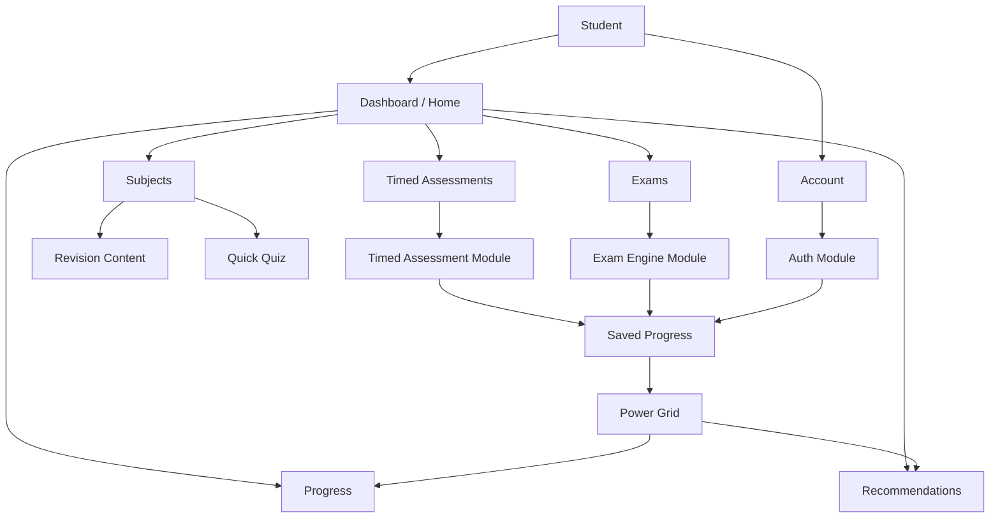

### Architecture layers

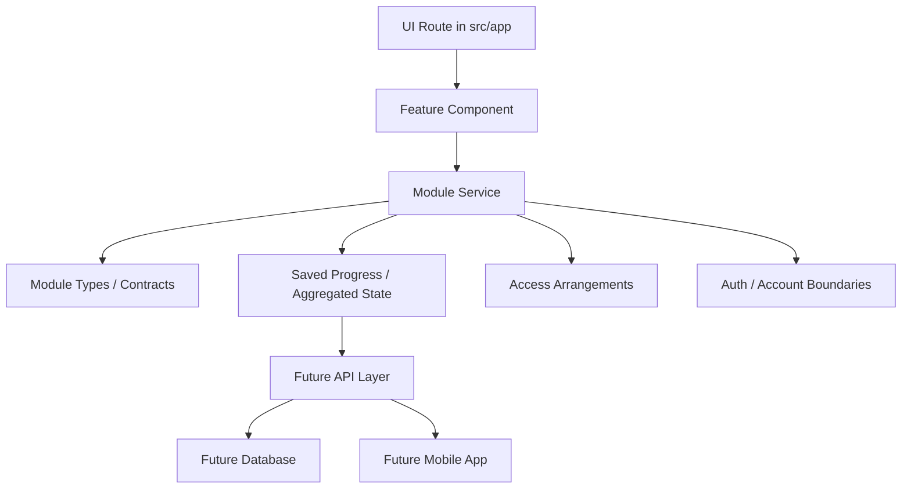

### Delivery architecture

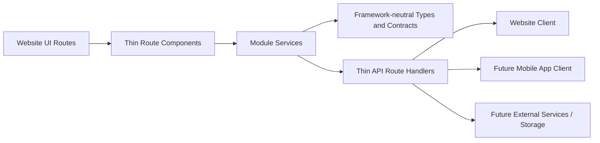

### Account flow

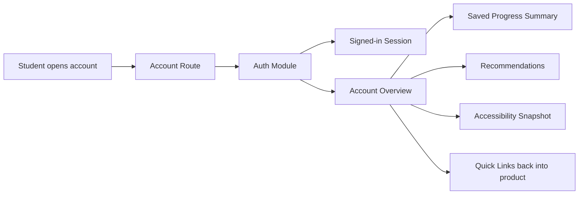

### API delivery flow

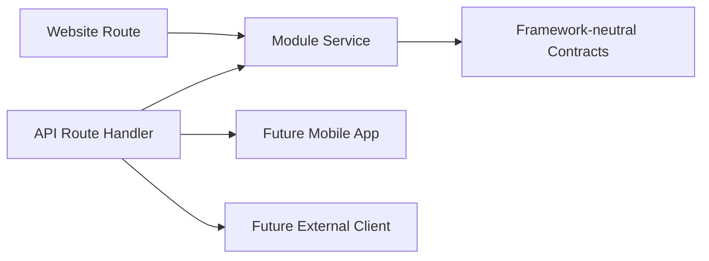

### Current student flow

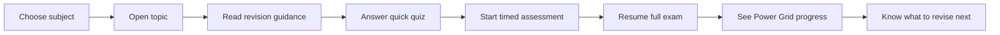

### Support flow

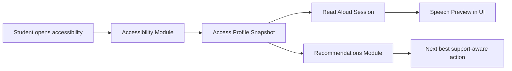

### Results flow

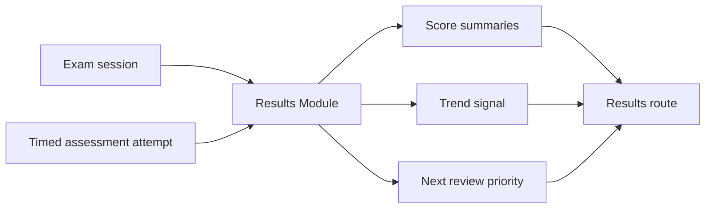

### Saved progress flow

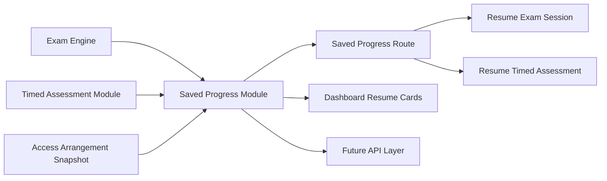

## Mark 3.2 Blueprint

### Core MVP modules

1. Dashboard
2. Power Grid Progress
3. Timed Assessments
4. Full GCSE Exam Engine
5. Saved Progress
6. Recommendations
7. Accessibility
8. Read Aloud
9. Language Ready Structure
10. Auth and Account Foundation
11. CMS/Admin Placeholder
12. Access Arrangements

### Launch subjects

- GCSE Mathematics
- GCSE English Language
- GCSE Combined Science
- Biology
- Chemistry
- Physics

### Power Grid levels

1. Ignition
2. Powered Up
3. Current Flow
4. Voltage Rising
5. Full Circuit
6. High Voltage
7. Grid Master
8. Power Station
9. Switch Legend

### Progress trends

- Improving
- Stable
- Declining

### Exam engine support

Boards:

- AQA
- Edexcel
- OCR
- Eduqas
- WJEC
- CCEA
- Cambridge IGCSE
- Edexcel International GCSE
- OxfordAQA International GCSE

Qualification types:

- GCSE
- IGCSE
- FunctionalSkills
- EntryLevel
- Level1
- Level2

Exam tiers:

- FOUNDATION
- HIGHER

Modes:

- Full GCSE Exam
- Manual Timed Assessment

### Access arrangements support

- EXTRA_TIME_25
- EXTRA_TIME_50
- READER
- SCRIBE
- REST_BREAKS
- COLOURED_OVERLAY
- SEPARATE_ROOM
- TEXT_TO_SPEECH
- LARGE_PRINT

## What Has Been Built So Far

This is no longer just a scaffold. The repo now contains several connected MVP slices.

The current build is a working website MVP with modular services underneath it. The architecture is deliberately set up so the same modules can later power:

- the current website routes
- thin API handlers
- a future mobile app client
- future persistent storage without rewriting frontend business rules

### Built routes

- `/`
- `/account`
- `/dashboard`
- `/how-it-works`
- `/subjects`
- `/assessments`
- `/exams`
- `/progress`
- `/saved-progress`
- `/support`
- `/recommendations`
- `/accessibility`
- `/results`

### Built API route handlers

- `/api/auth/session`
- `/api/auth/providers`
- `/api/account/overview`
- `/api/dashboard/home`
- `/api/website-guide`
- `/api/progress/summary`
- `/api/saved-progress/overview`
- `/api/recommendations`
- `/api/recommendations/page`
- `/api/accessibility/snapshot`
- `/api/results/overview`
- `/api/exams/papers`
- `/api/exams/session/:examId`
- `/api/assessments/definitions`
- `/api/assessments/seed/:assessmentId`
- `/api/cms/overview`
- `/api/past-papers/catalog`
- `/api/support/hub`
- `/api/support/resources`
- `/api/support/exam-guides`
- `/api/support/urgent-help`
- `/api/content/catalog`

### Architecture foundations already in code

- Route components that stay thin and mostly render prepared module data
- Service modules that own business logic and cross-module orchestration
- Type and contract files that keep boundaries explicit
- Thin API route handlers that can be reused by future app clients
- Language-ready copy structures for future localisation
- Account, accessibility, progress, support, and recommendation flows connected through service boundaries
- API delivery coverage across account, dashboard, progress, saved progress, support, recommendations, accessibility, results, exams, timed assessments, CMS, and past papers

### Placeholder routes still waiting for fuller product work

- `/admin` is now an architecture route, but not yet a full management tool

### Working product slices

- A live dashboard aggregation layer
- A student account route with signed-in identity, account-linked support, and quick recovery paths into the product
- A subject entry route with topic selection
- Topic revision content rendered from the revision module
- Topic quick quiz prompts rendered from the quiz module
- A timed assessment experience with duration presets and autosave-backed resume state
- A full exam experience with mock GCSE papers, progress map, flags, and autosave-backed resume state
- A Power Grid progress route using calculated subject summaries
- A Saved Progress route that brings exam and timed assessment autosaves into one shared resume surface
- A Support Hub route with trusted UK support links, urgent-help routes, and exam stress guides for young people
- A Recommendations route that converts progress, support, results, and saved-session signals into ordered next actions
- An accessibility route with settings, read aloud preview, and support-aware recommendation cards
- A results route that turns exam and timed assessment attempts into outcome summaries
- A guided website walkthrough route that explains how the main product routes work step by step
- An admin architecture route that explains content update and past-paper source planning in-product
- Access arrangement contracts and services integrated into exam and timed assessment flows
- Saved progress services for both exam sessions and timed assessment attempts, including shared overview summaries
- Thin API route handlers that expose modular auth and account data without moving business logic into the frontend
- Thin API route handlers that expose modular product data across the main MVP routes
- CMS and past-paper provider boundaries for future content updates and paper ingestion
- A master structured content catalog for all current MVP topics
- Read aloud, accessibility, and recommendations modules with real working foundations

## Route-by-Route Explanation

### `/`

This is the product home route.

It uses the dashboard aggregation layer to present:

- high-level metrics
- launch cards into the major routes
- exam session summaries
- timed assessment summaries
- subject focus cards
- a recommended next action

Learning note:

This route is a good example of composition. It does not calculate exam logic itself. It asks another module for a ready-made dashboard view model.

### `/account`

This is the student account route.

It currently shows:

- signed-in student identity
- account-linked product metrics
- sign-in options for MVP and future expansion
- quick links back into dashboard, saved progress, recommendations, and accessibility
- support carry-over summary tied to the current account

Learning note:

This route gives the MVP a real account option without trapping identity logic inside the page. The auth module owns the session and account overview model, which keeps the website ready for future app and API reuse.

### `/dashboard`

This is the student-home style dashboard route.

It currently shows:

- overall readiness
- active sessions
- subject watch cards
- links into the core working routes
- next best action guidance

Learning note:

This is what “aggregation” means in a codebase. One route combines outputs from several modules into one student-facing screen.

### `/how-it-works`

This is the guided walkthrough route.

It currently shows:

- a step-by-step explanation of the main student journey
- clickable route actions into the core pages
- short explanations of why each route matters
- glossary meanings for key website terms

Learning note:

This route helps both students and collaborators understand the product without needing to infer what route labels or status signals mean.

### `/subjects`

This is now the start of the learn-and-practise flow.

It currently lets the student:

- choose a launch subject
- switch between topics
- see a topic summary
- read revision guidance sections
- see a quick quiz question for the current topic

Learning note:

This route proves that subject metadata, topics, revision content, and quiz prompts can all live in separate modules while still forming one usable screen.

### `/assessments`

This is the timed checkpoint practice route.

It currently shows:

- assessment selection
- duration presets
- official duration caps
- adjusted duration after access arrangements
- resume state
- notes and bookmarks summary
- saved progress-backed session state

Learning note:

The page does not decide whether a student is allowed 15, 30, or full duration. The timed-assessment service owns that logic.

### `/exams`

This is the current full exam-style route.

It currently shows:

- mock GCSE paper selection
- question-by-question flow
- autosave timestamp feedback
- progress map
- question flagging
- completion percentage
- resumed session state
- fresh-attempt support after submission
- rotating question variants across attempts
- access-arrangement-aware timing

Learning note:

This route is a good example of the UI being “thin”. It renders the session state, but the exam engine, access arrangements, and saved progress modules shape the logic.

### `/progress`

This is the current Power Grid route.

It currently shows:

- overall Power Grid level
- readiness score
- active session count
- subject-level progress cards
- evidence statements
- next best action guidance

Learning note:

This route turns raw activity into meaning. That translation belongs in the Power Grid service, not scattered across page components.

### `/saved-progress`

This is the shared autosave and resume route.

It currently shows:

- saved exam sessions
- saved timed assessment attempts
- completion percentages
- resume-from question markers
- latest autosave timestamps
- access arrangement snapshot coverage
- direct return paths back into exams and assessments

Learning note:

This route proves that save and resume logic can stay in its own module while still serving multiple student experiences. The route reads a shared overview instead of rebuilding exam or assessment logic in the UI.

### `/support`

This is the student support route.

It currently shows:

- urgent help routes
- trusted UK support organisations
- exam stress guide links from reputable organisations
- clear boundaries explaining that the route is signposting, not counselling

Learning note:

This route keeps support signposting modular and safe for young people. The website renders trusted external resources from structured data, so future app clients can use the same route contracts without adding a chatbot or storing sensitive support disclosures.

### `/recommendations`

This is the student next-step route.

It currently shows:

- ordered recommendation cards
- priority signals
- linked next actions into working routes
- readiness, results, and saved-progress insight summaries
- language-ready route metadata flowing from the language module

Learning note:

This route keeps recommendation logic in its own module while allowing the website to render a product-ready action list. That matters for future API and mobile reuse because the decision layer is not trapped inside React components.

### `/accessibility`

This is now a real support route rather than a placeholder.

It currently shows:

- accessibility settings state
- access-profile-driven support snapshot data
- read aloud preview text
- voice and speed controls
- browser speech synthesis preview behaviour
- support-aware recommendation cards

Learning note:

This route is a good example of multiple small modules working together. Accessibility owns settings, read aloud owns preview session behaviour, and recommendations owns what to do next.

### `/results`

This is the current outcome route for finished or reviewable work.

It currently shows:

- overall score summary
- exam result cards
- timed assessment result cards
- score trends
- answered counts
- review or flag counts
- strongest area
- next priority

Learning note:

This route closes the student loop. It proves that outcome interpretation can live in its own module rather than being bolted onto exam or assessment screens.

### `/admin`

This is the current admin architecture route.

It currently shows:

- content source providers
- seeded content coverage
- future CMS provider planning
- past paper source providers
- paper catalog update strategy
- the current truth about what is still seeded versus what is not live yet

Learning note:

This route does not try to be a full CMS yet. Instead, it makes the architecture for content updates and past-paper sourcing explicit in the MVP so the website can later connect to real provider adapters without rewriting the student product routes.

## Module-by-Module Explanation

### `auth`

Purpose:

- owns authentication contracts, session identity, and account overview boundaries

Current work:

- mock signed-in student session
- sign-in provider metadata
- student account overview model
- framework-neutral auth/account contracts

### `language`

Purpose:

- owns language-ready copy boundaries and future localisation structures

Current work:

- locale preference contract
- route copy catalog
- recommendation copy metadata

### `content`

Purpose:

- owns the master structured content catalog for subjects, topics, revision material, and quiz prompts

Current work:

- seed JSON catalog for all current MVP topics
- repository boundary for content retrieval
- review and publication metadata fields for future editorial workflow
- framework-neutral content catalog contract

### `support`

Purpose:

- owns trusted signposting for young people, including urgent-help routes and exam stress support links

Current work:

- support resource registry
- urgent-help route data
- exam stress guide link data
- framework-neutral support contracts

### `dashboard`

Purpose:

- builds one combined home/dashboard view model from multiple modules

Current work:

- metrics
- route cards
- exam session cards
- timed assessment cards
- subject focus cards

### `website-guide`

Purpose:

- owns the guided explanation of how the website works

Current work:

- step-by-step route walkthrough data
- click-through study journey guidance
- glossary explanations for key website terms
- framework-neutral delivery contract

### `subjects`

Purpose:

- owns subject metadata and subject-level readiness signals

Current work:

- launch subject definitions
- exam readiness score per subject
- next topic recommendation per subject

### `topics`

Purpose:

- owns topic lists and subject-to-topic mapping

Current work:

- topic summaries
- confidence scores
- practice counts
- timed assessment availability markers

### `revision`

Purpose:

- owns revision content structure

Current work:

- revision stacks for seeded topics
- sectioned content matching the Mark 3.2 revision structure

### `quiz`

Purpose:

- owns quick practice prompts and answer options

Current work:

- seeded topic quiz questions
- multiple-choice answer structures

### `accessibility`

Purpose:

- owns accessibility settings and support presentation state

Current work:

- accessibility snapshot generation
- settings mapping from the access profile
- support settings view model for the accessibility route

### `read-aloud`

Purpose:

- owns read aloud session state and preview behaviour inputs

Current work:

- read aloud preview text
- voice options
- speed controls
- support-aware enablement

### `recommendations`

Purpose:

- owns student next-step guidance

Current work:

- recommendation cards
- priority levels
- route destinations
- guidance built from Power Grid and support state

### `timed-assessment`

Purpose:

- owns manual timed assessment attempt behaviour

Current work:

- assessment definitions
- duration cap handling
- access-arrangement-aware duration adjustment
- seeded attempt state
- resume hydration from saved progress

### `exam-engine`

Purpose:

- owns full exam mode rules and official exam timing

Current work:

- mock paper definitions
- paper blueprints with question slots
- question structures
- exam session creation
- rotating question variants
- fresh attempt generation
- seeded answers and flags
- resume hydration from saved progress
- session-owned generated question sets
- access-arrangement-aware official duration handling

### `saved-progress`

Purpose:

- owns save and resume contracts

Current work:

- saved exam progress payloads
- saved timed assessment payloads
- in-memory repository
- save helpers
- progress status handling

### `access-arrangements`

Purpose:

- owns SEND and access arrangement contracts and application logic

Current work:

- access arrangement values
- student access profile
- duration adjustment rules
- integration contracts for exams and timed assessments
- saved progress snapshot support

### `power-grid`

Purpose:

- owns readiness scoring and progress translation

Current work:

- Power Grid levels
- trend types
- subject-level progress summaries
- overall readiness summary
- next best action generation

### `results`

Purpose:

- owns score summaries and post-session outcome interpretation

Current work:

- exam result summaries
- timed assessment result summaries
- score aggregation
- trend mapping
- next review priority

## Why The Architecture Looks Like This

This is one of the most important ideas in the whole repo.

The code is being written so the student-facing page does not become the only place where rules live.

Bad long-term approach:

- page decides timing
- page decides progress
- page decides support logic
- page decides resume rules

Better approach:

- exam engine decides exam timing
- timed assessment decides manual duration rules
- saved progress decides how sessions are restored
- power grid decides progress meaning
- access arrangements decide support adjustments

That gives you:

- cleaner code
- safer changes later
- easier API extraction
- easier future mobile app reuse

## Folder Structure

```text
src/
  app/
    account/
    accessibility/
    admin/
    api/
    assessments/
    dashboard/
    exams/
    progress/
    recommendations/
    results/
    saved-progress/
    subjects/
    support/
  components/
  data/
  lib/
  modules/
    access-arrangements/
    accessibility/
    auth/
    cms/
    dashboard/
    exam-engine/
    language/
    past-papers/
    power-grid/
    quiz/
    read-aloud/
    recommendations/
    revision/
    saved-progress/
    subjects/
    support/
    timed-assessment/
    topics/
  types/
```

### Simple folder explanation

- `src/app`: page routes
- `src/app/api`: thin API route handlers
- `src/components`: reusable UI
- `src/modules`: product features and business rules
- `src/lib`: shared utilities
- `src/data`: future static seed content or fixtures
- `src/types`: shared exports

## Current Development State

Right now the project uses:

- mock data
- in-memory saved progress
- no real database
- mock signed-in account data
- real thin API routes over module services
- no real CMS data entry yet
- no enforced editorial fact-check and approval workflow yet
- no live external paper ingestion yet
- no owned in-app support content for young people
- trusted external support links instead of a wellbeing assistant

That means the current build is a functional MVP-shaped prototype, not a production system yet.

Current estimated project completion: `63%`

This is an estimate of MVP progress, not production readiness.

But it is already more than a mock layout because:

- routes are connected
- services are doing real work
- modules own real responsibilities
- different student journeys now exist end to end

## Local Development

Install dependencies:

```bash
npm install
```

Run the dev server:

```bash
npm run dev
```

Run the type check:

```bash
npm run type-check
```

Build the project:

```bash
npm run build
```

## What To Look At First If You Are Learning

If you want the fastest path to understanding this codebase, read in this order:

1. [src/app/subjects/page.tsx](/Users/lloydnwagbara/Documents/THE%20SWITCH%202/src/app/subjects/page.tsx)
2. [src/app/subjects/subject-experience.tsx](/Users/lloydnwagbara/Documents/THE%20SWITCH%202/src/app/subjects/subject-experience.tsx)
3. [src/modules/subjects/service.ts](/Users/lloydnwagbara/Documents/THE%20SWITCH%202/src/modules/subjects/service.ts)
4. [src/modules/topics/service.ts](/Users/lloydnwagbara/Documents/THE%20SWITCH%202/src/modules/topics/service.ts)
5. [src/modules/revision/service.ts](/Users/lloydnwagbara/Documents/THE%20SWITCH%202/src/modules/revision/service.ts)
6. [src/modules/quiz/service.ts](/Users/lloydnwagbara/Documents/THE%20SWITCH%202/src/modules/quiz/service.ts)

Then move on to:

1. [src/app/assessments/page.tsx](/Users/lloydnwagbara/Documents/THE%20SWITCH%202/src/app/assessments/page.tsx)
2. [src/modules/timed-assessment/service.ts](/Users/lloydnwagbara/Documents/THE%20SWITCH%202/src/modules/timed-assessment/service.ts)
3. [src/modules/saved-progress/service.ts](/Users/lloydnwagbara/Documents/THE%20SWITCH%202/src/modules/saved-progress/service.ts)
4. [src/app/exams/page.tsx](/Users/lloydnwagbara/Documents/THE%20SWITCH%202/src/app/exams/page.tsx)
5. [src/modules/exam-engine/service.ts](/Users/lloydnwagbara/Documents/THE%20SWITCH%202/src/modules/exam-engine/service.ts)
6. [src/modules/power-grid/service.ts](/Users/lloydnwagbara/Documents/THE%20SWITCH%202/src/modules/power-grid/service.ts)

## What Still Needs Building

Important MVP work still ahead:

- stronger real saved persistence beyond in-memory state
- write-side API layer
- fuller authentication flow
- enforced fact-check, editorial review, and publish workflow for student-facing content
- CMS content management tools
- repository-backed content and paper ingestion adapters
- deeper results workflows with more detailed marking logic
- language-ready route support
- broader past paper coverage and source validation
- possible owned structured learning content later, only after rigorous factual review and publication workflow are defined

## Launch Readiness Checklist

This section is a launch-oriented version of the remaining work.

It is meant to answer a practical question:

What still needs to be true before this project can be launched with confidence?

### Must-have before launch

- real authentication end to end
- real persistence instead of in-memory saved progress
- write-side API coverage for important student actions
- enforced fact-check, editorial review, and publish gating for student-facing content
- CMS or controlled content update workflow
- production-safe exam and assessment data handling
- stronger results and marking logic
- error handling and failure recovery across the main student journeys
- basic security review for auth, API routes, and student data handling
- accessibility QA across the real live flows
- deployment and production environment setup

### High-priority product gaps

- fuller saved progress persistence and resume reliability
- deeper exam paper and question-bank coverage
- broader timed assessment coverage
- stronger recommendations built from richer student history
- more complete access arrangements workflow
- real student account and profile settings
- past paper ingestion and validation workflow
- language-ready implementation beyond structure alone

### Content and trust requirements

- fact-check status per content item
- internal review status per content item
- approval step before publish
- source attribution and provider traceability
- rollback or unpublish path if content is wrong
- clear ownership for who can create, review, approve, and publish content

### Technical readiness

- database schema and adapters
- stable repository and provider adapters for content and papers
- test coverage for core modules
- API contract verification
- monitoring and logging
- backup and recovery approach for student progress

### Operational launch checks

- privacy and data handling review
- terms, safeguarding, and support signposting review
- admin or editor workflow for content updates
- production QA on mobile
- smoke testing across the core routes

### Shortest realistic launch sequence

1. real persistence
2. real auth
3. editorial fact-check and publish workflow
4. write-side APIs
5. results and marking hardening
6. accessibility and mobile QA
7. deployment, security, and monitoring
8. final content and paper coverage pass

## Recent Additions

This section is kept near the bottom on purpose so the README can read as a full project guide first and a latest-changes log second.

### API-first delivery expansion

Recent work extended the internal API-first delivery layer across more of the student product.

That includes:

- shared server-side API helpers
- more page routes consuming thin internal API routes instead of pulling module logic directly
- subject experience and read-aloud session API routes
- stronger consistency between website rendering and service-layer contracts

### Exam freshness and learning repetition

The exam flow now uses a first-pass freshness model that protects learning repetition while reducing stale repeated papers.

The goal is:

- repeat `topics` and `skills`
- rotate exact `question variants`
- keep official structure and timing stable
- preserve the actual generated paper through autosave and results

How it works:

- the exam engine stores paper blueprints with question slots
- each slot has multiple valid variants
- a fresh attempt prefers variants the student has not seen recently
- the generated question set is saved into Saved Progress
- resume restores the exact same generated set
- results score against the exact questions that were actually shown

Architecture flow:

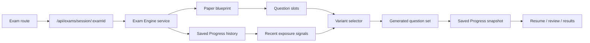

Attempt lifecycle:

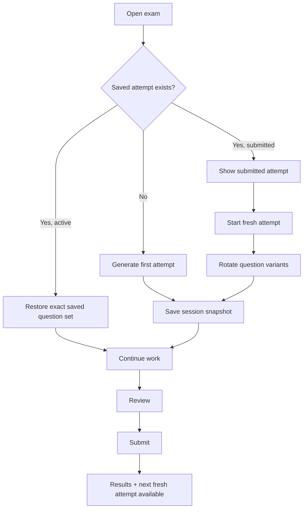

Current MVP limit:

- this is the first freshness layer, not the final exam-generation system
- question banks can grow later
- weak-topic-aware reappearance rules can deepen later
- longer-term exposure history can deepen later

### Guided website walkthrough

The website now includes a dedicated `How It Works` route so students can understand the main journey without guessing what route names or website signals mean.

That includes:

- a step-by-step click-through walkthrough
- direct links into Dashboard, Subjects, Assessments, Exams, Progress, Saved Progress, Accessibility, and Support
- glossary explanations for terms such as autosave, Power Grid, support snapshot, submitted, and recommendations
- a standalone API-delivered module that can later be reused by other clients

Guide flow:

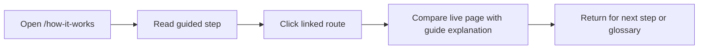

## Summary

The Switch is no longer just a blueprint sitting in a README.

It now has:

- a meaningful modular architecture
- a working student dashboard
- a subjects flow
- a timed assessment flow
- an exam flow
- a progress flow
- saved progress foundations
- access arrangements foundations
- Power Grid foundations

And most importantly, the code is being shaped so that each part of the system has a job.

That is one of the biggest differences between “a page that works” and “a product that can keep growing.”
