# The Switch Platform

## Local Restore Notes For THE SWITCH 3

If project information appears to have disappeared after switching to local
mode, open these files first:

- `PROJECT_RECOVERY.md`
- `RESTORED_CHATS.md`

The active local project folder for `THE SWITCH 3` is:

`/Users/lloydnwagbara/Documents/THE SWITCH 3`

The local project has been checked against GitHub `origin/main`, and the local
website has been verified with a successful production build.

## Mark 3.2 MVP

This README is now meant to be cumulative.

New product work, requested additions, previews, mockups, routes, modules, and architecture notes should be added to this file without removing the earlier record unless something is genuinely obsolete or incorrect.

### README update rule

- Keep the main product overview and learning outline in place.
- Add new work as appended sections or build-record entries.
- Do not let a new feature section interrupt the opening product explanation.
- Only replace earlier README content when that older content is genuinely wrong or obsolete.

### Multi-agent development workflow

This project is built with **Cursor Agent** and **Codex** on the same repo.

| Document | Purpose |
|----------|---------|
| `AGENTS.md` | Architecture, priorities, session rules, completion standard |
| `HANDOFF.md` | Live session state between Cursor and Codex |
| `README.md` | Cumulative product spec and build record (this file) |
| `.cursor/rules/` | Cursor-specific enforcement mirroring `AGENTS.md` (active — 4 rule files) |

#### Session start — tell the agent

At every session start, tell Cursor or Codex:

```text
Read HANDOFF.md first.
```

Then let the agent read `AGENTS.md` and this file's priority order.

#### Session end — update HANDOFF.md

At every session end, update the **Live session state** section in `HANDOFF.md` before stopping or switching tools.

#### Every session must

1. Tell the agent: **Read HANDOFF.md first**
2. Read `AGENTS.md` and this file's priority order
3. Work on one module / one feature branch
4. Run `npm run lint && npm run type-check && npm run test` before closeout
5. Commit, push, update **Live session state** in `HANDOFF.md`
6. Append to Ordered Build Record below

#### Handoff rule

Never switch between Cursor and Codex with uncommitted work. Commit + push + update `HANDOFF.md` first. Full workflow details live in `HANDOFF.md`.

### Agent workflow diagram

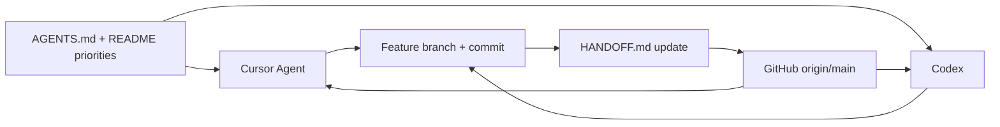

### Critical git workflow rule

- Treat git state review as mandatory before making code or release decisions.
- Check the current branch, `git status`, and whether local work still needs to be committed or pushed before changing implementation.
- Before calling work complete, verify the intended commit is present locally and confirm the branch has been pushed to GitHub successfully.

### Priority enforcement rule

- Agents must not skip higher-priority modules for lower-priority work unless the user explicitly overrides.
- Before starting a task, state which priority item it serves.
- If completing a lower-priority item while a higher-priority gap exists, record the reason in `HANDOFF.md` and README build record.

### Automatic GitHub push rule

- This repository should use the committed `.githooks/post-commit` hook so commits can push to GitHub automatically when the current branch already tracks a remote branch.
- Run `node scripts/enable-auto-push.mjs` once per local clone to point `core.hooksPath` at `.githooks`.
- Use `SWITCH_SKIP_AUTO_PUSH=1 git commit ...` only when a commit must stay local temporarily.
- Future sessions should treat automatic git update and push completion as part of the normal closeout path rather than as optional follow-up work.
- The user should not have to run manual git commands as the default path for ordinary completion.
- If GitHub authentication expires, the session should proactively repair it and continue the push workflow in the same session.
- Only ask the user for a browser or device approval step when an external GitHub login confirmation is genuinely unavoidable.

## Mark 3.2 Product Spec

This repository follows the current The Switch Platform Mark 3.2 product spec.

### Architecture direction

- Modular MVP
- Website first
- Future mobile app ready
- API first

### Core MVP scope

1. Dashboard
2. Power Grid
3. Timed Assessments
4. Exam Engine
5. Saved Progress
6. Recommendations
7. Accessibility
8. Read Aloud
9. Access Arrangements foundation
10. Guided sign-up and onboarding
11. Year 10 end-of-year progression papers that prepare students for GCSE-style questions
12. Qualification-aware content and exam coverage across GCSE and iGCSE routes

### Non-negotiable development rules

- Keep modules independent.
- Do not mix exam logic with progress logic.
- Do not mix saved progress with content logic.
- Keep Read Aloud separate from revision and quiz logic.
- All student progress must auto-save.
- Full GCSE exams must use official durations.
- Manual assessments must not exceed official durations.
- Mobile-first UI is required.
- Accessibility-first design is required.
- Build for future mobile app migration.
- No business logic should live only in the website frontend.
- Use an API layer between frontend experiences and backend services.
- Preserve a language-ready structure before translation is implemented.
- Treat CMS/Admin as a placeholder MVP module unless it is explicitly prioritised.
- Keep Access Arrangements independent from Exam Engine, Timed Assessment, Saved Progress, Read Aloud, and Accessibility modules.
- Full GCSE Exam Mode must support future access arrangements.
- Timed Assessments must support future access arrangements.
- Read Aloud must integrate with Access Arrangements.
- Accessibility settings must integrate with Access Arrangements.
- Saved Progress must store active access arrangement settings.
- Do not build complex SEND UI until explicitly prioritised.
- Do not build AI support until explicitly prioritised.
- Do not build school administration tools until explicitly prioritised.
- Access Arrangements API contracts must stay framework-neutral until the app stack is chosen.
- Website and future mobile clients must consume Access Arrangements through the API layer rather than duplicating the rules.
- Guided sign-up must capture learner stage, school context, qualification path, and subject setup before the personalised dashboard is treated as ready.
- Guardian invite and age-or-consent checks must remain part of the onboarding architecture for school-age learners.
- Guided sign-up should explicitly ask whether the learner wants accessibility support or access help as part of first-time setup.
- Qualification and subject setup must cover both GCSE and iGCSE routes where supported by the platform.
- SEND-related support should flow through accessibility, access arrangements, and support content without forcing a complex SEND UI during MVP.
- School selection should be driven by maintained UK school-source links rather than an unmanaged static list.
- Onboarding choices must feed dashboard, planner, saved progress, and recommendation setup through shared API and module boundaries.
- Reviewed-only student visibility is required for structured learning content.
- Source attribution is required for structured learning content and generated study visuals.
- Fact-check gates are required before draft content becomes student visible.
- Draft content must never be silently published to students.
- Content generation, supply, and updates must have an explicit module boundary before scale.

### Active build priority order

This is the order the MVP should be pushed forward in unless a new instruction overrides it:

1. Exam Engine
2. Power Grid
3. Saved Progress
4. Read Aloud
5. Dashboard
6. Timed Assessments
7. Full GCSE Exams
8. Content Fact-Checking And Editorial Workflow
9. Results
10. Recommendations
11. Accessibility
12. Access Arrangements foundation

### What this means for current work

- Exam Engine remains the highest-priority product slice.
- Power Grid should turn exam and assessment activity into actionable next steps.
- Saved Progress should behave like a real cross-module autosave and resume system.
- Read Aloud should appear inside real student flows, not only in isolated previews.
- Dashboard should aggregate the higher-priority modules rather than invent separate logic.
- Sign-up and onboarding should build the first dashboard, planner defaults, and learner context instead of leaving those choices implicit.
- Content should not keep expanding toward student-facing publication without a real fact-check and editorial approval workflow.
- Year 10 end-of-year work should prepare students for GCSE expectations rather than acting like a disconnected lower-stakes mode.
- CMS/Admin should stay architectural and placeholder-focused during MVP unless reprioritised.

## Website Preview And App Mockup

The current homepage now presents both the website-first preview and the future app direction from the same modular dashboard data model.

### Website preview

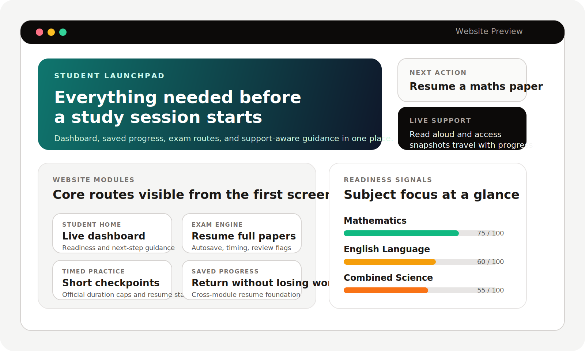

### App mockup

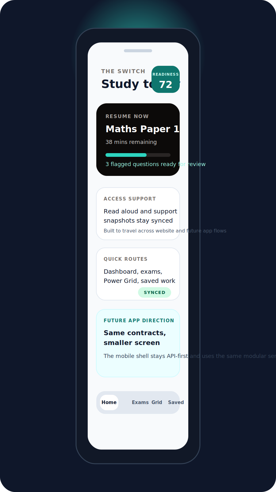

## Ordered Build Record

This section is the running record of what has been requested, added, and committed so far in this MVP.

### 2026-06-21 Full multi-agent workflow integration

- Added `HANDOFF.md` as the live session handoff file between Cursor Agent and Codex.
- Added `.cursor/rules/` with source-of-truth, architecture, module, and API-route enforcement.
- Consolidated `AGENTS.md` multi-agent workflow and removed duplicate temporary agent blocks.
- Aligned `README.md`, `PROJECT_RECOVERY.md`, and `RESTORED_CHATS.md` on `THE SWITCH 3` as the only active folder.
- Integrated git closeout rules: read `HANDOFF.md` at session start, update at session end, commit and push before switching tools.

### 2026-06-21 Session operating priorities documented

- Documented the operator rule in `AGENTS.md`, `README.md`, and `HANDOFF.md`.
- At session start: tell Cursor or Codex **Read HANDOFF.md first**.
- At session end: update the **Live session state** section in `HANDOFF.md`.
- Marked `.cursor/rules/` as active with 4 rule files — no longer optional setup.

### 2026-06-21 Source-of-Truth Migration to THE SWITCH 3

- Confirmed `/Users/lloydnwagbara/Documents/THE SWITCH 3` as the only active local project folder.
- Updated recovery notes and multi-agent workflow documentation.
- Cursor Agent and Codex must both use this folder and the same GitHub remote.

### 2026-06-21 truth-match hardening

- The launch closeout path now has an explicit deployed-runtime truth check through `npm run verify:live-truth-match`.
- This check compares the deployed admin persistence API and governance API against the intended live auth mode, live callback base URL, sqlite driver, shared data directory, recovery readiness, and final governance readiness.
- Manual governance records no longer mask a bad deployed runtime. If the live environment falls back to provisional or serverless-temporary persistence, governance now drops back to `watch` instead of pretending launch truth still matches.
- The admin runtime page now calls out ephemeral serverless persistence directly, so item 22 can stay honest when the deployed runtime is still different from the recorded evidence.
- Current truth remains unchanged: the repository is stronger and more truthful, but true `Final Path Mark 2` still requires the deployed runtime to stop using temporary serverless storage and to reflect one real shared live persistence path.

### 2026-06-21 durable live persistence and launch-verification update

- Production persistence on `https://theswitchplatform.com` now reports `sqlite` with `storageBackend: vercel-blob`, `dataDirectory: vercel-blob://switch-live-data`, `isEphemeralStorage: false`, and `recoveryReady: true` through the deployed `/api/persistence/runtime` API.
- The repo now supports a narrow `SWITCH_LAUNCH_VERIFICATION_SECRET` header path so protected live route checks can be automated without repeatedly extracting browser cookies by hand.
- Internal server-to-server page API fetches now forward launch-verification headers, and the launch fetch helpers now apply timeout-and-retry handling so transient production stalls fail honestly instead of hanging forever.
- The blob-backed sqlite helper now creates local backup temp directories before opening mirrored backup databases, which fixed the deployed `/api/governance/overview` crash that originally blocked the item 22 truth check.
- The blob-backed sqlite reader now probes metadata before reading bytes and prefers the real `BLOB_READ_WRITE_TOKEN` path ahead of the fallback OIDC path, so the repo no longer treats a missing blob or the weaker auth path as the default cause of the live failure.
- Current truth is still not `100% complete`: the latest deployed `dashboard`, `account`, `results`, `/api/dashboard/home`, and `/api/results/overview` routes still fail under live launch verification because shared-store reads are returning `Vercel Blob: Failed to fetch blob: 403 Forbidden`.
- A direct production Blob SDK probe confirmed the deeper platform-side blocker: the control plane can still return sqlite blob metadata, but issuing a signed read for `switch-live-data/switch-live.sqlite` fails with `BlobStoreSuspendedError: Vercel Blob: This store has been suspended.`
- Until that live Blob store is unsuspended in Vercel or replaced with another real shared durable store, the final walkthrough, final sign-off, final launch-complete run, and item 22 truth-match cannot be called complete honestly.
- Because those protected live routes still fail and the final walkthrough cannot yet finish cleanly against the deployed runtime, the honest platform label remains `near-launch`.

### 1. Mark 3.2 modular MVP foundation

The project was established around these core rules:

- website first
- future mobile app ready
- API first
- modular services
- accessibility first
- mobile-first UI
- no business logic living only in the frontend

This foundation is still the rule that everything else in the repo follows.

### 2. MVP architecture expansion

The README and repo were expanded to document the product architecture in more detail, including:

- dashboard
- Power Grid
- timed assessments
- full exam engine
- saved progress
- recommendations
- accessibility
- read aloud
- language-ready structure
- auth and account foundations
- CMS/admin placeholder
- access arrangements foundation

This stage also made the service-layer separation clearer so the website, API routes, and future mobile client can all reuse the same product logic.

### 3. Structured topic and revision content foundations

The repo was then expanded to support structured subject and topic content, including:

- subject metadata
- topic mapping
- revision content structures
- quiz prompt structures
- launch-subject coverage for the GCSE MVP

This is the foundation that supports the current `/subjects` learning route.

### 4. JSON content package architecture

The content layer was pushed further into a more explicit structured package shape so the product can work from seeded content rather than scattered page-level copy.

That includes:

- structured content catalog thinking
- clearer topic content packaging
- revision and quiz content organisation
- a more reusable content-serving direction for future CMS or provider updates

### 5. Support architecture with trusted signposting

The product gained a clearer support model that avoids pretending to be counselling or AI wellbeing support.

That work added:

- trusted UK support resources
- urgent-help links
- exam stress guides
- a modular support route
- a safer signposting-first architecture for young users

### 6. Content catalog module and API delivery

The repo now includes a proper content catalog module and delivery route.

Added work includes:

- `src/modules/content`
- `src/data/mvp-content-catalog.json`
- `/api/content/catalog`
- framework-neutral content contracts
- subject, topic, revision, and quiz content being shaped through shared catalog structures

This is a major architecture step because content now has a clearer module boundary instead of being implied across multiple feature files.

### 7. Homepage website preview and app mockup

The homepage was upgraded from a simple dashboard entry to a stronger product-preview surface.

Added work includes:

- a more polished website preview section on the homepage
- a future mobile app mockup panel on the homepage
- the same dashboard-backed data model feeding both surfaces
- a clearer visual demonstration that the product is web first and app ready

This work lives primarily in the shared homepage component and is already part of the running app at `/`.

### 8. README preview images

The README now includes the requested visuals so the repository itself shows what has been built.

Added assets:

- `public/readme/website-preview.svg`
- `public/readme/app-mockup.svg`

Added README showcase sections:

- Website Preview
- App Mockup

These were added so the repo can communicate the current MVP direction even outside the running local app.

### 9. API-first MVP connections and fresh exam attempts

The next pushed stage connected more of the product through internal API delivery and deepened the exam flow.

Added work includes:

- API-first page delivery across dashboard, exams, assessments, results, recommendations, accessibility, support, subjects, account, admin, and saved progress surfaces
- new internal routes for read aloud session and subject experience data
- smarter resume links across Saved Progress and Dashboard
- submitted-state handling for exams and timed assessments
- result and recommendation logic that now distinguishes active work from submitted work
- first-pass exam freshness logic that preserves learning repetition while rotating exact question variants between attempts

This stage matters because it moved more business logic behind shared contracts while also making full exam work feel less stale for active students.

### 10. Content fact-checking and editorial workflow priority

Content quality assurance is now being treated as an active project priority rather than only a later note.

That means one of the next important content-side stages should include:

- explicit fact-check statuses
- internal review and approval stages
- publish gating before student visibility
- source attribution and provider traceability

### 11. Year 10 end-of-year exam context and GCSE bridge

The MVP now also needs to support students who are still in Year 10 and preparing for end-of-year exams before they step into full GCSE papers.

That includes:

- subject-level context that explains how revision supports Year 10 end-of-year exams
- topic-level context showing how each topic bridges into GCSE-style command words and questions
- progression papers that let students practise GCSE-style questions before full GCSE paper timing
- a clear rule that Year 10 assessments should prepare for GCSE rather than run as a separate disconnected content track

### 12. Main quality principle for content before scale

Content quality must now stay ahead of content volume.

That means:

- reviewed-only student visibility
- source attribution
- fact-check gates
- no silent publishing of draft content
- generated study visuals following the same review and fact-check workflow as other student content
- a workflow that prevents unreviewed owned content from reaching students

This principle is being put in place because bad or unchecked learning content would damage trust faster than missing features.

This matters because student trust depends on content quality, not only on product flow and interface quality.

### 13. Guided website walkthrough

The MVP now includes a dedicated guided walkthrough route so students and collaborators can understand how the website is meant to be used.

Added work includes:

- a step-by-step route guide
- clickable actions into the core student flows
- glossary explanations for terms such as autosave, Power Grid, support snapshot, and recommendations
- a standalone API-delivered module so the same guide can later be reused by other clients

This matters because understanding the product flow should not depend on guessing what route names or study signals mean.

### 14. Qualification-aware exam and content expansion

The MVP now has a clearer architecture for widening beyond a tiny GCSE-only sample.

That includes:

- Year 10 end-of-year papers and advanced Year 10 GCSE-bridge papers
- full GCSE foundation and higher examples
- iGCSE subject and paper coverage foundations
- shared access-arrangement support flowing through every exam paper type
- explicit content generation, supply, and update paths in the catalog model

## Mermaid Learning Diagrams

These diagrams are here to make the MVP easier to understand quickly while the project keeps growing.

### Year 10 to GCSE progression

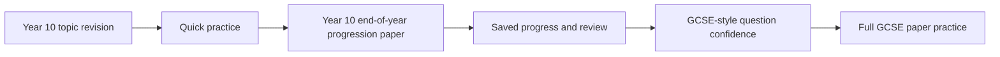

### Content quality gate

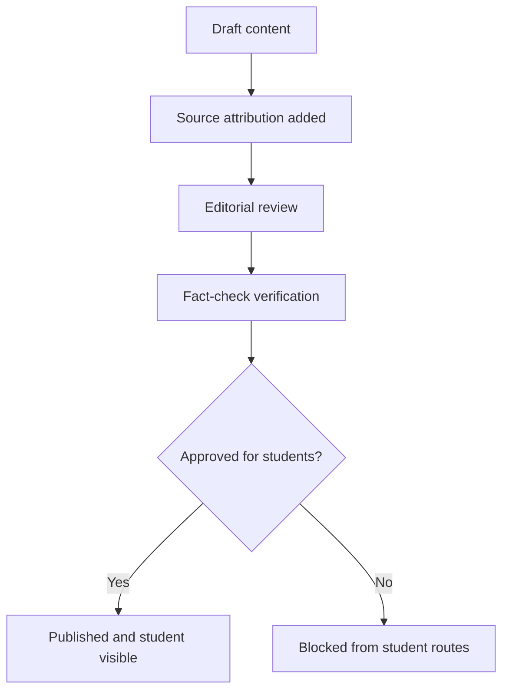

### Content supply pipeline

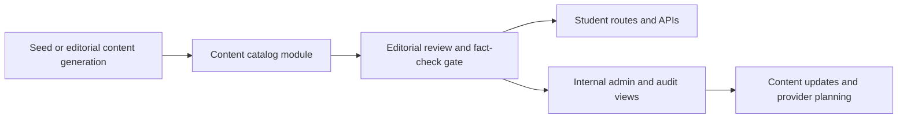

## What You Asked To Be Added And Is Now Present

This is the direct checklist version.

### Added to the product

- dashboard-backed homepage
- website preview section
- app mockup section
- content catalog module
- content API route
- support signposting route
- saved progress route
- accessibility route
- recommendations route
- results route
- account route
- assessments route
- exams route
- progress route
- subjects route

### Added to the README

- architecture explanation
- product flows
- route-by-route explanation
- module-by-module explanation
- folder structure
- development state
- learning order
- build commands
- website preview image
- app mockup image
- ordered build record

### Added as images

- website preview image in the README
- app mockup image in the README

## Everything Currently Present In This MVP

If you want one place that lists the full current state without replacing earlier notes, this is it.

### Student-facing routes currently present

- `/`
- `/account`
- `/dashboard`
- `/how-it-works`
- `/subjects`
- `/assessments`
- `/exams`
- `/progress`
- `/saved-progress`
- `/support`
- `/recommendations`
- `/accessibility`
- `/results`
- `/admin`

### API routes currently present

- `/api/auth/session`
- `/api/auth/providers`
- `/api/account/overview`
- `/api/dashboard/home`
- `/api/website-guide`
- `/api/progress/summary`
- `/api/saved-progress/overview`
- `/api/saved-progress/session/:entityType/:entityId`
- `/api/recommendations`
- `/api/recommendations/page`
- `/api/accessibility/snapshot`
- `/api/results/overview`
- `/api/cms/workflow/:contentId`
- `/api/exams/papers`
- `/api/exams/session/:examId`
- `/api/assessments/definitions`
- `/api/assessments/seed/:assessmentId`
- `/api/cms/overview`
- `/api/past-papers/catalog`
- `/api/support/hub`
- `/api/support/resources`
- `/api/support/exam-guides`
- `/api/support/urgent-help`
- `/api/content/catalog`
- `/api/content/editorial-audit`

### Modules currently present

- `auth`
- `language`
- `content`
- `support`
- `dashboard`
- `website-guide`
- `subjects`
- `topics`
- `revision`
- `quiz`
- `accessibility`
- `read-aloud`
- `recommendations`
- `timed-assessment`
- `exam-engine`
- `saved-progress`
- `access-arrangements`
- `power-grid`
- `results`
- `cms`
- `past-papers`

### Visual assets currently present in the README

- `public/readme/website-preview.svg`
- `public/readme/app-mockup.svg`

The Switch Platform is a GCSE revision, timed practice, progress tracking, and exam-readiness product.

This repository is the website-first MVP build. It is being designed so a student can:

1. Choose a subject and topic
2. Read focused revision guidance
3. Practise through a quiz or timed checkpoint
4. Sit a full exam-style paper
5. Save progress automatically
6. Return later without losing work
7. See how prepared they are
8. Know what to revise next

This README is written as a project guide and a learning guide. If you are learning to code, the idea is that you should be able to read this file and understand:

- what the product is
- what has already been built
- how the codebase is organised
- why the architecture is set up this way
- what each major route and module is responsible for

## Project Vision

The Switch is meant to help students:

- Learn
- Practise
- Track progress
- Improve
- Become exam ready

The platform must be:

- Mobile first
- SEND friendly
- Accessible
- Modular
- Scalable
- API first
- Web first
- Future app ready

## Simple Explanation

The easiest way to understand the project is like this:

- `src/app` is the visible website
- `src/app/api` is the thin delivery layer for API-style route handlers
- `src/modules` is where the actual feature rules live
- the page asks the modules for data
- the API handlers ask the same modules for data
- the modules decide the logic
- later, an API can sit in front of those modules
- later still, a mobile app can reuse the same logic

That separation matters because it stops important product rules from being trapped inside page components.

For example:

- exam timing rules should belong to the exam engine
- saved progress rules should belong to saved progress
- progress calculations should belong to power grid
- support settings should belong to access arrangements and accessibility
- account and session identity should belong to auth

## Visual Overview

### Product map

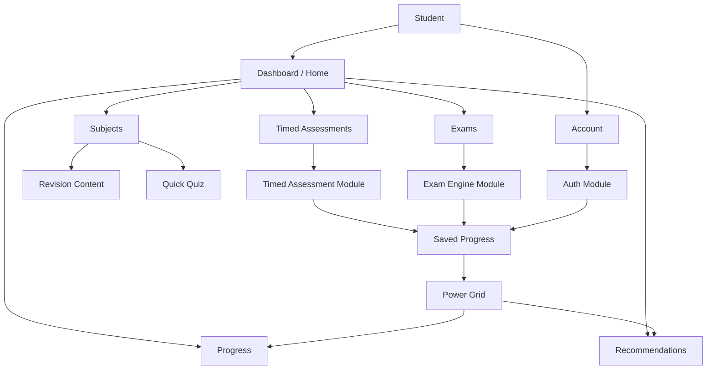

### Architecture layers

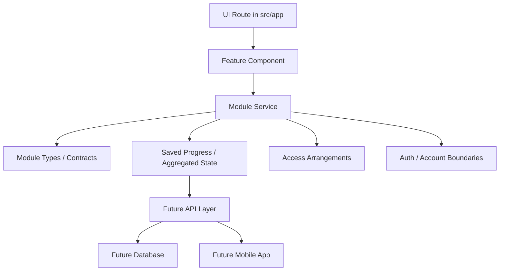

### Delivery architecture

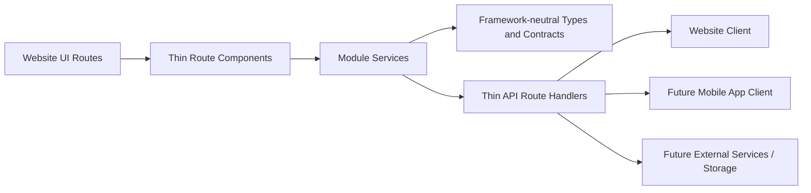

### Account flow

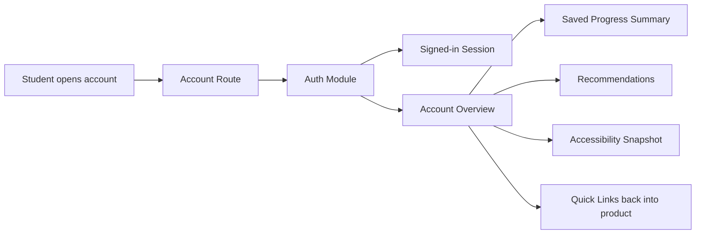

### API delivery flow

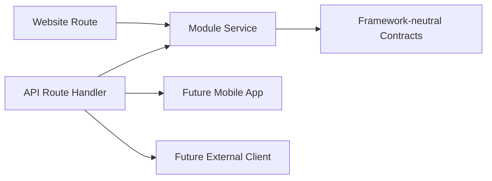

### Current student flow

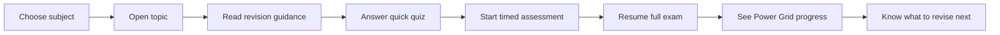

### Support flow

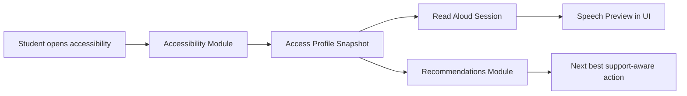

### Results flow

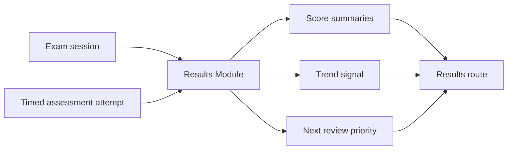

### Saved progress flow

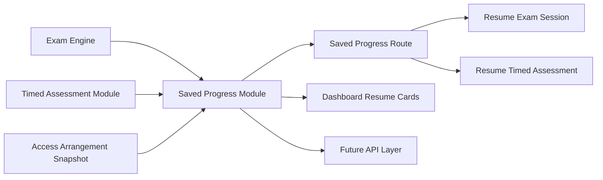

## Mark 3.2 Blueprint

### Core MVP modules

1. Dashboard
2. Power Grid Progress
3. Timed Assessments
4. Full GCSE Exam Engine
5. Saved Progress
6. Recommendations
7. Accessibility
8. Read Aloud
9. Language Ready Structure
10. Auth and Account Foundation
11. CMS/Admin Placeholder
12. Access Arrangements

### Launch subjects

- GCSE Mathematics
- GCSE English Language
- GCSE Combined Science
- Biology
- Chemistry
- Physics

### Power Grid levels

1. Ignition
2. Powered Up
3. Current Flow
4. Voltage Rising
5. Full Circuit
6. High Voltage
7. Grid Master
8. Power Station
9. Switch Legend

### Progress trends

- Improving
- Stable
- Declining

### Exam engine support

Boards:

- AQA
- Edexcel
- OCR
- Eduqas
- WJEC
- CCEA
- Cambridge IGCSE
- Edexcel International GCSE
- OxfordAQA International GCSE

Qualification types:

- GCSE
- IGCSE
- FunctionalSkills
- EntryLevel
- Level1
- Level2

Exam tiers:

- FOUNDATION
- HIGHER

Modes:

- Full GCSE Exam
- Manual Timed Assessment

### Access arrangements support

- EXTRA_TIME_25
- EXTRA_TIME_50
- READER
- SCRIBE
- REST_BREAKS
- COLOURED_OVERLAY
- SEPARATE_ROOM
- TEXT_TO_SPEECH
- LARGE_PRINT

## What Has Been Built So Far

This is no longer just a scaffold. The repo now contains several connected MVP slices.

The current build is a working website MVP with modular services underneath it. The architecture is deliberately set up so the same modules can later power:

- the current website routes
- thin API handlers
- a future mobile app client
- future persistent storage without rewriting frontend business rules

### Built routes

- `/`
- `/account`
- `/dashboard`
- `/how-it-works`
- `/subjects`
- `/assessments`
- `/exams`
- `/progress`
- `/saved-progress`
- `/support`
- `/recommendations`
- `/accessibility`
- `/results`

### Built API route handlers

- `/api/auth/session`
- `/api/auth/providers`
- `/api/account/overview`
- `/api/dashboard/home`
- `/api/website-guide`
- `/api/progress/summary`
- `/api/saved-progress/overview`
- `/api/saved-progress/session/:entityType/:entityId`
- `/api/recommendations`
- `/api/recommendations/page`
- `/api/accessibility/snapshot`
- `/api/results/overview`
- `/api/cms/workflow/:contentId`
- `/api/exams/papers`
- `/api/exams/session/:examId`
- `/api/assessments/definitions`
- `/api/assessments/seed/:assessmentId`
- `/api/cms/overview`
- `/api/past-papers/catalog`
- `/api/support/hub`
- `/api/support/resources`
- `/api/support/exam-guides`
- `/api/support/urgent-help`
- `/api/content/catalog`

### Architecture foundations already in code

- Route components that stay thin and mostly render prepared module data
- Service modules that own business logic and cross-module orchestration
- Type and contract files that keep boundaries explicit
- Thin API route handlers that can be reused by future app clients
- Language-ready copy structures for future localisation
- Account, accessibility, progress, support, and recommendation flows connected through service boundaries
- API delivery coverage across account, dashboard, progress, saved progress, support, recommendations, accessibility, results, exams, timed assessments, CMS, and past papers

### Placeholder routes still waiting for fuller product work

- `/admin` is now an architecture route, but not yet a full management tool

### Working product slices

- A live dashboard aggregation layer
- A student account route with signed-in identity, account-linked support, and quick recovery paths into the product
- A subject entry route with topic selection
- Topic revision content rendered from the revision module
- Topic quick quiz prompts rendered from the quiz module
- A timed assessment experience with duration presets and autosave-backed resume state
- A full exam experience with mock GCSE papers, progress map, flags, and autosave-backed resume state
- A Power Grid progress route using calculated subject summaries
- A Saved Progress route that brings exam and timed assessment autosaves into one shared resume surface
- A Support Hub route with trusted UK support links, urgent-help routes, and exam stress guides for young people
- A Recommendations route that converts progress, support, results, and saved-session signals into ordered next actions
- An accessibility route with settings, read aloud preview, and support-aware recommendation cards
- A results route that turns exam and timed assessment attempts into outcome summaries
- A guided website walkthrough route that explains how the main product routes work step by step
- An admin architecture route that explains content update and past-paper source planning in-product
- Access arrangement contracts and services integrated into exam and timed assessment flows
- Saved progress services for both exam sessions and timed assessment attempts, including shared overview summaries
- Thin API route handlers that expose modular auth and account data without moving business logic into the frontend
- Thin API route handlers that expose modular product data across the main MVP routes
- CMS and past-paper provider boundaries for future content updates and paper ingestion
- A master structured content catalog for all current MVP topics
- Read aloud, accessibility, and recommendations modules with real working foundations

## Route-by-Route Explanation

### `/`

This is the product home route.

It uses the dashboard aggregation layer to present:

- high-level metrics
- launch cards into the major routes
- exam session summaries
- timed assessment summaries
- subject focus cards
- a recommended next action

Learning note:

This route is a good example of composition. It does not calculate exam logic itself. It asks another module for a ready-made dashboard view model.

### `/account`

This is the student account route.

It currently shows:

- signed-in student identity
- account-linked product metrics
- sign-in options for MVP and future expansion
- quick links back into dashboard, saved progress, recommendations, and accessibility
- support carry-over summary tied to the current account

Learning note:

This route gives the MVP a real account option without trapping identity logic inside the page. The auth module owns the session and account overview model, which keeps the website ready for future app and API reuse.

### `/dashboard`

This is the student-home style dashboard route.

It currently shows:

- overall readiness
- active sessions
- subject watch cards
- links into the core working routes
- next best action guidance

Learning note:

This is what “aggregation” means in a codebase. One route combines outputs from several modules into one student-facing screen.

### `/how-it-works`

This is the guided walkthrough route.

It currently shows:

- a step-by-step explanation of the main student journey
- clickable route actions into the core pages
- short explanations of why each route matters
- glossary meanings for key website terms

Learning note:

This route helps both students and collaborators understand the product without needing to infer what route labels or status signals mean.

### `/subjects`

This is now the start of the learn-and-practise flow.

It currently lets the student:

- choose a launch subject
- switch between topics
- see a topic summary
- read revision guidance sections
- see a quick quiz question for the current topic

Learning note:

This route proves that subject metadata, topics, revision content, and quiz prompts can all live in separate modules while still forming one usable screen.

### `/assessments`

This is the timed checkpoint practice route.

It currently shows:

- assessment selection
- duration presets
- official duration caps
- adjusted duration after access arrangements
- resume state
- notes and bookmarks summary
- saved progress-backed session state

Learning note:

The page does not decide whether a student is allowed 15, 30, or full duration. The timed-assessment service owns that logic.

### `/exams`

This is the current full exam-style route.

It currently shows:

- mock GCSE paper selection
- question-by-question flow
- autosave timestamp feedback
- progress map
- question flagging
- completion percentage
- resumed session state
- fresh-attempt support after submission
- rotating question variants across attempts
- access-arrangement-aware timing

Learning note:

This route is a good example of the UI being “thin”. It renders the session state, but the exam engine, access arrangements, and saved progress modules shape the logic.

### `/progress`

This is the current Power Grid route.

It currently shows:

- overall Power Grid level
- readiness score
- active session count
- subject-level progress cards
- evidence statements
- next best action guidance

Learning note:

This route turns raw activity into meaning. That translation belongs in the Power Grid service, not scattered across page components.

### `/saved-progress`

This is the shared autosave and resume route.

It currently shows:

- saved exam sessions
- saved timed assessment attempts
- completion percentages
- resume-from question markers
- latest autosave timestamps
- access arrangement snapshot coverage
- direct return paths back into exams and assessments

Learning note:

This route proves that save and resume logic can stay in its own module while still serving multiple student experiences. The route reads a shared overview instead of rebuilding exam or assessment logic in the UI.

### `/support`

This is the student support route.

It currently shows:

- urgent help routes
- trusted UK support organisations
- exam stress guide links from reputable organisations
- clear boundaries explaining that the route is signposting, not counselling

Learning note:

This route keeps support signposting modular and safe for young people. The website renders trusted external resources from structured data, so future app clients can use the same route contracts without adding a chatbot or storing sensitive support disclosures.

### `/recommendations`

This is the student next-step route.

It currently shows:

- ordered recommendation cards
- priority signals
- linked next actions into working routes
- readiness, results, and saved-progress insight summaries
- language-ready route metadata flowing from the language module

Learning note:

This route keeps recommendation logic in its own module while allowing the website to render a product-ready action list. That matters for future API and mobile reuse because the decision layer is not trapped inside React components.

### `/accessibility`

This is now a real support route rather than a placeholder.

It currently shows:

- accessibility settings state
- access-profile-driven support snapshot data
- read aloud preview text
- voice and speed controls
- browser speech synthesis preview behaviour
- support-aware recommendation cards

Learning note:

This route is a good example of multiple small modules working together. Accessibility owns settings, read aloud owns preview session behaviour, and recommendations owns what to do next.

### `/results`

This is the current outcome route for finished or reviewable work.

It currently shows:

- overall score summary
- exam result cards
- timed assessment result cards
- score trends
- answered counts
- review or flag counts
- strongest area
- next priority

Learning note:

This route closes the student loop. It proves that outcome interpretation can live in its own module rather than being bolted onto exam or assessment screens.

### `/admin`

This is the current admin architecture route.

It currently shows:

- content source providers
- seeded content coverage
- future CMS provider planning
- past paper source providers
- paper catalog update strategy
- the current truth about what is still seeded versus what is not live yet

Learning note:

This route does not try to be a full CMS yet. Instead, it makes the architecture for content updates and past-paper sourcing explicit in the MVP so the website can later connect to real provider adapters without rewriting the student product routes.

## Module-by-Module Explanation

### `auth`

Purpose:

- owns authentication contracts, session identity, and account overview boundaries

Current work:

- local cookie-backed auth session with signed-in and signed-out states
- sign-in provider metadata
- student account overview model
- framework-neutral auth/account contracts

### `language`

Purpose:

- owns language-ready copy boundaries and future localisation structures

Current work:

- locale preference contract
- route copy catalog
- recommendation copy metadata

### `content`

Purpose:

- owns the master structured content catalog for subjects, topics, revision material, and quiz prompts

Current work:

- seed JSON catalog for all current MVP topics
- repository boundary for content retrieval
- review and publication metadata fields for future editorial workflow
- framework-neutral content catalog contract

### `support`

Purpose:

- owns trusted signposting for young people, including urgent-help routes and exam stress support links

Current work:

- support resource registry
- urgent-help route data
- exam stress guide link data
- framework-neutral support contracts

### `dashboard`

Purpose:

- builds one combined home/dashboard view model from multiple modules

Current work:

- metrics
- route cards
- exam session cards
- timed assessment cards
- subject focus cards

### `website-guide`

Purpose:

- owns the guided explanation of how the website works

Current work:

- step-by-step route walkthrough data
- click-through study journey guidance
- glossary explanations for key website terms
- framework-neutral delivery contract

### `subjects`

Purpose:

- owns subject metadata and subject-level readiness signals

Current work:

- launch subject definitions
- exam readiness score per subject
- next topic recommendation per subject

### `topics`

Purpose:

- owns topic lists and subject-to-topic mapping

Current work:

- topic summaries
- confidence scores
- practice counts
- timed assessment availability markers

### `revision`

Purpose:

- owns revision content structure

Current work:

- revision stacks for seeded topics
- sectioned content matching the Mark 3.2 revision structure

### `quiz`

Purpose:

- owns quick practice prompts and answer options

Current work:

- seeded topic quiz questions
- multiple-choice answer structures

### `accessibility`

Purpose:

- owns accessibility settings and support presentation state

Current work:

- accessibility snapshot generation
- settings mapping from the access profile
- support settings view model for the accessibility route

### `read-aloud`

Purpose:

- owns read aloud session state and preview behaviour inputs

Current work:

- read aloud preview text
- voice options
- speed controls
- support-aware enablement

### `recommendations`

Purpose:

- owns student next-step guidance

Current work:

- recommendation cards
- priority levels
- route destinations
- guidance built from Power Grid and support state

### `timed-assessment`

Purpose:

- owns manual timed assessment attempt behaviour

Current work:

- assessment definitions
- duration cap handling
- access-arrangement-aware duration adjustment
- seeded attempt state
- resume hydration from saved progress

### `exam-engine`

Purpose:

- owns full exam mode rules and official exam timing

Current work:

- mock paper definitions
- paper blueprints with question slots
- question structures
- exam session creation
- rotating question variants
- fresh attempt generation
- seeded answers and flags
- resume hydration from saved progress
- session-owned generated question sets
- access-arrangement-aware official duration handling

### `saved-progress`

Purpose:

- owns save and resume contracts

Current work:

- saved exam progress payloads
- saved timed assessment payloads
- local file-backed repository
- save helpers
- progress status handling

### `access-arrangements`

Purpose:

- owns SEND and access arrangement contracts and application logic

Current work:

- access arrangement values
- student access profile
- duration adjustment rules
- integration contracts for exams and timed assessments
- saved progress snapshot support

### `power-grid`

Purpose:

- owns readiness scoring and progress translation

Current work:

- Power Grid levels
- trend types
- subject-level progress summaries
- overall readiness summary
- next best action generation

### `results`

Purpose:

- owns score summaries and post-session outcome interpretation

Current work:

- exam result summaries
- timed assessment result summaries
- score aggregation
- trend mapping
- next review priority

## Why The Architecture Looks Like This

This is one of the most important ideas in the whole repo.

The code is being written so the student-facing page does not become the only place where rules live.

Bad long-term approach:

- page decides timing
- page decides progress
- page decides support logic
- page decides resume rules

Better approach:

- exam engine decides exam timing
- timed assessment decides manual duration rules
- saved progress decides how sessions are restored
- power grid decides progress meaning
- access arrangements decide support adjustments

That gives you:

- cleaner code
- safer changes later
- easier API extraction
- easier future mobile app reuse

## Folder Structure

```text
src/
  app/
    account/
    accessibility/
    admin/
    api/
    assessments/
    dashboard/
    exams/
    progress/
    recommendations/
    results/
    saved-progress/
    subjects/
    support/
  components/
  data/
  lib/
  modules/
    access-arrangements/
    accessibility/
    auth/
    cms/
    dashboard/
    exam-engine/
    language/
    past-papers/
    power-grid/
    quiz/
    read-aloud/
    recommendations/
    revision/
    saved-progress/
    subjects/
    support/
    timed-assessment/
    topics/
  types/
```

### Simple folder explanation

- `src/app`: page routes
- `src/app/api`: thin API route handlers
- `src/components`: reusable UI
- `src/modules`: product features and business rules
- `src/lib`: shared utilities
- `src/data`: future static seed content or fixtures
- `src/types`: shared exports

## Current Development State

Right now the project uses:

- mock data
- local file-backed saved progress
- no shared production database yet
- local cookie-backed auth session with a seeded student profile
- real thin API routes over module services
- local CMS workflow controls, not a production editorial system yet
- no production-enforced editorial fact-check and publish workflow yet
- no live external paper ingestion yet
- no owned in-app support content for young people
- trusted external support links instead of a wellbeing assistant

That means the current build is a functional MVP-shaped prototype, not a production system yet.

Current estimated project completion: `78%`

This is an estimate of overall MVP progress, not production readiness.

But it is already more than a mock layout because:

- routes are connected
- services are doing real work
- modules own real responsibilities
- different student journeys now exist end to end

## Local Development

Install dependencies:

```bash
npm install
```

Run the dev server:

```bash
npm run dev
```

Run the type check:

```bash
npm run type-check
```

Build the project:

```bash
npm run build
```

## What To Look At First If You Are Learning

If you want the fastest path to understanding this codebase, read in this order:

1. [src/app/subjects/page.tsx](/Users/lloydnwagbara/Documents/THE%20SWITCH%202/src/app/subjects/page.tsx)
2. [src/app/subjects/subject-experience.tsx](/Users/lloydnwagbara/Documents/THE%20SWITCH%202/src/app/subjects/subject-experience.tsx)
3. [src/modules/subjects/service.ts](/Users/lloydnwagbara/Documents/THE%20SWITCH%202/src/modules/subjects/service.ts)
4. [src/modules/topics/service.ts](/Users/lloydnwagbara/Documents/THE%20SWITCH%202/src/modules/topics/service.ts)
5. [src/modules/revision/service.ts](/Users/lloydnwagbara/Documents/THE%20SWITCH%202/src/modules/revision/service.ts)
6. [src/modules/quiz/service.ts](/Users/lloydnwagbara/Documents/THE%20SWITCH%202/src/modules/quiz/service.ts)

Then move on to:

1. [src/app/assessments/page.tsx](/Users/lloydnwagbara/Documents/THE%20SWITCH%202/src/app/assessments/page.tsx)
2. [src/modules/timed-assessment/service.ts](/Users/lloydnwagbara/Documents/THE%20SWITCH%202/src/modules/timed-assessment/service.ts)
3. [src/modules/saved-progress/service.ts](/Users/lloydnwagbara/Documents/THE%20SWITCH%202/src/modules/saved-progress/service.ts)
4. [src/app/exams/page.tsx](/Users/lloydnwagbara/Documents/THE%20SWITCH%202/src/app/exams/page.tsx)
5. [src/modules/exam-engine/service.ts](/Users/lloydnwagbara/Documents/THE%20SWITCH%202/src/modules/exam-engine/service.ts)
6. [src/modules/power-grid/service.ts](/Users/lloydnwagbara/Documents/THE%20SWITCH%202/src/modules/power-grid/service.ts)

## What Still Needs Building

To reach a truly 100% functional, high-quality production release, the platform still needs work across product, content, trust, operations, and scale.

Top-level remaining work:

- production database, shared persistence, and migration-safe data adapters
- production authentication, authorization, route protection, and account security hardening
- production CMS editing, editorial workflow, approval history, rollback, and audit support
- live content, provider, and past-paper ingestion with source validation and traceability
- broader academic coverage across subjects, question banks, exams, and timed assessments
- stronger recommendation quality driven by richer learner history and cross-route evidence
- full accessibility, safeguarding, privacy, and support-quality validation
- stronger automated testing, observability, deployment, backup, and operational readiness
- language-ready delivery and internationalization foundations beyond route structure alone

## Full Product Completion List

This section tracks everything still needed to call the platform fully functional in both quality and functionality.

### 1. Core production infrastructure

Status: not complete.

Still to do:

- replace local file-backed stores with a shared production database
- define durable schemas for auth, saved progress, results, support settings, and editorial records
- build migration-safe adapters so current module guarantees survive infrastructure changes
- add backup, restore, and disaster-recovery plans for student data

### 2. Authentication, authorization, and account safety

Status: prototype complete, production layer not complete.

Still to do:

- connect to a production authentication provider
- add role-aware authorization for learners, editors, reviewers, and admins
- harden session expiry, route protection, and account recovery flows
- verify student data access boundaries across all routes and APIs

### 3. Saved progress, results, and student continuity

Status: strong prototype, not final production system.

Still to do:

- move saved progress and results to shared production persistence
- verify resume, review, submit, and recovery behaviour under real multi-user load
- add stronger idempotency and concurrency protection for critical writes
- ensure every student journey remains recoverable after refresh, reconnect, or partial failure

### 4. Production CMS and editorial operations

Status: local workflow prototype complete, production workflow not complete.

Still to do:

- move editorial workflow from local storage into a shared system
- support structured editing, review assignment, approval history, and rollback
- add audit trails for who created, reviewed, approved, blocked, and published content
- keep admin tooling thin while preserving clear governance and traceability

### 5. Content trust and publication quality

Status: foundations complete, operational trust system not complete.

Still to do:

- enforce review, fact-check, approval, and publish gates everywhere student content appears
- require trusted source attribution and provider traceability for all surfaced learning content
- add blocked-content recovery paths when evidence is incomplete or disputed
- define content correction, rollback, and re-review procedures after publication

### 6. Live paper and content ingestion

Status: not complete.

Still to do:

- connect real external content and past-paper sources
- validate ingestion quality, source licensing, and provenance
- normalize imported papers into the internal exam and assessment models
- add safe reconciliation when upstream sources change or are removed

### 7. Academic coverage and learning depth

Status: partially complete.

Still to do:

- expand subject coverage where current routes are still shallow
- broaden exam-paper and timed-assessment breadth across more topics and levels
- deepen question-bank freshness, variation, and weak-topic follow-up behaviour
- improve recommendation quality from broader learner evidence and longitudinal history

### 8. Accessibility, support, and safeguarding

Status: foundations complete, full validation not complete.

Still to do:

- complete accessibility QA across desktop, tablet, and mobile flows
- validate support snapshot carry-over in every high-stakes student route
- review safeguarding copy, crisis signposting, and escalation behaviour
- confirm support experiences stay safe and understandable for younger learners

### 9. Quality engineering and test coverage

Status: not complete.

Still to do:

- add automated tests for core module logic
- add route and API integration coverage for main student journeys
- verify failure handling, degraded states, and recovery paths
- protect scoring, timing, resume, and submission rules with regression coverage

### 10. Observability, performance, and resilience

Status: not complete.

Still to do:

- add production monitoring, structured logging, and alerting
- capture errors and operational signals for key student journeys
- review performance across initial load, route transitions, and heavy result views
- test resilience under concurrent usage and interrupted network conditions

### 11. Deployment, compliance, and operations

Status: not complete.

Still to do:

- complete deployment pipeline and production environment setup
- review privacy, data handling, retention, and compliance requirements
- define operational ownership for incidents, content changes, and student data support
- run final smoke testing across dashboard, subjects, assessments, exams, saved progress, results, account, and admin

### 12. Language readiness and future platform reach

Status: structural groundwork only.

Still to do:

- move from language-ready routing structure to actual translatable product content
- define localization rules for learning content, support copy, and assessment metadata
- verify that accessibility, content gating, and results still behave correctly across languages
- prepare platform conventions that support future client surfaces without fragmenting product rules

## Remaining MVP Priority List

These are the highest-priority groups still left before the product can be treated as production-ready.

### 1. Production data and identity

Status: highest priority.

Still to do:

- production database and shared persistence
- production auth provider and route protection
- account security and session hardening
- multi-user continuity across saved progress, results, and support state

### 2. Production content and paper operations

Status: highest priority.

Still to do:

- production CMS workflow backend
- editorial ownership, approval history, and rollback
- live paper and content ingestion pipelines
- trusted source validation and publish controls

### 3. Core product depth and academic coverage

Status: high priority.

Still to do:

- broader subject depth
- broader exam and timed-assessment coverage
- stronger recommendations and learner-history interpretation
- deeper question-bank quality and freshness

### 4. Product safety and quality

Status: high priority.

Still to do:

- automated tests for critical rules and routes
- API contract and failure-path verification
- accessibility QA across real devices
- observability, recovery, and resilience hardening

### 5. Launch operations and compliance

Status: high priority.

Still to do:

- deployment and environment setup
- privacy, safeguarding, and support-signposting review
- operational ownership and incident response expectations
- final end-to-end smoke testing

## Launch Readiness Checklist

This section is a launch-oriented version of the remaining work.

It is meant to answer a practical question:

What still needs to be true before this project can be launched with confidence?

### Must-have before launch

- production authentication provider integration and security hardening
- production persistence instead of local file-backed prototype storage
- write-side API coverage for important student actions
- enforced fact-check, editorial review, and publish gating for student-facing content
- CMS or controlled content update workflow
- production-safe exam and assessment data handling
- stronger results and marking logic
- error handling and failure recovery across the main student journeys
- basic security review for auth, API routes, and student data handling
- accessibility QA across the real live flows
- deployment and production environment setup

### High-priority product gaps

- fuller saved progress persistence and resume reliability
- deeper exam paper and question-bank coverage
- broader timed assessment coverage
- stronger recommendations built from richer student history
- more complete access arrangements workflow
- real student account and profile settings
- past paper ingestion and validation workflow
- language-ready implementation beyond structure alone

### Content and trust requirements

- fact-check status per content item
- internal review status per content item
- approval step before publish
- source attribution and provider traceability
- rollback or unpublish path if content is wrong
- clear ownership for who can create, review, approve, and publish content

### Technical readiness

- database schema and adapters
- stable repository and provider adapters for content and papers
- test coverage for core modules
- API contract verification
- monitoring and logging
- backup and recovery approach for student progress

### Operational launch checks

- privacy and data handling review
- terms, safeguarding, and support signposting review
- admin or editor workflow for content updates
- production QA on mobile
- smoke testing across the core routes

### Shortest realistic launch sequence

1. production persistence
2. production auth provider integration
3. editorial fact-check and publish workflow
4. live content and paper ingestion
5. broader assessment and paper coverage
6. accessibility, mobile QA, and safeguarding review
7. deployment, security, monitoring, and final launch checks

## Phase 3 Roadmap

This is the next delivery phase after the completed MVP checklist and completed Phase 2 roadmap.

Rule for this section:

- only mark an item as completed after the implementation is shipped in code and reflected in the README

Current phase 3 snapshot:

- 0 of 8 items completed (0%)

### 1. Production persistence and shared data layer

Status: in progress.

Main goals:

- replace local prototype persistence with a shared production-ready data layer
- preserve current saved-progress, results, and session guarantees during the migration
- define database-backed adapters for core student records

Current implementation progress:

- repository wiring now reads its persistence runtime from environment-aware adapter configuration instead of hardcoding local JSON assumptions everywhere
- the persistence layer can now switch drivers for local JSON or in-memory runtime use, which gives the project a cleaner seam for production-backed adapters and safer test isolation
- the admin route now makes the active persistence driver visible so prototype storage is easier to spot during launch preparation

### 2. Production authentication and account security

Status: in progress.

Main goals:

- connect the platform to a production auth provider
- harden session, route, and account-security behaviour
- support real multi-user account continuity across all core routes

Current implementation progress:

- auth sessions now carry explicit expiry timestamps instead of behaving like indefinite preview cookies
- cookie settings are now centralized so secure production cookies and consistent session TTL rules can be enforced from one place
- auth session create and destroy routes now reject cross-origin mutation attempts instead of accepting any browser request shape
- the admin route now requires an authenticated session, which starts moving launch-sensitive surfaces behind real route protection instead of leaving them open by default
- preview auth now sits behind a provider abstraction so the current demo identity flow can later be replaced by a real production identity provider without rewriting the page-facing contracts
- saved progress, results, recommendations, accessibility, and account-linked read-aloud routes now require an authenticated request context instead of silently loading guest-personalized data
- authorization is now role-aware as well as sign-in-aware, with editor and admin preview roles protecting CMS and admin surfaces from ordinary student sessions
- auth runtime mode can now switch between local preview-cookie sessions and a trusted external-header identity boundary, so the app no longer assumes its own cookie flow is the only deployment shape
- production auth can now run through redirect-based provider start and callback routes with signed session cookies instead of relying on local persisted preview sessions
- production provider configuration now supports OIDC-style authorization, token exchange, user-info resolution, and role mapping without changing the account-facing route contracts
- external-header auth can now require signed upstream identity headers, so trusted proxy mode no longer depends on unsigned header trust alone

### 3. Production CMS and editorial operations

Status: in progress.

Main goals:

- move the local editorial queue into a shared production workflow
- support controlled editing, review assignment, approval history, and rollback
- enforce trusted publication gates across all student-facing content

Current implementation progress:

- CMS service logic now runs behind a backend adapter instead of assuming one hardwired local repository path
- CMS runtime mode can now switch between a writable repository-backed adapter and a read-only runtime, which gives launch preparation a cleaner seam for a future production CMS backend
- admin now surfaces the active CMS backend mode so read-only and writable editorial states are visible during launch checks
- CMS overview and workflow mutation routes now sit behind role-aware authorization instead of relying on open MVP placeholder access

### 4. Live content and paper ingestion

Status: planned.

Main goals:

- connect real content and past-paper sources
- validate source traceability and ingestion quality
- keep imported content aligned with editorial workflow controls

### 5. Academic coverage expansion

Status: planned.

Main goals:

- expand subject, exam, and timed-assessment coverage
- improve question-bank depth and freshness across more topics
- deepen recommendation quality from broader student evidence

### 6. Accessibility, safeguarding, and support validation

Status: planned.

Main goals:

- complete device-level accessibility QA
- validate safeguarding and support-signposting behaviour
- confirm support-aware experiences remain safe across all core student routes

### 7. Production QA, observability, and resilience

Status: planned.

Main goals:

- increase automated test coverage for critical product paths
- add production monitoring, logging, performance review, and recovery support
- verify failure handling and resilience under real usage conditions

### 8. Deployment, compliance, and launch operations

Status: planned.

Main goals:

- complete deployment and operational setup
- review privacy, data handling, and compliance expectations
- run final launch readiness checks across product, content, and support operations

## Final Phase Roadmap

This is the final stretch before launch.

It is about making sure the product feels dependable, safe, complete, and ready for real students and schools.

Rule for this section:

- only mark an item as completed when the work is real, working, and reflected in this README

Current final-phase snapshot:

- roadmap structure complete, launch completion still requires the final closeout work below

### Final phase execution order

Use this order so the platform becomes stable first, then broader, then fully launch-ready.

1. Unified production platform architecture
2. Fully optimized learner journey continuity
3. Complete editorial and trust operating system
4. Full academic and assessment coverage optimization
5. Accessibility, safeguarding, and student support excellence
6. Quality engineering and architecture hardening
7. Production observability, performance, and resilience
8. Launch governance and long-term operational readiness

### Final phase at a glance

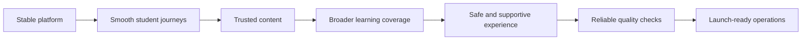

### What is done and what is left

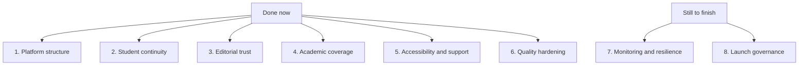

This roadmap section now also uses simpler language and quick visual summaries so the project picture is easier to understand at a glance.

### 1. Unified production platform architecture

Status: completed.

Main goals:

- finalize the boundary between routes, APIs, modules, persistence, and external providers
- remove prototype-only infrastructure assumptions from core product paths
- standardize shared contracts so all clients consume the same domain rules

Implementation milestones:

- production database adapter layer is added for auth, saved progress, results, and editorial data
- all critical routes read and write through stable module contracts instead of prototype-only assumptions
- shared request, validation, and response contracts are aligned across core APIs
- architecture documentation matches the implemented route to API to module to persistence boundary
- prototype-only persistence paths are removed from primary production code paths

### 2. Fully optimized learner journey continuity

Status: completed.

Main goals:

- make every core learner journey resilient from first visit through resume, review, and follow-up action
- guarantee continuity across refresh, reconnect, device change, and partial failure
- keep saved progress, support state, results, and recommendations synchronized across the platform

Implementation milestones:

- learner account, dashboard, subjects, assessments, exams, saved progress, results, and recommendations all stay in sync across real sessions
- resume and review flows recover correctly after refresh, reconnect, or interrupted writes
- cross-device session continuity is supported for active and submitted work
- support snapshots and access arrangements persist consistently through every core journey
- degraded and recovery states are validated for each high-stakes learner route

### 3. Complete editorial and trust operating system

Status: completed.

Main goals:

- turn editorial controls into a full operating system for creation, review, fact-check, approval, publication, rollback, and audit
- enforce source traceability and content ownership across all learning material
- make trust rules part of normal platform behavior rather than a side workflow

Implementation milestones:

- editors can create, update, review, approve, publish, block, and roll back content through shared workflow tooling
- every student-visible content item carries review state, fact-check state, source attribution, and approval history
- blocked or disputed content can be removed from learner routes without breaking route stability
- audit logs exist for create, review, approval, publish, and rollback actions
- publication gates are enforced in code across all student-facing content surfaces

### 4. Full academic and assessment coverage optimization

Status: completed.

Main goals:

- broaden subject and assessment depth to the target MVP completion scope
- optimize question-bank variation, freshness, and weak-topic reinforcement
- keep exam, timed-assessment, and recommendation quality aligned across the same learner evidence

Implementation outcome:

- Power Grid, results, and recommendations now share one academic reinforcement model instead of inferring weak-topic follow-up independently
- saved exam and timed-assessment evidence now drive one weakest-topic signal with topic-level deep-link routing back into subject study
- recommendation copy, Power Grid focus guidance, and result next-step priorities stay aligned around the same saved learner evidence
- the MVP content catalog now covers broader GCSE and iGCSE topic depth across mathematics, English language, and combined science with published editorial records
- timed-assessment coverage now includes six checkpoint definitions across algebra, geometry, inference, writing craft, science energy, and iGCSE graph fluency
- reinforcement tests now protect weakest-topic selection and subject-route fallback behaviour from drifting as more content is added

Implementation milestones:

- target subject set is fully covered with validated topic depth
- exam and timed-assessment inventories are expanded to the intended MVP breadth
- question-bank freshness and variant rotation rules are tuned against real coverage goals
- recommendation quality uses broader learner evidence and produces stable next-step guidance
- weak-topic reinforcement rules are consistent across results, Power Grid, and recommendations

### 5. Accessibility, safeguarding, and student support excellence

Status: completed.

Implementation outcome:

- accessibility, read-aloud, and support-aware messaging now share one reviewed safety model instead of leaving safeguarding language to scattered page copy
- the support hub now exposes reviewed signposting rules, escalation guidance, and route-by-route support guidance for support, accessibility, and recommendations
- accessibility and recommendations now surface the same escalation guidance so urgent help stays visible without turning learning routes into pseudo-therapy flows
- support-safety tests now protect signposting-only behaviour, urgent-help visibility, and route-coverage expectations from drift

Implementation milestones:

- accessibility settings are fully supported across all core learner routes and backed by a shared support-aware message layer
- read-aloud, support snapshots, and access arrangements behave consistently in live and saved flows
- safeguarding and support-signposting copy is reviewed and validated for high-risk contexts
- crisis and wellbeing pathways remain visible without interrupting core academic journeys unnecessarily
- support-aware experiences are reviewed for clarity, safety, and age appropriateness

### 6. Quality engineering and architecture hardening

Status: completed.

Implementation outcome:

- saved-progress transition, normalization, and write-side consistency rules now live behind explicit shared helpers instead of staying buried inside one service body
- route error handling now has a pure boundary helper so thin API routes can share one failure contract without duplicating error-shaping logic
- regression coverage now protects continuity transitions, stale question filtering, safe resume pointers, route error fallback behaviour, and submitted-session immutability
- the saved-progress service is thinner and more maintainable because persistence writes now compose shared hardening rules instead of redefining them inline

Implementation milestones:

- unit coverage exists for scoring, timing, persistence, publication, and continuity rules
- route and API boundary coverage now exists for shared route-error handling plus saved-progress write-side transitions
- critical learner journeys have regression protection around resume, submit, and review continuity paths
- module boundaries are simplified where duplication or drift still exists
- data consistency guarantees are enforced for submission, resume, review, and editorial transitions

### 7. Production observability, performance, and resilience

Status: completed.

Implementation outcome:

- the admin route now includes one shared operations view across auth, persistence, saved sessions, assessments, exams, and editorial workflow
- launch alerts now stay visible for preview auth, prototype-style persistence, blocked content, and missing support carry-over in saved sessions
- risky actions now produce structured operational events for auth, editorial changes, saved-progress status changes, exam submissions, and timed-assessment submissions
- simple performance watch points now keep content size, saved-session growth, and live inventory growth visible during launch preparation
- recovery readiness is now shown in one place so account recovery, data recovery, session continuity, and editorial rollback can be checked together

Implementation milestones:

- monitoring and alerting now cover auth, persistence, assessments, exams, saved progress, and editorial flows
- structured logs and diagnostics now exist for high-risk write paths and failure states
- performance budgets are reviewed through a shared launch watch view
- resilience is tested through shared alert and recovery checks across key launch systems
- backup and recovery expectations are surfaced through the operations summary for the active data runtime

### 8. Launch governance and long-term operational readiness

Status: completed.

This is the final part of the roadmap.

If anyone needs one section to consult before launch, it should be this one.

Implementation outcome:

- the admin route now includes a launch-governance layer with recorded reviews, named owners, final smoke checks, and post-launch follow-up loops
- privacy, retention, safeguarding, support, and release-approval reviews are now recorded in one visible launch-readiness view
- engineering, editorial, student data, and support responsibilities are now clearly named instead of being left as implied ownership
- the final launch walk-through now has an explicit checklist across dashboard, subjects, assessments, exams, saved progress, results, account, and admin
- post-launch review routines now exist for incidents, content corrections, and learner trust follow-up so the product is ready to keep improving after release

Implementation milestones:

- deployment and launch ownership are reflected through one admin-facing governance summary
- privacy, retention, safeguarding, and compliance reviews are completed and recorded
- ownership is defined for incidents, content operations, data support, and release approvals
- final launch smoke tests are listed across all core routes and operational workflows
- post-launch review loops exist for incidents, learner trust issues, and content corrections

### Final launch closeout roadmap

Consult this section last.

This is the real final roadmap to full completion, with the code, architecture, operational setup, and launch environment all working as a true production system instead of a strong prototype.

### Final launch picture

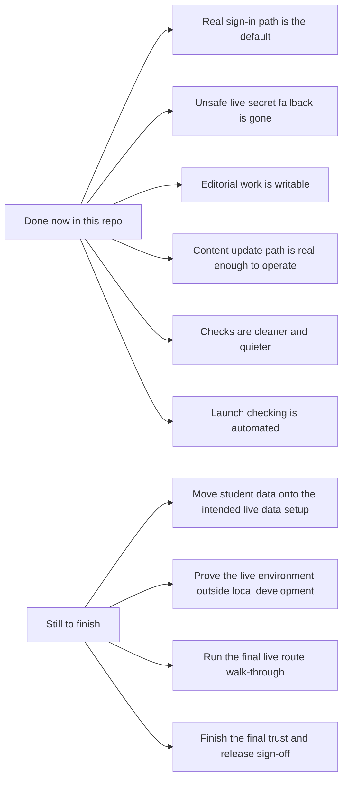

### What is already done in the codebase

1. Done. Sign-in no longer defaults to preview mode.
2. Done. Live sign-in no longer falls back to the preview secret.
3. Not done yet. Student data is still using the local file-based setup, so the intended live data setup still needs to replace it.
4. Done. Editorial work now runs through a writable live workflow in this runtime.
5. Done. The content and paper update path is now described and handled as a real operating path instead of only a placeholder plan.
6. Done. Verification is cleaner now, with the noisy runtime warning issue cleared up.
7. Done. Launch checking now has stronger automation instead of relying only on manual command runs.
8. Not done yet. The full live environment still needs to be confirmed outside local development.
9. Not done yet. The final live route walk-through still needs to be run in the real environment.
10. Not done yet. The final privacy, safeguarding, alerts, ownership, and release sign-off still need to be confirmed in the live environment.

### What still must be finished before calling this fully launched

1. Move student data onto the intended live data setup, with backup, restore, and recovery checks proved in the real operating environment.
2. Confirm the live environment, live settings, and release flow work correctly outside local development.
3. Run the final live route check across dashboard, subjects, assessments, exams, saved progress, results, account, support, and admin.
4. Confirm privacy, retention, safeguarding, alerts, ownership, and final release sign-off in the live environment.

### Full completion checklist

For this project to be honestly described as fully complete, all of the following need to be true at the same time:

1. The sign-in system is running on the intended live auth setup.
2. Live auth does not fall back to preview secrets.
3. Student data is stored through the intended production-ready data layer.
4. Backup and restore checks are proven for live student data.
5. Editorial review, approval, publishing, and rollback are fully writable in the intended live workflow.
6. Planned content and paper-ingestion paths are replaced by real operating paths.
7. The test and verification output is clean, without repeated avoidable runtime warnings.
8. The repo has stronger launch automation, not only manual command checks.
9. The live environment passes full route smoke testing.
10. Privacy, retention, safeguarding, support, and incident ownership are confirmed in the real release environment.

Current closeout status: 7 of 10 final launch items are done in the codebase. 3 of 10 still need live-environment completion.

### Final completion sequence

1. Live student data setup
2. Live environment confirmation
3. Final live route check
4. Final trust and release sign-off

### Why this section matters

The product build is strong, but it should not be described as fully launch-complete until this closeout list is finished.

This is the final section that should be consulted before anyone says the platform is fully complete or fully live.

### Final Path Mark 1

This is the main section to refer back to for the true final path to full completion.

It covers everything still needed across:

- code
- architecture
- data
- sign-in
- editorial workflow
- content operations
- release checks
- live environment proof
- trust, ownership, and final launch approval

### Full launch audit in simple language

This is the plain-language launch audit for the whole project.

What the audit says overall:

- the product is strong and much more than a rough prototype
- the core learner journey is in good shape
- the sign-in direction is stronger than before
- the editorial controls are stronger than before
- the launch checking is stronger than before
- but the platform is still not honestly at a true 100% live-production finish

Current plain-English completion picture:

- earlier quality and roadmap phases are complete for the work they were meant to cover
- the final launch closeout list is 7 of 10 complete in the codebase
- the true full-launch picture is closer to about 88% to 90% complete
- the remaining gap is mostly about real live setup, real proof, real operating discipline, and final launch approval

The four biggest things still stopping a true 100% launch are:

1. The live student-data path is now implemented in code, but it still needs to be proven in the real deployed environment with real backup and recovery evidence.
2. The repo now has live-proof automation, but the deployed sign-in path still needs a real run with live credentials, callbacks, and protected-route proof.
3. The final live route walkthrough path now exists in code, but the real target environment still needs the recorded pass.
4. The final launch approval picture is visible and recordable, but it still needs named real-world approvals and evidence from the live environment.

### Full completion plan

This is the full plan for taking the project from a strong near-launch build to a true 100% production-ready release.

#### 1. Make the project story tell the exact truth

What needs to be done:

- keep the README, admin launch view, and release notes aligned with the real state of the code
- stop any wording that sounds more complete than the real live setup or operating path
- keep one clearly named launch section as the single source of truth before release
- document the real production architecture, real operating path, and real remaining risks in one place

100% complete means:

- the README and admin view say the same thing
- the completion percentage is based on real remaining launch work, not optimism
- nobody reading the project can mistake a strong near-launch system for a fully live system

#### 2. Finish production sign-in for the real environment

What needs to be done:

- connect the intended real sign-in provider setup end to end
- prove sign-in, sign-out, callback handling, and protected-route access in the real environment
- make preview sign-in a local-only development tool, not a launch path
- confirm role handling for student, editor, and admin access in the real deployed environment
- add clear failure handling for sign-in provider outages or incomplete provider setup

100% complete means:

- real users can sign in through the intended live sign-in path
- protected pages and APIs work correctly outside local development
- preview sign-in is not used as release evidence

#### 3. Replace local student-data storage with the intended live data setup

What needs to be done:

- move saved progress, results, account-linked settings, sessions, and editorial records off the local file-based setup
- use the intended shared live data layer for all important learner continuity records
- prove backup creation, backup restore, and recovery checks in the real operating environment
- confirm continuity across multiple sessions, sign-ins, and restarts
- document ownership for data recovery and incident handling

100% complete means:

- student data is not relying on local machine storage
- restart, restore, and recovery behaviour are proven
- saved progress and results survive real-world usage safely

#### 4. Finish the live editorial and content operating path

What needs to be done:

- keep the writable editorial workflow as the real place where review, approval, publish, and rollback happen
- replace future or optional content-source wording with the real live operating source path
- define exactly how new content, corrections, and paper updates arrive and are approved
- confirm blocked content, disputed evidence, and rollback handling in the live workflow
- keep source evidence and trust checks attached to every publish decision

100% complete means:

- there is one real content operating path
- editorial work is writable, reviewable, reversible, and trustworthy
- content and paper updates are no longer described as future placeholders

#### 5. Make launch governance evidence-based

What needs to be done:

- change launch reviews and sign-off records from mostly fixed statements into evidence-backed release records
- store the real outcome of environment checks, route checks, approvals, and sign-off actions
- make the admin governance view reflect real proof, not only expected status
- record who approved what, when, and on which environment
- keep privacy, safeguarding, support, alert ownership, and incident ownership tied to named people and real release evidence

100% complete means:

- launch governance is based on real release evidence
- sign-off can be audited after launch
- the final release decision is backed by proof, not assumptions

#### 6. Upgrade release scripts from local confidence to real launch proof

What needs to be done:

- keep local smoke tests, end-to-end checks, and release scripts for development confidence
- add a real live-mode verification path that does not depend on preview sign-in
- separate local verification from pre-launch verification so the results are honest
- make release scripts clearly show what was tested locally and what was tested in the live environment
- keep verification output quiet, readable, and trustworthy

100% complete means:

- green checks prove the intended release mode, not just the local preview mode
- launch scripts clearly distinguish rehearsal checks from real launch checks
- the release process is repeatable and easy to trust

#### 7. Prove the live environment outside local development

What needs to be done:

- confirm real environment variables, domains, secrets, sign-in callbacks, and route protection in the deployed environment
- confirm the live data location, backup location, and recovery path
- confirm the live editorial mode and the live admin route behaviour
- confirm support, saved progress, results, dashboard, subjects, assessments, exams, account, and admin in the real environment
- confirm alerts, logs, and failure handling for auth, persistence, and content operations

100% complete means:

- the platform behaves correctly in the real deployed environment
- live infrastructure matches what the code expects
- launch readiness is proven outside local development

#### 8. Run the final live launch walk-through

What needs to be done:

- run the final signed-in route pass across dashboard, subjects, assessments, exams, saved progress, results, account, support, and admin
- check student continuity from start to save to resume to submit to review
- check role protection for student, editor, and admin journeys
- confirm content visibility, blocked content handling, and editorial controls
- record the date, environment, and result of the walk-through

100% complete means:

- the whole learner and admin journey has been tested in the live environment
- the final route pass is recorded and repeatable

#### 9. Finish final trust, compliance, and release ownership

What needs to be done:

- confirm privacy and retention handling in the live environment
- confirm safeguarding wording, urgent-help signposting, and support boundaries
- confirm alert ownership, incident ownership, and recovery responsibility
- confirm who has final launch authority and who can stop a release
- capture the final release approval in a permanent record

100% complete means:

- the live release has named owners, named approvals, and named recovery responsibilities
- the platform is not only working, but governable and supportable

#### 10. Define the exact meaning of 100%

This project should only be called 100% complete when all of the statements below are true at the same time:

1. The README, admin launch view, and release picture all match each other.
2. Real sign-in is the release path in the deployed environment.
3. Preview sign-in is not being used as proof of launch readiness.
4. Student data runs on the intended live data setup.
5. Backup, restore, and recovery checks are proven for live student data.
6. Editorial review, approval, publish, and rollback all work through the real live workflow.
7. Content and paper update paths are real operating paths, not future placeholders.
8. Launch governance reflects real evidence and real sign-off.
9. Release automation proves both local confidence and live launch readiness honestly.
10. The live environment has passed the final full route walk-through.
11. Privacy, safeguarding, support, alerts, ownership, and release approval are confirmed in the live environment.

Until all of those are true together, the project should be described as near-launch, not fully complete.

### Final phase for actual completion

This is part of Final Path Mark 1 and should be treated as the final completion standard for the whole project.

This is the last full phase required before the project can honestly be called fully complete, fully live, and free of prototype foundations.

In simple terms, this phase means:

- no preview-only launch path
- no local-only student-data dependency
- no placeholder content operating path
- no guessed sign-off
- no gap between what the README says and what the live platform really does

#### The final-phase goal

The goal of this last phase is to make the whole platform work as one real production system.

That means:

- the code is real
- the architecture is real
- the data setup is real
- the sign-in path is real
- the editorial path is real
- the release checks are real
- the launch approval is real

#### The final-phase picture

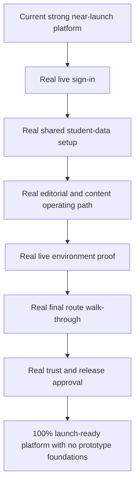

#### The full final-phase checklist

##### 1. Finish the real sign-in path

This must be true:

- the live sign-in route is the one used for real launch
- preview sign-in is kept only for local development and rehearsal
- student, editor, and admin access all work correctly in the live environment
- sign-in, sign-out, and protected pages are proven in the real release setup

##### 2. Finish the real student-data path

This must be true:

- saved progress, results, account settings, sessions, and editorial records no longer depend on local machine files
- the live data location is shared, durable, and intended for real use
- restart, backup, restore, and recovery checks are proven
- learner continuity survives across sessions, devices, and returns

##### 3. Finish the real content and editorial path

This must be true:

- review, approval, publish, block, correction, and rollback all happen through one real operating path
- content and paper updates are no longer described as future or optional placeholders
- trust evidence stays attached to every publish decision
- blocked or disputed content can be safely held back without confusing learners

##### 4. Finish the real architecture picture

This must be true:

- the routes, services, data layer, sign-in boundary, and editorial controls all match the architecture described in the README
- the product is not quietly relying on prototype-only assumptions under the surface
- the live architecture is simple enough to explain clearly and strong enough to operate safely

##### 5. Finish the real launch evidence

This must be true:

- launch checks show what was proved locally and what was proved in the live environment
- the strongest checks no longer depend on preview-only behaviour
- the final route walk-through is recorded with the environment, date, and result
- the release story is backed by proof, not confidence alone

##### 6. Finish the real operating ownership

This must be true:

- privacy, safeguarding, support boundaries, data recovery, alerts, and incidents all have named owners
- the final release approval is recorded clearly
- it is clear who can approve launch, stop launch, and respond after launch

#### What 100% launch-ready means here

For this project, 100% launch-ready means all of the following are true at the same time:

1. The live platform uses the intended real sign-in path.
2. The live platform uses the intended real shared student-data setup.
3. The live platform uses the intended real editorial and content operating path.
4. The strongest release checks prove the real live setup, not only the local preview setup.
5. The full learner and admin journey has been checked in the real environment.
6. The launch record includes real evidence, real owners, and real release approval.
7. The README, the admin launch view, and the live runtime all tell the same story.

If even one of those is still missing, the project is not yet at true 100% completion.

#### Final launch decision rule

The project should only be called fully complete when this final phase is finished in full.

Until then, the honest description is:

- strong
- advanced
- near-launch
- but not yet fully complete
- and not yet fully free of prototype foundations

### Final Path Mark 2

This section names the final live-completion path that follows `Final Path Mark 1`.

Use it when the codebase closeout is already in place and the remaining work is about proving, recording, and approving the real live platform.

#### What Final Path Mark 2 means

- `Final Path Mark 1` = the repo, scripts, governance surfaces, and closeout structure are in place
- `Final Path Mark 2` = the real deployed environment has been proven end to end and the final launch approval has been recorded

Authoritative rule:

- The following `Full End-to-End Completion List` is the only list to use when judging true 100% completion for this repository.
- Use this same list in this README, in `AGENTS.md`, in this chat, and in any future chat or completion discussion for this repository.
- Do not replace it with a shorter substitute list.
- Short summaries are allowed only if they clearly point back to this list as the source of truth.

`Final Path Mark 2` should only be marked complete when every item below is complete in the real target environment.

#### Full End-to-End Completion List

1. Configure the real live auth environment.
   Set `SWITCH_AUTH_MODE=oidc`, `SWITCH_AUTH_SECRET`, `SWITCH_AUTH_BASE_URL`, and one complete live OIDC provider block.
2. Prove the real deployed sign-in flow.
   Verify sign-in, callback, session creation, sign-out, and protected-route access in the live environment.
3. Prove the real deployed sign-up and onboarding flow.
   Verify welcome, learner-role selection, school and year-group capture, qualification-path capture, subject selection across GCSE and iGCSE where supported, accessibility-question capture, SEND and access-arrangement path visibility, guardian invite path, age-or-consent confirmation, UK school-source lookup behaviour, and first dashboard provisioning based on the learner's selected setup in the live environment.
4. Configure the real live persistence environment.
   Set `SWITCH_PERSISTENCE_DRIVER=sqlite` and `SWITCH_DATA_DIRECTORY` to the intended shared live student-data setup.
5. Prove live student-data continuity.
   Verify saved progress, results, account-linked settings, and session continuity across real usage.
6. Prove backup, restore, and recovery.
   Run live backup, restore, and recovery checks for the student-data path.
7. Configure the live CMS and editorial runtime.
   Set `SWITCH_CMS_BACKEND_MODE=live` and confirm the intended writable editorial operating mode.
8. Prove the live editorial workflow.
   Verify review, approval, publish, rollback, and blocked-content handling through the real operating path.
9. Configure live governance recording.
   Set `SWITCH_RECORD_GOVERNANCE=1` and `SWITCH_GOVERNANCE_ENVIRONMENT` for the target release environment.
10. Provide named launch ownership.
   Set `SWITCH_LAUNCH_APPROVER` and `SWITCH_LAUNCH_STOP_AUTHORITY`.
11. Provide governance review notes.
   Set `SWITCH_GOVERNANCE_PRIVACY_REVIEW_NOTE`, `SWITCH_GOVERNANCE_SAFEGUARDING_REVIEW_NOTE`, and `SWITCH_GOVERNANCE_RELEASE_REVIEW_NOTE`.
12. Provide governance sign-off notes.
   Set `SWITCH_GOVERNANCE_PRIVACY_SIGNOFF_NOTE`, `SWITCH_GOVERNANCE_SAFEGUARDING_SIGNOFF_NOTE`, `SWITCH_GOVERNANCE_ALERTS_SIGNOFF_NOTE`, `SWITCH_GOVERNANCE_INCIDENT_SIGNOFF_NOTE`, and `SWITCH_GOVERNANCE_RELEASE_SIGNOFF_NOTE`.
13. Configure the live base URL.
   Set `SWITCH_LIVE_BASE_URL` to the deployed platform URL.
14. Provide live route test access.
   For cookie or OIDC live auth, set `SWITCH_LIVE_STUDENT_COOKIE` and `SWITCH_LIVE_ADMIN_COOKIE`. For `external-header` live auth, set the matching live student and live admin identity environment values required by the walkthrough runtime.
15. Run live launch status verification.
   Execute `npm run verify:launch-status` and confirm the report shows the intended release environment inputs, command order, and any remaining live-only gaps truthfully before the final run starts.
16. Run live readiness verification.
   Execute `npm run verify:live-readiness`.
17. Run live persistence recovery verification.
   Execute `npm run verify:persistence-recovery`.
18. Run the final live walkthrough.
   Execute `npm run verify:live-walkthrough` across dashboard, subjects, assessments, exams, saved progress, results, account, support, and admin.
19. Run the final governance sign-off.
   Execute `npm run verify:launch-signoff`.
20. Run the final launch completion sequence.
   Execute `npm run verify:launch-complete`.
21. Store the release evidence permanently.
   Keep the outputs from launch-status, readiness, recovery, walkthrough, sign-off, and launch-complete as the permanent release record.
22. Confirm system-wide truth matches.
   Ensure `README.md`, the admin launch view, runtime state, and recorded release evidence all match exactly.

Completion rule:

- Only when all 22 items above are done should the platform be described as fully complete, fully live, and 100% end to end.

#### Final Path Mark 2 command order

Run these in order against the intended release environment once the deployment is ready:

1. `npm run verify:launch-status`
2. `npm run verify:live-readiness`
3. `npm run verify:persistence-recovery`
4. `npm run verify:live-walkthrough`
5. `npm run verify:launch-signoff`
6. `npm run verify:launch-complete`

#### Final Path Mark 2 completion rule

The platform should only be called fully complete when:

- `Final Path Mark 1` is code-complete in the repository
- `Final Path Mark 2` is evidence-complete in the real environment
- the final release record includes real owners, real proof, and real approval

Until then, the honest description remains near-launch rather than fully complete.

#### Final Path Mark 2 operator note from the June 21, 2026 live run

The June 21, 2026 live-launch session established these additional operator truths for the current OIDC release path:

- In OIDC mode, there is no separate built-in live admin user record to create inside the app.
- Live admin access is assigned from the signed-in OIDC email address through `SWITCH_AUTH_ADMIN_EMAILS`.
- If the same live user should be able to enter both editorial and admin-protected routes, that same email should also be included in `SWITCH_AUTH_EDITOR_EMAILS`.
- `SWITCH_LIVE_STUDENT_COOKIE` and `SWITCH_LIVE_ADMIN_COOKIE` must contain real signed-in `switch_auth_session=...` values copied from the deployed browser session. Placeholder values do not count as live route test access.
- A live manual sign-in success does not by itself complete `Full End-to-End Completion List` item 14. The walkthrough runtime still needs those two real cookie values for the scripted proof path.

Recommended live admin configuration pattern for the current Google OIDC path:

```bash
SWITCH_AUTH_EDITOR_EMAILS=your-real-google-email@example.com
SWITCH_AUTH_ADMIN_EMAILS=your-real-google-email@example.com
```

Current recorded blocker state from that same live run:

- `npm run verify:live-readiness` passed
- `npm run verify:persistence-recovery` passed
- `npm run verify:live-walkthrough` failed because authenticated `/assessments` returned `500`
- `npm run verify:launch-complete` failed because it depends on `verify:live-walkthrough`

The honest project label remains `near-launch` until the walkthrough, sign-off, launch-complete, permanent evidence storage, and system-wide truth-match steps are all complete.

#### June 21, 2026 later live-run update

A later June 21, 2026 live run moved the project further forward:

- `npm run verify:live-walkthrough` passed
- `npm run verify:launch-signoff` passed
- `npm run verify:launch-complete` passed
- the command outputs were stored in `release-evidence/2026-06-21-final-path-mark-2-local-live-check.md`

Important remaining truth:

- a later same-day rerun replaced the placeholder ownership values with `TF Solutions` in the local evidence path
- the final system-wide truth match across README, admin runtime view, runtime state, and recorded evidence was then checked explicitly and found a remaining deployed-runtime mismatch

Because of those remaining gaps, the honest label remains `near-launch` rather than final true `100% complete`.

### Final target architecture

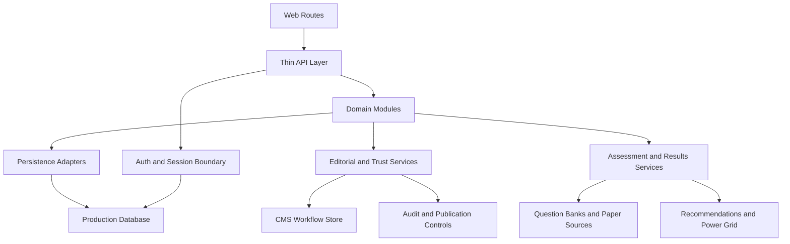

### Final learner continuity model

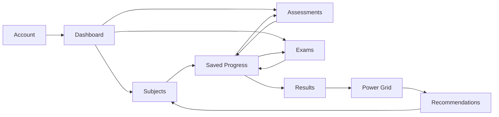

### Final content trust flow

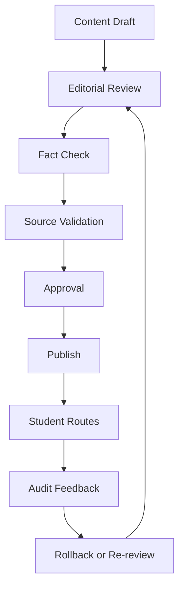

### Final quality and operations loop

```mermaid
flowchart LR
    A["Code Changes"] --> B["Automated Tests"]
    B --> C["Build and Deploy"]
    C --> D["Monitoring and Alerts"]
    D --> E["Incident and Support Review"]
    E --> F["Product and Editorial Improvements"]
    F --> A
```

## Recent Additions

This section is kept near the bottom on purpose so the README can read as a full project guide first and a latest-changes log second.

### Guided sign-up and onboarding direction

The product direction now explicitly includes a guided sign-up and onboarding flow inspired by the supplied reference journey.

That means the intended learner account path should include:

- welcome and role entry
- progressive onboarding with visible step state
- school and year-group capture
- qualification-path selection
- subject selection
- accessibility support question
- SEND, access-arrangement, and support-path question flow
- optional guardian invite
- age-or-consent confirmation
- first dashboard build after onboarding completion

This direction is now part of the MVP plan rather than a later polish idea.

Architecture rule:

- onboarding should stay thin in the website frontend
- auth, account, learner-profile, subject-selection, and guardian-invite rules should live behind shared API and module boundaries
- dashboard, planner, recommendations, and saved progress should consume onboarding outcomes instead of re-asking for the same setup separately
- the first dashboard should be built from what the learner picked during onboarding rather than treating the dashboard as generic before setup
- qualification, subject, accessibility, and support selections should directly shape dashboard content, planner defaults, saved progress setup, and recommendations

UK school-source direction:

- England: `https://www.get-information-schools.service.gov.uk/`
- Scotland: `https://education.gov.scot/parentzone/find-a-school/`
- Wales: `https://mylocalschool.gov.wales/`
- Northern Ireland: `https://www.eani.org.uk/`

These links should be treated as maintained source-entry points for school lookup planning rather than replaced by one hardcoded local school list.

### Later qualification expansion direction

This is a later expansion note and not part of the current active MVP list or current active build-priority order.

Future qualification expansion should be handled by qualification family, not by incorrectly placing every nation into one GCSE bucket.

Planned later-direction categories:

- England GCSE
- Wales GCSE
- Northern Ireland GCSE
- broader iGCSE coverage
- Scotland as a separate qualification family
- Republic of Ireland as a separate qualification family

Rules for this later expansion:

- do not describe Scottish qualification content as GCSE content
- do not describe Republic of Ireland qualification content as GCSE content
- keep nation and qualification selection explicit in onboarding and account setup
- let dashboard, planner, recommendations, and content access adapt from the selected qualification route
- only move these later-direction categories into active delivery when the current MVP and launch path can support the added content, routing, and quality-control load

### Shared repository and persistence foundation

The architecture now has a cleaner shared persistence boundary for core local data flows instead of each module owning its own file-write pattern.

That includes:

- a reusable JSON file store utility for local persistence adapters
- shared default repositories for auth sessions, saved progress, access profiles, and CMS workflow records
- file-backed access profile persistence instead of in-memory-only support settings
- thinner module services that now depend on reusable repository boundaries instead of duplicating storage logic

This foundation is now part of the completed final-phase architecture slice for the current roadmap pass.

### Shared server request context

Core API routes now also share a cleaner server request boundary instead of resolving auth and user context separately in each route.

That includes:

- a shared request context helper for session, user id, and default server repositories
- core account, dashboard, progress, recommendations, results, and saved-progress APIs reading from the same auth-derived route context
- cleaner route-to-service wiring for repository-backed server flows

This request-context layer completed the current final-phase architecture slice by moving the main learner-facing read and write APIs onto shared server boundaries.

### Shared learner continuity layer

The platform now has a shared learner continuity model so resume, review, and next-step decisions stop drifting between dashboard, saved progress, results, Power Grid, and recommendations.

That includes:

- a shared learner continuity service built from saved-progress session summaries
- one primary continuity action for active resume, submitted review, or first-session start states
- saved progress, dashboard, Power Grid, results, and recommendations reading the same continuity direction instead of inferring it independently
- continuity-aware follow-up labels that keep submitted work on review paths instead of reopening finished live sessions

This continuity layer is now part of the completed learner-journey slice for the current final-phase roadmap pass.

Learner-friendly explanation:

- if work is still active, the platform should send the learner back to the exact saved place to continue
- if work is already submitted, the platform should send the learner to review results instead of reopening the finished live session
- if no session exists yet, the platform should guide the learner into the safest first action

Continuity flow:

```mermaid
flowchart TD
    A["Learner opens dashboard, saved progress, results, or recommendations"] --> B["Shared continuity service reads saved session summaries"]
    B --> C{"Active session exists?"}
    C -- "Yes" --> D["Resume the saved live session"]
    C -- "No" --> E{"Submitted session exists?"}
    E -- "Yes" --> F["Open review through results"]
    E -- "No" --> G["Guide learner into first safe session"]
```

Route alignment model:

```mermaid
flowchart LR
    A["Saved Progress"] --> E["Shared continuity decision"]
    B["Dashboard"] --> E
    C["Results"] --> E
    D["Recommendations"] --> E
    E --> F["Resume active work"]
    E --> G["Review submitted work"]
    E --> H["Start first session"]
```

### Production auth provider boundary

The auth layer now has a real production-capable provider boundary instead of stopping at local preview cookies and seeded demo identities.

That includes:

- signed auth session cookies instead of local persisted session records for the primary web auth boundary
- redirect-based provider start and callback routes for production sign-in flows
- OIDC-style provider configuration for authorization, token exchange, user-info resolution, and mapped roles
- stronger external-header trust rules through optional signed upstream auth headers
- account, protected routes, and role-aware APIs still consuming the same auth contracts while the runtime mode changes underneath

This auth boundary now covers the production-auth slice of the current launch-readiness roadmap pass while keeping preview mode available for local development.

#### Final Path Mark 2 live auth minimum

Before the platform can start the final live completion path, the deployed auth environment must include one complete redirect-based OIDC configuration.

The minimum live auth block is:

```bash
SWITCH_AUTH_MODE=oidc
SWITCH_AUTH_SECRET=<long-random-production-secret>
SWITCH_AUTH_BASE_URL=https://app.switch.example.com

SWITCH_OIDC_GOOGLE_CLIENT_ID=<provider-client-id>
SWITCH_OIDC_GOOGLE_CLIENT_SECRET=<provider-client-secret>
SWITCH_OIDC_GOOGLE_AUTHORIZATION_URL=https://accounts.google.com/o/oauth2/v2/auth
SWITCH_OIDC_GOOGLE_TOKEN_URL=https://oauth2.googleapis.com/token
SWITCH_OIDC_GOOGLE_USERINFO_URL=https://openidconnect.googleapis.com/v1/userinfo
SWITCH_OIDC_GOOGLE_SCOPES=openid profile email
SWITCH_OIDC_GOOGLE_PROMPT=select_account
```

Rules for this block:

- `SWITCH_AUTH_MODE` must resolve to `oidc` for the redirect-based live sign-in path.
- `SWITCH_AUTH_SECRET` must be a real production secret and must not use the preview fallback.
- `SWITCH_AUTH_BASE_URL` must be the exact deployed app origin used by the callback flow.
- At least one provider block must be complete from top to bottom.
- A provider only counts as complete when `CLIENT_ID`, `CLIENT_SECRET`, `AUTHORIZATION_URL`, `TOKEN_URL`, and `USERINFO_URL` are all present together.
- The repo treats a partial provider block as not configured.

The matching template now lives in `.env.example` under `Final Path Mark 2 live OIDC release example`.

### Explicit editorial publish gates

Editorial workflow now exposes explicit publish-gate checks instead of relying on one implicit ready flag after workflow updates.

That includes:

- publish-gate checks for publication status, editorial review, fact-check verification, source attribution, and workflow approval
- workflow validation that blocks unsafe approval attempts before content is treated as publish-ready
- required notes for higher-risk editorial actions such as block and rollback
- admin-facing publish-gate visibility so editors can see exactly why a content item is blocked or ready
- shared workflow-rule tests protecting approval and publish-gate behaviour from drift

This trust hardening now strengthens the completed editorial-and-publish-gates slice for the current final-phase roadmap pass.

### Shared academic reinforcement layer

The academic-coverage work now has a shared reinforcement layer and broader content inventory so weak-topic guidance stops drifting between progress, results, and recommendation surfaces.

That includes:

- one shared saved-evidence model for weakest-topic detection across exams and timed assessments
- topic-priority signals that can deep-link back into the subject route when a matching catalog topic exists
- subject-level fallback guidance when the saved evidence is narrower than the current catalog structure
- aligned next-step messaging across Power Grid, results, and recommendations instead of three separate weak-topic heuristics
- broader published topic coverage across GCSE mathematics, GCSE English language, GCSE combined science, and iGCSE mathematics
- six timed checkpoints and seven seeded exam papers now mapped against the expanded subject inventory
- focused tests for weakest-topic prioritisation and subject-route fallback behaviour

This reinforcement and coverage expansion now completes the current academic-and-assessment optimization slice for the final-phase roadmap.

### Editorial trust and audit trail

The platform now has a stronger editorial trust layer behind student-visible content. That means content teams can record who owns a change, what review action happened, when something was blocked, and how to roll it back safely without losing the audit trail.

That includes:

- richer editorial workflow records with owner, action type, timestamps, notes, and action history
- admin controls for review, fact-check, approval, block, and rollback actions
- recent audit-trail visibility in the admin workflow view so changes can be understood quickly
- rollback-aware workflow handling so content can return to a safer earlier state when needed
- stronger trust reporting in the editorial summary, including rollback counts

This trust layer is now part of the completed editorial and trust slice for the current final-phase roadmap pass.

Learner-friendly explanation:

- if a learning item is reviewed or corrected, the platform can now keep a clearer record of who changed it and why
- if something is disputed or unsafe, it can be blocked and tracked instead of quietly drifting through the system
- if a mistake gets published, the workflow can step back to an earlier safer state instead of leaving the learner with unclear content history

Editorial trust flow:

```mermaid
flowchart TD
    A["Editor updates content item"] --> B["Workflow action recorded"]
    B --> C["Owner, note, and timestamp saved"]
    C --> D{"Workflow action"}
    D -- "review" --> E["Queued for review"]
    D -- "fact-check" --> F["Queued for fact-check"]
    D -- "approve" --> G["Approved for release decisions"]
    D -- "block" --> H["Blocked from learner release"]
    D -- "rollback" --> I["Returned to an earlier safer status"]
```

Audit trail model:

```mermaid
flowchart LR
    A["Content item"] --> B["Workflow record"]
    B --> C["Owner"]
    B --> D["Current status"]
    B --> E["Action history"]
    E --> F["Review"]
    E --> G["Fact-check"]
    E --> H["Approval"]
    E --> I["Block"]
    E --> J["Rollback"]
    E --> K["Admin audit view"]
```

### Daily student motivation section

The MVP now includes a clean daily motivation section so the website can greet students with a calmer message that changes each day.

That includes:

- a shared daily motivation service for one quote-of-the-day style message
- a clean dashboard and home section that shows the quote without cluttering the study flow
- the same motivation moment carried into the app preview so the website and app concept stay aligned

Learner-friendly explanation:

- some students need a quieter emotional reset before they jump into saved work, results, or a new paper
- this section is meant to support momentum, not add pressure
- the wording stays simple and encouraging instead of sounding corporate or distracting

Motivation flow:

```mermaid
flowchart LR
    A["Current date"] --> B["Shared motivation service"]
    B --> C["Daily quote selected"]
    C --> D["Home and dashboard section"]
    C --> E["App preview mobile concept"]
```

### Website and app mockup preview

The project now also includes a dedicated preview route at `/app-preview` so the same product foundation can be shown as both a website direction and a mobile-style app concept.

That includes:

- a launch-style website preview built from the real dashboard metrics and route actions
- a mobile app mockup panel driven by the same learner continuity and Power Grid signals
- academic coverage cards built from the live subject catalog instead of placeholder marketing copy
- a local preview link for demos when the app is running: `http://localhost:3000/app-preview`

Why this matters to a learner:

- it shows that the product can feel consistent across web and app-style experiences
- it keeps the same next-step logic, readiness signals, and support context instead of inventing a second disconnected experience
- it makes demos easier because the product story is visible in one route

Preview structure:

```mermaid
flowchart LR
    A["Dashboard data"] --> D["/app-preview"]
    B["Power Grid summary"] --> D
    C["Student-visible subject catalog"] --> D
    D --> E["Website launch view"]
    D --> F["Mobile app mockup"]
    D --> G["Coverage cards"]
```

### README Standard

For the MVP and later roadmap phases, README updates should stay learner-friendly by default.

That means each major completed or in-progress item should include:

- a plain-English explanation of what changed
- why it matters to the learner journey, not only the codebase
- route or module references for technical readers
- a Mermaid diagram when the change affects a multi-step flow or system boundary
- completion wording that only marks work as done after the implementation is actually in code

### API-first delivery expansion

Recent work extended the internal API-first delivery layer across more of the student product.

That includes:

- shared server-side API helpers
- more page routes consuming thin internal API routes instead of pulling module logic directly
- subject experience and read-aloud session API routes
- stronger consistency between website rendering and service-layer contracts

### Exam freshness and learning repetition

The exam flow now uses a first-pass freshness model that protects learning repetition while reducing stale repeated papers.

The goal is:

- repeat `topics` and `skills`
- rotate exact `question variants`
- keep official structure and timing stable
- preserve the actual generated paper through autosave and results

How it works:

- the exam engine stores paper blueprints with question slots
- each slot has multiple valid variants
- a fresh attempt prefers variants the student has not seen recently
- the generated question set is saved into Saved Progress
- resume restores the exact same generated set
- results score against the exact questions that were actually shown

Architecture flow:

```mermaid
flowchart LR
    A["Exam route"] --> B["/api/exams/session/:examId"]
    B --> C["Exam Engine service"]
    C --> D["Paper blueprint"]
    C --> E["Saved Progress history"]
    D --> F["Question slots"]
    E --> G["Recent exposure signals"]
    F --> H["Variant selector"]
    G --> H
    H --> I["Generated question set"]
    I --> J["Saved Progress snapshot"]
    J --> K["Resume / review / results"]
```

Attempt lifecycle:

```mermaid
flowchart TD
    A["Open exam"] --> B{"Saved attempt exists?"}
    B -- "Yes, active" --> C["Restore exact saved question set"]
    B -- "Yes, submitted" --> D["Show submitted attempt"]
    B -- "No" --> E["Generate first attempt"]
    D --> F["Start fresh attempt"]
    F --> G["Rotate question variants"]
    E --> H["Save session snapshot"]
    G --> H
    C --> I["Continue work"]
    H --> I
    I --> J["Review"]
    J --> K["Submit"]
    K --> L["Results + next fresh attempt available"]
```

Current MVP limit:

- this is the first freshness layer, not the final exam-generation system
- question banks can grow later
- weak-topic-aware reappearance rules can deepen later
- longer-term exposure history can deepen later

### Guided website walkthrough

The website now includes a dedicated `How It Works` route so students can understand the main journey without guessing what route names or website signals mean.

That includes:

- a step-by-step click-through walkthrough
- direct links into Dashboard, Subjects, Assessments, Exams, Progress, Saved Progress, Accessibility, and Support
- glossary explanations for terms such as autosave, Power Grid, support snapshot, submitted, and recommendations
- a standalone API-delivered module that can later be reused by other clients

Guide flow:

```mermaid
flowchart LR
    A["Open /how-it-works"] --> B["Read guided step"]
    B --> C["Click linked route"]
    C --> D["Compare live page with guide explanation"]
    D --> E["Return for next step or glossary"]
```

### Exam submission snapshot integrity

The Exam Engine submission flow now posts the current browser session snapshot through
the API before marking the attempt as submitted.

This protects the autosave rule when a student answers a question and immediately
submits before the debounce save finishes.

The flow is:

- the website sends the current question id, responses, and time remaining to `/api/exams/session/:examId`
- the Exam Engine service saves that latest snapshot through Saved Progress
- the same service marks the saved record as submitted
- Results and Saved Progress read the final submitted answer set, not a stale autosave

Results now seeds or refreshes the relevant sessions first, then reads Saved
Progress, and scores exam outcomes from the saved generated question set and
saved response payload.

Power Grid now follows the same saved-progress state when choosing next actions:
active saved work is resumed first, review-marked work goes back through the
review path, and submitted work routes to Results rather than reopening a
finished attempt.

### Content editorial gate foundation

The content catalog now has a first-pass editorial workflow foundation before
the MVP grows more student-facing content.

That includes:

- source attribution on seed catalog topics
- reviewed, draft, and fact-check-needed content states
- `/api/content/catalog` returning a student-visible catalog by default
- `/api/content/catalog?audience=internal` returning the full internal catalog
- `/api/content/editorial-audit` returning review counts, blocked topics, and next editorial priority
- Admin showing which content is student-visible and which topic is blocked from publication

This keeps the CMS/Admin module as a placeholder while still enforcing the
important rule: unreviewed or draft content should not silently reach student
clients.

### 12. Editorial-gated subject delivery and admin visibility (Completed)

The next implemented stage pushed the content workflow further into the live
student and admin routes rather than leaving it only as a catalog-side idea.

Added work includes:

- subject, topic, revision, and quiz services now reading only student-visible reviewed content
- the `/subjects` route showing a real empty-state when reviewed learning content is not yet available
- content topic metadata now carrying publication status, review status, last-updated timing, and source attribution
- Admin exposing content provider boundaries, blocked topic visibility, and student-visible content counts
- CMS overview records now distinguishing subject, topic, revision, and quiz content references from the same seed source

This matters because the website now behaves like a product with publication
rules, not just a set of routes reading any seeded content that happens to
exist in the repo.

### 13. Saved-state scoring and live exam countdown (Completed)

The exam, results, and Power Grid flow now follows saved session state more
closely, and the exam route now behaves more like a real timed paper.

Added work includes:

- Results reading saved generated question sets and saved responses before scoring an exam attempt
- Power Grid next-action logic separating active work, submitted work, and review-ready work more clearly
- exam submission saving the final browser snapshot before marking the attempt as submitted
- the exam route now running a real countdown instead of only showing a static remaining-time label
- countdown-driven session syncing so remaining time is kept aligned with the existing autosave model
- automatic exam submission when the countdown reaches zero
- clearer in-product time warnings for the final fifteen and five minutes of a paper

This matters because official-duration exam behaviour should feel trustworthy,
and downstream progress or results logic should reflect the actual final session
state rather than a stale autosave snapshot.

### 14. Timed assessment session parity (Completed)

The timed assessment route has now moved beyond a summary-only checkpoint and
into a real saved session flow.

Added work includes:

- live question-by-question timed checkpoint interaction
- seeded timed assessment question sets instead of only aggregate counters
- timed assessment autosave through its own API save path
- timed assessment submission saving the latest browser snapshot before completion
- live countdown behaviour with automatic submission at time expiry
- bookmark and notes support inside the timed checkpoint session
- read-aloud controls inside the active timed assessment flow
- question counts now matching the mock scored answer sets used by Results

This matters because timed practice now behaves more like a real student
workflow and no longer sits behind the exam route as a lighter placeholder.

### 15. Accessibility settings persistence (Completed)

The accessibility route now saves support settings through the API and module
layer instead of behaving like a page-only preview.

Added work includes:

- `PATCH /api/accessibility/snapshot` for profile-backed accessibility updates
- accessibility settings now saving into the shared access-profile and preference model
- saved accessibility state feeding the live accessibility route immediately after save
- read aloud status on the accessibility page now reflecting the newly saved support state
- adjustable font size, colour scheme, and line spacing controls on the student-facing route

This matters because support settings now behave more like real student
preferences that can travel into future read-aloud and saved-session flows.

### 16. Timed assessment result-source consistency (Completed)

Timed assessment results now score from the saved checkpoint question set rather
than from a separate hardcoded answer map.

Added work includes:

- timed assessment question sets now being stored in Saved Progress snapshots
- Results reading timed checkpoint scoring data from the saved question set first
- removal of duplicate timed assessment answer-key assumptions from the results flow
- stronger parity between the live timed checkpoint route and the results route

This matters because scoring should come from the same module-owned session data
that the student actually used, not from a second disconnected result-only map.

### 17. Actionable results routing (Completed)

The results route now links students back into the right study flow instead of
only summarising what happened.

Added work includes:

- exam result items now linking back into full-paper review or resume routes
- timed assessment result items now linking back into checkpoint review or resume routes
- result summaries now carrying action labels and route targets from the results module itself

This matters because outcome screens should help students act on their work,
not just read a score and stop there.

### 18. Dashboard session priority and state clarity (Completed)

The dashboard now prioritises the most relevant active session first and shows
clearer session state on the student home surface.

Added work includes:

- dashboard session cards now distinguishing live work from submitted review work
- dashboard session ordering now prioritising active sessions ahead of submitted ones
- dashboard session cards now carrying explicit action labels such as resume or reopen review
- home and dashboard surfaces now using more reliable “next session” ordering instead of defaulting to the first seeded item

This matters because the student home surface should guide the next real action,
not accidentally treat completed work as the primary resume target.

### 19. Timed assessment deep-link resume reliability (Completed)

Timed assessment resume links now reopen the intended question instead of only
the intended assessment and duration.

Added work includes:

- assessments page now reading `questionId` from route search params
- timed assessment experience now honouring a deep-linked initial question on load
- resume links from saved progress, Power Grid, and results now landing more reliably in the correct checkpoint state

This matters because an autosave resume flow is not fully trustworthy if it
reopens the right session but the wrong question.

### 20. Shared read-aloud speed preference (Completed)

The accessibility route now saves the student's preferred read-aloud speed into
the shared support profile rather than treating speed as a page-only preview
control.

Added work includes:

- accessibility settings now persisting preferred read-aloud speed through the same profile-backed save path
- the accessibility route now making it clearer that saved speed becomes the default for later study sessions
- exam, timed assessment, and other read-aloud sessions now able to start from the same stored reading-speed preference

This matters because read-aloud support should feel continuous across routes,
not reset to a local preview preference whenever the student opens a new
session.

### 21. Live support snapshot in active exam and checkpoint flows (Completed)

The exam and timed assessment routes now surface the actual support snapshot
that is attached to the live session instead of leaving those preferences
implicit behind the scenes.

Added work includes:

- active exam and timed checkpoint sidebars now showing timing adjustments from the shared support layer
- saved profile defaults for text size, reading speed, and colour scheme now visible inside those live routes
- support preference chips now making focus mode, reduced distraction, high contrast, and related settings visible during active work
- read-aloud panels now clarifying the difference between the saved default speed and a temporary preview speed change

This matters because accessibility support should be visible and trustworthy in
the routes where students actually work, not only in the settings screen.

### 22. Support snapshot carry-over in results and saved progress (Completed)

Results and saved-progress summaries now show the saved support context in a
student-readable way instead of reducing it to a hidden count.

Added work includes:

- results cards now showing saved support summaries and support preference chips alongside outcome data
- saved-progress session cards now exposing the same readable support snapshot and preference carry-over details
- support-summary formatting now living in a shared presentation helper so active and post-session routes stay aligned

This matters because students should still be able to see which support profile
was active after submission and during resume decisions, not only while the
session is live.

### 23. Support visibility on dashboard and recommendations (Completed)

The dashboard and recommendations surfaces now carry the same readable support
snapshot language forward into the pre-session decision points.

Added work includes:

- dashboard support summaries and session cards now showing support preference chips alongside existing progress signals
- recommendations now surfacing saved support context in both route insights and relevant recommendation cards
- shared support-summary helpers now connecting accessibility, saved progress, results, dashboard, and recommendations through one presentation layer

This matters because the student should be able to see support context before
starting work, while working, and after submission without each route inventing
its own different wording.

### 24. Power Grid degraded-state recovery (Completed)

The Power Grid route now distinguishes between a trustworthy readiness summary
and a degraded evidence state instead of treating both cases as a normal loaded
progress view.

Added work includes:

- Power Grid summaries now exposing a data-state flag, recovery copy, and source warnings
- the `/progress` route now showing a recovery screen when there is not enough safe subject evidence to build a trustworthy readiness breakdown
- the normal progress surface now showing data-watch warnings when evidence is partial rather than silently pretending the summary is complete

This matters because readiness guidance should fail safely when linked evidence
is incomplete, not keep presenting a confident-looking progress surface with
missing foundations.

### 25. Cautious Power Grid next-step routing (Completed)

Power Grid next-step guidance now becomes more conservative when the evidence is
partial instead of giving a normal-looking confident recommendation.

Added work includes:

- Power Grid next-best-action wording now prefers rebuilding a safer saved evidence trail when source warnings are present
- Power Grid next-step hrefs now fall back toward saved-progress recovery rather than overcommitting to a normal comparison flow
- downstream surfaces that consume Power Grid guidance now inherit that more cautious recommendation automatically

This matters because the route should not give the student a high-confidence
"do this next" message when the evidence behind the comparison is still
incomplete.

## Phase 2 Roadmap

This is the next phase after the current MVP-quality pass. The goal is to harden
the highest-priority modules and replace prototype infrastructure without losing
the modular architecture.

Current roadmap snapshot:

- MVP Quality Checklist: 6 of 6 complete for the current MVP pass (100%)
- Phase 2 Roadmap: 7 of 7 completed (100%)
- Main priority picture across the MVP checklist plus phase 2 roadmap: 13 of 13 major items completed for those earlier phases
- Final launch closeout roadmap: 7 of 10 items completed in the codebase, 3 of 10 still require live-environment completion

### 1. Exam Engine hardening (Completed)

Priority reason:

- this remains the highest-priority product slice in the MVP order

Main goals:

- safer fallback and degraded-state handling when paper or session data is missing
- stronger error-state recovery across live exam flows
- deeper post-submit marking and review quality later in the phase

Current phase 2 progress:

- `/exams` now has a recovery surface when paper or seeded session loading fails instead of assuming the live paper is always available
- the live exam client now exposes stronger recovery messaging and reload paths when autosave, submit, or fresh-attempt writes fail
- submitted exam attempts now have deeper post-submit review quality, including exact answer comparison against the saved question set and working-note carry-over per question

### 29. Exam Engine full recovery and submitted review hardening (Completed)

The highest-priority product slice now has safer live recovery behaviour and a
deeper submitted review surface, instead of stopping at basic route fallbacks.

Added work includes:

- the live exam route now shows clearer recovery guidance when autosave, submit, fresh-attempt, or reload actions fail
- recovery actions now let the student reload the current session or step safely into saved progress or results without pretending the last write definitely succeeded
- submitted exam attempts now show per-question correctness, student answer, correct answer, flags, and saved working notes against the exact submitted paper mix
- the Exam Engine module docs now describe the stronger post-submit review and live recovery behaviour

This matters because the exam flow is the highest-risk student journey in the
MVP, and it needs both safe failure handling during live work and trustworthy
review quality after submission.

### 2. Power Grid hardening (Completed)

Main goals:

- clearer degraded-state handling when linked saved or result data is incomplete
- safer next-action decisions when upstream evidence is partial

Current phase 2 progress:

- `/progress` now has an explicit degraded-state recovery surface when there is not enough safe subject evidence to build a trustworthy readiness summary
- Power Grid summaries now carry source warnings so partial evidence is visible rather than implied
- Power Grid next-step guidance now becomes more cautious when those warnings are present

### 3. Saved Progress infrastructure (Completed)

Main goals:

- replace in-memory persistence with real storage
- keep current resume and review guarantees while moving to more durable persistence

Current phase 2 progress:

- the default saved-progress repository now reads and writes a local JSON-backed store instead of depending on in-memory-only state
- saved progress records still preserve the current normalization, support snapshot, resume, and review guarantees across local restarts

### 26. Local file-backed saved progress persistence (Completed)

Saved progress now survives local restarts through a file-backed store instead of
resetting whenever the app process starts over.

Added work includes:

- the default saved-progress repository now reads and writes a local JSON persistence file for prototype flows
- writes replace older records for the same user and entity key before saving the latest normalized state
- saved-progress module docs now describe the file-backed prototype store
- local persistence artifacts are ignored from git so the prototype storage stays local-only

This matters because resume and review behaviour should remain available through
normal local development restarts while the platform is still waiting for
production-grade shared persistence.

### 4. Real authentication (Completed)

Main goals:

- replace mock signed-in state with real end-to-end auth
- keep account-linked support and saved-progress routing consistent

Current phase 2 progress:

- auth sessions now use a real cookie-backed local session flow instead of a hardcoded signed-in default
- account, dashboard, progress, saved-progress, recommendations, results, read-aloud, accessibility, exam, and timed assessment routes now resolve the current user through the shared auth boundary
- the account route now supports signed-out recovery and sign-in or sign-out actions while keeping the page thin

### 27. Cookie-backed authentication foundation (Completed)

The platform now has a real local auth foundation instead of assuming the same
signed-in student on every request.

Added work includes:

- auth sessions now persist through a local cookie-backed store with explicit signed-in and signed-out states
- `/api/auth/session` now supports reading, creating, and clearing the active session
- user-aware routes now resolve the current authenticated learner before loading accessibility, saved-progress, recommendation, results, exam, and timed assessment data
- the account route now exposes real sign-in and sign-out controls while the app shell reads accessibility state for the active session rather than a hardcoded demo user

This matters because account-linked saved progress, support settings, and resume
routes should follow the same learner across requests instead of silently
pretending every session belongs to one fixed demo account.

### 28. 2026-06-10 delivery snapshot (Completed)

This is the consolidated summary of the major implementation work completed in
today's pass so the README reflects the real shipped state of the branch.

Added work includes:

- accessibility runtime application so saved support preferences now affect the app shell instead of staying page-local
- shared support-summary presentation and visibility across live sessions, results, saved progress, dashboard, and recommendations
- admin-facing MVP release checklist coverage for the current priority modules
- safer exam and progress recovery states when linked session or evidence data is incomplete
- local file-backed saved-progress persistence that survives local restarts
- cookie-backed auth session handling with signed-in and signed-out states and user-aware route loading
- production build verification passed on 2026-06-10 after the current branch changes

This matters because the platform now behaves much more like one connected
student product, with continuity across support, session recovery, identity,
dashboard guidance, and admin release visibility.

### 5. Write-side API expansion (Completed)

Main goals:

- give the main student actions stronger write-side API coverage
- reduce dependence on page-local assumptions for important state changes

Current phase 2 progress:

- saved progress now has a shared write-side API route for status changes instead of leaving pause or resume state implicit inside pages
- the saved-progress route now uses that shared API to control pause and ready-to-resume behaviour for active sessions
- saved-progress status transitions now reject unsafe submitted-to-active downgrades through the module service and API validation layer

### 30. Saved-progress write-side API expansion (Completed)

The product now has a shared write path for saved-progress state instead of
depending only on read models and page-local assumptions.

Added work includes:

- `/api/saved-progress/session/:entityType/:entityId` now updates saved-progress status for the active user
- saved-progress transition rules now block unsafe downgrades from submitted records back into active work
- the Saved Progress route now exposes pause and ready-to-resume controls backed by the shared API route
- saved-progress module docs now describe the shared write-side status transition support

This matters because recommendations, dashboard guidance, resume routing, and
saved-session recovery should all be able to trust one API-backed source of
truth for active versus paused saved work.

### 6. Results and marking depth (Completed)

Main goals:

- deepen marking quality beyond the current MVP scoring pass
- keep result interpretation aligned with saved session evidence

Current phase 2 progress:

- results now carry deeper marking signals including correct, incorrect, unanswered, confidence, and question-level review summaries
- exam and timed-assessment result cards now surface review priorities and marking notes that still follow the saved session evidence layer

### 31. Shared results review depth and marking confidence (Completed)

Results now go beyond one summary percentage and expose a deeper review model
that still reads from the shared saved session evidence.

Added work includes:

- result summaries now include correct, incorrect, and unanswered counts alongside marking confidence
- result models now carry review priorities, marking notes, and question-level outcome summaries for both exams and timed assessments
- the results route now shows those deeper review signals without recalculating from a page-only model

This matters because submitted work should turn into a trustworthy review flow,
not just a single score number with limited follow-up guidance.

### 7. CMS and editorial workflow expansion (Completed)

Main goals:

- move from architecture-only admin planning into a controlled update workflow
- keep review, fact-check, and publication gates intact as content volume grows

Current phase 2 progress:

- the admin route now has a local editorial workflow queue with API-backed status updates instead of only static content architecture notes
- CMS workflow records now persist locally and track controlled review, fact-check, approval, and blocked states per content item

### 32. Local editorial queue and CMS workflow controls (Completed)

The admin surface now includes a real controlled editorial queue instead of
stopping at provider architecture and blocked-content summaries.

Added work includes:

- `/api/cms/workflow/:contentId` now updates local editorial workflow records
- CMS overview data now includes workflow records and queue counts for review, fact-check, approval, and blocked states
- the admin route now exposes workflow controls and notes for the current content queue
- CMS module docs now describe the new local workflow support

This matters because expanding content safely needs a real review path in the
product, not only a future-planning description of how one might work later.

## MVP Quality Checklist

This is the current product-quality checklist for the MVP. It should stay
cumulative and be updated as items move from in progress to complete.

Priority rule:

- focus on trust, continuity, and data safety before adding lots of new routes
- treat autosave quality as product quality
- use this list as the working priority order for MVP hardening

### 1. Make every core student flow end-to-end reliable

Status: complete for the current MVP pass.

Covered in this pass:

- exams can start, resume, autosave, submit, reopen review, and route into results
- timed assessments can start, resume, autosave, submit, reopen review, and route into results
- saved progress now links back into the correct session routes with question-level resume support
- results now link back into the correct exam or timed assessment follow-up route
- dashboard now prioritises active work ahead of submitted review work
- accessibility settings now persist through the API layer instead of staying page-local

### 2. Treat saved progress as a critical system, not a feature

Status: complete for the current MVP pass.

Covered in this pass:

- saved progress now exposes resume-ready and review-ready recovery state
- shared saved-progress routing now decides whether students resume live work or open results
- dashboard, Power Grid, recommendations, results, and the saved-progress route now read those shared recovery decisions
- save-time normalization now filters invalid resume pointers and rebuilds safe checkpoint state
- stale follow-up saves can no longer overwrite a submitted saved-progress record back into active work
- saved-progress summaries now fail safely when linked exam or assessment metadata is unavailable

This remains one of the strictest quality areas in the MVP because lost, stale,
duplicated, or wrongly resumed progress would break student trust quickly.

### 3. Keep one source of truth for scoring, timing, and support rules

Status: complete for the current MVP pass.

Covered in this pass:

- exam results score from saved exam snapshots
- timed assessment results now score from saved checkpoint question sets
- exam and timed checkpoint timing rules live in their own modules
- accessibility and support settings are moving into shared profile-backed state
- saved progress now exposes one shared session-insights layer for score, completion, review, timing, and support signals
- results, Power Grid, and saved-progress summaries now read those shared derived session signals instead of recalculating them separately
- recommendations now inherit those aligned signals through the results and Power Grid modules

### Source-of-Truth Explainer

What changed:

- saved progress is no longer only a storage layer
- it now also provides shared derived session insights
- those insights carry scoring, completion, review counts, timing state, and support state in one place

Why this matters:

- results should not score one way while Power Grid interprets the same session another way
- recommendations should not point a student somewhere based on different numbers from the results page
- support and timing details should follow the same saved session evidence across routes

```mermaid
flowchart TD
    A["Exam Engine session"] --> C["Saved Progress normalization"]
    B["Timed Assessment attempt"] --> C
    C --> D["Saved session record"]
    D --> E["Shared session insights"]
    E --> F["Saved Progress route"]
    E --> G["Results"]
    E --> H["Power Grid"]
    H --> I["Recommendations"]
```

Plain-English rule:

- live session state is saved once
- saved progress normalizes that state into a safe session record
- shared session insights derive meaning from that saved record
- student routes consume those same derived signals instead of each inventing their own version

### Resume And Review Explainer

The saved-progress system now makes one routing decision for the whole product:

- if the session is still active, resume the live route
- if the session is submitted, open results or review

```mermaid
flowchart TD
    A["Saved session record"] --> B{"Status"}
    B -->|"in-progress / paused"| C["Resume-ready state"]
    B -->|"submitted"| D["Review-ready state"]
    C --> E["Exam or assessment route"]
    D --> F["Results route"]
    C --> G["Dashboard / Saved Progress / Power Grid"]
    D --> G
```

That keeps the student journey consistent:

- dashboard uses it
- saved progress uses it
- Power Grid uses it
- results uses it
- recommendations inherit it through those modules

### Timing And Support Explainer

Timing and support rules now travel with the same saved-session evidence instead of being treated as page-only details.

```mermaid
flowchart LR
    A["Access Arrangements"] --> B["Adjusted duration"]
    A --> C["Support snapshot"]
    B --> D["Live exam / assessment session"]
    C --> D
    D --> E["Saved Progress"]
    E --> F["Shared session insights"]
    F --> G["Results"]
    F --> H["Power Grid"]
    F --> I["Saved Progress summaries"]
```

This means:

- timing shown during the live attempt lines up with timing stored in saved progress
- support snapshots remain attached to the saved evidence
- downstream routes read the same support-aware session picture

### 4. Raise content quality before expanding content volume

Status: complete for the current MVP pass.

Covered in this pass:

- editorial-gated student content delivery
- source attribution
- draft and review-status handling
- internal audit route and admin visibility
- trusted source attribution is now enforced in the student visibility gate instead of being a docs-only expectation
- blocked editorial audit decisions now explain when source evidence is incomplete or still pending
- student subject routes now show source attribution and checked-against evidence for visible topics

### Content Quality Explainer

What changed:

- published content is still blocked unless it is reviewed, fact-checked, and backed by trusted source attribution
- admin audit views can now show whether a topic is blocked by source evidence, not just by draft or review state
- student topic surfaces now show where the visible content came from and what it was checked against

```mermaid
flowchart TD
    A["Seed or future CMS topic"] --> B{"Publication status"}
    B -->|"draft"| X["Blocked from student routes"]
    B -->|"published"| C{"Review status"}
    C -->|"not reviewed"| X
    C -->|"reviewed"| D{"Fact check verified"}
    D -->|"no"| X
    D -->|"yes"| E{"Trusted source attribution"}
    E -->|"missing or pending"| X
    E -->|"complete"| F["Student-visible content catalog"]
    F --> G["Subjects route"]
    F --> H["Revision and quiz services"]
```

Plain-English rule:

- draft content stays out
- reviewed but unverified content stays out
- verified content without trusted attribution still stays out
- only fully gated topics can reach student routes

### 5. Make accessibility real, not decorative

Status: complete for the current MVP pass.

Progress already made:

- persisted accessibility settings
- shared preferred read-aloud speed persistence
- read aloud in active exam and timed checkpoint flows
- live support snapshot visibility inside exam and timed checkpoint routes
- support snapshot visibility in results and saved-progress summaries
- support snapshots travelling with saved progress

### 6. Use a release checklist for every priority module

Status: complete for the current MVP pass.

Each priority slice should now be checked for:

- start/resume/submit/review continuity
- saved-progress correctness
- results consistency
- dashboard and recommendation consistency
- support-setting carry-over
- safe fallback behaviour when saved or linked data is missing

Covered in this pass:

- the admin route now includes an explicit MVP release checklist for the current priority modules
- Exam Engine, Power Grid, Saved Progress, Read Aloud, Dashboard, and Timed Assessments now each show check-level release notes
- checks are now labeled as complete, in progress, or watch so remaining fallback risk stays visible instead of implied

### 7. Add a daily student motivation section to the MVP

Status: complete for the current MVP pass.

Progress already made:

- a shared daily motivation service now rotates one student-friendly quote each day
- dashboard and home now show that quote in a clean low-noise section
- the app preview route also carries the same motivation moment so website and app concept stay aligned
- the wording is intentionally calm and study-safe rather than noisy, sales-like, or distracting

## Summary

The Switch is no longer just a blueprint sitting in a README.

It now has:

- a meaningful modular architecture
- a working student dashboard
- a subjects flow
- a timed assessment flow
- an exam flow
- a progress flow
- saved progress foundations
- access arrangements foundations
- Power Grid foundations

Most importantly, it now reads more like a real product than a rough concept.

Current completion snapshot:

- MVP quality pass: complete for the current checklist
- Phase 2: complete for the current roadmap
- Phase 3: planned, 0 of 8 items completed
- Final Phase: partly complete, with 7 of 10 closeout items now done in the codebase
- Overall project completion estimate: about 88% to 90% complete toward true full production launch

In simple terms: the product foundation is strong, but it is still short of a true full-production finish until the closeout work above is done.

## Phase 1 Launch Stabilization

Status: complete.

This was the cleanup and confidence-building pass before deeper launch work.

What this phase was meant to do:

- finish the current in-progress student-facing MVP work cleanly
- make sure the local build is stable and trustworthy
- add a first lightweight automated test layer instead of relying only on manual checking
- remove small loose ends that make the project feel unfinished

What is now complete in this phase:

- the current dashboard, home, app preview, and daily motivation work has been carried through as part of the live build
- local build verification is now passing through both `npm run build` and `npm run type-check`
- a lightweight test harness now exists through the built-in Node test runner for key runtime and stability checks
- stray local clutter from the route tree has been cleaned up so the project state is easier to trust

Learner-friendly explanation:

- this phase is like tidying the desk before sitting a serious exam
- it does not make the whole platform fully launched yet
- it does make the current build calmer, cleaner, and more dependable before bigger production work continues

Phase 1 stabilization flow:

```mermaid
flowchart LR
    A["Current MVP build"] --> B["Finish in-progress student-facing work"]
    B --> C["Run local build and type checks"]
    C --> D["Add lightweight automated tests"]
    D --> E["Clean stray project clutter"]
    E --> F["Stable Phase 1 baseline"]
```

What the new lightweight tests cover:

- auth runtime mode switching between local preview and external-provider boundary shapes
- CMS runtime mode switching between writable and read-only backend shapes
- in-memory persistence behavior used by the new runtime boundary work
- daily motivation date behavior so the learner-facing quote stays stable across the same day

Why this matters before launch work continues:

- later launch phases are much easier to trust when the current local build is already stable
- small hidden issues are less likely to get dragged into production-auth, production-data, and production-CMS work
- the team can now treat the current repo state as a cleaner checkpoint instead of an unfinished midway state

### 33. Environment example and runtime setup baseline (Completed)

The repo now includes a real `.env.example` that matches the current runtime surface instead of leaving environment setup implied.

Added guidance includes:

- auth mode and session secret setup
- public callback base URL setup
- external-header auth secret setup
- role-mapping email lists for editor and admin access
- OIDC provider variables for email magic link, Google, and Apple
- persistence driver and data-directory setup
- CMS backend mode setup
- live-readiness verification base URL setup

Why this matters:

- the project no longer relies on scattered code reading just to discover the runtime contract
- local setup and deployed setup now have one clearer starting point
- the remaining final-path work can now talk about real environment variables instead of implied ones

### 34. Script-backed launch governance recording (Completed)

The release verification path can now write its own evidence into launch governance instead of leaving the admin record entirely manual.

Added guidance includes:

- `npm run verify:release` can now record local rehearsal evidence when governance recording is explicitly enabled
- `npm run verify:live-readiness` can now record passed environment checks and live-readiness evidence for a named environment
- governance recording stays opt-in so local confidence checks are not silently presented as live launch proof
- `.env.example` now documents the environment variables used for script-backed governance recording

Why this matters:

- the admin launch view can now reflect script-backed evidence instead of only hand-entered notes
- local rehearsal proof and live-environment proof stay separated more honestly
- the final-path governance layer is closer to being evidence-backed by default release operations

### 35. Final-route rehearsal governance recording (Completed)

The final-route rehearsal script can now write route smoke-check outcomes into launch governance when recording is explicitly enabled.

Added guidance includes:

- `npm run test:final-smoke` can now record the signed-in dashboard, subjects, assessments, exams, saved-progress, results, account, and admin route pass as governance smoke checks
- the recorded notes explicitly describe the run as a local preview-style rehearsal rather than live launch proof
- the governance env example now includes a dedicated smoke-check owner field

Why this matters:

- the admin launch view can now show route-pass evidence from the actual rehearsal script instead of relying only on manual route notes
- local route proof and live launch proof stay separated honestly
- the final-path governance layer now captures both environment readiness and route-rehearsal evidence from scripts

### 36. Live route walkthrough script and final-proof recording (Completed)

The repo now has a dedicated deployed-environment route-walkthrough script instead of stopping at local preview rehearsal.

Added guidance includes:

- `npm run verify:live-walkthrough` now checks the deployed dashboard, subjects, assessments, exams, saved-progress, results, account, support, and admin routes
- the script supports both cookie-backed live auth and the repo's signed external-header auth mode
- when governance recording is explicitly enabled, the script now records the passed smoke checks and the final live-proof evidence entry
- `.env.example` now documents the live walkthrough runtime values needed for cookie or external-header verification

Why this matters:

- the final-path codebase now has a real live-environment walkthrough path instead of only local rehearsal tooling
- launch governance can now capture true deployed-route evidence separately from local preview proof
- the remaining gap is narrower and more honestly limited to having the real target environment and credentials available

### 37. Final trust and release sign-off recording path (Completed)

The repo now has a dedicated final sign-off script instead of relying on one-off manual governance edits for the last trust and approval layer.

Added guidance includes:

- `npm run verify:launch-signoff` now records privacy, safeguarding, release-review, alerts, incident ownership, and final release-approval records into launch governance
- the sign-off script captures named final launch authority and named stop-release authority alongside the recorded notes
- `.env.example` now documents the required trust-and-approval inputs for that final recording step

Why this matters:

- the last trust and approval stage now has a repeatable recording path instead of only manual patch requests
- launch governance is closer to reflecting auditable release records rather than fixed placeholder language
- the remaining gap is now even more directly about having the real live environment and real decision-makers available for the final run

### 38. Final launch completion orchestration (Completed)

The repo now has one final launch command that ties the live-only verification steps together in the right order.

Added guidance includes:

- `npm run verify:launch-complete` now runs live readiness, persistence recovery, live route walkthrough, and final launch sign-off as one sequence
- the command keeps the final live path distinct from local rehearsal scripts
- `.env.example` now documents the optional dry-run flag for checking the sequence before a real live run

Why this matters:

- the final external launch pass is now repeatable instead of relying on remembered command order
- the repo now expresses the true last-step sequence for Final Path Mark 1 in code

### 39. Final launch preflight guard (Completed)

The final orchestration command now checks the required live inputs before it tries the real launch sequence.

Added guidance includes:

- `npm run verify:launch-complete` now performs a launch preflight before any live checks run
- dry-run mode now shows missing live inputs instead of only listing the command order
- the preflight covers live auth setup, live walkthrough credentials, governance notes, and final approver fields

Why this matters:

- the last live pass now fails fast with a clear missing-input list instead of failing partway through the sequence
- the final launch path is more repeatable for the real operators who still need to run it
- this keeps the repo honest about what is still external-state dependent

### 40. Final launch status report (Completed)

The repo now has a single status command that reports what is code-complete versus what still depends on the real live environment.

Added guidance includes:

- `npm run verify:launch-status` now prints the Final Path Mark 1 closeout state in one place
- the status output includes code-complete items, remaining live-only items, preflight readiness, and any missing required live inputs
- the command also prints the ordered final live sequence so operators can move straight from status into execution

Why this matters:

- the final operators no longer need to piece together readiness from README notes, env vars, and multiple scripts
- the repo now exposes one fast truth-check before the real launch sequence begins

### 41. Final launch runbook (Completed)

The repo now includes one dedicated runbook for the final live-only completion work.

Added guidance includes:

- `FINAL_LAUNCH_RUNBOOK.md` now holds the operator checklist for the remaining live-only steps
- the runbook covers required environment inputs, dry-run validation, live command order, evidence expectations, and the final completion rule
- the file is meant to be the single practical handoff for the real launch operators

Why this matters:

- the final live-only work no longer depends on piecing together instructions from multiple README sections
- the remaining completion list is now explicit, ordered, and easier to execute safely
- this keeps the repo aligned with the rule that the project story should tell the exact truth
- this further reduces the remaining gap to external state rather than missing repo guidance
- what remains is almost entirely the real environment, real credentials, and real approvals rather than missing repo machinery

### 42. Local preview sign-in path for account testing (Completed)

The repo now has a working local sign-in path again for day-to-day product testing, even while the real live launch path still depends on OIDC provider setup.

Added guidance includes:

- `.env.local` can now run the website in `preview-cookie` mode for local account testing
- the local account route can create and clear signed session cookies again through the existing auth API boundary
- the same account page and account-linked routes can now be tested without pretending the local preview is the final live auth path

Why this matters in architecture terms:

- the auth module still owns identity and session rules
- the website still talks to auth through the API and module boundary instead of embedding business logic directly into the page
- local preview testing and real live launch stay separated cleanly, which protects the future mobile and API-first architecture

Learner-friendly explanation:

- think of this as a practice sign-in desk inside the building
- it lets you test how people move through the product after signing in
- but it is not the real front gate that the live platform will use later

Local preview sign-in architecture:

```mermaid
flowchart LR
    A["Account page"] --> B["Account auth controls"]
    B --> C["/api/auth/start"]
    C --> D["Auth module"]
    D --> E["Preview-cookie session"]
    E --> F["Signed-in account route"]
    F --> G["Dashboard, saved progress, recommendations, and protected routes"]
```

How to think about the code:

- `src/app/account/page.tsx` is the website route
- `src/components/account-auth-controls.tsx` is the interaction layer the student clicks
- `src/app/api/auth/*` is the API boundary
- `src/modules/auth/*` is the business-logic layer that decides how sessions work

This is useful to learn because it shows one of the most important architecture habits in the repo:

- the page should not own auth logic
- the auth module should own auth logic
- the page should read and trigger that logic through the API layer

### 43. Live cookie guide route for final-path testing (Completed)

The website now includes a dedicated route that explains how to capture the two live auth cookies needed for the final live walkthrough.

Added guidance includes:

- a new route at `/account/live-cookie-guide`
- a direct account-page link that opens the guide from the signed-out or signed-in account experience
- browser-specific instructions for Chrome, Edge, Firefox, and Safari
- the exact `.env.local` format needed for `SWITCH_LIVE_STUDENT_COOKIE` and `SWITCH_LIVE_ADMIN_COOKIE`

Why this matters in architecture terms:

- launch-readiness guidance is now exposed through the website shell instead of being trapped only in chat or scattered notes
- the account slice now teaches the operator how the final live walkthrough connects back into environment configuration
- this keeps the operational learning path close to the auth route where the work actually starts

Learner-friendly explanation:

- this page acts like an operations checklist inside the product
- instead of remembering several scattered steps, you can open one route and follow the path in order
- it links the account experience, the environment setup, and the final launch walkthrough together

Live cookie guide flow:

```mermaid
flowchart TD
    A["Deployed account sign-in"] --> B["Open browser developer tools"]
    B --> C["Find switch_auth_session cookie"]
    C --> D["Save student cookie"]
    C --> E["Save admin cookie"]
    D --> F["Add values to .env.local"]
    E --> F
    F --> G["Run live walkthrough and launch verification"]
```

How to think about the code:

- `src/app/account/live-cookie-guide/page.tsx` is a teaching route inside the website
- `src/app/account/page.tsx` links into that route from the account slice
- the guide does not replace the auth module
- it supports the operator who needs to prove the final live auth flow

This is useful to learn because it shows another architecture habit in the repo:

- operational guidance can live in the product shell
- but the product shell should still describe and support the real backend workflow, not bypass it

### 44. Full project audit and launch completion plan (Completed)

The repo now includes a fuller written audit of what is built, what is still provisional, and what still blocks a true live launch.

Added guidance includes:

- a clearer full-project audit and launch-completion path in the repository documentation

### 45. June 21, 2026 live-launch verification findings (Recorded)

Today’s live launch work clarified the real remaining gap between a working deployed sign-in path and a fully evidenced `Final Path Mark 2` closeout.

Added repository truth includes:

- the live custom domain and OIDC provider path can be configured successfully without that alone proving the final walkthrough
- live readiness can pass while final walkthrough is still incomplete
- live persistence recovery can pass while final walkthrough is still incomplete
- the current OIDC admin path is email-allowlist driven through `SWITCH_AUTH_ADMIN_EMAILS` and `SWITCH_AUTH_EDITOR_EMAILS`
- the final walkthrough still depends on real `SWITCH_LIVE_STUDENT_COOKIE` and `SWITCH_LIVE_ADMIN_COOKIE` values from the deployed signed-in browser sessions
- the current recorded live blocker is authenticated `/assessments` returning `500` during `npm run verify:live-walkthrough`
- `npm run verify:launch-complete` currently fails as a downstream consequence of that walkthrough failure rather than as a separate root-cause failure

Why this matters in architecture terms:

- it separates auth configuration success from full launch-proof success
- it keeps the scripted live-proof path honest instead of treating a partial live success as full completion
- it documents that role mapping for the live admin path belongs to the auth module and environment boundary, not to an ad hoc account-creation UI

Plain-English explanation:

- the site can look live and still not be fully signed off
- a successful sign-in is good progress, but the project only becomes fully complete when the scripted proof path also passes
- the current job is not to invent a fake admin account, but to make sure the real signed-in email is allowed to act as admin and that the walkthrough can prove it end to end
- stronger separation between repository-complete work and live-environment-only completion work
- a more explicit rule that the platform should not be described as fully complete until the real deployment path is proven

Why this matters:

- the repo history now tells the truth about what is code-complete versus what still depends on external setup
- future work can build from a shared baseline instead of re-auditing the same areas from scratch

### 45. Final-path and local preview auth documentation (Completed)

The repo documentation now explains the local preview auth path and the final-path launch truth more clearly.

Added guidance includes:

- clearer final-path notes for local preview auth versus real live auth
- stronger wording around the difference between repository readiness and deployed-environment proof
- documentation support for local account testing without overstating launch completeness

Why this matters:

- day-to-day product work can keep moving with a usable local auth path
- the repo stays honest about the remaining live OIDC and deployment requirements

### 46. Netlify deploy config and completion source of truth (Completed)

The repo now includes the Netlify deployment configuration and the clearer completion source-of-truth framing that was pushed alongside the final-path work.

Added guidance includes:

### 47. One-login admin path and password-admin hardening plan (Recorded)

The website now follows one main sign-in path for both student and admin journeys.

Current live admin truth:

- students and admins should use the same primary sign-in route
- the signed-in account is distinguished by role after sign-in rather than by a second disconnected login page
- the current live admin rule is email-based role mapping through `SWITCH_AUTH_EDITOR_EMAILS` and `SWITCH_AUTH_ADMIN_EMAILS`
- the account page now explains the one-login role-based access path
- the account page now links admin-capable users directly into `/admin`
- the admin page now explains why the signed-in account can see admin tools and surfaces the key launch, operations, editorial, and persistence metrics already available in the product

Why this matters:

- it keeps auth architecture simpler and safer for the current launch path
- it avoids building two separate session systems for student and admin users
- it matches the repo rule that business logic should stay in shared modules instead of being split into fragile page-only auth behavior

Plain-English explanation:

- everyone signs in through one front door
- the website then checks who you are allowed to be
- normal learners see learner pages
- allowlisted staff or operators can also open admin pages from the same signed-in account

#### If a password-based admin login is later required

This is not the current live auth path, and it should not be treated as complete just because the idea exists in documentation.

If the project later decides to add a true email-and-password admin login, the work should be treated as a separate auth hardening deliverable and should only be called complete when all of the following are done:

1. Create a dedicated password-capable auth mode or provider boundary instead of mixing raw password checks directly into pages.
2. Add a secure admin-user store with hashed passwords only.
3. Add admin account creation rules and ownership controls.
4. Add password reset and account recovery.
5. Add brute-force protection, lockout or rate limiting, and audit visibility.
6. Add clear session rules for admin expiry and sign-out.
7. Keep the student auth path and admin auth path consuming the same shared role and session contracts where possible.
8. Add tests proving that ordinary student accounts cannot reach admin routes.
9. Add tests proving that valid admin credentials can reach the admin route and see the intended metrics.
10. Update launch verification so the chosen production auth path is still proven honestly.

#### Step-by-step non-coder guide for future password-admin work

If you later decide you truly need a password-first admin login, use this order:

```mermaid
flowchart TD
    A["Decide that Google OIDC plus admin-email allowlist is not enough"] --> B["Define a separate admin auth mode"]
    B --> C["Add secure admin-user storage with hashed passwords"]
    C --> D["Add admin sign-in, reset, and session rules"]
    D --> E["Protect /admin with the shared role system"]
    E --> F["Test valid admin access and blocked student access"]
    F --> G["Update README, AGENTS, and launch verification truth"]
```

Simple explanation of those steps:

1. Decide why the current Google sign-in plus admin-email allowlist is not enough.
2. Choose a real password system rather than adding a quick insecure password box.
3. Store hashed passwords, never plain passwords.
4. Add password reset before calling the system usable.
5. Keep admin routes behind role checks, not just behind the existence of a form.
6. Test that normal student users still cannot open admin pages.
7. Update the documentation and completion rules so the repo stays honest about the real auth path.

Current recommendation:

- for the present launch path, keep one sign-in and role-based admin access
- only add a password-first admin login if there is a clear business or operational need that the current OIDC path cannot meet safely

### 48. Final live walkthrough, sign-off, and launch-complete evidence stored (Recorded)

The repository now contains a permanent release-evidence record for the June 21, 2026 final live verification pass.

Recorded evidence now includes:

- direct command output for `verify:launch-status`
- direct command output for `verify:live-readiness`
- direct command output for `verify:persistence-recovery`
- direct command output for `verify:live-walkthrough`
- direct command output for `verify:launch-signoff`
- direct command output for `verify:launch-complete`

The evidence file is:

- `release-evidence/2026-06-21-final-path-mark-2-local-live-check.md`

What this proves:

- the deployed route walkthrough passed across dashboard, subjects, assessments, exams, saved progress, results, account, support, and admin
- the final launch completion sequence passed in one repeatable run
- the repo now has a permanent stored record for those command outputs instead of relying only on chat history or screenshots

What it does not yet prove on its own:

- that the deployed admin runtime already matches the same persistence and governance truth recorded in the local evidence path
- that every final truth surface already matches without one last explicit operator check

Plain-English explanation:

- the hardest live command sequence now has evidence saved in the project
- this is stronger than screenshots alone because the repo now carries the recorded output
- the project is much closer to final closeout, but it should still stay truthful about any placeholder approvals or remaining surface mismatches

### 49. Explicit item 22 truth-match check found a live runtime mismatch (Recorded)

The repo now has an explicit record of the final item 22 truth-match check, and that check did not fully pass yet.

What was checked:

- the recorded release evidence
- the README truth
- the deployed admin runtime APIs using the live admin session

What was found:

- the local evidence path recorded `sqlite` with the explicit data directory `/Users/lloydnwagbara/Documents/THE SWITCH 3/.codex-data/live-data`
- the deployed admin persistence API returned `local-json` with `/tmp/.codex-data`
- the deployed governance overview still returned seeded `watch` review records instead of a fully aligned final ready-state closeout picture

Why this matters:

- item 22 requires README, admin launch view, runtime state, and recorded evidence to match exactly
- right now they do not match exactly
- that means the platform still cannot be described honestly as true final `100% complete`

Plain-English explanation:

- the final command sequence passed in the local live-check path
- but the deployed admin runtime is still telling a different story about persistence and governance state
- until that deployed runtime story matches the final evidence story, the project remains `near-launch`

- `netlify.toml` for deployment configuration
- stronger completion language that points back to the full end-to-end launch criteria
- a more explicit release record in the repo history

Why this matters:

- deployment expectations are now present in the repository rather than implied
- completion claims are tied back to one consistent standard

### 47. Onboarding launch requirements and school-source documentation (Completed)

The repo documentation now records the onboarding requirements needed before the personalised student dashboard should be treated as ready.

Added guidance includes:

- learner stage, school context, qualification path, subject setup, accessibility support, guardian invite, and consent requirements
- maintained UK school-source entry points for England, Scotland, Wales, and Northern Ireland
- stronger wording that onboarding choices must feed dashboard, planner, saved progress, and recommendations through shared boundaries

Why this matters:

- the onboarding direction is now part of the pushed project record rather than a chat-only instruction
- future implementation work has a clearer product truth to follow

### 48. Later qualification expansion notes (Completed)

The repo now includes the later-direction qualification expansion record without promoting it into the active MVP delivery order.

Added guidance includes:

- explicit later-direction categories for England GCSE, Wales GCSE, Northern Ireland GCSE, broader iGCSE, Scotland, and Republic of Ireland
- clear rules against flattening Scotland or Republic of Ireland into generic GCSE language
- guidance that qualification and nation choices should later shape dashboard, planner, recommendations, and content access

Why this matters:

- the qualification roadmap is recorded without distorting the current MVP scope
- future expansion can stay aligned with the architecture already being built

### 49. Launch script env loading and timed-assessment normalization hardening (Completed)

The pushed code now includes a small but important runtime hardening pass across launch scripts and timed-assessment progress handling.

Added work includes:

- `scripts/load-script-env.mjs` for shared script environment loading
- updated launch verification scripts to use the shared environment loading path
- timed-assessment progress normalization that removes stale question state more safely
- expanded persistence-script test coverage for the updated runtime behavior

Why this matters:

- the launch verification scripts now share a more consistent environment-loading path
- saved timed-assessment state is less likely to carry invalid question references forward

### 50. Repo-managed automatic GitHub push workflow and git verification rules (Completed)

The pushed project now includes the repository-managed git automation and the matching documentation rules in both `README.md` and `AGENTS.md`.

Added work includes:

- `.githooks/post-commit` for automatic push behavior on tracked branches
- `scripts/enable-auto-push.mjs` to enable the committed hooks in each local clone
- the critical git workflow rule in `README.md`
- the matching git decision rule and pushed-baseline reminder in `AGENTS.md`

Why this matters:

- the repo now documents and supports the expected git workflow instead of relying on memory
- pushed branch state is easier to trust and verify across future sessions

### 51. Vercel plugin session note and current deployment direction (Recorded)

The current working environment now has the Codex-side `vercel-plugin` installed, and the current deployment direction for the website remains Vercel-first unless a later instruction explicitly changes platform choice.

Added guidance includes:

- the Codex environment can now use the installed Vercel plugin after agent-tool restart
- Vercel remains the preferred current hosting direction for this Next.js MVP
- Google OIDC remains the preferred current auth-provider direction for the live auth item on the full completion path
- new deployment notes should be appended cumulatively rather than replacing earlier completion history

Why this matters:

- the active tool and hosting direction are now recorded in the repo instead of being trapped only in session chat
- future sessions can stay aligned with the same Vercel-plus-Google-OIDC path without losing earlier documentation

### 52. Plain-English auth and deployment learning record (Recorded)

This repo now includes a clearer non-coder explanation of what happened during the Vercel auth and deployment troubleshooting path.

Plain-English explanation:

- the website has two different sign-in worlds:
  - a preview/demo world used for rehearsal
  - a real live sign-in world used for actual external identity providers
- those two worlds can look similar on the account page
- because of that, future checks should not assume that seeing the word `google` on screen automatically proves a real Google sign-in happened
- the live path is only proven when the deployed website really redirects out to the identity provider, comes back through the callback route, creates a session, signs out correctly, and protects routes correctly

What went wrong in this session:

- the deployed Vercel runtime first failed because the app tried to write persistence files into a read-only serverless path
- after that was fixed, the account journey still showed mixed behaviour because preview-mode auth and live OIDC auth were being confused during operator checks
- the account UI therefore needed to be interpreted carefully rather than assumed to be final-path proof

What was fixed in code:

- the persistence runtime now falls back to a writable temp directory in serverless runtimes when no explicit data directory is configured
- Microsoft was added as a supported auth provider option alongside Google, Apple, and Email Magic Link provider slots

Simple architecture explanation:

- the account page is the visible front door
- the API auth routes handle starting sign-in, callback return, session read, and sign-out
- the auth module decides whether the runtime is using preview auth, OIDC auth, or external-header auth
- the persistence layer stores supporting session and account-linked data

Auth path diagram:

```mermaid
flowchart LR
    A["Account page"] --> B["/api/auth/start"]
    B --> C{"Auth mode"}
    C -->|preview-cookie| D["Create demo session cookie"]
    C -->|oidc| E["Redirect to external identity provider"]
    E --> F["/api/auth/callback"]
    F --> G["Create signed session cookie"]
    G --> H["Return to account page signed in"]
```

Session-learning rule:

- seeing `preview` language means the runtime is not currently proving the real live sign-in path
- seeing a signed-in state alone is not enough; the route flow and runtime mode must also match the intended live auth path

Documentation rule for future sessions:

- append to `README.md` and `AGENTS.md`
- do not silently overwrite earlier project record unless the earlier material is truly obsolete or incorrect
- add diagrams when they make the system easier to understand for the next operator
