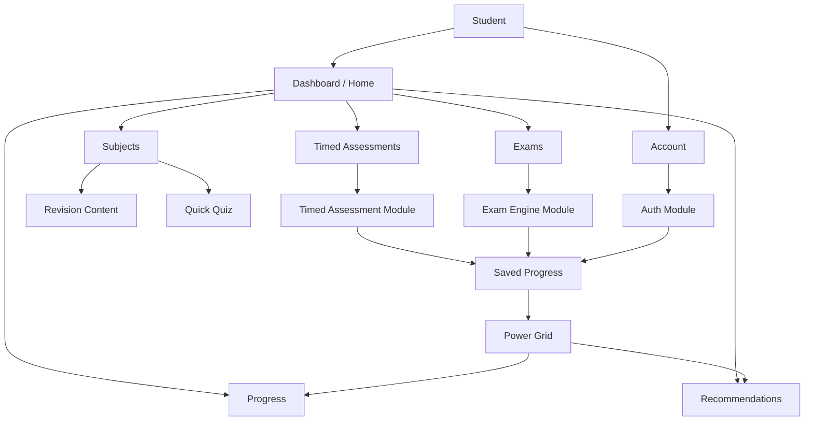
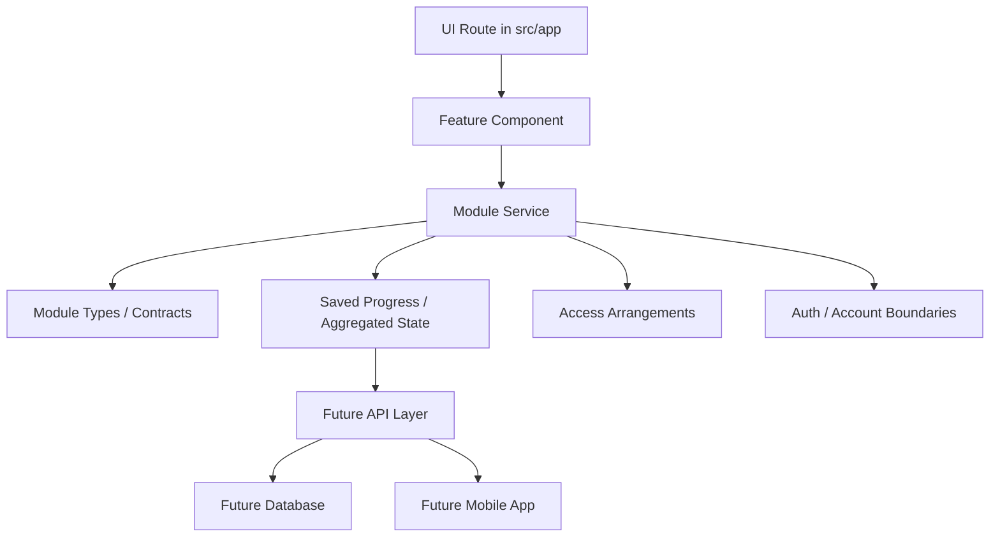
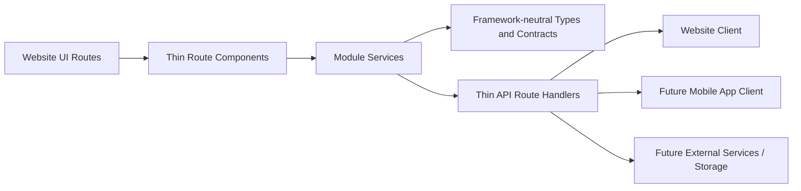
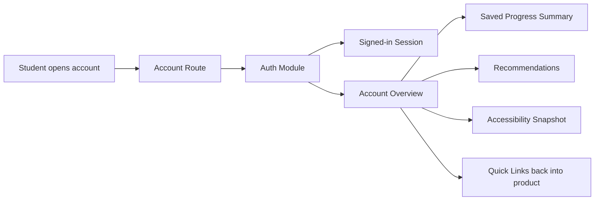
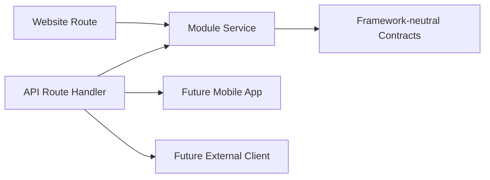
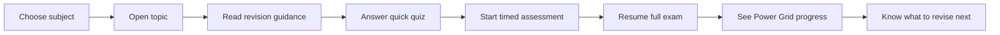
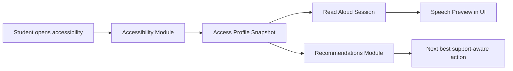
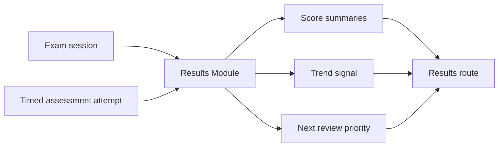
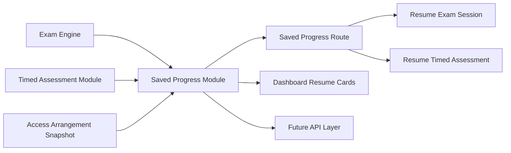

# The Switch Platform

## Mark 3.2 MVP

The Switch Platform is a GCSE revision, timed practice, progress tracking, and exam-readiness product.

This repository is the website-first MVP build. It is being designed so a student can:

1. Choose a subject and topic
2. Read focused revision guidance
3. Practise through a quiz or timed checkpoint
4. Sit a full exam-style paper
5. Save progress automatically
6. Return later without losing work
7. See how prepared they are
8. Know what to revise next

This README is written as a project guide and a learning guide. If you are learning to code, the idea is that you should be able to read this file and understand:

- what the product is
- what has already been built
- how the codebase is organised
- why the architecture is set up this way
- what each major route and module is responsible for

## Project Vision

The Switch is meant to help students:

- Learn
- Practise
- Track progress
- Improve
- Become exam ready

The platform must be:

- Mobile first
- SEND friendly
- Accessible
- Modular
- Scalable
- API first
- Web first
- Future app ready

## Simple Explanation

The easiest way to understand the project is like this:

- `src/app` is the visible website
- `src/app/api` is the thin delivery layer for API-style route handlers
- `src/modules` is where the actual feature rules live
- the page asks the modules for data
- the API handlers ask the same modules for data
- the modules decide the logic
- later, an API can sit in front of those modules
- later still, a mobile app can reuse the same logic

That separation matters because it stops important product rules from being trapped inside page components.

For example:

- exam timing rules should belong to the exam engine
- saved progress rules should belong to saved progress
- progress calculations should belong to power grid
- support settings should belong to access arrangements and accessibility
- account and session identity should belong to auth

## Visual Overview

### Product map



### Architecture layers



### Delivery architecture



### Account flow



### API delivery flow



### Current student flow



### Support flow



### Results flow



### Saved progress flow



## Mark 3.2 Blueprint

### Core MVP modules

1. Dashboard
2. Power Grid Progress
3. Timed Assessments
4. Full GCSE Exam Engine
5. Saved Progress
6. Recommendations
7. Accessibility
8. Read Aloud
9. Language Ready Structure
10. Auth and Account Foundation
11. CMS/Admin Placeholder
12. Access Arrangements

### Launch subjects

- GCSE Mathematics
- GCSE English Language
- GCSE Combined Science
- Biology
- Chemistry
- Physics

### Power Grid levels

1. Ignition
2. Powered Up
3. Current Flow
4. Voltage Rising
5. Full Circuit
6. High Voltage
7. Grid Master
8. Power Station
9. Switch Legend

### Progress trends

- Improving
- Stable
- Declining

### Exam engine support

Boards:

- AQA
- Edexcel
- OCR
- Eduqas
- WJEC
- CCEA
- Cambridge IGCSE
- Edexcel International GCSE
- OxfordAQA International GCSE

Qualification types:

- GCSE
- IGCSE
- FunctionalSkills
- EntryLevel
- Level1
- Level2

Exam tiers:

- FOUNDATION
- HIGHER

Modes:

- Full GCSE Exam
- Manual Timed Assessment

### Access arrangements support

- EXTRA_TIME_25
- EXTRA_TIME_50
- READER
- SCRIBE
- REST_BREAKS
- COLOURED_OVERLAY
- SEPARATE_ROOM
- TEXT_TO_SPEECH
- LARGE_PRINT

## What Has Been Built So Far

This is no longer just a scaffold. The repo now contains several connected MVP slices.

The current build is a working website MVP with modular services underneath it. The architecture is deliberately set up so the same modules can later power:

- the current website routes
- thin API handlers
- a future mobile app client
- future persistent storage without rewriting frontend business rules

### Built routes

- `/`
- `/account`
- `/dashboard`
- `/subjects`
- `/assessments`
- `/exams`
- `/progress`
- `/saved-progress`
- `/recommendations`
- `/accessibility`
- `/results`

### Built API route handlers

- `/api/auth/session`
- `/api/auth/providers`
- `/api/account/overview`
- `/api/dashboard/home`
- `/api/progress/summary`
- `/api/saved-progress/overview`
- `/api/recommendations`
- `/api/recommendations/page`
- `/api/accessibility/snapshot`
- `/api/results/overview`
- `/api/exams/papers`
- `/api/exams/session/:examId`
- `/api/assessments/definitions`
- `/api/assessments/seed/:assessmentId`
- `/api/cms/overview`
- `/api/cms/content-packages`
- `/api/past-papers/catalog`

### Architecture foundations already in code

- Route components that stay thin and mostly render prepared module data
- Service modules that own business logic and cross-module orchestration
- Type and contract files that keep boundaries explicit
- Thin API route handlers that can be reused by future app clients
- Language-ready copy structures for future localisation
- Account, support, progress, and recommendation flows connected through service boundaries
- API delivery coverage across account, dashboard, progress, saved progress, recommendations, accessibility, results, exams, timed assessments, CMS, and past papers

### Placeholder routes still waiting for fuller product work

- `/admin` is now an architecture route, but not yet a full management tool

### Working product slices

- A live dashboard aggregation layer
- A student account route with signed-in identity, account-linked support, and quick recovery paths into the product
- A subject entry route with topic selection
- Topic revision content rendered from the revision module
- Topic quick quiz prompts rendered from the quiz module
- A timed assessment experience with duration presets and autosave-backed resume state
- A full exam experience with mock GCSE papers, progress map, flags, and autosave-backed resume state
- A Power Grid progress route using calculated subject summaries
- A Saved Progress route that brings exam and timed assessment autosaves into one shared resume surface
- A Recommendations route that converts progress, support, results, and saved-session signals into ordered next actions
- An accessibility and support route with settings, read aloud preview, and support-aware recommendation cards
- A results route that turns exam and timed assessment attempts into outcome summaries
- An admin architecture route that explains content update and past-paper source planning in-product
- Access arrangement contracts and services integrated into exam and timed assessment flows
- Saved progress services for both exam sessions and timed assessment attempts, including shared overview summaries
- Thin API route handlers that expose modular auth and account data without moving business logic into the frontend
- Thin API route handlers that expose modular product data across the main MVP routes
- CMS and past-paper provider boundaries for future content updates and paper ingestion
- JSON topic content packages that can add reading material, questions, and clickable free official resource links
- Read aloud, accessibility, and recommendations modules with real working foundations

## Route-by-Route Explanation

### `/`

This is the product home route.

It uses the dashboard aggregation layer to present:

- high-level metrics
- launch cards into the major routes
- exam session summaries
- timed assessment summaries
- subject focus cards
- a recommended next action

Learning note:

This route is a good example of composition. It does not calculate exam logic itself. It asks another module for a ready-made dashboard view model.

### `/account`

This is the student account route.

It currently shows:

- signed-in student identity
- account-linked product metrics
- sign-in options for MVP and future expansion
- quick links back into dashboard, saved progress, recommendations, and accessibility
- support carry-over summary tied to the current account

Learning note:

This route gives the MVP a real account option without trapping identity logic inside the page. The auth module owns the session and account overview model, which keeps the website ready for future app and API reuse.

### `/dashboard`

This is the student-home style dashboard route.

It currently shows:

- overall readiness
- active sessions
- subject watch cards
- links into the core working routes
- next best action guidance

Learning note:

This is what “aggregation” means in a codebase. One route combines outputs from several modules into one student-facing screen.

### `/subjects`

This is now the start of the learn-and-practise flow.

It currently lets the student:

- choose a launch subject
- switch between topics
- see a topic summary
- read revision guidance sections
- see a quick quiz question for the current topic

Learning note:

This route proves that subject metadata, topics, revision content, and quiz prompts can all live in separate modules while still forming one usable screen.

### `/assessments`

This is the timed checkpoint practice route.

It currently shows:

- assessment selection
- duration presets
- official duration caps
- adjusted duration after access arrangements
- resume state
- notes and bookmarks summary
- saved progress-backed session state

Learning note:

The page does not decide whether a student is allowed 15, 30, or full duration. The timed-assessment service owns that logic.

### `/exams`

This is the current full exam-style route.

It currently shows:

- mock GCSE paper selection
- question-by-question flow
- autosave timestamp feedback
- progress map
- question flagging
- completion percentage
- resumed session state
- access-arrangement-aware timing

Learning note:

This route is a good example of the UI being “thin”. It renders the session state, but the exam engine, access arrangements, and saved progress modules shape the logic.

### `/progress`

This is the current Power Grid route.

It currently shows:

- overall Power Grid level
- readiness score
- active session count
- subject-level progress cards
- evidence statements
- next best action guidance

Learning note:

This route turns raw activity into meaning. That translation belongs in the Power Grid service, not scattered across page components.

### `/saved-progress`

This is the shared autosave and resume route.

It currently shows:

- saved exam sessions
- saved timed assessment attempts
- completion percentages
- resume-from question markers
- latest autosave timestamps
- access arrangement snapshot coverage
- direct return paths back into exams and assessments

Learning note:

This route proves that save and resume logic can stay in its own module while still serving multiple student experiences. The route reads a shared overview instead of rebuilding exam or assessment logic in the UI.

### `/recommendations`

This is the student next-step route.

It currently shows:

- ordered recommendation cards
- priority signals
- linked next actions into working routes
- readiness, results, and saved-progress insight summaries
- language-ready route metadata flowing from the language module

Learning note:

This route keeps recommendation logic in its own module while allowing the website to render a product-ready action list. That matters for future API and mobile reuse because the decision layer is not trapped inside React components.

### `/accessibility`

This is now a real support route rather than a placeholder.

It currently shows:

- accessibility settings state
- access-profile-driven support snapshot data
- read aloud preview text
- voice and speed controls
- browser speech synthesis preview behaviour
- support-aware recommendation cards

Learning note:

This route is a good example of multiple small modules working together. Accessibility owns settings, read aloud owns preview session behaviour, and recommendations owns what to do next.

### `/results`

This is the current outcome route for finished or reviewable work.

It currently shows:

- overall score summary
- exam result cards
- timed assessment result cards
- score trends
- answered counts
- review or flag counts
- strongest area
- next priority

Learning note:

This route closes the student loop. It proves that outcome interpretation can live in its own module rather than being bolted onto exam or assessment screens.

### `/admin`

This is the current admin architecture route.

It currently shows:

- content source providers
- seeded content coverage
- future CMS provider planning
- past paper source providers
- paper catalog update strategy
- the current truth about what is still seeded versus what is not live yet

Learning note:

This route does not try to be a full CMS yet. Instead, it makes the architecture for content updates and past-paper sourcing explicit in the MVP so the website can later connect to real provider adapters without rewriting the student product routes.

## Module-by-Module Explanation

### `auth`

Purpose:

- owns authentication contracts, session identity, and account overview boundaries

Current work:

- mock signed-in student session
- sign-in provider metadata
- student account overview model
- framework-neutral auth/account contracts

### `language`

Purpose:

- owns language-ready copy boundaries and future localisation structures

Current work:

- locale preference contract
- route copy catalog
- recommendation copy metadata

### `dashboard`

Purpose:

- builds one combined home/dashboard view model from multiple modules

Current work:

- metrics
- route cards
- exam session cards
- timed assessment cards
- subject focus cards

### `subjects`

Purpose:

- owns subject metadata and subject-level readiness signals

Current work:

- launch subject definitions
- exam readiness score per subject
- next topic recommendation per subject

### `topics`

Purpose:

- owns topic lists and subject-to-topic mapping

Current work:

- topic summaries
- confidence scores
- practice counts
- timed assessment availability markers

### `revision`

Purpose:

- owns revision content structure

Current work:

- revision stacks for seeded topics
- sectioned content matching the Mark 3.2 revision structure

### `quiz`

Purpose:

- owns quick practice prompts and answer options

Current work:

- seeded topic quiz questions
- multiple-choice answer structures

### `accessibility`

Purpose:

- owns accessibility settings and support presentation state

Current work:

- accessibility snapshot generation
- settings mapping from the access profile
- support settings view model for the accessibility route

### `read-aloud`

Purpose:

- owns read aloud session state and preview behaviour inputs

Current work:

- read aloud preview text
- voice options
- speed controls
- support-aware enablement

### `recommendations`

Purpose:

- owns student next-step guidance

Current work:

- recommendation cards
- priority levels
- route destinations
- guidance built from Power Grid and support state

### `timed-assessment`

Purpose:

- owns manual timed assessment attempt behaviour

Current work:

- assessment definitions
- duration cap handling
- access-arrangement-aware duration adjustment
- seeded attempt state
- resume hydration from saved progress

### `exam-engine`

Purpose:

- owns full exam mode rules and official exam timing

Current work:

- mock paper definitions
- question structures
- exam session creation
- seeded answers and flags
- resume hydration from saved progress
- access-arrangement-aware official duration handling

### `saved-progress`

Purpose:

- owns save and resume contracts

Current work:

- saved exam progress payloads
- saved timed assessment payloads
- in-memory repository
- save helpers
- progress status handling

### `access-arrangements`

Purpose:

- owns SEND and access arrangement contracts and application logic

Current work:

- access arrangement values
- student access profile
- duration adjustment rules
- integration contracts for exams and timed assessments
- saved progress snapshot support

### `power-grid`

Purpose:

- owns readiness scoring and progress translation

Current work:

- Power Grid levels
- trend types
- subject-level progress summaries
- overall readiness summary
- next best action generation

### `results`

Purpose:

- owns score summaries and post-session outcome interpretation

Current work:

- exam result summaries
- timed assessment result summaries
- score aggregation
- trend mapping
- next review priority

## Why The Architecture Looks Like This

This is one of the most important ideas in the whole repo.

The code is being written so the student-facing page does not become the only place where rules live.

Bad long-term approach:

- page decides timing
- page decides progress
- page decides support logic
- page decides resume rules

Better approach:

- exam engine decides exam timing
- timed assessment decides manual duration rules
- saved progress decides how sessions are restored
- power grid decides progress meaning
- access arrangements decide support adjustments

That gives you:

- cleaner code
- safer changes later
- easier API extraction
- easier future mobile app reuse

## Folder Structure

```text
src/
  app/
    accessibility/
    admin/
    assessments/
    dashboard/
    exams/
    progress/
    subjects/
  components/
  data/
  lib/
  modules/
    access-arrangements/
    accessibility/
    auth/
    cms/
    dashboard/
    exam-engine/
    language/
    past-papers/
    power-grid/
    quiz/
    read-aloud/
    recommendations/
    revision/
    saved-progress/
    subjects/
    timed-assessment/
    topics/
  types/
```

### Simple folder explanation

- `src/app`: page routes
- `src/components`: reusable UI
- `src/modules`: product features and business rules
- `src/lib`: shared utilities
- `src/data`: future static seed content or fixtures
- `src/types`: shared exports

## Current Development State

Right now the project uses:

- mock data
- in-memory saved progress
- no real database
- mock signed-in account data
- real thin API routes over module services
- no real CMS data entry yet
- no live external paper ingestion yet

That means the current build is a functional MVP-shaped prototype, not a production system yet.

But it is already more than a mock layout because:

- routes are connected
- services are doing real work
- modules own real responsibilities
- different student journeys now exist end to end

## Local Development

Install dependencies:

```bash
npm install
```

Run the dev server:

```bash
npm run dev
```

Run the type check:

```bash
npm run type-check
```

Build the project:

```bash
npm run build
```

## What To Look At First If You Are Learning

If you want the fastest path to understanding this codebase, read in this order:

1. [src/app/subjects/page.tsx](/Users/lloydnwagbara/Documents/THE%20SWITCH%202/src/app/subjects/page.tsx)
2. [src/app/subjects/subject-experience.tsx](/Users/lloydnwagbara/Documents/THE%20SWITCH%202/src/app/subjects/subject-experience.tsx)
3. [src/modules/subjects/service.ts](/Users/lloydnwagbara/Documents/THE%20SWITCH%202/src/modules/subjects/service.ts)
4. [src/modules/topics/service.ts](/Users/lloydnwagbara/Documents/THE%20SWITCH%202/src/modules/topics/service.ts)
5. [src/modules/revision/service.ts](/Users/lloydnwagbara/Documents/THE%20SWITCH%202/src/modules/revision/service.ts)
6. [src/modules/quiz/service.ts](/Users/lloydnwagbara/Documents/THE%20SWITCH%202/src/modules/quiz/service.ts)

Then move on to:

1. [src/app/assessments/page.tsx](/Users/lloydnwagbara/Documents/THE%20SWITCH%202/src/app/assessments/page.tsx)
2. [src/modules/timed-assessment/service.ts](/Users/lloydnwagbara/Documents/THE%20SWITCH%202/src/modules/timed-assessment/service.ts)
3. [src/modules/saved-progress/service.ts](/Users/lloydnwagbara/Documents/THE%20SWITCH%202/src/modules/saved-progress/service.ts)
4. [src/app/exams/page.tsx](/Users/lloydnwagbara/Documents/THE%20SWITCH%202/src/app/exams/page.tsx)
5. [src/modules/exam-engine/service.ts](/Users/lloydnwagbara/Documents/THE%20SWITCH%202/src/modules/exam-engine/service.ts)
6. [src/modules/power-grid/service.ts](/Users/lloydnwagbara/Documents/THE%20SWITCH%202/src/modules/power-grid/service.ts)

## What Still Needs Building

Important MVP work still ahead:

- stronger real saved persistence beyond in-memory state
- write-side API layer
- fuller authentication flow
- CMS content management tools
- repository-backed content and paper ingestion adapters
- deeper results workflows with more detailed marking logic
- language-ready route support
- broader past paper coverage and source validation

## Summary

The Switch is no longer just a blueprint sitting in a README.

It now has:

- a meaningful modular architecture
- a working student dashboard
- a subjects flow
- a timed assessment flow
- an exam flow
- a progress flow
- saved progress foundations
- access arrangements foundations
- Power Grid foundations

And most importantly, the code is being shaped so that each part of the system has a job.

That is one of the biggest differences between “a page that works” and “a product that can keep growing.”
