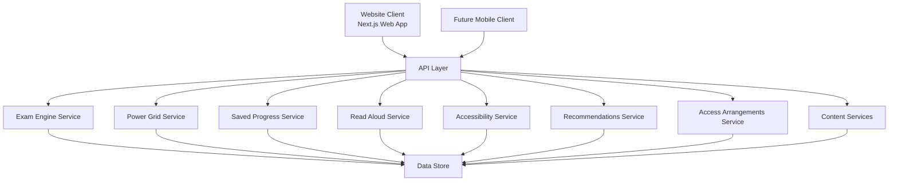
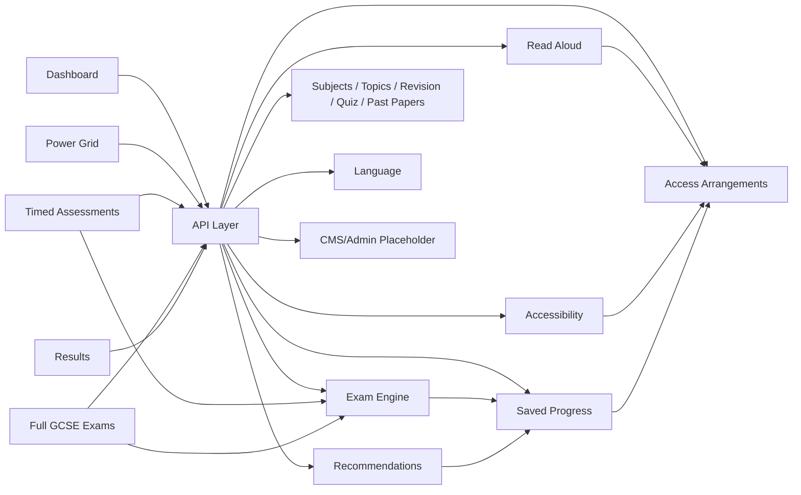
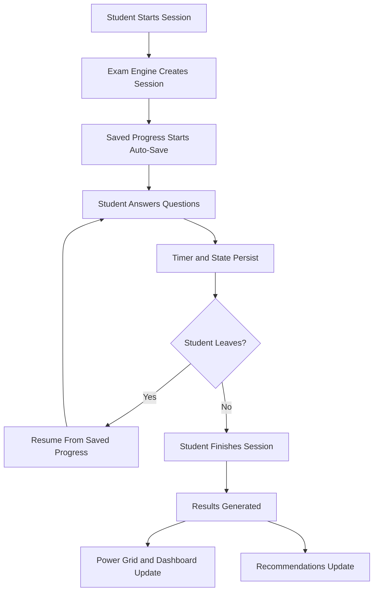
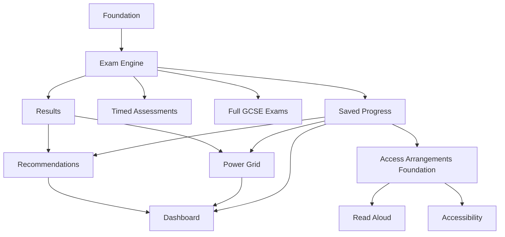

# The Switch Platform

## Mark 3.2 Final MVP Blueprint

Version: 3.2

Status: MVP Development

Owner: Lloyd

Project Type:
GCSE Revision, Progress Tracking and Exam Readiness Platform

## Simple Explanation

This project is being built so a student can revise, take timed assessments, complete exam-style sessions, save their progress automatically, and get clear feedback on what to do next.

If you are new to coding, the easiest way to understand the architecture is this:

- The website is what the student sees and taps on.
- The API layer is the messenger between the website and the core platform logic.
- The modules and services contain the real rules for exams, progress, accessibility, and recommendations.
- The database stores the student's information, answers, and progress.

In simple product terms:

- Frontend means the visible screens.
- API means the layer that passes requests and responses around.
- Services or modules mean the parts that do the real work.
- Database means the storage layer.

Why this matters:

- It keeps the project organised.
- It makes the system easier to improve later.
- It allows a future mobile app to reuse the same backend logic.
- It stops important rules from being trapped only inside the website.

The most important MVP idea is:

1. A student starts a session
2. The system saves progress automatically
3. The student can leave and return later
4. The student can finish and see results

If that flow works well, the core of the platform works.

## Current Repository Status

This repository now includes the initial Mark 3.2 scaffold:

- Next.js App Router project setup
- TypeScript configuration
- Tailwind CSS configuration
- `src` directory structure
- Module-first architecture placeholders
- Access Arrangements contracts, services, and integration types
- Initial exam engine mock data models and UI prototype
- App routes for early navigation and build validation

This is a contracts-first foundation build.

It does not yet include:

- Dashboard functionality
- Real assessment workflows
- Real exam workflows
- Saved progress persistence
- Power Grid calculations
- Results workflows
- API-backed data persistence

## Current UI Milestone

The platform now includes an initial Exam Engine UI slice at `/exams`.

This screen currently demonstrates:

- Mock GCSE paper selection
- Question-by-question exam flow
- Session summary and official timing display
- Autosave state feedback
- Question flagging and progress map
- Mock resume state through seeded session data

This is still mock-data driven, but it gives the MVP a real product-shaped starting point for the Exam Engine.

## Tech Stack

- Next.js App Router
- TypeScript
- Tailwind CSS
- React

## Local Development

Install dependencies:

```bash
npm install
```

Run the development server:

```bash
npm run dev
```

Run the TypeScript check:

```bash
npm run type-check
```

Create a production build:

```bash
npm run build
```

## Current App Routes

- `/`
- `/dashboard`
- `/subjects`
- `/assessments`
- `/exams`
- `/progress`
- `/accessibility`
- `/admin`

These routes are placeholders only and exist to validate the app scaffold.

The `/exams` route now contains the first interactive UI prototype.

## Current Folder Structure

```text
src/
  app/
    dashboard/
    subjects/
    assessments/
    exams/
    progress/
    accessibility/
    admin/
  modules/
    auth/
    subjects/
    topics/
    revision/
    quiz/
    timed-assessment/
    exam-engine/
    past-papers/
    power-grid/
    saved-progress/
    recommendations/
    accessibility/
    read-aloud/
    access-arrangements/
    language/
    cms/
  components/
  lib/
  data/
  types/
```

Each module currently includes:

- `types.ts`
- `service.ts`
- `README.md`

## Project Vision

The Switch is a GCSE revision platform designed to help students:

- Learn
- Practise
- Track progress
- Improve
- Become exam ready

The platform must be:

- Mobile first
- SEND friendly
- Accessible
- Modular
- Scalable
- API first
- Web first
- Future app ready

## Core Purpose

Students should always know:

- Where am I?
- How am I doing?
- What should I revise next?
- Am I exam ready?

## Modular MVP Strategy

Every major feature is isolated into its own module.

Modules can:

- Be upgraded independently
- Become premium later
- Be reused in future products
- Be reused in future mobile apps

## Website First Strategy

The Switch launches as a website first.

Requirements:

- Mobile responsive
- Tablet responsive
- Desktop responsive

## App Transition Strategy

```text
Frontend
  -> API Layer
  -> Backend Services
  -> Database

Future Mobile App
  -> Same API Layer
  -> Same Backend
  -> Same Database
```

No business logic should live only in the website frontend.

## Architecture Diagrams

### Platform Architecture



### Module Boundaries



### Core Student Journey



## Core MVP Modules

1. Dashboard
2. Power Grid Progress
3. Timed Assessments
4. Exam Engine
5. Saved Progress
6. Recommendations
7. Accessibility
8. Read Aloud
9. Access Arrangements

Supporting MVP foundations:

- Language-ready structure
- CMS/Admin placeholder only

## MVP Delivery Plan

The Mark 3.2 MVP should be delivered in stages so the platform grows around a stable assessment core without mixing module responsibilities too early.

### Stage 1: Foundation

- Keep the architecture modular and API first.
- Preserve separation between exam logic, progress logic, content logic, read aloud, and access arrangements.
- Keep the project language ready even before translation is implemented.
- Treat CMS/Admin as a placeholder module during MVP.

### Stage 2: Exam Engine

- Build the core question, answer, timing, and session flow.
- Support GCSE-style assessment flows and official exam durations.
- Keep exam rules independent from progress persistence and recommendations.

### Stage 3: Power Grid

- Build the topic and skill progression experience.
- Show revision status, confidence, and next-step visibility.
- Consume data through the API layer rather than frontend-only logic.

### Stage 4: Saved Progress

- Auto-save all student progress.
- Store answers, active sessions, timing state, and active access arrangement settings.
- Keep saved progress separate from content modelling and exam rules.

### Stage 5: Read Aloud

- Build Read Aloud as its own module and service boundary.
- Allow exam and revision experiences to consume it without embedding its logic.
- Prepare it to integrate with Access Arrangements.

### Stage 6: Dashboard

- Build the student home view after the core systems are stable.
- Show current activity, recent progress, Power Grid summary, and recommended next actions.

### Stage 7: Timed Assessments

- Add shorter manual assessment flows.
- Enforce the rule that manual assessments cannot exceed official durations.
- Keep the structure ready for future access arrangements support.

### Stage 8: Full GCSE Exams

- Add complete exam mode on top of the mature Exam Engine.
- Use official durations.
- Keep the API and timing model ready for future access arrangements.

### Stage 9: Results and Recommendations

- Deliver clear results views for completed sessions.
- Add simple rules-based recommendations for MVP.
- Avoid AI support until explicitly prioritised.

### Stage 10: Accessibility and Access Arrangements Foundation

- Add accessibility settings in a dedicated module.
- Maintain framework-neutral Access Arrangements contracts through the API layer.
- Avoid complex SEND or school administration UI during MVP.

## MVP Success Milestone

The first true MVP milestone is reached when a student can:

1. Start an exam-style session
2. Answer questions
3. Have progress auto-saved
4. Leave and later return
5. Continue the same session
6. Finish the session
7. View basic results

Once this works reliably, the platform has its core assessment spine in place.

### MVP Delivery Dependency Map



## Build Priority

1. Exam Engine
2. Power Grid
3. Saved Progress
4. Read Aloud
5. Dashboard
6. Timed Assessments
7. Full GCSE Exams
8. Results
9. Recommendations
10. Accessibility
11. Access Arrangements foundation

## Project Modules

- Authentication
- Subjects
- Topics
- Revision
- Quiz
- Timed Assessment
- Exam Engine
- Past Papers
- Power Grid
- Saved Progress
- Recommendations
- Accessibility
- Read Aloud
- Access Arrangements
- Language
- CMS/Admin

## Launch Subjects

- GCSE Mathematics
- GCSE English Language
- GCSE Combined Science
- Biology
- Chemistry
- Physics

## Power Grid

Levels:

1. Ignition
2. Powered Up
3. Current Flow
4. Voltage Rising
5. Full Circuit
6. High Voltage
7. Grid Master
8. Power Station
9. Switch Legend

Progress Trends:

- Improving: Green arrow
- Stable: Yellow arrow
- Declining: Red arrow

## Exam Engine

Supports:

- AQA
- Edexcel
- OCR
- Eduqas
- WJEC
- CCEA
- Cambridge IGCSE
- Edexcel International GCSE
- OxfordAQA International GCSE

Qualification Types:

- GCSE
- IGCSE
- FunctionalSkills
- EntryLevel
- Level1
- Level2

Exam Tiers:

- FOUNDATION
- HIGHER

Exam Modes:

- Full GCSE Exam
  - Uses official duration
  - Student cannot modify duration
  - Supports future access arrangements
- Manual Timed Assessment
  - Student chooses duration
  - Cannot exceed official duration
  - Supports future access arrangements

## Saved Progress

Stores:

- Current question
- Selected answers
- Written answers
- Notes
- Bookmarks
- Timer state
- Time remaining
- Assessment state
- Exam state
- Active access arrangement settings
- Last activity

## Read Aloud Module

Supports:

- Revision notes
- Questions
- Answers
- Worked examples
- Worked solutions
- Feedback
- Recommendations

Controls:

- Play
- Pause
- Resume
- Stop
- Speed control
- Voice selection

Technology:

- Browser SpeechSynthesis API
- Access Arrangements integration for reader and text-to-speech support

## Accessibility

Required:

- Read Aloud
- Focus Mode
- Text Size Controls
- High Contrast Mode
- Dyslexia Friendly Font
- Line Spacing
- Reduced Distraction Mode
- Access Arrangements integration

## Access Arrangements

The platform architecture must support SEND and exam access arrangements without requiring every SEND feature to be built in the MVP.

Access Arrangement Values:

- EXTRA_TIME_25
- EXTRA_TIME_50
- READER
- SCRIBE
- REST_BREAKS
- COLOURED_OVERLAY
- SEPARATE_ROOM
- TEXT_TO_SPEECH
- LARGE_PRINT

Access Arrangements must integrate with:

- Exam Engine
- Timed Assessment
- Saved Progress
- Read Aloud
- Accessibility

Architecture rules:

- Do not build complex SEND UI during the foundation phase.
- Do not build AI support during the foundation phase.
- Do not build school administration tools during the foundation phase.
- Build module data structures, services, contracts, and integration points first.
- Keep future mobile apps able to reuse these services through APIs.

## Revision Content Structure

1. Explain Simply
2. Standard Explanation
3. Detailed Explanation
4. Worked Examples
5. Common Mistakes
6. Practice Questions
7. Timed Assessment
8. Past Paper Questions
9. Mark Scheme
10. Exam Technique

## API First Strategy

Future APIs:

- Progress API
- Assessment API
- Exam API
- Recommendation API
- Content API
- Accessibility API
- Read Aloud API
- Language API
- Access Arrangements API

Access Arrangements API contracts:

- GET /access-profile/:userId
- PUT /access-profile/:userId
- POST /access-arrangements/apply/assessment
- POST /access-arrangements/apply/exam

## Future Features

Phase 2:

- Interactive Flashcards
- Revision Planner
- Teacher Dashboard
- School Dashboard

Phase 3:

- AI Tutor
- AI Study Coach
- Predicted Grades
- Advanced Analytics

## Success Criteria

A student can:

- Open Dashboard
- View Power Grid
- Complete Timed Assessment
- Complete Full GCSE Exam
- Use Read Aloud
- Save Progress
- Resume Work
- View Results
- Receive Recommendations
- Understand what to revise next
