# The Switch Platform

## Local Restore Notes

If project information appears to have disappeared after switching to local
mode, open these files first:

- `PROJECT_RECOVERY.md`
- `RESTORED_CHATS.md`

The active local project folder is:

`/Users/lloydnwagbara/Documents/THE SWITCH 2`

The local project has been checked against GitHub `origin/main`, and the local
website has been verified with a successful production build.

## Mark 3.2 MVP

This README is now meant to be cumulative.

New product work, requested additions, previews, mockups, routes, modules, and architecture notes should be added to this file without removing the earlier record unless something is genuinely obsolete or incorrect.

### README update rule

- Keep the main product overview and learning outline in place.
- Add new work as appended sections or build-record entries.
- Do not let a new feature section interrupt the opening product explanation.
- Only replace earlier README content when that older content is genuinely wrong or obsolete.

## Mark 3.2 Product Spec

This repository follows the current The Switch Platform Mark 3.2 product spec.

### Architecture direction

- Modular MVP
- Website first
- Future mobile app ready
- API first

### Core MVP scope

1. Dashboard
2. Power Grid
3. Timed Assessments
4. Exam Engine
5. Saved Progress
6. Recommendations
7. Accessibility
8. Read Aloud
9. Access Arrangements foundation
10. Year 10 end-of-year progression papers that prepare students for GCSE-style questions
11. Qualification-aware content and exam coverage across GCSE and iGCSE routes

### Non-negotiable development rules

- Keep modules independent.
- Do not mix exam logic with progress logic.
- Do not mix saved progress with content logic.
- Keep Read Aloud separate from revision and quiz logic.
- All student progress must auto-save.
- Full GCSE exams must use official durations.
- Manual assessments must not exceed official durations.
- Mobile-first UI is required.
- Accessibility-first design is required.
- Build for future mobile app migration.
- No business logic should live only in the website frontend.
- Use an API layer between frontend experiences and backend services.
- Preserve a language-ready structure before translation is implemented.
- Treat CMS/Admin as a placeholder MVP module unless it is explicitly prioritised.
- Keep Access Arrangements independent from Exam Engine, Timed Assessment, Saved Progress, Read Aloud, and Accessibility modules.
- Full GCSE Exam Mode must support future access arrangements.
- Timed Assessments must support future access arrangements.
- Read Aloud must integrate with Access Arrangements.
- Accessibility settings must integrate with Access Arrangements.
- Saved Progress must store active access arrangement settings.
- Do not build complex SEND UI until explicitly prioritised.
- Do not build AI support until explicitly prioritised.
- Do not build school administration tools until explicitly prioritised.
- Access Arrangements API contracts must stay framework-neutral until the app stack is chosen.
- Website and future mobile clients must consume Access Arrangements through the API layer rather than duplicating the rules.
- Reviewed-only student visibility is required for structured learning content.
- Source attribution is required for structured learning content and generated study visuals.
- Fact-check gates are required before draft content becomes student visible.
- Draft content must never be silently published to students.
- Content generation, supply, and updates must have an explicit module boundary before scale.

### Active build priority order

This is the order the MVP should be pushed forward in unless a new instruction overrides it:

1. Exam Engine
2. Power Grid
3. Saved Progress
4. Read Aloud
5. Dashboard
6. Timed Assessments
7. Full GCSE Exams
8. Content Fact-Checking And Editorial Workflow
9. Results
10. Recommendations
11. Accessibility
12. Access Arrangements foundation

### What this means for current work

- Exam Engine remains the highest-priority product slice.
- Power Grid should turn exam and assessment activity into actionable next steps.
- Saved Progress should behave like a real cross-module autosave and resume system.
- Read Aloud should appear inside real student flows, not only in isolated previews.
- Dashboard should aggregate the higher-priority modules rather than invent separate logic.
- Content should not keep expanding toward student-facing publication without a real fact-check and editorial approval workflow.
- Year 10 end-of-year work should prepare students for GCSE expectations rather than acting like a disconnected lower-stakes mode.
- CMS/Admin should stay architectural and placeholder-focused during MVP unless reprioritised.

## Website Preview And App Mockup

The current homepage now presents both the website-first preview and the future app direction from the same modular dashboard data model.

### Website preview


### App mockup


## Ordered Build Record

This section is the running record of what has been requested, added, and committed so far in this MVP.

### 1. Mark 3.2 modular MVP foundation

The project was established around these core rules:

- website first
- future mobile app ready
- API first
- modular services
- accessibility first
- mobile-first UI
- no business logic living only in the frontend

This foundation is still the rule that everything else in the repo follows.

### 2. MVP architecture expansion

The README and repo were expanded to document the product architecture in more detail, including:

- dashboard
- Power Grid
- timed assessments
- full exam engine
- saved progress
- recommendations
- accessibility
- read aloud
- language-ready structure
- auth and account foundations
- CMS/admin placeholder
- access arrangements foundation

This stage also made the service-layer separation clearer so the website, API routes, and future mobile client can all reuse the same product logic.

### 3. Structured topic and revision content foundations

The repo was then expanded to support structured subject and topic content, including:

- subject metadata
- topic mapping
- revision content structures
- quiz prompt structures
- launch-subject coverage for the GCSE MVP

This is the foundation that supports the current `/subjects` learning route.

### 4. JSON content package architecture

The content layer was pushed further into a more explicit structured package shape so the product can work from seeded content rather than scattered page-level copy.

That includes:

- structured content catalog thinking
- clearer topic content packaging
- revision and quiz content organisation
- a more reusable content-serving direction for future CMS or provider updates

### 5. Support architecture with trusted signposting

The product gained a clearer support model that avoids pretending to be counselling or AI wellbeing support.

That work added:

- trusted UK support resources
- urgent-help links
- exam stress guides
- a modular support route
- a safer signposting-first architecture for young users

### 6. Content catalog module and API delivery

The repo now includes a proper content catalog module and delivery route.

Added work includes:

- `src/modules/content`
- `src/data/mvp-content-catalog.json`
- `/api/content/catalog`
- framework-neutral content contracts
- subject, topic, revision, and quiz content being shaped through shared catalog structures

This is a major architecture step because content now has a clearer module boundary instead of being implied across multiple feature files.

### 7. Homepage website preview and app mockup

The homepage was upgraded from a simple dashboard entry to a stronger product-preview surface.

Added work includes:

- a more polished website preview section on the homepage
- a future mobile app mockup panel on the homepage
- the same dashboard-backed data model feeding both surfaces
- a clearer visual demonstration that the product is web first and app ready

This work lives primarily in the shared homepage component and is already part of the running app at `/`.

### 8. README preview images

The README now includes the requested visuals so the repository itself shows what has been built.

Added assets:

- `public/readme/website-preview.svg`
- `public/readme/app-mockup.svg`

Added README showcase sections:

- Website Preview
- App Mockup

These were added so the repo can communicate the current MVP direction even outside the running local app.

### 9. API-first MVP connections and fresh exam attempts

The next pushed stage connected more of the product through internal API delivery and deepened the exam flow.

Added work includes:

- API-first page delivery across dashboard, exams, assessments, results, recommendations, accessibility, support, subjects, account, admin, and saved progress surfaces
- new internal routes for read aloud session and subject experience data
- smarter resume links across Saved Progress and Dashboard
- submitted-state handling for exams and timed assessments
- result and recommendation logic that now distinguishes active work from submitted work
- first-pass exam freshness logic that preserves learning repetition while rotating exact question variants between attempts

This stage matters because it moved more business logic behind shared contracts while also making full exam work feel less stale for active students.

### 10. Content fact-checking and editorial workflow priority

Content quality assurance is now being treated as an active project priority rather than only a later note.

That means one of the next important content-side stages should include:

- explicit fact-check statuses
- internal review and approval stages
- publish gating before student visibility
- source attribution and provider traceability

### 11. Year 10 end-of-year exam context and GCSE bridge

The MVP now also needs to support students who are still in Year 10 and preparing for end-of-year exams before they step into full GCSE papers.

That includes:

- subject-level context that explains how revision supports Year 10 end-of-year exams
- topic-level context showing how each topic bridges into GCSE-style command words and questions
- progression papers that let students practise GCSE-style questions before full GCSE paper timing
- a clear rule that Year 10 assessments should prepare for GCSE rather than run as a separate disconnected content track

### 12. Main quality principle for content before scale

Content quality must now stay ahead of content volume.

That means:

- reviewed-only student visibility
- source attribution
- fact-check gates
- no silent publishing of draft content
- generated study visuals following the same review and fact-check workflow as other student content
- a workflow that prevents unreviewed owned content from reaching students

This principle is being put in place because bad or unchecked learning content would damage trust faster than missing features.

This matters because student trust depends on content quality, not only on product flow and interface quality.

### 13. Guided website walkthrough

The MVP now includes a dedicated guided walkthrough route so students and collaborators can understand how the website is meant to be used.

Added work includes:

- a step-by-step route guide
- clickable actions into the core student flows
- glossary explanations for terms such as autosave, Power Grid, support snapshot, and recommendations
- a standalone API-delivered module so the same guide can later be reused by other clients

This matters because understanding the product flow should not depend on guessing what route names or study signals mean.

### 14. Qualification-aware exam and content expansion

The MVP now has a clearer architecture for widening beyond a tiny GCSE-only sample.

That includes:

- Year 10 end-of-year papers and advanced Year 10 GCSE-bridge papers
- full GCSE foundation and higher examples
- iGCSE subject and paper coverage foundations
- shared access-arrangement support flowing through every exam paper type
- explicit content generation, supply, and update paths in the catalog model

## Mermaid Learning Diagrams

These diagrams are here to make the MVP easier to understand quickly while the project keeps growing.

### Year 10 to GCSE progression

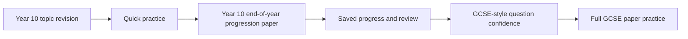

### Content quality gate

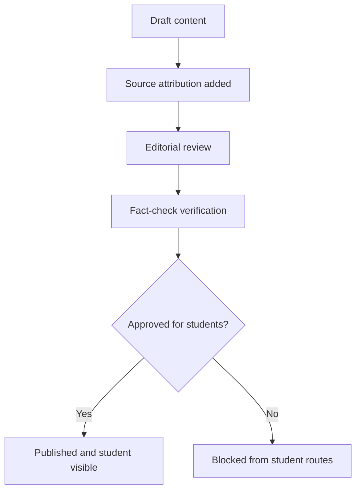

### Content supply pipeline

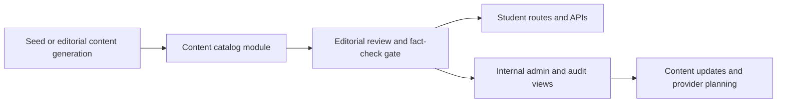

## What You Asked To Be Added And Is Now Present

This is the direct checklist version.

### Added to the product

- dashboard-backed homepage
- website preview section
- app mockup section
- content catalog module
- content API route
- support signposting route
- saved progress route
- accessibility route
- recommendations route
- results route
- account route
- assessments route
- exams route
- progress route
- subjects route

### Added to the README

- architecture explanation
- product flows
- route-by-route explanation
- module-by-module explanation
- folder structure
- development state
- learning order
- build commands
- website preview image
- app mockup image
- ordered build record

### Added as images

- website preview image in the README
- app mockup image in the README

## Everything Currently Present In This MVP

If you want one place that lists the full current state without replacing earlier notes, this is it.

### Student-facing routes currently present

- `/`
- `/account`
- `/dashboard`
- `/how-it-works`
- `/subjects`
- `/assessments`
- `/exams`
- `/progress`
- `/saved-progress`
- `/support`
- `/recommendations`
- `/accessibility`
- `/results`
- `/admin`

### API routes currently present

- `/api/auth/session`
- `/api/auth/providers`
- `/api/account/overview`
- `/api/dashboard/home`
- `/api/website-guide`
- `/api/progress/summary`
- `/api/saved-progress/overview`
- `/api/saved-progress/session/:entityType/:entityId`
- `/api/recommendations`
- `/api/recommendations/page`
- `/api/accessibility/snapshot`
- `/api/results/overview`
- `/api/cms/workflow/:contentId`
- `/api/exams/papers`
- `/api/exams/session/:examId`
- `/api/assessments/definitions`
- `/api/assessments/seed/:assessmentId`
- `/api/cms/overview`
- `/api/past-papers/catalog`
- `/api/support/hub`
- `/api/support/resources`
- `/api/support/exam-guides`
- `/api/support/urgent-help`
- `/api/content/catalog`
- `/api/content/editorial-audit`

### Modules currently present

- `auth`
- `language`
- `content`
- `support`
- `dashboard`
- `website-guide`
- `subjects`
- `topics`
- `revision`
- `quiz`
- `accessibility`
- `read-aloud`
- `recommendations`
- `timed-assessment`
- `exam-engine`
- `saved-progress`
- `access-arrangements`
- `power-grid`
- `results`
- `cms`
- `past-papers`

### Visual assets currently present in the README

- `public/readme/website-preview.svg`
- `public/readme/app-mockup.svg`

The Switch Platform is a GCSE revision, timed practice, progress tracking, and exam-readiness product.

This repository is the website-first MVP build. It is being designed so a student can:

1. Choose a subject and topic
2. Read focused revision guidance
3. Practise through a quiz or timed checkpoint
4. Sit a full exam-style paper
5. Save progress automatically
6. Return later without losing work
7. See how prepared they are
8. Know what to revise next

This README is written as a project guide and a learning guide. If you are learning to code, the idea is that you should be able to read this file and understand:

- what the product is
- what has already been built
- how the codebase is organised
- why the architecture is set up this way
- what each major route and module is responsible for

## Project Vision

The Switch is meant to help students:

- Learn
- Practise
- Track progress
- Improve
- Become exam ready

The platform must be:

- Mobile first
- SEND friendly
- Accessible
- Modular
- Scalable
- API first
- Web first
- Future app ready

## Simple Explanation

The easiest way to understand the project is like this:

- `src/app` is the visible website
- `src/app/api` is the thin delivery layer for API-style route handlers
- `src/modules` is where the actual feature rules live
- the page asks the modules for data
- the API handlers ask the same modules for data
- the modules decide the logic
- later, an API can sit in front of those modules
- later still, a mobile app can reuse the same logic

That separation matters because it stops important product rules from being trapped inside page components.

For example:

- exam timing rules should belong to the exam engine
- saved progress rules should belong to saved progress
- progress calculations should belong to power grid
- support settings should belong to access arrangements and accessibility
- account and session identity should belong to auth

## Visual Overview

### Product map

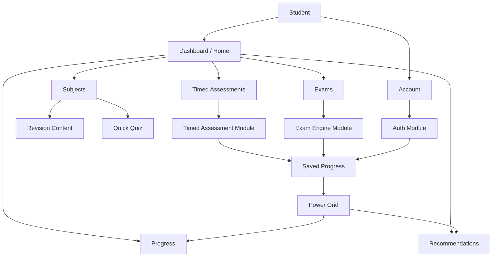

### Architecture layers

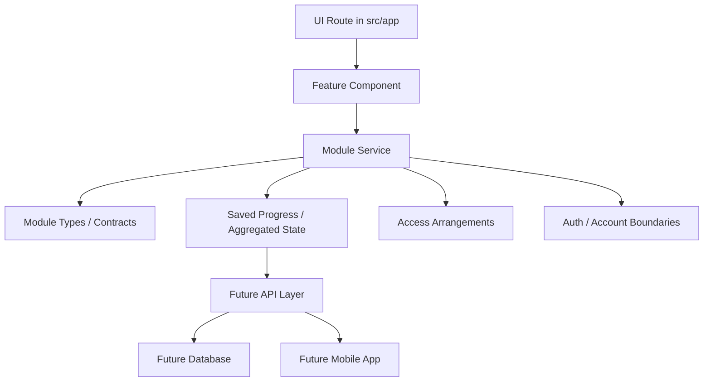

### Delivery architecture

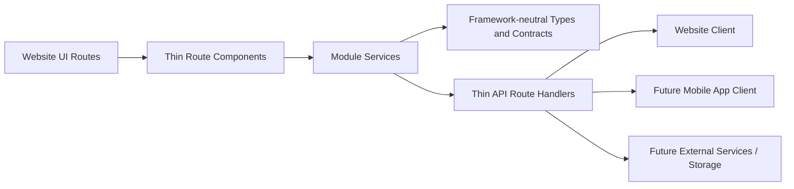

### Account flow

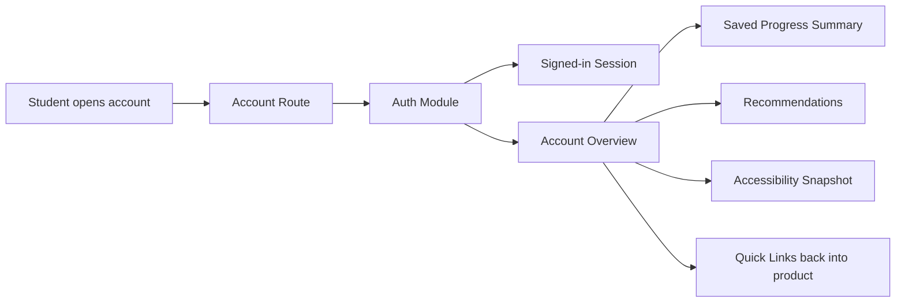

### API delivery flow

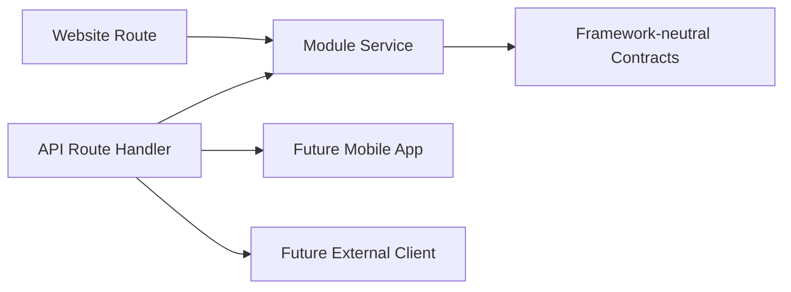

### Current student flow

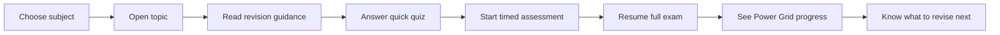

### Support flow

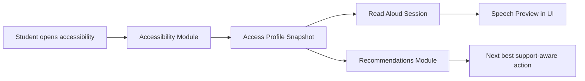

### Results flow

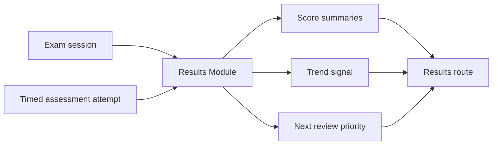

### Saved progress flow

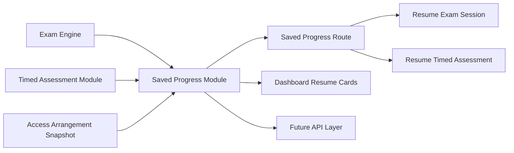

## Mark 3.2 Blueprint

### Core MVP modules

1. Dashboard
2. Power Grid Progress
3. Timed Assessments
4. Full GCSE Exam Engine
5. Saved Progress
6. Recommendations
7. Accessibility
8. Read Aloud
9. Language Ready Structure
10. Auth and Account Foundation
11. CMS/Admin Placeholder
12. Access Arrangements

### Launch subjects

- GCSE Mathematics
- GCSE English Language
- GCSE Combined Science
- Biology
- Chemistry
- Physics

### Power Grid levels

1. Ignition
2. Powered Up
3. Current Flow
4. Voltage Rising
5. Full Circuit
6. High Voltage
7. Grid Master
8. Power Station
9. Switch Legend

### Progress trends

- Improving
- Stable
- Declining

### Exam engine support

Boards:

- AQA
- Edexcel
- OCR
- Eduqas
- WJEC
- CCEA
- Cambridge IGCSE
- Edexcel International GCSE
- OxfordAQA International GCSE

Qualification types:

- GCSE
- IGCSE
- FunctionalSkills
- EntryLevel
- Level1
- Level2

Exam tiers:

- FOUNDATION
- HIGHER

Modes:

- Full GCSE Exam
- Manual Timed Assessment

### Access arrangements support

- EXTRA_TIME_25
- EXTRA_TIME_50
- READER
- SCRIBE
- REST_BREAKS
- COLOURED_OVERLAY
- SEPARATE_ROOM
- TEXT_TO_SPEECH
- LARGE_PRINT

## What Has Been Built So Far

This is no longer just a scaffold. The repo now contains several connected MVP slices.

The current build is a working website MVP with modular services underneath it. The architecture is deliberately set up so the same modules can later power:

- the current website routes
- thin API handlers
- a future mobile app client
- future persistent storage without rewriting frontend business rules

### Built routes

- `/`
- `/account`
- `/dashboard`
- `/how-it-works`
- `/subjects`
- `/assessments`
- `/exams`
- `/progress`
- `/saved-progress`
- `/support`
- `/recommendations`
- `/accessibility`
- `/results`

### Built API route handlers

- `/api/auth/session`
- `/api/auth/providers`
- `/api/account/overview`
- `/api/dashboard/home`
- `/api/website-guide`
- `/api/progress/summary`
- `/api/saved-progress/overview`
- `/api/saved-progress/session/:entityType/:entityId`
- `/api/recommendations`
- `/api/recommendations/page`
- `/api/accessibility/snapshot`
- `/api/results/overview`
- `/api/cms/workflow/:contentId`
- `/api/exams/papers`
- `/api/exams/session/:examId`
- `/api/assessments/definitions`
- `/api/assessments/seed/:assessmentId`
- `/api/cms/overview`
- `/api/past-papers/catalog`
- `/api/support/hub`
- `/api/support/resources`
- `/api/support/exam-guides`
- `/api/support/urgent-help`
- `/api/content/catalog`

### Architecture foundations already in code

- Route components that stay thin and mostly render prepared module data
- Service modules that own business logic and cross-module orchestration
- Type and contract files that keep boundaries explicit
- Thin API route handlers that can be reused by future app clients
- Language-ready copy structures for future localisation
- Account, accessibility, progress, support, and recommendation flows connected through service boundaries
- API delivery coverage across account, dashboard, progress, saved progress, support, recommendations, accessibility, results, exams, timed assessments, CMS, and past papers

### Placeholder routes still waiting for fuller product work

- `/admin` is now an architecture route, but not yet a full management tool

### Working product slices

- A live dashboard aggregation layer
- A student account route with signed-in identity, account-linked support, and quick recovery paths into the product
- A subject entry route with topic selection
- Topic revision content rendered from the revision module
- Topic quick quiz prompts rendered from the quiz module
- A timed assessment experience with duration presets and autosave-backed resume state
- A full exam experience with mock GCSE papers, progress map, flags, and autosave-backed resume state
- A Power Grid progress route using calculated subject summaries
- A Saved Progress route that brings exam and timed assessment autosaves into one shared resume surface
- A Support Hub route with trusted UK support links, urgent-help routes, and exam stress guides for young people
- A Recommendations route that converts progress, support, results, and saved-session signals into ordered next actions
- An accessibility route with settings, read aloud preview, and support-aware recommendation cards
- A results route that turns exam and timed assessment attempts into outcome summaries
- A guided website walkthrough route that explains how the main product routes work step by step
- An admin architecture route that explains content update and past-paper source planning in-product
- Access arrangement contracts and services integrated into exam and timed assessment flows
- Saved progress services for both exam sessions and timed assessment attempts, including shared overview summaries
- Thin API route handlers that expose modular auth and account data without moving business logic into the frontend
- Thin API route handlers that expose modular product data across the main MVP routes
- CMS and past-paper provider boundaries for future content updates and paper ingestion
- A master structured content catalog for all current MVP topics
- Read aloud, accessibility, and recommendations modules with real working foundations

## Route-by-Route Explanation

### `/`

This is the product home route.

It uses the dashboard aggregation layer to present:

- high-level metrics
- launch cards into the major routes
- exam session summaries
- timed assessment summaries
- subject focus cards
- a recommended next action

Learning note:

This route is a good example of composition. It does not calculate exam logic itself. It asks another module for a ready-made dashboard view model.

### `/account`

This is the student account route.

It currently shows:

- signed-in student identity
- account-linked product metrics
- sign-in options for MVP and future expansion
- quick links back into dashboard, saved progress, recommendations, and accessibility
- support carry-over summary tied to the current account

Learning note:

This route gives the MVP a real account option without trapping identity logic inside the page. The auth module owns the session and account overview model, which keeps the website ready for future app and API reuse.

### `/dashboard`

This is the student-home style dashboard route.

It currently shows:

- overall readiness
- active sessions
- subject watch cards
- links into the core working routes
- next best action guidance

Learning note:

This is what “aggregation” means in a codebase. One route combines outputs from several modules into one student-facing screen.

### `/how-it-works`

This is the guided walkthrough route.

It currently shows:

- a step-by-step explanation of the main student journey
- clickable route actions into the core pages
- short explanations of why each route matters
- glossary meanings for key website terms

Learning note:

This route helps both students and collaborators understand the product without needing to infer what route labels or status signals mean.

### `/subjects`

This is now the start of the learn-and-practise flow.

It currently lets the student:

- choose a launch subject
- switch between topics
- see a topic summary
- read revision guidance sections
- see a quick quiz question for the current topic

Learning note:

This route proves that subject metadata, topics, revision content, and quiz prompts can all live in separate modules while still forming one usable screen.

### `/assessments`

This is the timed checkpoint practice route.

It currently shows:

- assessment selection
- duration presets
- official duration caps
- adjusted duration after access arrangements
- resume state
- notes and bookmarks summary
- saved progress-backed session state

Learning note:

The page does not decide whether a student is allowed 15, 30, or full duration. The timed-assessment service owns that logic.

### `/exams`

This is the current full exam-style route.

It currently shows:

- mock GCSE paper selection
- question-by-question flow
- autosave timestamp feedback
- progress map
- question flagging
- completion percentage
- resumed session state
- fresh-attempt support after submission
- rotating question variants across attempts
- access-arrangement-aware timing

Learning note:

This route is a good example of the UI being “thin”. It renders the session state, but the exam engine, access arrangements, and saved progress modules shape the logic.

### `/progress`

This is the current Power Grid route.

It currently shows:

- overall Power Grid level
- readiness score
- active session count
- subject-level progress cards
- evidence statements
- next best action guidance

Learning note:

This route turns raw activity into meaning. That translation belongs in the Power Grid service, not scattered across page components.

### `/saved-progress`

This is the shared autosave and resume route.

It currently shows:

- saved exam sessions
- saved timed assessment attempts
- completion percentages
- resume-from question markers
- latest autosave timestamps
- access arrangement snapshot coverage
- direct return paths back into exams and assessments

Learning note:

This route proves that save and resume logic can stay in its own module while still serving multiple student experiences. The route reads a shared overview instead of rebuilding exam or assessment logic in the UI.

### `/support`

This is the student support route.

It currently shows:

- urgent help routes
- trusted UK support organisations
- exam stress guide links from reputable organisations
- clear boundaries explaining that the route is signposting, not counselling

Learning note:

This route keeps support signposting modular and safe for young people. The website renders trusted external resources from structured data, so future app clients can use the same route contracts without adding a chatbot or storing sensitive support disclosures.

### `/recommendations`

This is the student next-step route.

It currently shows:

- ordered recommendation cards
- priority signals
- linked next actions into working routes
- readiness, results, and saved-progress insight summaries
- language-ready route metadata flowing from the language module

Learning note:

This route keeps recommendation logic in its own module while allowing the website to render a product-ready action list. That matters for future API and mobile reuse because the decision layer is not trapped inside React components.

### `/accessibility`

This is now a real support route rather than a placeholder.

It currently shows:

- accessibility settings state
- access-profile-driven support snapshot data
- read aloud preview text
- voice and speed controls
- browser speech synthesis preview behaviour
- support-aware recommendation cards

Learning note:

This route is a good example of multiple small modules working together. Accessibility owns settings, read aloud owns preview session behaviour, and recommendations owns what to do next.

### `/results`

This is the current outcome route for finished or reviewable work.

It currently shows:

- overall score summary
- exam result cards
- timed assessment result cards
- score trends
- answered counts
- review or flag counts
- strongest area
- next priority

Learning note:

This route closes the student loop. It proves that outcome interpretation can live in its own module rather than being bolted onto exam or assessment screens.

### `/admin`

This is the current admin architecture route.

It currently shows:

- content source providers
- seeded content coverage
- future CMS provider planning
- past paper source providers
- paper catalog update strategy
- the current truth about what is still seeded versus what is not live yet

Learning note:

This route does not try to be a full CMS yet. Instead, it makes the architecture for content updates and past-paper sourcing explicit in the MVP so the website can later connect to real provider adapters without rewriting the student product routes.

## Module-by-Module Explanation

### `auth`

Purpose:

- owns authentication contracts, session identity, and account overview boundaries

Current work:

- local cookie-backed auth session with signed-in and signed-out states
- sign-in provider metadata
- student account overview model
- framework-neutral auth/account contracts

### `language`

Purpose:

- owns language-ready copy boundaries and future localisation structures

Current work:

- locale preference contract
- route copy catalog
- recommendation copy metadata

### `content`

Purpose:

- owns the master structured content catalog for subjects, topics, revision material, and quiz prompts

Current work:

- seed JSON catalog for all current MVP topics
- repository boundary for content retrieval
- review and publication metadata fields for future editorial workflow
- framework-neutral content catalog contract

### `support`

Purpose:

- owns trusted signposting for young people, including urgent-help routes and exam stress support links

Current work:

- support resource registry
- urgent-help route data
- exam stress guide link data
- framework-neutral support contracts

### `dashboard`

Purpose:

- builds one combined home/dashboard view model from multiple modules

Current work:

- metrics
- route cards
- exam session cards
- timed assessment cards
- subject focus cards

### `website-guide`

Purpose:

- owns the guided explanation of how the website works

Current work:

- step-by-step route walkthrough data
- click-through study journey guidance
- glossary explanations for key website terms
- framework-neutral delivery contract

### `subjects`

Purpose:

- owns subject metadata and subject-level readiness signals

Current work:

- launch subject definitions
- exam readiness score per subject
- next topic recommendation per subject

### `topics`

Purpose:

- owns topic lists and subject-to-topic mapping

Current work:

- topic summaries
- confidence scores
- practice counts
- timed assessment availability markers

### `revision`

Purpose:

- owns revision content structure

Current work:

- revision stacks for seeded topics
- sectioned content matching the Mark 3.2 revision structure

### `quiz`

Purpose:

- owns quick practice prompts and answer options

Current work:

- seeded topic quiz questions
- multiple-choice answer structures

### `accessibility`

Purpose:

- owns accessibility settings and support presentation state

Current work:

- accessibility snapshot generation
- settings mapping from the access profile
- support settings view model for the accessibility route

### `read-aloud`

Purpose:

- owns read aloud session state and preview behaviour inputs

Current work:

- read aloud preview text
- voice options
- speed controls
- support-aware enablement

### `recommendations`

Purpose:

- owns student next-step guidance

Current work:

- recommendation cards
- priority levels
- route destinations
- guidance built from Power Grid and support state

### `timed-assessment`

Purpose:

- owns manual timed assessment attempt behaviour

Current work:

- assessment definitions
- duration cap handling
- access-arrangement-aware duration adjustment
- seeded attempt state
- resume hydration from saved progress

### `exam-engine`

Purpose:

- owns full exam mode rules and official exam timing

Current work:

- mock paper definitions
- paper blueprints with question slots
- question structures
- exam session creation
- rotating question variants
- fresh attempt generation
- seeded answers and flags
- resume hydration from saved progress
- session-owned generated question sets
- access-arrangement-aware official duration handling

### `saved-progress`

Purpose:

- owns save and resume contracts

Current work:

- saved exam progress payloads
- saved timed assessment payloads
- local file-backed repository
- save helpers
- progress status handling

### `access-arrangements`

Purpose:

- owns SEND and access arrangement contracts and application logic

Current work:

- access arrangement values
- student access profile
- duration adjustment rules
- integration contracts for exams and timed assessments
- saved progress snapshot support

### `power-grid`

Purpose:

- owns readiness scoring and progress translation

Current work:

- Power Grid levels
- trend types
- subject-level progress summaries
- overall readiness summary
- next best action generation

### `results`

Purpose:

- owns score summaries and post-session outcome interpretation

Current work:

- exam result summaries
- timed assessment result summaries
- score aggregation
- trend mapping
- next review priority

## Why The Architecture Looks Like This

This is one of the most important ideas in the whole repo.

The code is being written so the student-facing page does not become the only place where rules live.

Bad long-term approach:

- page decides timing
- page decides progress
- page decides support logic
- page decides resume rules

Better approach:

- exam engine decides exam timing
- timed assessment decides manual duration rules
- saved progress decides how sessions are restored
- power grid decides progress meaning
- access arrangements decide support adjustments

That gives you:

- cleaner code
- safer changes later
- easier API extraction
- easier future mobile app reuse

## Folder Structure

```text
src/
  app/
    account/
    accessibility/
    admin/
    api/
    assessments/
    dashboard/
    exams/
    progress/
    recommendations/
    results/
    saved-progress/
    subjects/
    support/
  components/
  data/
  lib/
  modules/
    access-arrangements/
    accessibility/
    auth/
    cms/
    dashboard/
    exam-engine/
    language/
    past-papers/
    power-grid/
    quiz/
    read-aloud/
    recommendations/
    revision/
    saved-progress/
    subjects/
    support/
    timed-assessment/
    topics/
  types/
```

### Simple folder explanation

- `src/app`: page routes
- `src/app/api`: thin API route handlers
- `src/components`: reusable UI
- `src/modules`: product features and business rules
- `src/lib`: shared utilities
- `src/data`: future static seed content or fixtures
- `src/types`: shared exports

## Current Development State

Right now the project uses:

- mock data
- local file-backed saved progress
- no shared production database yet
- local cookie-backed auth session with a seeded student profile
- real thin API routes over module services
- local CMS workflow controls, not a production editorial system yet
- no production-enforced editorial fact-check and publish workflow yet
- no live external paper ingestion yet
- no owned in-app support content for young people
- trusted external support links instead of a wellbeing assistant

That means the current build is a functional MVP-shaped prototype, not a production system yet.

Current estimated project completion: `78%`

This is an estimate of overall MVP progress, not production readiness.

But it is already more than a mock layout because:

- routes are connected
- services are doing real work
- modules own real responsibilities
- different student journeys now exist end to end

## Local Development

Install dependencies:

```bash
npm install
```

Run the dev server:

```bash
npm run dev
```

Run the type check:

```bash
npm run type-check
```

Build the project:

```bash
npm run build
```

## What To Look At First If You Are Learning

If you want the fastest path to understanding this codebase, read in this order:

1. [src/app/subjects/page.tsx](/Users/lloydnwagbara/Documents/THE%20SWITCH%202/src/app/subjects/page.tsx)
2. [src/app/subjects/subject-experience.tsx](/Users/lloydnwagbara/Documents/THE%20SWITCH%202/src/app/subjects/subject-experience.tsx)
3. [src/modules/subjects/service.ts](/Users/lloydnwagbara/Documents/THE%20SWITCH%202/src/modules/subjects/service.ts)
4. [src/modules/topics/service.ts](/Users/lloydnwagbara/Documents/THE%20SWITCH%202/src/modules/topics/service.ts)
5. [src/modules/revision/service.ts](/Users/lloydnwagbara/Documents/THE%20SWITCH%202/src/modules/revision/service.ts)
6. [src/modules/quiz/service.ts](/Users/lloydnwagbara/Documents/THE%20SWITCH%202/src/modules/quiz/service.ts)

Then move on to:

1. [src/app/assessments/page.tsx](/Users/lloydnwagbara/Documents/THE%20SWITCH%202/src/app/assessments/page.tsx)
2. [src/modules/timed-assessment/service.ts](/Users/lloydnwagbara/Documents/THE%20SWITCH%202/src/modules/timed-assessment/service.ts)
3. [src/modules/saved-progress/service.ts](/Users/lloydnwagbara/Documents/THE%20SWITCH%202/src/modules/saved-progress/service.ts)
4. [src/app/exams/page.tsx](/Users/lloydnwagbara/Documents/THE%20SWITCH%202/src/app/exams/page.tsx)
5. [src/modules/exam-engine/service.ts](/Users/lloydnwagbara/Documents/THE%20SWITCH%202/src/modules/exam-engine/service.ts)
6. [src/modules/power-grid/service.ts](/Users/lloydnwagbara/Documents/THE%20SWITCH%202/src/modules/power-grid/service.ts)

## What Still Needs Building

To reach a truly 100% functional, high-quality production release, the platform still needs work across product, content, trust, operations, and scale.

Top-level remaining work:

- production database, shared persistence, and migration-safe data adapters
- production authentication, authorization, route protection, and account security hardening
- production CMS editing, editorial workflow, approval history, rollback, and audit support
- live content, provider, and past-paper ingestion with source validation and traceability
- broader academic coverage across subjects, question banks, exams, and timed assessments
- stronger recommendation quality driven by richer learner history and cross-route evidence
- full accessibility, safeguarding, privacy, and support-quality validation
- stronger automated testing, observability, deployment, backup, and operational readiness
- language-ready delivery and internationalization foundations beyond route structure alone

## Full Product Completion List

This section tracks everything still needed to call the platform fully functional in both quality and functionality.

### 1. Core production infrastructure

Status: not complete.

Still to do:

- replace local file-backed stores with a shared production database
- define durable schemas for auth, saved progress, results, support settings, and editorial records
- build migration-safe adapters so current module guarantees survive infrastructure changes
- add backup, restore, and disaster-recovery plans for student data

### 2. Authentication, authorization, and account safety

Status: prototype complete, production layer not complete.

Still to do:

- connect to a production authentication provider
- add role-aware authorization for learners, editors, reviewers, and admins
- harden session expiry, route protection, and account recovery flows
- verify student data access boundaries across all routes and APIs

### 3. Saved progress, results, and student continuity

Status: strong prototype, not final production system.

Still to do:

- move saved progress and results to shared production persistence
- verify resume, review, submit, and recovery behaviour under real multi-user load
- add stronger idempotency and concurrency protection for critical writes
- ensure every student journey remains recoverable after refresh, reconnect, or partial failure

### 4. Production CMS and editorial operations

Status: local workflow prototype complete, production workflow not complete.

Still to do:

- move editorial workflow from local storage into a shared system
- support structured editing, review assignment, approval history, and rollback
- add audit trails for who created, reviewed, approved, blocked, and published content
- keep admin tooling thin while preserving clear governance and traceability

### 5. Content trust and publication quality

Status: foundations complete, operational trust system not complete.

Still to do:

- enforce review, fact-check, approval, and publish gates everywhere student content appears
- require trusted source attribution and provider traceability for all surfaced learning content
- add blocked-content recovery paths when evidence is incomplete or disputed
- define content correction, rollback, and re-review procedures after publication

### 6. Live paper and content ingestion

Status: not complete.

Still to do:

- connect real external content and past-paper sources
- validate ingestion quality, source licensing, and provenance
- normalize imported papers into the internal exam and assessment models
- add safe reconciliation when upstream sources change or are removed

### 7. Academic coverage and learning depth

Status: partially complete.

Still to do:

- expand subject coverage where current routes are still shallow
- broaden exam-paper and timed-assessment breadth across more topics and levels
- deepen question-bank freshness, variation, and weak-topic follow-up behaviour
- improve recommendation quality from broader learner evidence and longitudinal history

### 8. Accessibility, support, and safeguarding

Status: foundations complete, full validation not complete.

Still to do:

- complete accessibility QA across desktop, tablet, and mobile flows
- validate support snapshot carry-over in every high-stakes student route
- review safeguarding copy, crisis signposting, and escalation behaviour
- confirm support experiences stay safe and understandable for younger learners

### 9. Quality engineering and test coverage

Status: not complete.

Still to do:

- add automated tests for core module logic
- add route and API integration coverage for main student journeys
- verify failure handling, degraded states, and recovery paths
- protect scoring, timing, resume, and submission rules with regression coverage

### 10. Observability, performance, and resilience

Status: not complete.

Still to do:

- add production monitoring, structured logging, and alerting
- capture errors and operational signals for key student journeys
- review performance across initial load, route transitions, and heavy result views
- test resilience under concurrent usage and interrupted network conditions

### 11. Deployment, compliance, and operations

Status: not complete.

Still to do:

- complete deployment pipeline and production environment setup
- review privacy, data handling, retention, and compliance requirements
- define operational ownership for incidents, content changes, and student data support
- run final smoke testing across dashboard, subjects, assessments, exams, saved progress, results, account, and admin

### 12. Language readiness and future platform reach

Status: structural groundwork only.

Still to do:

- move from language-ready routing structure to actual translatable product content
- define localization rules for learning content, support copy, and assessment metadata
- verify that accessibility, content gating, and results still behave correctly across languages
- prepare platform conventions that support future client surfaces without fragmenting product rules

## Remaining MVP Priority List

These are the highest-priority groups still left before the product can be treated as production-ready.

### 1. Production data and identity

Status: highest priority.

Still to do:

- production database and shared persistence
- production auth provider and route protection
- account security and session hardening
- multi-user continuity across saved progress, results, and support state

### 2. Production content and paper operations

Status: highest priority.

Still to do:

- production CMS workflow backend
- editorial ownership, approval history, and rollback
- live paper and content ingestion pipelines
- trusted source validation and publish controls

### 3. Core product depth and academic coverage

Status: high priority.

Still to do:

- broader subject depth
- broader exam and timed-assessment coverage
- stronger recommendations and learner-history interpretation
- deeper question-bank quality and freshness

### 4. Product safety and quality

Status: high priority.

Still to do:

- automated tests for critical rules and routes
- API contract and failure-path verification
- accessibility QA across real devices
- observability, recovery, and resilience hardening

### 5. Launch operations and compliance

Status: high priority.

Still to do:

- deployment and environment setup
- privacy, safeguarding, and support-signposting review
- operational ownership and incident response expectations
- final end-to-end smoke testing

## Launch Readiness Checklist

This section is a launch-oriented version of the remaining work.

It is meant to answer a practical question:

What still needs to be true before this project can be launched with confidence?

### Must-have before launch

- production authentication provider integration and security hardening
- production persistence instead of local file-backed prototype storage
- write-side API coverage for important student actions
- enforced fact-check, editorial review, and publish gating for student-facing content
- CMS or controlled content update workflow
- production-safe exam and assessment data handling
- stronger results and marking logic
- error handling and failure recovery across the main student journeys
- basic security review for auth, API routes, and student data handling
- accessibility QA across the real live flows
- deployment and production environment setup

### High-priority product gaps

- fuller saved progress persistence and resume reliability
- deeper exam paper and question-bank coverage
- broader timed assessment coverage
- stronger recommendations built from richer student history
- more complete access arrangements workflow
- real student account and profile settings
- past paper ingestion and validation workflow
- language-ready implementation beyond structure alone

### Content and trust requirements

- fact-check status per content item
- internal review status per content item
- approval step before publish
- source attribution and provider traceability
- rollback or unpublish path if content is wrong
- clear ownership for who can create, review, approve, and publish content

### Technical readiness

- database schema and adapters
- stable repository and provider adapters for content and papers
- test coverage for core modules
- API contract verification
- monitoring and logging
- backup and recovery approach for student progress

### Operational launch checks

- privacy and data handling review
- terms, safeguarding, and support signposting review
- admin or editor workflow for content updates
- production QA on mobile
- smoke testing across the core routes

### Shortest realistic launch sequence

1. production persistence
2. production auth provider integration
3. editorial fact-check and publish workflow
4. live content and paper ingestion
5. broader assessment and paper coverage
6. accessibility, mobile QA, and safeguarding review
7. deployment, security, monitoring, and final launch checks

## Phase 3 Roadmap

This is the next delivery phase after the completed MVP checklist and completed Phase 2 roadmap.

Rule for this section:

- only mark an item as completed after the implementation is shipped in code and reflected in the README

Current phase 3 snapshot:

- 0 of 8 items completed (0%)

### 1. Production persistence and shared data layer

Status: in progress.

Main goals:

- replace local prototype persistence with a shared production-ready data layer
- preserve current saved-progress, results, and session guarantees during the migration
- define database-backed adapters for core student records

Current implementation progress:

- repository wiring now reads its persistence runtime from environment-aware adapter configuration instead of hardcoding local JSON assumptions everywhere
- the persistence layer can now switch drivers for local JSON or in-memory runtime use, which gives the project a cleaner seam for production-backed adapters and safer test isolation
- the admin route now makes the active persistence driver visible so prototype storage is easier to spot during launch preparation

### 2. Production authentication and account security

Status: planned.

Main goals:

- connect the platform to a production auth provider
- harden session, route, and account-security behaviour
- support real multi-user account continuity across all core routes

### 3. Production CMS and editorial operations

Status: planned.

Main goals:

- move the local editorial queue into a shared production workflow
- support controlled editing, review assignment, approval history, and rollback
- enforce trusted publication gates across all student-facing content

### 4. Live content and paper ingestion

Status: planned.

Main goals:

- connect real content and past-paper sources
- validate source traceability and ingestion quality
- keep imported content aligned with editorial workflow controls

### 5. Academic coverage expansion

Status: planned.

Main goals:

- expand subject, exam, and timed-assessment coverage
- improve question-bank depth and freshness across more topics
- deepen recommendation quality from broader student evidence

### 6. Accessibility, safeguarding, and support validation

Status: planned.

Main goals:

- complete device-level accessibility QA
- validate safeguarding and support-signposting behaviour
- confirm support-aware experiences remain safe across all core student routes

### 7. Production QA, observability, and resilience

Status: planned.

Main goals:

- increase automated test coverage for critical product paths
- add production monitoring, logging, performance review, and recovery support
- verify failure handling and resilience under real usage conditions

### 8. Deployment, compliance, and launch operations

Status: planned.

Main goals:

- complete deployment and operational setup
- review privacy, data handling, and compliance expectations
- run final launch readiness checks across product, content, and support operations

## Final Phase Roadmap

This is the full-completion phase after Phase 3. It is not about small fixes. It is the final architecture, product-quality, and operational optimization pass required to call the platform fully functional and high quality.

Rule for this section:

- only mark an item as completed after the implementation is shipped in code, architecture decisions are reflected in the codebase, and the README is updated to match

Current final-phase snapshot:

- 3 of 8 items completed (38%)

### Final phase execution order

Use this order so infrastructure, trust, and learner continuity are stabilized before broader optimization work.

1. Unified production platform architecture
2. Fully optimized learner journey continuity
3. Complete editorial and trust operating system
4. Full academic and assessment coverage optimization
5. Accessibility, safeguarding, and student support excellence
6. Quality engineering and architecture hardening
7. Production observability, performance, and resilience
8. Launch governance and long-term operational readiness

### 1. Unified production platform architecture

Status: completed.

Main goals:

- finalize the boundary between routes, APIs, modules, persistence, and external providers
- remove prototype-only infrastructure assumptions from core product paths
- standardize shared contracts so all clients consume the same domain rules

Implementation milestones:

- production database adapter layer is added for auth, saved progress, results, and editorial data
- all critical routes read and write through stable module contracts instead of prototype-only assumptions
- shared request, validation, and response contracts are aligned across core APIs
- architecture documentation matches the implemented route to API to module to persistence boundary
- prototype-only persistence paths are removed from primary production code paths

### 2. Fully optimized learner journey continuity

Status: completed.

Main goals:

- make every core learner journey resilient from first visit through resume, review, and follow-up action
- guarantee continuity across refresh, reconnect, device change, and partial failure
- keep saved progress, support state, results, and recommendations synchronized across the platform

Implementation milestones:

- learner account, dashboard, subjects, assessments, exams, saved progress, results, and recommendations all stay in sync across real sessions
- resume and review flows recover correctly after refresh, reconnect, or interrupted writes
- cross-device session continuity is supported for active and submitted work
- support snapshots and access arrangements persist consistently through every core journey
- degraded and recovery states are validated for each high-stakes learner route

### 3. Complete editorial and trust operating system

Status: completed.

Main goals:

- turn editorial controls into a full operating system for creation, review, fact-check, approval, publication, rollback, and audit
- enforce source traceability and content ownership across all learning material
- make trust rules part of normal platform behavior rather than a side workflow

Implementation milestones:

- editors can create, update, review, approve, publish, block, and roll back content through shared workflow tooling
- every student-visible content item carries review state, fact-check state, source attribution, and approval history
- blocked or disputed content can be removed from learner routes without breaking route stability
- audit logs exist for create, review, approval, publish, and rollback actions
- publication gates are enforced in code across all student-facing content surfaces

### 4. Full academic and assessment coverage optimization

Status: planned.

Main goals:

- broaden subject and assessment depth to the target MVP completion scope
- optimize question-bank variation, freshness, and weak-topic reinforcement
- keep exam, timed-assessment, and recommendation quality aligned across the same learner evidence

Implementation milestones:

- target subject set is fully covered with validated topic depth
- exam and timed-assessment inventories are expanded to the intended MVP breadth
- question-bank freshness and variant rotation rules are tuned against real coverage goals
- recommendation quality uses broader learner evidence and produces stable next-step guidance
- weak-topic reinforcement rules are consistent across results, Power Grid, and recommendations

### 5. Accessibility, safeguarding, and student support excellence

Status: planned.

Main goals:

- make accessibility support complete across all routes and device classes
- validate safeguarding and crisis-signposting behaviour under real product conditions
- ensure support-aware experiences remain understandable, respectful, and safe for younger learners

Implementation milestones:

- accessibility settings are fully supported across all core learner routes and reviewed on desktop, tablet, and mobile
- read-aloud, support snapshots, and access arrangements behave consistently in live and saved flows
- safeguarding and support-signposting copy is reviewed and validated for high-risk contexts
- crisis and wellbeing pathways remain visible without interrupting core academic journeys unnecessarily
- support-aware experiences are reviewed for clarity, safety, and age appropriateness

### 6. Quality engineering and architecture hardening

Status: planned.

Main goals:

- protect core rules with automated unit, integration, and journey-level test coverage
- harden module boundaries, failure handling, and data consistency guarantees
- optimize architecture for long-term maintainability without fragmenting product logic

Implementation milestones:

- unit coverage exists for scoring, timing, persistence, publication, and continuity rules
- route and API integration coverage exists for dashboard, subjects, assessments, exams, saved progress, results, and admin
- critical learner journeys have end-to-end regression coverage
- module boundaries are simplified where duplication or drift still exists
- data consistency guarantees are enforced for submission, resume, review, and editorial transitions

### 7. Production observability, performance, and resilience

Status: planned.

Main goals:

- add complete monitoring, logging, alerting, and recovery coverage for high-risk flows
- optimize performance across route rendering, APIs, results views, and heavy student interactions
- verify resilience under concurrency, degraded dependencies, and interrupted network conditions

Implementation milestones:

- monitoring and alerting cover auth, persistence, assessments, exams, saved progress, and editorial flows
- structured logs and diagnostics exist for high-risk write paths and failure states
- performance budgets are reviewed for key routes and large result or session payloads
- resilience is tested under concurrent submissions, reconnects, and degraded dependency conditions
- backup and recovery mechanisms are verified for production student data and content operations

### 8. Launch governance and long-term operational readiness

Status: planned.

Main goals:

- complete launch governance, privacy, compliance, retention, and incident handling practices
- define ownership across engineering, editorial, support, and student data operations
- make the platform ready not only to launch, but to run safely and improve continuously after launch

Implementation milestones:

- deployment pipeline and production environments are finalized
- privacy, retention, safeguarding, and compliance reviews are completed and recorded
- ownership is defined for incidents, content operations, data support, and release approvals
- final launch smoke tests pass across all core routes and operational workflows
- post-launch review loops exist for incidents, learner trust issues, and content corrections

### Final target architecture

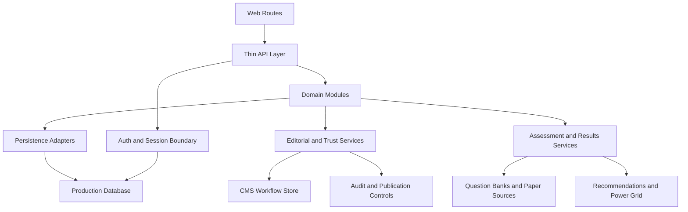

### Final learner continuity model

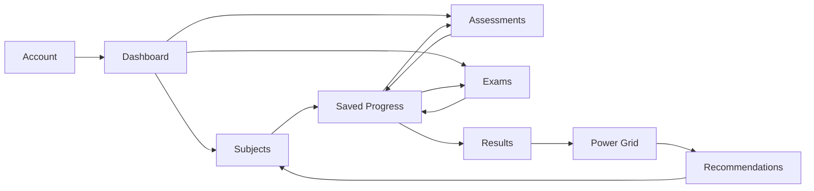

### Final content trust flow

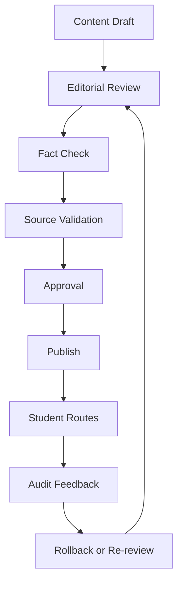

### Final quality and operations loop

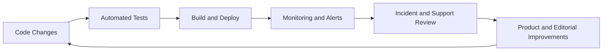

## Recent Additions

This section is kept near the bottom on purpose so the README can read as a full project guide first and a latest-changes log second.

### Shared repository and persistence foundation

The architecture now has a cleaner shared persistence boundary for core local data flows instead of each module owning its own file-write pattern.

That includes:

- a reusable JSON file store utility for local persistence adapters
- shared default repositories for auth sessions, saved progress, access profiles, and CMS workflow records
- file-backed access profile persistence instead of in-memory-only support settings
- thinner module services that now depend on reusable repository boundaries instead of duplicating storage logic

This foundation is now part of the completed final-phase architecture slice for the current roadmap pass.

### Shared server request context

Core API routes now also share a cleaner server request boundary instead of resolving auth and user context separately in each route.

That includes:

- a shared request context helper for session, user id, and default server repositories
- core account, dashboard, progress, recommendations, results, and saved-progress APIs reading from the same auth-derived route context
- cleaner route-to-service wiring for repository-backed server flows

This request-context layer completed the current final-phase architecture slice by moving the main learner-facing read and write APIs onto shared server boundaries.

### Shared learner continuity layer

The platform now has a shared learner continuity model so resume, review, and next-step decisions stop drifting between dashboard, saved progress, results, Power Grid, and recommendations.

That includes:

- a shared learner continuity service built from saved-progress session summaries
- one primary continuity action for active resume, submitted review, or first-session start states
- saved progress, dashboard, Power Grid, results, and recommendations reading the same continuity direction instead of inferring it independently
- continuity-aware follow-up labels that keep submitted work on review paths instead of reopening finished live sessions

This continuity layer is now part of the completed learner-journey slice for the current final-phase roadmap pass.

Learner-friendly explanation:

- if work is still active, the platform should send the learner back to the exact saved place to continue
- if work is already submitted, the platform should send the learner to review results instead of reopening the finished live session
- if no session exists yet, the platform should guide the learner into the safest first action

Continuity flow:

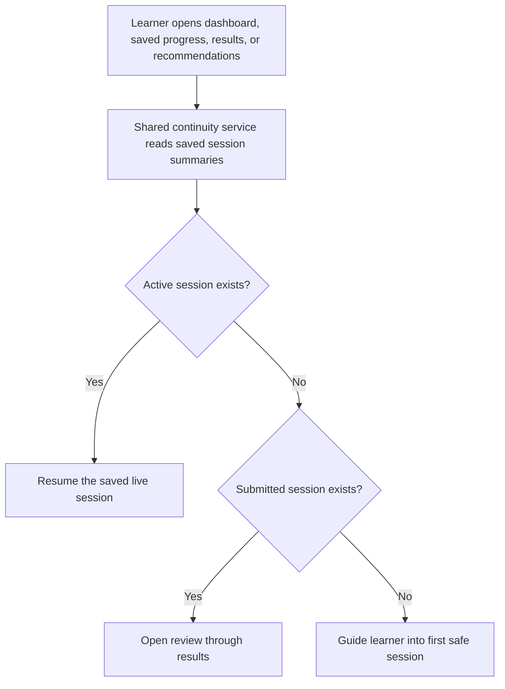

Route alignment model:

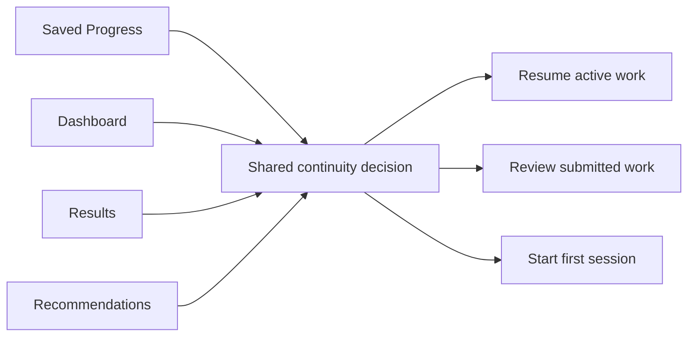

### Editorial trust and audit trail

The platform now has a stronger editorial trust layer behind student-visible content. That means content teams can record who owns a change, what review action happened, when something was blocked, and how to roll it back safely without losing the audit trail.

That includes:

- richer editorial workflow records with owner, action type, timestamps, notes, and action history
- admin controls for review, fact-check, approval, block, and rollback actions
- recent audit-trail visibility in the admin workflow view so changes can be understood quickly
- rollback-aware workflow handling so content can return to a safer earlier state when needed
- stronger trust reporting in the editorial summary, including rollback counts

This trust layer is now part of the completed editorial and trust slice for the current final-phase roadmap pass.

Learner-friendly explanation:

- if a learning item is reviewed or corrected, the platform can now keep a clearer record of who changed it and why
- if something is disputed or unsafe, it can be blocked and tracked instead of quietly drifting through the system
- if a mistake gets published, the workflow can step back to an earlier safer state instead of leaving the learner with unclear content history

Editorial trust flow:

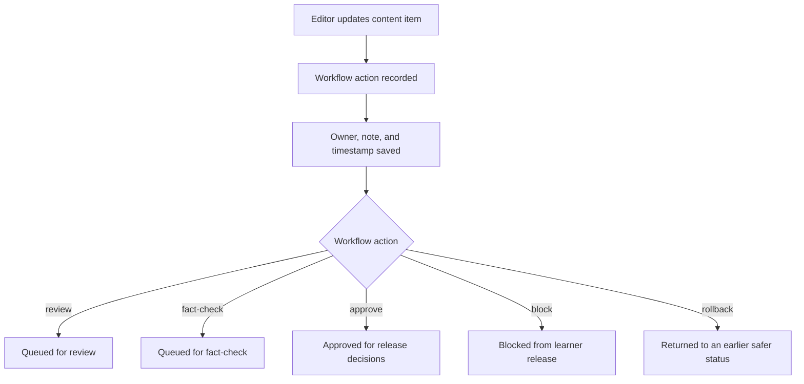

Audit trail model:

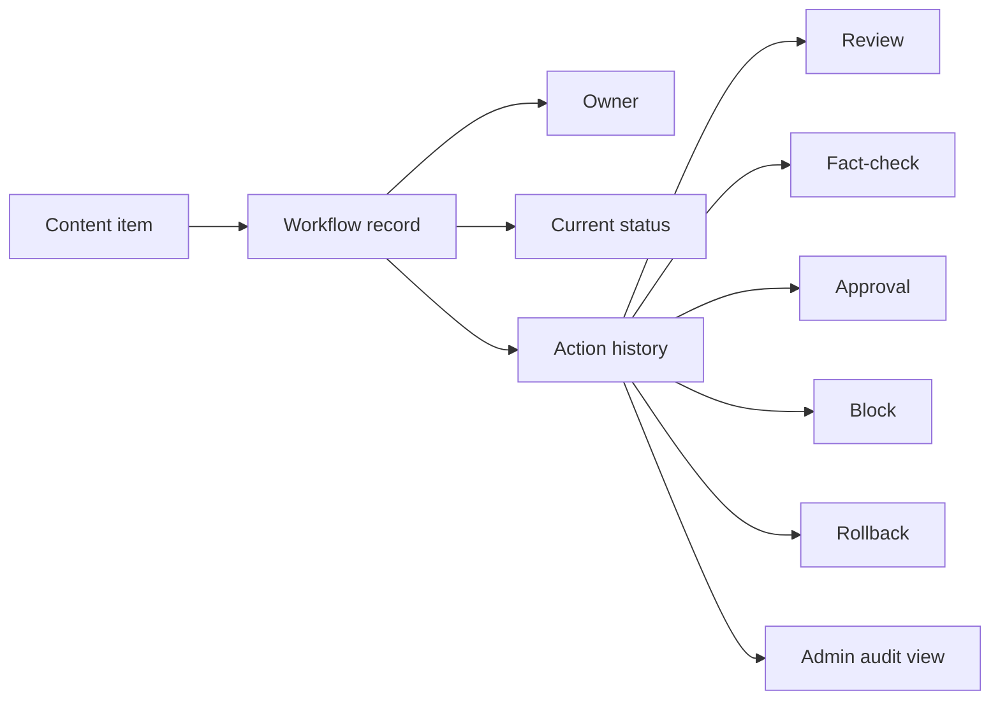

### Daily student motivation section

The MVP now includes a clean daily motivation section so the website can greet students with a calmer message that changes each day.

That includes:

- a shared daily motivation service for one quote-of-the-day style message
- a clean dashboard and home section that shows the quote without cluttering the study flow
- the same motivation moment carried into the app preview so the website and app concept stay aligned

Learner-friendly explanation:

- some students need a quieter emotional reset before they jump into saved work, results, or a new paper
- this section is meant to support momentum, not add pressure
- the wording stays simple and encouraging instead of sounding corporate or distracting

Motivation flow:

```mermaid
flowchart LR
    A["Current date"] --> B["Shared motivation service"]
    B --> C["Daily quote selected"]
    C --> D["Home and dashboard section"]
    C --> E["App preview mobile concept"]
```

### Website and app mockup preview

The project now also includes a dedicated preview route at `/app-preview` so the same product foundation can be shown as both a website direction and a mobile-style app concept.

That includes:

- a launch-style website preview built from the real dashboard metrics and route actions
- a mobile app mockup panel driven by the same learner continuity and Power Grid signals
- academic coverage cards built from the live subject catalog instead of placeholder marketing copy
- a local preview link for demos when the app is running: `http://localhost:3000/app-preview`

Why this matters to a learner:

- it shows that the product can feel consistent across web and app-style experiences
- it keeps the same next-step logic, readiness signals, and support context instead of inventing a second disconnected experience
- it makes demos easier because the product story is visible in one route

Preview structure:

```mermaid
flowchart LR
    A["Dashboard data"] --> D["/app-preview"]
    B["Power Grid summary"] --> D
    C["Student-visible subject catalog"] --> D
    D --> E["Website launch view"]
    D --> F["Mobile app mockup"]
    D --> G["Coverage cards"]
```

### README Standard

For the MVP and later roadmap phases, README updates should stay learner-friendly by default.

That means each major completed or in-progress item should include:

- a plain-English explanation of what changed
- why it matters to the learner journey, not only the codebase
- route or module references for technical readers
- a Mermaid diagram when the change affects a multi-step flow or system boundary
- completion wording that only marks work as done after the implementation is actually in code

### API-first delivery expansion

Recent work extended the internal API-first delivery layer across more of the student product.

That includes:

- shared server-side API helpers
- more page routes consuming thin internal API routes instead of pulling module logic directly
- subject experience and read-aloud session API routes
- stronger consistency between website rendering and service-layer contracts

### Exam freshness and learning repetition

The exam flow now uses a first-pass freshness model that protects learning repetition while reducing stale repeated papers.

The goal is:

- repeat `topics` and `skills`
- rotate exact `question variants`
- keep official structure and timing stable
- preserve the actual generated paper through autosave and results

How it works:

- the exam engine stores paper blueprints with question slots
- each slot has multiple valid variants
- a fresh attempt prefers variants the student has not seen recently
- the generated question set is saved into Saved Progress
- resume restores the exact same generated set
- results score against the exact questions that were actually shown

Architecture flow:

```mermaid
flowchart LR
    A["Exam route"] --> B["/api/exams/session/:examId"]
    B --> C["Exam Engine service"]
    C --> D["Paper blueprint"]
    C --> E["Saved Progress history"]
    D --> F["Question slots"]
    E --> G["Recent exposure signals"]
    F --> H["Variant selector"]
    G --> H
    H --> I["Generated question set"]
    I --> J["Saved Progress snapshot"]
    J --> K["Resume / review / results"]
```

Attempt lifecycle:

```mermaid
flowchart TD
    A["Open exam"] --> B{"Saved attempt exists?"}
    B -- "Yes, active" --> C["Restore exact saved question set"]
    B -- "Yes, submitted" --> D["Show submitted attempt"]
    B -- "No" --> E["Generate first attempt"]
    D --> F["Start fresh attempt"]
    F --> G["Rotate question variants"]
    E --> H["Save session snapshot"]
    G --> H
    C --> I["Continue work"]
    H --> I
    I --> J["Review"]
    J --> K["Submit"]
    K --> L["Results + next fresh attempt available"]
```

Current MVP limit:

- this is the first freshness layer, not the final exam-generation system
- question banks can grow later
- weak-topic-aware reappearance rules can deepen later
- longer-term exposure history can deepen later

### Guided website walkthrough

The website now includes a dedicated `How It Works` route so students can understand the main journey without guessing what route names or website signals mean.

That includes:

- a step-by-step click-through walkthrough
- direct links into Dashboard, Subjects, Assessments, Exams, Progress, Saved Progress, Accessibility, and Support
- glossary explanations for terms such as autosave, Power Grid, support snapshot, submitted, and recommendations
- a standalone API-delivered module that can later be reused by other clients

Guide flow:

```mermaid
flowchart LR
    A["Open /how-it-works"] --> B["Read guided step"]
    B --> C["Click linked route"]
    C --> D["Compare live page with guide explanation"]
    D --> E["Return for next step or glossary"]
```

### Exam submission snapshot integrity

The Exam Engine submission flow now posts the current browser session snapshot through
the API before marking the attempt as submitted.

This protects the autosave rule when a student answers a question and immediately
submits before the debounce save finishes.

The flow is:

- the website sends the current question id, responses, and time remaining to `/api/exams/session/:examId`
- the Exam Engine service saves that latest snapshot through Saved Progress
- the same service marks the saved record as submitted
- Results and Saved Progress read the final submitted answer set, not a stale autosave

Results now seeds or refreshes the relevant sessions first, then reads Saved
Progress, and scores exam outcomes from the saved generated question set and
saved response payload.

Power Grid now follows the same saved-progress state when choosing next actions:
active saved work is resumed first, review-marked work goes back through the
review path, and submitted work routes to Results rather than reopening a
finished attempt.

### Content editorial gate foundation

The content catalog now has a first-pass editorial workflow foundation before
the MVP grows more student-facing content.

That includes:

- source attribution on seed catalog topics
- reviewed, draft, and fact-check-needed content states
- `/api/content/catalog` returning a student-visible catalog by default
- `/api/content/catalog?audience=internal` returning the full internal catalog
- `/api/content/editorial-audit` returning review counts, blocked topics, and next editorial priority
- Admin showing which content is student-visible and which topic is blocked from publication

This keeps the CMS/Admin module as a placeholder while still enforcing the
important rule: unreviewed or draft content should not silently reach student
clients.

### 12. Editorial-gated subject delivery and admin visibility (Completed)

The next implemented stage pushed the content workflow further into the live
student and admin routes rather than leaving it only as a catalog-side idea.

Added work includes:

- subject, topic, revision, and quiz services now reading only student-visible reviewed content
- the `/subjects` route showing a real empty-state when reviewed learning content is not yet available
- content topic metadata now carrying publication status, review status, last-updated timing, and source attribution
- Admin exposing content provider boundaries, blocked topic visibility, and student-visible content counts
- CMS overview records now distinguishing subject, topic, revision, and quiz content references from the same seed source

This matters because the website now behaves like a product with publication
rules, not just a set of routes reading any seeded content that happens to
exist in the repo.

### 13. Saved-state scoring and live exam countdown (Completed)

The exam, results, and Power Grid flow now follows saved session state more
closely, and the exam route now behaves more like a real timed paper.

Added work includes:

- Results reading saved generated question sets and saved responses before scoring an exam attempt
- Power Grid next-action logic separating active work, submitted work, and review-ready work more clearly
- exam submission saving the final browser snapshot before marking the attempt as submitted
- the exam route now running a real countdown instead of only showing a static remaining-time label
- countdown-driven session syncing so remaining time is kept aligned with the existing autosave model
- automatic exam submission when the countdown reaches zero
- clearer in-product time warnings for the final fifteen and five minutes of a paper

This matters because official-duration exam behaviour should feel trustworthy,
and downstream progress or results logic should reflect the actual final session
state rather than a stale autosave snapshot.

### 14. Timed assessment session parity (Completed)

The timed assessment route has now moved beyond a summary-only checkpoint and
into a real saved session flow.

Added work includes:

- live question-by-question timed checkpoint interaction
- seeded timed assessment question sets instead of only aggregate counters
- timed assessment autosave through its own API save path
- timed assessment submission saving the latest browser snapshot before completion
- live countdown behaviour with automatic submission at time expiry
- bookmark and notes support inside the timed checkpoint session
- read-aloud controls inside the active timed assessment flow
- question counts now matching the mock scored answer sets used by Results

This matters because timed practice now behaves more like a real student
workflow and no longer sits behind the exam route as a lighter placeholder.

### 15. Accessibility settings persistence (Completed)

The accessibility route now saves support settings through the API and module
layer instead of behaving like a page-only preview.

Added work includes:

- `PATCH /api/accessibility/snapshot` for profile-backed accessibility updates
- accessibility settings now saving into the shared access-profile and preference model
- saved accessibility state feeding the live accessibility route immediately after save
- read aloud status on the accessibility page now reflecting the newly saved support state
- adjustable font size, colour scheme, and line spacing controls on the student-facing route

This matters because support settings now behave more like real student
preferences that can travel into future read-aloud and saved-session flows.

### 16. Timed assessment result-source consistency (Completed)

Timed assessment results now score from the saved checkpoint question set rather
than from a separate hardcoded answer map.

Added work includes:

- timed assessment question sets now being stored in Saved Progress snapshots
- Results reading timed checkpoint scoring data from the saved question set first
- removal of duplicate timed assessment answer-key assumptions from the results flow
- stronger parity between the live timed checkpoint route and the results route

This matters because scoring should come from the same module-owned session data
that the student actually used, not from a second disconnected result-only map.

### 17. Actionable results routing (Completed)

The results route now links students back into the right study flow instead of
only summarising what happened.

Added work includes:

- exam result items now linking back into full-paper review or resume routes
- timed assessment result items now linking back into checkpoint review or resume routes
- result summaries now carrying action labels and route targets from the results module itself

This matters because outcome screens should help students act on their work,
not just read a score and stop there.

### 18. Dashboard session priority and state clarity (Completed)

The dashboard now prioritises the most relevant active session first and shows
clearer session state on the student home surface.

Added work includes:

- dashboard session cards now distinguishing live work from submitted review work
- dashboard session ordering now prioritising active sessions ahead of submitted ones
- dashboard session cards now carrying explicit action labels such as resume or reopen review
- home and dashboard surfaces now using more reliable “next session” ordering instead of defaulting to the first seeded item

This matters because the student home surface should guide the next real action,
not accidentally treat completed work as the primary resume target.

### 19. Timed assessment deep-link resume reliability (Completed)

Timed assessment resume links now reopen the intended question instead of only
the intended assessment and duration.

Added work includes:

- assessments page now reading `questionId` from route search params
- timed assessment experience now honouring a deep-linked initial question on load
- resume links from saved progress, Power Grid, and results now landing more reliably in the correct checkpoint state

This matters because an autosave resume flow is not fully trustworthy if it
reopens the right session but the wrong question.

### 20. Shared read-aloud speed preference (Completed)

The accessibility route now saves the student's preferred read-aloud speed into
the shared support profile rather than treating speed as a page-only preview
control.

Added work includes:

- accessibility settings now persisting preferred read-aloud speed through the same profile-backed save path
- the accessibility route now making it clearer that saved speed becomes the default for later study sessions
- exam, timed assessment, and other read-aloud sessions now able to start from the same stored reading-speed preference

This matters because read-aloud support should feel continuous across routes,
not reset to a local preview preference whenever the student opens a new
session.

### 21. Live support snapshot in active exam and checkpoint flows (Completed)

The exam and timed assessment routes now surface the actual support snapshot
that is attached to the live session instead of leaving those preferences
implicit behind the scenes.

Added work includes:

- active exam and timed checkpoint sidebars now showing timing adjustments from the shared support layer
- saved profile defaults for text size, reading speed, and colour scheme now visible inside those live routes
- support preference chips now making focus mode, reduced distraction, high contrast, and related settings visible during active work
- read-aloud panels now clarifying the difference between the saved default speed and a temporary preview speed change

This matters because accessibility support should be visible and trustworthy in
the routes where students actually work, not only in the settings screen.

### 22. Support snapshot carry-over in results and saved progress (Completed)

Results and saved-progress summaries now show the saved support context in a
student-readable way instead of reducing it to a hidden count.

Added work includes:

- results cards now showing saved support summaries and support preference chips alongside outcome data
- saved-progress session cards now exposing the same readable support snapshot and preference carry-over details
- support-summary formatting now living in a shared presentation helper so active and post-session routes stay aligned

This matters because students should still be able to see which support profile
was active after submission and during resume decisions, not only while the
session is live.

### 23. Support visibility on dashboard and recommendations (Completed)

The dashboard and recommendations surfaces now carry the same readable support
snapshot language forward into the pre-session decision points.

Added work includes:

- dashboard support summaries and session cards now showing support preference chips alongside existing progress signals
- recommendations now surfacing saved support context in both route insights and relevant recommendation cards
- shared support-summary helpers now connecting accessibility, saved progress, results, dashboard, and recommendations through one presentation layer

This matters because the student should be able to see support context before
starting work, while working, and after submission without each route inventing
its own different wording.

### 24. Power Grid degraded-state recovery (Completed)

The Power Grid route now distinguishes between a trustworthy readiness summary
and a degraded evidence state instead of treating both cases as a normal loaded
progress view.

Added work includes:

- Power Grid summaries now exposing a data-state flag, recovery copy, and source warnings
- the `/progress` route now showing a recovery screen when there is not enough safe subject evidence to build a trustworthy readiness breakdown
- the normal progress surface now showing data-watch warnings when evidence is partial rather than silently pretending the summary is complete

This matters because readiness guidance should fail safely when linked evidence
is incomplete, not keep presenting a confident-looking progress surface with
missing foundations.

### 25. Cautious Power Grid next-step routing (Completed)

Power Grid next-step guidance now becomes more conservative when the evidence is
partial instead of giving a normal-looking confident recommendation.

Added work includes:

- Power Grid next-best-action wording now prefers rebuilding a safer saved evidence trail when source warnings are present
- Power Grid next-step hrefs now fall back toward saved-progress recovery rather than overcommitting to a normal comparison flow
- downstream surfaces that consume Power Grid guidance now inherit that more cautious recommendation automatically

This matters because the route should not give the student a high-confidence
"do this next" message when the evidence behind the comparison is still
incomplete.

## Phase 2 Roadmap

This is the next phase after the current MVP-quality pass. The goal is to harden
the highest-priority modules and replace prototype infrastructure without losing
the modular architecture.

Current roadmap snapshot:

- MVP Quality Checklist: 6 of 6 complete for the current MVP pass (100%)
- Phase 2 Roadmap: 7 of 7 completed (100%)
- Main priority picture across the MVP checklist plus phase 2 roadmap: 13 of 13 major items completed (100%)

### 1. Exam Engine hardening (Completed)

Priority reason:

- this remains the highest-priority product slice in the MVP order

Main goals:

- safer fallback and degraded-state handling when paper or session data is missing
- stronger error-state recovery across live exam flows
- deeper post-submit marking and review quality later in the phase

Current phase 2 progress:

- `/exams` now has a recovery surface when paper or seeded session loading fails instead of assuming the live paper is always available
- the live exam client now exposes stronger recovery messaging and reload paths when autosave, submit, or fresh-attempt writes fail
- submitted exam attempts now have deeper post-submit review quality, including exact answer comparison against the saved question set and working-note carry-over per question

### 29. Exam Engine full recovery and submitted review hardening (Completed)

The highest-priority product slice now has safer live recovery behaviour and a
deeper submitted review surface, instead of stopping at basic route fallbacks.

Added work includes:

- the live exam route now shows clearer recovery guidance when autosave, submit, fresh-attempt, or reload actions fail
- recovery actions now let the student reload the current session or step safely into saved progress or results without pretending the last write definitely succeeded
- submitted exam attempts now show per-question correctness, student answer, correct answer, flags, and saved working notes against the exact submitted paper mix
- the Exam Engine module docs now describe the stronger post-submit review and live recovery behaviour

This matters because the exam flow is the highest-risk student journey in the
MVP, and it needs both safe failure handling during live work and trustworthy
review quality after submission.

### 2. Power Grid hardening (Completed)

Main goals:

- clearer degraded-state handling when linked saved or result data is incomplete
- safer next-action decisions when upstream evidence is partial

Current phase 2 progress:

- `/progress` now has an explicit degraded-state recovery surface when there is not enough safe subject evidence to build a trustworthy readiness summary
- Power Grid summaries now carry source warnings so partial evidence is visible rather than implied
- Power Grid next-step guidance now becomes more cautious when those warnings are present

### 3. Saved Progress infrastructure (Completed)

Main goals:

- replace in-memory persistence with real storage
- keep current resume and review guarantees while moving to more durable persistence

Current phase 2 progress:

- the default saved-progress repository now reads and writes a local JSON-backed store instead of depending on in-memory-only state
- saved progress records still preserve the current normalization, support snapshot, resume, and review guarantees across local restarts

### 26. Local file-backed saved progress persistence (Completed)

Saved progress now survives local restarts through a file-backed store instead of
resetting whenever the app process starts over.

Added work includes:

- the default saved-progress repository now reads and writes a local JSON persistence file for prototype flows
- writes replace older records for the same user and entity key before saving the latest normalized state
- saved-progress module docs now describe the file-backed prototype store
- local persistence artifacts are ignored from git so the prototype storage stays local-only

This matters because resume and review behaviour should remain available through
normal local development restarts while the platform is still waiting for
production-grade shared persistence.

### 4. Real authentication (Completed)

Main goals:

- replace mock signed-in state with real end-to-end auth
- keep account-linked support and saved-progress routing consistent

Current phase 2 progress:

- auth sessions now use a real cookie-backed local session flow instead of a hardcoded signed-in default
- account, dashboard, progress, saved-progress, recommendations, results, read-aloud, accessibility, exam, and timed assessment routes now resolve the current user through the shared auth boundary
- the account route now supports signed-out recovery and sign-in or sign-out actions while keeping the page thin

### 27. Cookie-backed authentication foundation (Completed)

The platform now has a real local auth foundation instead of assuming the same
signed-in student on every request.

Added work includes:

- auth sessions now persist through a local cookie-backed store with explicit signed-in and signed-out states
- `/api/auth/session` now supports reading, creating, and clearing the active session
- user-aware routes now resolve the current authenticated learner before loading accessibility, saved-progress, recommendation, results, exam, and timed assessment data
- the account route now exposes real sign-in and sign-out controls while the app shell reads accessibility state for the active session rather than a hardcoded demo user

This matters because account-linked saved progress, support settings, and resume
routes should follow the same learner across requests instead of silently
pretending every session belongs to one fixed demo account.

### 28. 2026-06-10 delivery snapshot (Completed)

This is the consolidated summary of the major implementation work completed in
today's pass so the README reflects the real shipped state of the branch.

Added work includes:

- accessibility runtime application so saved support preferences now affect the app shell instead of staying page-local
- shared support-summary presentation and visibility across live sessions, results, saved progress, dashboard, and recommendations
- admin-facing MVP release checklist coverage for the current priority modules
- safer exam and progress recovery states when linked session or evidence data is incomplete
- local file-backed saved-progress persistence that survives local restarts
- cookie-backed auth session handling with signed-in and signed-out states and user-aware route loading
- production build verification passed on 2026-06-10 after the current branch changes

This matters because the platform now behaves much more like one connected
student product, with continuity across support, session recovery, identity,
dashboard guidance, and admin release visibility.

### 5. Write-side API expansion (Completed)

Main goals:

- give the main student actions stronger write-side API coverage
- reduce dependence on page-local assumptions for important state changes

Current phase 2 progress:

- saved progress now has a shared write-side API route for status changes instead of leaving pause or resume state implicit inside pages
- the saved-progress route now uses that shared API to control pause and ready-to-resume behaviour for active sessions
- saved-progress status transitions now reject unsafe submitted-to-active downgrades through the module service and API validation layer

### 30. Saved-progress write-side API expansion (Completed)

The product now has a shared write path for saved-progress state instead of
depending only on read models and page-local assumptions.

Added work includes:

- `/api/saved-progress/session/:entityType/:entityId` now updates saved-progress status for the active user
- saved-progress transition rules now block unsafe downgrades from submitted records back into active work
- the Saved Progress route now exposes pause and ready-to-resume controls backed by the shared API route
- saved-progress module docs now describe the shared write-side status transition support

This matters because recommendations, dashboard guidance, resume routing, and
saved-session recovery should all be able to trust one API-backed source of
truth for active versus paused saved work.

### 6. Results and marking depth (Completed)

Main goals:

- deepen marking quality beyond the current MVP scoring pass
- keep result interpretation aligned with saved session evidence

Current phase 2 progress:

- results now carry deeper marking signals including correct, incorrect, unanswered, confidence, and question-level review summaries
- exam and timed-assessment result cards now surface review priorities and marking notes that still follow the saved session evidence layer

### 31. Shared results review depth and marking confidence (Completed)

Results now go beyond one summary percentage and expose a deeper review model
that still reads from the shared saved session evidence.

Added work includes:

- result summaries now include correct, incorrect, and unanswered counts alongside marking confidence
- result models now carry review priorities, marking notes, and question-level outcome summaries for both exams and timed assessments
- the results route now shows those deeper review signals without recalculating from a page-only model

This matters because submitted work should turn into a trustworthy review flow,
not just a single score number with limited follow-up guidance.

### 7. CMS and editorial workflow expansion (Completed)

Main goals:

- move from architecture-only admin planning into a controlled update workflow
- keep review, fact-check, and publication gates intact as content volume grows

Current phase 2 progress:

- the admin route now has a local editorial workflow queue with API-backed status updates instead of only static content architecture notes
- CMS workflow records now persist locally and track controlled review, fact-check, approval, and blocked states per content item

### 32. Local editorial queue and CMS workflow controls (Completed)

The admin surface now includes a real controlled editorial queue instead of
stopping at provider architecture and blocked-content summaries.

Added work includes:

- `/api/cms/workflow/:contentId` now updates local editorial workflow records
- CMS overview data now includes workflow records and queue counts for review, fact-check, approval, and blocked states
- the admin route now exposes workflow controls and notes for the current content queue
- CMS module docs now describe the new local workflow support

This matters because expanding content safely needs a real review path in the
product, not only a future-planning description of how one might work later.

## MVP Quality Checklist

This is the current product-quality checklist for the MVP. It should stay
cumulative and be updated as items move from in progress to complete.

Priority rule:

- focus on trust, continuity, and data safety before adding lots of new routes
- treat autosave quality as product quality
- use this list as the working priority order for MVP hardening

### 1. Make every core student flow end-to-end reliable

Status: complete for the current MVP pass.

Covered in this pass:

- exams can start, resume, autosave, submit, reopen review, and route into results
- timed assessments can start, resume, autosave, submit, reopen review, and route into results
- saved progress now links back into the correct session routes with question-level resume support
- results now link back into the correct exam or timed assessment follow-up route
- dashboard now prioritises active work ahead of submitted review work
- accessibility settings now persist through the API layer instead of staying page-local

### 2. Treat saved progress as a critical system, not a feature

Status: complete for the current MVP pass.

Covered in this pass:

- saved progress now exposes resume-ready and review-ready recovery state
- shared saved-progress routing now decides whether students resume live work or open results
- dashboard, Power Grid, recommendations, results, and the saved-progress route now read those shared recovery decisions
- save-time normalization now filters invalid resume pointers and rebuilds safe checkpoint state
- stale follow-up saves can no longer overwrite a submitted saved-progress record back into active work
- saved-progress summaries now fail safely when linked exam or assessment metadata is unavailable

This remains one of the strictest quality areas in the MVP because lost, stale,
duplicated, or wrongly resumed progress would break student trust quickly.

### 3. Keep one source of truth for scoring, timing, and support rules

Status: complete for the current MVP pass.

Covered in this pass:

- exam results score from saved exam snapshots
- timed assessment results now score from saved checkpoint question sets
- exam and timed checkpoint timing rules live in their own modules
- accessibility and support settings are moving into shared profile-backed state
- saved progress now exposes one shared session-insights layer for score, completion, review, timing, and support signals
- results, Power Grid, and saved-progress summaries now read those shared derived session signals instead of recalculating them separately
- recommendations now inherit those aligned signals through the results and Power Grid modules

### Source-of-Truth Explainer

What changed:

- saved progress is no longer only a storage layer
- it now also provides shared derived session insights
- those insights carry scoring, completion, review counts, timing state, and support state in one place

Why this matters:

- results should not score one way while Power Grid interprets the same session another way
- recommendations should not point a student somewhere based on different numbers from the results page
- support and timing details should follow the same saved session evidence across routes

```mermaid
flowchart TD
    A["Exam Engine session"] --> C["Saved Progress normalization"]
    B["Timed Assessment attempt"] --> C
    C --> D["Saved session record"]
    D --> E["Shared session insights"]
    E --> F["Saved Progress route"]
    E --> G["Results"]
    E --> H["Power Grid"]
    H --> I["Recommendations"]
```

Plain-English rule:

- live session state is saved once
- saved progress normalizes that state into a safe session record
- shared session insights derive meaning from that saved record
- student routes consume those same derived signals instead of each inventing their own version

### Resume And Review Explainer

The saved-progress system now makes one routing decision for the whole product:

- if the session is still active, resume the live route
- if the session is submitted, open results or review

```mermaid
flowchart TD
    A["Saved session record"] --> B{"Status"}
    B -->|"in-progress / paused"| C["Resume-ready state"]
    B -->|"submitted"| D["Review-ready state"]
    C --> E["Exam or assessment route"]
    D --> F["Results route"]
    C --> G["Dashboard / Saved Progress / Power Grid"]
    D --> G
```

That keeps the student journey consistent:

- dashboard uses it
- saved progress uses it
- Power Grid uses it
- results uses it
- recommendations inherit it through those modules

### Timing And Support Explainer

Timing and support rules now travel with the same saved-session evidence instead of being treated as page-only details.

```mermaid
flowchart LR
    A["Access Arrangements"] --> B["Adjusted duration"]
    A --> C["Support snapshot"]
    B --> D["Live exam / assessment session"]
    C --> D
    D --> E["Saved Progress"]
    E --> F["Shared session insights"]
    F --> G["Results"]
    F --> H["Power Grid"]
    F --> I["Saved Progress summaries"]
```

This means:

- timing shown during the live attempt lines up with timing stored in saved progress
- support snapshots remain attached to the saved evidence
- downstream routes read the same support-aware session picture

### 4. Raise content quality before expanding content volume

Status: complete for the current MVP pass.

Covered in this pass:

- editorial-gated student content delivery
- source attribution
- draft and review-status handling
- internal audit route and admin visibility
- trusted source attribution is now enforced in the student visibility gate instead of being a docs-only expectation
- blocked editorial audit decisions now explain when source evidence is incomplete or still pending
- student subject routes now show source attribution and checked-against evidence for visible topics

### Content Quality Explainer

What changed:

- published content is still blocked unless it is reviewed, fact-checked, and backed by trusted source attribution
- admin audit views can now show whether a topic is blocked by source evidence, not just by draft or review state
- student topic surfaces now show where the visible content came from and what it was checked against

```mermaid
flowchart TD
    A["Seed or future CMS topic"] --> B{"Publication status"}
    B -->|"draft"| X["Blocked from student routes"]
    B -->|"published"| C{"Review status"}
    C -->|"not reviewed"| X
    C -->|"reviewed"| D{"Fact check verified"}
    D -->|"no"| X
    D -->|"yes"| E{"Trusted source attribution"}
    E -->|"missing or pending"| X
    E -->|"complete"| F["Student-visible content catalog"]
    F --> G["Subjects route"]
    F --> H["Revision and quiz services"]
```

Plain-English rule:

- draft content stays out
- reviewed but unverified content stays out
- verified content without trusted attribution still stays out
- only fully gated topics can reach student routes

### 5. Make accessibility real, not decorative

Status: complete for the current MVP pass.

Progress already made:

- persisted accessibility settings
- shared preferred read-aloud speed persistence
- read aloud in active exam and timed checkpoint flows
- live support snapshot visibility inside exam and timed checkpoint routes
- support snapshot visibility in results and saved-progress summaries
- support snapshots travelling with saved progress

### 6. Use a release checklist for every priority module

Status: complete for the current MVP pass.

Each priority slice should now be checked for:

- start/resume/submit/review continuity
- saved-progress correctness
- results consistency
- dashboard and recommendation consistency
- support-setting carry-over
- safe fallback behaviour when saved or linked data is missing

Covered in this pass:

- the admin route now includes an explicit MVP release checklist for the current priority modules
- Exam Engine, Power Grid, Saved Progress, Read Aloud, Dashboard, and Timed Assessments now each show check-level release notes
- checks are now labeled as complete, in progress, or watch so remaining fallback risk stays visible instead of implied

### 7. Add a daily student motivation section to the MVP

Status: complete for the current MVP pass.

Progress already made:

- a shared daily motivation service now rotates one student-friendly quote each day
- dashboard and home now show that quote in a clean low-noise section
- the app preview route also carries the same motivation moment so website and app concept stay aligned
- the wording is intentionally calm and study-safe rather than noisy, sales-like, or distracting

## Summary

The Switch is no longer just a blueprint sitting in a README.

It now has:

- a meaningful modular architecture
- a working student dashboard
- a subjects flow
- a timed assessment flow
- an exam flow
- a progress flow
- saved progress foundations
- access arrangements foundations
- Power Grid foundations

And most importantly, the code is being shaped so that each part of the system has a job.

Current completion snapshot:

- MVP quality pass: complete for the current checklist
- Phase 2: complete for the current roadmap
- Phase 3: planned, 0 of 8 items completed
- Final Phase: 3 of 8 items completed
- Overall project completion estimate: 86% complete for the currently tracked MVP plus full production-completion roadmap

That is one of the biggest differences between “a page that works” and “a product that can keep growing.”
