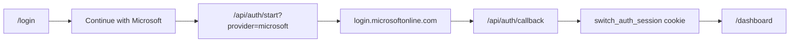

# Microsoft sign-in for The Switch Platform

Plain-English guide for turning on **Continue with Microsoft** on the live site.

## What this gives you

- Students and staff can sign in with a school or work Microsoft account.
- The same sign-in path also works for admin when the signed-in email is allowlisted.
- Google and Microsoft can both appear on `/login` at the same time.


## The four steps (simple view)

1. Open **https://theswitchplatform.com/login**
2. Press **Continue with Microsoft**
3. Sign in on the Microsoft page
4. Return to The Switch on your dashboard with a live session

## What you need in Azure

Create an **App registration** in [Microsoft Entra admin center](https://portal.azure.com/#view/Microsoft_AAD_RegisteredApps/ApplicationsListBlade):

| Setting | Value |
|---------|--------|
| Platform | Web |
| Redirect URI | `https://theswitchplatform.com/api/auth/callback` |
| Client ID | copy to `SWITCH_OIDC_MICROSOFT_CLIENT_ID` |
| Client secret | copy to `SWITCH_OIDC_MICROSOFT_CLIENT_SECRET` |

Use these standard Microsoft OIDC URLs:

```bash
SWITCH_OIDC_MICROSOFT_AUTHORIZATION_URL=https://login.microsoftonline.com/common/oauth2/v2.0/authorize
SWITCH_OIDC_MICROSOFT_TOKEN_URL=https://login.microsoftonline.com/common/oauth2/v2.0/token
SWITCH_OIDC_MICROSOFT_USERINFO_URL=https://graph.microsoft.com/oidc/userinfo
SWITCH_OIDC_MICROSOFT_SCOPES=openid profile email
```

## Where to put the values

**Local rehearsal:** `.env.local`  
**Fly production:** `fly secrets set ... -a the-switch-platform`

Helper script (opens Azure and prints the redirect URI):

```bash
npm run setup:microsoft-oauth-live
```

## How to prove it works

```bash
npm run verify:microsoft-oauth-live
npm run verify:google-oauth-live
```

Then sign in manually at `/login` with a real Microsoft account.

## Fly deploy note (June 2026)

If `fly deploy` fails at `npm run build` with a TypeScript error on `/login`, make sure you have the latest branch that types `searchParams` correctly in `src/app/login/page.tsx`. After the fix:

```bash
npm run build
fly deploy -a the-switch-platform
npm run verify:microsoft-oauth-live
```

Live routes after deploy:

- https://theswitchplatform.com/login
- https://theswitchplatform.com/login/microsoft-guide

## Admin access after Microsoft sign-in

There is no separate Microsoft admin account inside the app. Add the signed-in email to:

```bash
SWITCH_AUTH_ADMIN_EMAILS=your-email@school.onmicrosoft.com
SWITCH_AUTH_EDITOR_EMAILS=your-email@school.onmicrosoft.com
```

Redeploy, sign in again, then open `/admin`.

## Architecture (still one auth module)



The website shell shows the button. The auth module still owns session creation and role mapping.
