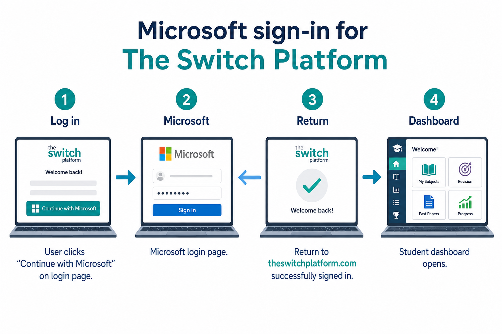
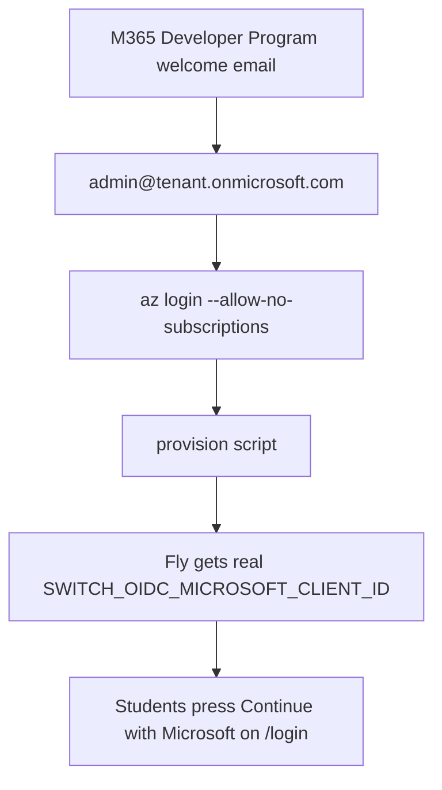
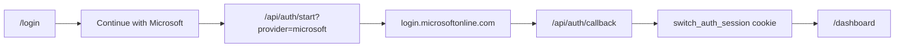

# Microsoft sign-in for The Switch Platform

Plain-English guide for turning on **Continue with Microsoft** on the live site.

## What this gives you

- Students and staff can sign in with a school or work Microsoft account.
- The same sign-in path also works for admin when the signed-in email is allowlisted.
- Google and Microsoft can both appear on `/login` at the same time.



## The four steps (simple view)

1. Open **https://theswitchplatform.com/login**
2. Press **Continue with Microsoft**
3. Sign in on the Microsoft page
4. Return to The Switch on your dashboard with a live session

## What you need in Azure

Create an **App registration** in [Microsoft Entra admin center](https://portal.azure.com/#view/Microsoft_AAD_RegisteredApps/ApplicationsListBlade):

| Setting | Value |
|---------|--------|
| Platform | Web |
| Redirect URI | `https://theswitchplatform.com/api/auth/callback` |
| Supported account types | **Multitenant + personal Microsoft accounts** (required for `@hotmail.com`, `@outlook.com`, and school/work accounts) |
| Client ID | copy to `SWITCH_OIDC_MICROSOFT_CLIENT_ID` (must be a real UUID — not `your-client-id`) |
| Client secret | copy to `SWITCH_OIDC_MICROSOFT_CLIENT_SECRET` |

### Personal Microsoft accounts (Hotmail / Outlook)

If sign-in shows `unauthorized_client` or `client does not exist or is not enabled for consumers`:

1. Open your app → **Authentication**
2. Under **Supported account types**, choose **Accounts in any organizational directory (Any Microsoft Entra ID tenant - Multitenant) and personal Microsoft accounts**
3. Save, then try `/login` again

Do **not** leave placeholder values on Fly. If the Microsoft URL contains `client_id=your-client-id`, replace the secrets below with your real Azure values.

Use these standard Microsoft OIDC URLs:

```bash
SWITCH_OIDC_MICROSOFT_AUTHORIZATION_URL=https://login.microsoftonline.com/common/oauth2/v2.0/authorize
SWITCH_OIDC_MICROSOFT_TOKEN_URL=https://login.microsoftonline.com/common/oauth2/v2.0/token
SWITCH_OIDC_MICROSOFT_USERINFO_URL=https://graph.microsoft.com/oidc/userinfo
SWITCH_OIDC_MICROSOFT_SCOPES=openid profile email
```

## Where to put the values

**Local rehearsal:** `.env.local`  
**Fly production:**

```bash
fly secrets set \
  SWITCH_OIDC_MICROSOFT_CLIENT_ID="<your-azure-application-client-id-uuid>" \
  SWITCH_OIDC_MICROSOFT_CLIENT_SECRET="<your-azure-client-secret>" \
  SWITCH_OIDC_MICROSOFT_AUTHORIZATION_URL="https://login.microsoftonline.com/common/oauth2/v2.0/authorize" \
  SWITCH_OIDC_MICROSOFT_TOKEN_URL="https://login.microsoftonline.com/common/oauth2/v2.0/token" \
  SWITCH_OIDC_MICROSOFT_USERINFO_URL="https://graph.microsoft.com/oidc/userinfo" \
  SWITCH_OIDC_MICROSOFT_SCOPES="openid profile email" \
  -a the-switch-platform
```

Fly restarts the app after secrets change. No redeploy is required unless you also changed code.

Helper script (opens Azure and prints the redirect URI):

```bash
npm run setup:microsoft-oauth-live
```

**Full terminal setup (Azure CLI + Fly secrets + verify)** — after joining M365 Developer Program and installing Azure CLI:

```bash
brew install azure-cli   # once
az login --use-device-code --allow-no-subscriptions
npm run provision:microsoft-oauth-live:apply
```

Or run the combined script (includes login prompt):

```bash
npm run provision:microsoft-oauth-live
```

Sign in with **admin@yourtenant.onmicrosoft.com** from the M365 Developer welcome email — not a directory-less Hotmail account.

The provision script will prompt for **one browser sign-in** (`az login` device code), then automatically:

1. Create or update the Azure App registration (multitenant + personal accounts)
2. Create a client secret
3. Set all `SWITCH_OIDC_MICROSOFT_*` secrets on Fly
4. Update `.env.local`
5. Run `npm run verify:microsoft-oauth-live`

### M365 Developer tenant vs Hotmail (plain English)

| What you did | What it enables |
|--------------|-----------------|
| Signed into Azure website with `@hotmail.com` | Browse portal only — may show “no directory” |
| Joined M365 Developer Program | Creates `admin@tenant.onmicrosoft.com` sandbox |
| `az login` with tenant admin | Terminal can create app registrations |
| `npm run provision:microsoft-oauth-live:apply` | Puts real credentials on Fly automatically |



## How to prove it works

```bash
npm run verify:microsoft-oauth-live
npm run verify:google-oauth-live
```

Then sign in manually at `/login` with a real Microsoft account.

## Fly deploy note (June 2026)

If `fly deploy` fails at `npm run build` with a TypeScript error on `/login`, make sure you have the latest branch that types `searchParams` correctly in `src/app/login/page.tsx`. After the fix:

```bash
npm run build
fly deploy -a the-switch-platform
npm run verify:microsoft-oauth-live
```

Live routes after deploy:

- https://theswitchplatform.com/login
- https://theswitchplatform.com/login/microsoft-guide

## Admin access after Microsoft sign-in

There is no separate Microsoft admin account inside the app. Add the signed-in email to:

```bash
SWITCH_AUTH_ADMIN_EMAILS=your-email@school.onmicrosoft.com
SWITCH_AUTH_EDITOR_EMAILS=your-email@school.onmicrosoft.com
```

Redeploy, sign in again, then open `/admin`.

## Architecture (still one auth module)



The website shell shows the button. The auth module still owns session creation and role mapping.
