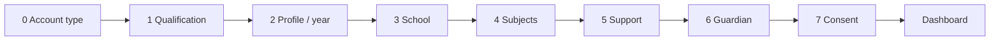

# Seneca-Style Onboarding & Website Mockup

> **Build priority:** Full End-to-End Completion List **item 3** (onboarding)  
> **Live route:** https://theswitchplatform.com/onboarding  
> **Reference:** Seneca Learning onboarding flow (account type → qualification → profile → subjects → dashboard)  
> **Shipped:** 2026-06-23 — commit `129f39e`

Plain English: this document is the visual and flow mockup for the new guided setup. It matches the Seneca screenshots supplied for step order, spacing, and tone — while keeping Switch-specific steps (school lookup, accessibility, guardian, consent).

---

## Design tokens

| Token | Value | Use |
|-------|-------|-----|
| Page background | `#eef6ff` | Onboarding + homepage gradient base |
| Primary action | `sky-500` / `sky-700` | Progress bar, Continue, Sign up |
| Card surface | `white` + `rounded-2xl` + light shadow | All selection cards |
| Body text | `slate-700` / `slate-500` | Headings and subtitles |
| Progress track | `slate-200` | Full-width bar at top |
| Progress fill | `sky-500` | Filled portion with emoji indicator |

Typography: existing platform sans-serif (Tailwind defaults). Mobile-first — cards stack to one column on small screens.

---

## Marketing header (homepage)

Mirrors Seneca public site nav: logo left, audience links centre, auth CTAs right.

```
┌─────────────────────────────────────────────────────────────────┐
│  ✦ THE SWITCH    For Students  How it works  Support  Schools   │
│                                      Log in    [ Sign up ]      │
└─────────────────────────────────────────────────────────────────┘
```

- **Component:** `src/components/marketing-site-header.tsx`
- **Used on:** `/` (homepage only via `dashboard-home.tsx` `mode="home"`)
- **Signed-in:** Log in → Account; Sign up → Dashboard

---

## Onboarding flow (8 steps)



**Shell:** `OnboardingShell` — progress bar, centred title/subtitle, sticky footer (Back | Continue).

| Step | Key | Title | Continue label |
|------|-----|-------|----------------|
| 0 | `account-type` | Select your Switch account type: | Continue |
| 1 | `qualification` | What are you studying for this year? | Continue |
| 2 | `profile` | Great to meet you, {name}! | Continue |
| 3 | `school` | Where do you go to school? | Continue |
| 4 | `subjects` | Which 🎒 {qualification} subjects are you studying? | **Let's go!** |
| 5 | `support` | Accessibility and support | Continue |
| 6 | `guardian` | Invite a parent or guardian | Continue |
| 7 | `consent` | Almost there! | **Open my dashboard** |

---

## Step mockups

### Step 0 — Account type

```
        [==========●────────────────]  progress (~12%)

              Select your Switch account type:

    ┌──────────┐  ┌──────────┐  ┌──────────┐
    │    🎓    │  │  👨‍👩‍👧   │  │    💼    │
    │ I'm a    │  │ I'm a    │  │ I'm a    │
    │ student  │  │ parent   │  │ teacher  │
    └──────────┘  └──────────┘  └──────────┘
         ▲ selected = sky border

    [ Back ]                              [ Continue ]
```

- Three horizontal cards, pastel icon circles (orange / violet / rose)
- Selected card: `border-sky-500`

### Step 1 — Qualification

```
        [================●──────────────]  (~25%)

         What are you studying for this year?
         More than one? Pick your main route...

    ┌─────────────────────┐  ┌─────────────────────┐
    │ ○ GCSE (England)  🎒│  │ ○ GCSE (Wales)    🏴│
    └─────────────────────┘  └─────────────────────┘
    ┌─────────────────────┐  ┌─────────────────────┐
    │ ○ GCSE (NI)       📜│  │ ○ iGCSE           🌍│
    └─────────────────────┘  └─────────────────────┘

    [ Back ]                              [ Continue ]
```

- Two-column grid, radio + label + emoji icon

### Step 2 — Profile / year group

```
        [====================●──────────]  (~37%)

              Great to meet you, Lloyd!
         Which profile matches your vibe?

    ┌────────────┐  ┌────────────┐  ┌────────────┐
    │     🤖     │  │     😅     │  │     🙂     │
    │ Lloyd the  │  │ Lloyd the  │  │ Lloyd the  │
    │ Exam ready │  │ Building   │  │ Getting    │
    │  (Year 11) │  │ momentum   │  │ started    │
    └────────────┘  └────────────┘  └────────────┘

    [ Back ]                              [ Continue ]
```

- Personalised first name from signed-in session
- Year 9 / 10 / 11 persona cards (Seneca “vibe” pattern)

### Step 3 — School

```
        [========================●──────]  (~50%)

              Where do you go to school?
         We use official UK school sources...

    ┌─────────────────────────────────────────┐
    │ School name                             │
    │ [________________________________]      │
    │ Nation: [ England ▼ ]                   │
    │ Links: GIAS · Parentzone · Wales · EANI │
    └─────────────────────────────────────────┘

    [ Back ]                              [ Continue ]
```

### Step 4 — Subjects

```
        [============================●──]  (~62%)

      Which 🎒 GCSE subjects are you studying?
              We'll narrow down the specifics later...

    ┌─────────────────────┐  ┌─────────────────────┐
    │ ☑ GCSE Maths      📐│  │ ☐ GCSE English   ✍️│
    └─────────────────────┘  └─────────────────────┘
    ┌─────────────────────┐  ┌─────────────────────┐
    │ ☑ Combined Science 🧬│  │ ☐ iGCSE Maths    📊│
    └─────────────────────┘  └─────────────────────┘

    [ Back ]                              [ Let's go! ]
```

- Continue disabled until ≥1 subject selected
- Subject list from `listStudentVisibleContentSubjects()` via API

### Step 5 — Support (Switch-specific)

```
        [================================●]  (~75%)

            Accessibility and support
         Optional — accessibility or access help

    ┌─────────────────────────────────────────┐
    │ ☐ I want accessibility support visible  │
    │ ☐ I want exam access arrangement help   │
    │ ☐ Show SEND support-path signposting    │
    └─────────────────────────────────────────┘

    [ Back ]                              [ Continue ]
```

### Step 6 — Guardian (optional)

```
    ┌─────────────────────────────────────────┐
    │ Guardian email (optional)               │
    │ [ parent@example.com              ]     │
    └─────────────────────────────────────────┘

    [ Back ]                              [ Continue ]
```

### Step 7 — Consent

```
        [==================================●]  (~100%)

                  Almost there!
         Confirm age or consent, then dashboard.

    ┌─────────────────────────────────────────┐
    │ ☑ I confirm age/consent or guardian     │
    │   agreement for this setup.             │
    └─────────────────────────────────────────┘

    [ Back ]                         [ Open my dashboard ]
```

- On complete → `PUT /api/onboarding/profile` with `complete: true` → redirect `/dashboard`

---

## Homepage mockup (post-onboarding entry)

```
┌─────────────────────────────────────────────────────────────────┐
│  ✦ THE SWITCH    For Students  ...           Log in  [Sign up]  │
├─────────────────────────────────────────────────────────────────┤
│  light blue gradient background (#eef6ff)                         │
│                                                                 │
│  ┌─────────────────────────────┐  ┌──────────────────┐         │
│  │ Hero — student home preview │  │ Session / routes │         │
│  │ Next best step, planner     │  │ sidebar cards    │         │
│  └─────────────────────────────┘  └──────────────────┘         │
└─────────────────────────────────────────────────────────────────┘
```

Dashboard (`/dashboard`) keeps the existing signed-in nav — marketing header is homepage-only.

---

## Architecture (unchanged)

```
/onboarding (page) → onboarding-experience.tsx → /api/onboarding/profile
                                                      ↓
                                            onboarding/service.ts
                                                      ↓
                                            onboarding-profile-store
```

- Incomplete learners hitting `/dashboard` redirect to `/onboarding`
- Dashboard personalises from `selectedSubjectIds` and qualification path

---

## Live proof checklist (item 3)

- [x] Deploy to Fly (`fly deploy -a the-switch-platform`)
- [x] New learner: sign in → `/onboarding` → complete all 8 steps (automated via `npm run verify:live-onboarding`)
- [x] Dashboard shows subjects from onboarding choices
- [x] Record evidence in `release-evidence/2026-06-23-final-path-mark-2-item-3-complete.md`
- [x] Re-run `npm run verify:live-walkthrough`

---

## Files

| File | Role |
|------|------|
| `src/components/onboarding/onboarding-shell.tsx` | Progress bar + footer shell |
| `src/components/marketing-site-header.tsx` | Public marketing nav |
| `src/app/onboarding/onboarding-experience.tsx` | Step content + save logic |
| `src/modules/onboarding/service.ts` | Step order + completion rules |
| `src/components/dashboard-home.tsx` | Homepage header + gradient |
