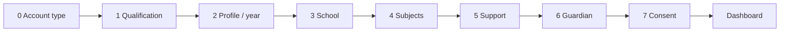

# Mock Idea — Onboarding & Website Mockup

> **Design direction name:** **Mock Idea** (Seneca-inspired layout study — not a copy)  
> **Platform:** The Switch Platform · https://theswitchplatform.com  
> **Onboarding route:** `/onboarding`  
> **Reference:** Supplied Seneca screenshots — adapted with indigo/violet twist + MVP SEND colours  
> **Shipped:** 2026-06-23 onboarding · 2026-06-24 Mock Idea shell

Plain English: **Mock Idea** is our name for the student-facing layout direction. It keeps the calm, card-based flow from the reference screenshots but uses **indigo/violet** accents instead of Seneca blue, adds **MVP SEND colour chips** (cream, blue, yellow, high contrast), and runs on The Switch Platform modules — not a third-party clone.

---

## Mock Idea twist (what is different)

| Reference pattern | Mock Idea twist |
|-------------------|-----------------|
| Seneca blue branding | **Indigo/violet** primary + amber SEND chips |
| Seneca logo | **✦ MOCK IDEA** wordmark |
| Subject sidebar purple icons | Violet accent nav + **Access** + **SEND help** items |
| Gamified XP header | Kept — “Good morning, {name}” + support chips from onboarding |
| Planner popup | **PlannerPromptCard** — dismissible, links `/progress` + `/accessibility` |
| Marketing footer | **MarketingSiteFooter** with SEND overlay chips |

---

## MVP SEND colour requirements

From `globals.css` accessibility runtime — used as **signposting chips** (not auto-applied without user choice):

| Overlay | Hex | MVP use |
|---------|-----|---------|
| Cream | `#f6f0dc` | Dyslexia-friendly reading backgrounds |
| Blue | `#eaf4ff` | Calm focus backgrounds |
| Yellow | `#fff8c4` | High-visibility reading |
| High contrast | black/white | Maximum legibility |

Components: `SEND_COLOUR_CHIPS` in `src/components/mock-idea/brand-tokens.ts`  
Surfaces: footer, sidebar mini chips, `SendSupportRail`, planner CTA button.

---

## Design tokens

| Token | Value | Use |
|-------|-------|-----|
| Page background | `#eef6ff` | Onboarding + student shell |
| Primary action | `indigo-600` / `indigo-700` | Sign up, Create my plan |
| Secondary | `sky-100` / `violet-100` | Active nav items |
| SEND chips | cream / blue / yellow / black | Accessibility signposting |
| Card surface | `white` + `rounded-2xl` + shadow | Cards and modals |

---

## Marketing header (homepage)

```
┌─────────────────────────────────────────────────────────────────┐
│  ✦ MOCK IDEA   For Students  Resources  For Parents  Schools    │
│                          Join class  Log in    [ Sign up ]        │
└─────────────────────────────────────────────────────────────────┘
```

- **Component:** `src/components/marketing-site-header.tsx`
- **Used on:** `/` homepage

---

## Marketing footer (homepage)

Four columns: Mock Idea brand · For learners · Access & SEND · Schools  
Bottom row: **MVP SEND colour overlay chips** linking to `/accessibility`.

- **Component:** `src/components/mock-idea/marketing-site-footer.tsx`

---

## Signed-in dashboard shell

```
┌──────┬──────────────────────────────────────────────────────────┐
│ ✦    │  Good morning, Lloyd · 100 XP to Level 1               │
│ 🏠   │  [Accessibility setup] [Access settings]               │
│ 📝   ├──────────────────────────────────────────────────────────┤
│ 📅   │  [ Planner prompt card — Create my plan ]                │
│ 📚   │  [ SEND support rail — cream/blue/yellow/high contrast ] │
│ ♿   │  … existing dashboard content …                          │
│ 🧭   │                                                          │
│ 🙂   │                                                          │
└──────┴──────────────────────────────────────────────────────────┘
```

- **Component:** `src/components/mock-idea/student-app-shell.tsx`
- **Used on:** `/dashboard` when `mode="dashboard"`
- **Also:** `PlannerPromptCard`, `SendSupportRail`

Mobile: bottom tab bar (Home, Practice, Planner, Subjects).

---

## Onboarding banner

Top strip on `/onboarding`: **Mock Idea guided setup · The Switch Platform**

- **Component:** `src/components/onboarding/onboarding-shell.tsx`

---

## Onboarding flow (8 steps)



**Shell:** `OnboardingShell` — progress bar, centred title/subtitle, sticky footer (Back | Continue).

| Step | Key | Title | Continue label |
|------|-----|-------|----------------|
| 0 | `account-type` | Select your Switch account type: | Continue |
| 1 | `qualification` | What are you studying for this year? | Continue |
| 2 | `profile` | Great to meet you, {name}! | Continue |
| 3 | `school` | Where do you go to school? | Continue |
| 4 | `subjects` | Which 🎒 {qualification} subjects are you studying? | **Let's go!** |
| 5 | `support` | Accessibility and support | Continue |
| 6 | `guardian` | Invite a parent or guardian | Continue |
| 7 | `consent` | Almost there! | **Open my dashboard** |

---

## Step mockups

### Step 0 — Account type

```
        [==========●────────────────]  progress (~12%)

              Select your Switch account type:

    ┌──────────┐  ┌──────────┐  ┌──────────┐
    │    🎓    │  │  👨‍👩‍👧   │  │    💼    │
    │ I'm a    │  │ I'm a    │  │ I'm a    │
    │ student  │  │ parent   │  │ teacher  │
    └──────────┘  └──────────┘  └──────────┘
         ▲ selected = sky border

    [ Back ]                              [ Continue ]
```

- Three horizontal cards, pastel icon circles (orange / violet / rose)
- Selected card: `border-sky-500`

### Step 1 — Qualification

```
        [================●──────────────]  (~25%)

         What are you studying for this year?
         More than one? Pick your main route...

    ┌─────────────────────┐  ┌─────────────────────┐
    │ ○ GCSE (England)  🎒│  │ ○ GCSE (Wales)    🏴│
    └─────────────────────┘  └─────────────────────┘
    ┌─────────────────────┐  ┌─────────────────────┐
    │ ○ GCSE (NI)       📜│  │ ○ iGCSE           🌍│
    └─────────────────────┘  └─────────────────────┘

    [ Back ]                              [ Continue ]
```

- Two-column grid, radio + label + emoji icon

### Step 2 — Profile / year group

```
        [====================●──────────]  (~37%)

              Great to meet you, Lloyd!
         Which profile matches your vibe?

    ┌────────────┐  ┌────────────┐  ┌────────────┐
    │     🤖     │  │     😅     │  │     🙂     │
    │ Lloyd the  │  │ Lloyd the  │  │ Lloyd the  │
    │ Exam ready │  │ Building   │  │ Getting    │
    │  (Year 11) │  │ momentum   │  │ started    │
    └────────────┘  └────────────┘  └────────────┘

    [ Back ]                              [ Continue ]
```

- Personalised first name from signed-in session
- Year 9 / 10 / 11 persona cards (Seneca “vibe” pattern)

### Step 3 — School

```
        [========================●──────]  (~50%)

              Where do you go to school?
         We use official UK school sources...

    ┌─────────────────────────────────────────┐
    │ School name                             │
    │ [________________________________]      │
    │ Nation: [ England ▼ ]                   │
    │ Links: GIAS · Parentzone · Wales · EANI │
    └─────────────────────────────────────────┘

    [ Back ]                              [ Continue ]
```

### Step 4 — Subjects

```
        [============================●──]  (~62%)

      Which 🎒 GCSE subjects are you studying?
   Pick MVP subjects — Combined Science covers biology, chemistry, and physics.

    ┌─────────────────────┐  ┌─────────────────────┐
    │ ☑ GCSE Maths      📐│  │ ☐ GCSE English   ✍️│
    │ Core number,      │  │ Reading, inference, │
    │ algebra, geometry │  │ language analysis   │
    └─────────────────────┘  └─────────────────────┘
    ┌─────────────────────┐  ┌─────────────────────┐
    │ ☑ Combined Science 🧬│  │ (iGCSE route only) │
    │ Biology, chemistry, │  │ iGCSE Maths      📊│
    │ and physics         │  │                     │
    └─────────────────────┘  └─────────────────────┘

    [ Back ]                              [ Let's go! ]
```

- **GCSE routes** (England, Wales, NI): Maths, English Language, Combined Science
- **iGCSE route:** iGCSE Mathematics only
- Subject list from `listStudentVisibleContentSubjects()` — same as `/subjects`
- Changing qualification path clears incompatible subject selections

### Step 5 — Support (Accessibility · Access Arrangements · SEND)

```
        [================================●]  (~75%)

     Accessibility, access arrangements, and SEND support

    ┌─────────────────────────────────────────┐
    │ ☑ Accessibility support               │
    │   Contrast, dyslexia font, focus mode   │
    │   → Accessibility module              │
    └─────────────────────────────────────────┘
    ┌─────────────────────────────────────────┐
    │ ☑ Exam access arrangements              │
    │   Extra time, reader, rest breaks       │
    │   → Access Arrangements foundation      │
    └─────────────────────────────────────────┘
    ┌─────────────────────────────────────────┐
    │ ☑ SEND and support signposting          │
    │   Trusted UK links — not counselling    │
    │   → Support Hub                         │
    └─────────────────────────────────────────┘

    [ Back ]                              [ Continue ]
```

- Maps to README Core MVP #7 Accessibility, #9 Access Arrangements, Support Hub
- On complete: seeds `StudentAccessProfile` when accessibility/access flags set
- Dashboard shows support chips from onboarding choices

### Step 6 — Guardian (optional)

```
    ┌─────────────────────────────────────────┐
    │ Guardian email (optional)               │
    │ [ parent@example.com              ]     │
    └─────────────────────────────────────────┘

    [ Back ]                              [ Continue ]
```

### Step 7 — Consent

```
        [==================================●]  (~100%)

                  Almost there!
         Confirm age or consent, then dashboard.

    ┌─────────────────────────────────────────┐
    │ ☑ I confirm age/consent or guardian     │
    │   agreement for this setup.             │
    └─────────────────────────────────────────┘

    [ Back ]                         [ Open my dashboard ]
```

- On complete → `PUT /api/onboarding/profile` with `complete: true` → redirect `/dashboard`

---

## Homepage mockup (post-onboarding entry)

```
┌─────────────────────────────────────────────────────────────────┐
│  ✦ THE SWITCH    For Students  ...           Log in  [Sign up]  │
├─────────────────────────────────────────────────────────────────┤
│  light blue gradient background (#eef6ff)                         │
│                                                                 │
│  ┌─────────────────────────────┐  ┌──────────────────┐         │
│  │ Hero — student home preview │  │ Session / routes │         │
│  │ Next best step, planner     │  │ sidebar cards    │         │
│  └─────────────────────────────┘  └──────────────────┘         │
└─────────────────────────────────────────────────────────────────┘
```

Dashboard (`/dashboard`) keeps the existing signed-in nav — marketing header is homepage-only.

---

## Architecture (unchanged)

```
/onboarding (page) → onboarding-experience.tsx → /api/onboarding/profile
                                                      ↓
                                            onboarding/service.ts
                                                      ↓
                                            onboarding-profile-store
```

- Incomplete learners hitting `/dashboard` redirect to `/onboarding`
- Dashboard personalises from `selectedSubjectIds` and qualification path

---

## Live proof checklist (item 3)

- [x] Deploy to Fly (`fly deploy -a the-switch-platform`)
- [x] New learner: sign in → `/onboarding` → complete all 8 steps (automated via `npm run verify:live-onboarding`)
- [x] Dashboard shows subjects from onboarding choices
- [x] Record evidence in `release-evidence/2026-06-23-final-path-mark-2-item-3-complete.md`
- [x] Re-run `npm run verify:live-walkthrough`

---

## Files

| File | Role |
|------|------|
| `src/components/mock-idea/brand-tokens.ts` | Mock Idea brand + SEND palette |
| `src/components/mock-idea/student-app-shell.tsx` | Sidebar + welcome header |
| `src/components/mock-idea/marketing-site-footer.tsx` | Public footer + SEND chips |
| `src/components/mock-idea/planner-prompt-card.tsx` | Planner modal card |
| `src/components/mock-idea/send-support-rail.tsx` | Access/SEND dashboard rail |
| `src/components/marketing-site-header.tsx` | Public header (Mock Idea) |
| `src/components/onboarding/onboarding-shell.tsx` | Onboarding progress shell |
| `src/app/onboarding/onboarding-experience.tsx` | Step content + save logic |
| `src/modules/onboarding/service.ts` | Step order + completion rules |
| `src/components/dashboard-home.tsx` | Home + dashboard layout |
