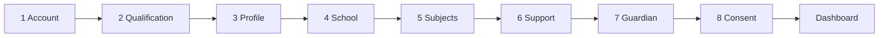

# Mock Idea — Visual Mockup Guide (Study Atelier)

> **Design direction:** **Mock Idea · Study Atelier** — creative layout on The Switch Platform  
> **Not Seneca:** no narrow icon sidebar, no pale-blue clone, no centred popup modal  
> **Live gallery:** https://theswitchplatform.com/mock-idea-preview  
> **Onboarding:** `/onboarding` · **Dashboard:** `/dashboard`  
> **Docs shipped:** 2026-06-24 creative refresh

Plain English: **Mock Idea** is a creative study-home direction for The Switch. It uses **bento panels**, a **top study rail**, **stone/teal/amber** Switch colours, **MVP SEND swatches**, and **access arrangement signposting** — inspired by modern ed-tech patterns but deliberately different from the reference screenshots.

---

## Creative twist vs reference screenshots

| Reference habit | Mock Idea Study Atelier |
|-----------------|-------------------------|
| Narrow left icon sidebar | **Top horizontal study rail** + optional right SEND swatch column |
| Pale blue `#eef6ff` everywhere | **Stone `#f5f5f4`** mesh with teal/amber blobs |
| Purple/blue Seneca branding | **Teal/emerald/amber** Switch palette + ◆ glyph |
| Emoji icon stacks under labels | **Letter badges** (H, P, L, S, A, +) in coloured squares |
| Centred planner popup modal | **Split bento planner panel** — dark left panel + bullet list right |
| Light footer with pill chips | **Dark stone footer** with diagonal wave + colour **swatch circles** |
| Single progress emoji bar | **Numbered step rail** on onboarding (desktop) |

---

## Everything added (checklist)

| Feature | Where | Component / route |
|---------|-------|-------------------|
| Mock Idea branding | Header, shell, onboarding | `brand-tokens.ts` |
| Marketing header | Homepage `/` | `marketing-site-header.tsx` |
| Marketing footer + SEND swatches | Homepage `/` | `marketing-site-footer.tsx` |
| Signed-in study shell | `/dashboard` | `student-app-shell.tsx` |
| Planner bento panel | `/dashboard` | `planner-prompt-card.tsx` |
| Access & SEND rail | `/dashboard` | `send-support-rail.tsx` |
| Onboarding 8-step flow | `/onboarding` | `onboarding-experience.tsx` |
| Onboarding step rail | `/onboarding` | `onboarding-shell.tsx` |
| MVP SEND colour overlays | Footer, rail, sidebar, planner | `SEND_COLOUR_CHIPS` |
| Access arrangements links | Rail, footer, onboarding step 5 | `/how-it-works`, modules |
| Visual mockup gallery | `/mock-idea-preview` | `mock-idea-showcase.tsx` |

---

## MVP SEND colour requirements

From `globals.css` — signposting until learner chooses in `/accessibility`:

| Overlay | Hex | MVP use |
|---------|-----|---------|
| Cream | `#f6f0dc` | Dyslexia-friendly reading backgrounds |
| Blue | `#eaf4ff` | Calm focus backgrounds |
| Yellow | `#fff8c4` | High-visibility reading |
| High contrast | `#000000` / white text | Maximum legibility |

---

## Design tokens

| Token | Value | Use |
|-------|-------|-----|
| Page background | `stone-100` / `#f5f5f4` | Shell, onboarding, homepage |
| Primary action | `teal-800` | Sign up, Continue, Create my plan |
| Accent mesh | teal + amber + sky blurs | Ambient background blobs |
| Card surface | `white` + border + shadow | Bento panels |
| Footer | `stone-950` | Marketing footer band |
| SEND swatches | cream / blue / yellow / black | Linked to `/accessibility` |

---

## Mockup 1 — Marketing header

```
┌──────────────────────────────────────────────────────────────────────────┐
│ ▬▬▬ teal → amber → emerald gradient strip ▬▬▬                          │
│  ◆ Mock Idea          For Students  Resources  Parents  Schools          │
│  Study Atelier mock                        Join class  Log in  [Sign up] │
└──────────────────────────────────────────────────────────────────────────┘
```

- Square ◆ logo on **stone-950** block (not sunburst)
- Segmented nav with teal highlight on “For Students”
- Teal CTA button (not Seneca deep-blue pill)

**Component:** `src/components/mock-idea/marketing-site-header.tsx`

---

## Mockup 2 — Marketing footer

```
        ╱ diagonal wave cut from stone-100 into stone-950 ╲
┌──────────────────────────────────────────────────────────────────────────┐
│  ◆ Mock Idea          For learners    Access & SEND      Schools         │
│  Study Atelier        · dashboard     · accessibility    · admin         │
│                       · subjects      · support          · resources     │
│                       · onboarding    · access guide     · log in        │
│                       · mock gallery                                       │
│  ─────────────────────────────────────────────────────────────────────   │
│  MVP SEND colour overlays                                                │
│  (cream) (blue) (yellow) (black)  ← swatch squares, not flat pills       │
│  © Mock Idea on The Switch Platform                                      │
└──────────────────────────────────────────────────────────────────────────┘
```

**Component:** `src/components/mock-idea/marketing-site-footer.tsx`

---

## Mockup 3 — Signed-in dashboard shell

```
┌──────────────────────────────────────────────────────────────────────────┐
│ ◆ Mock Idea    [H Home][P Practice][L Planner][S Subjects][A Access]…  ◉ │
├──────────────────────────────────────────────────────────────────────────┤
│ STUDY ATELIER · powered by The Switch                                    │
│ Good afternoon, Lloyd                    [support chips] [Access settings] │
│ Study Pulse active · planner and access tools ready below                  │
├───────────────────────────────────────────────┬──────────────────────────┤
│ ┌─ PLANNER BENTO ─────────┬─ bullets + CTAs ─┐ │ SEND overlays (desktop)  │
│ │ dark teal panel         │ Create my plan   │ │ [cream][blue]            │
│ │ 3 mini subject tiles    │ SEND colours     │ │ [yellow][contrast]     │
│ └─────────────────────────┴──────────────────┘ │                          │
│ ┌─ ACCESS & SEND RAIL ────┬─ colour cards ───┐ │                          │
│ │ onboarding chips        │ 4 swatch tiles   │ │                          │
│ │ module links            │                  │ │                          │
│ └─────────────────────────┴──────────────────┘ │                          │
│ … live dashboard cards (readiness, routes, sessions) …                     │
└───────────────────────────────────────────────┴──────────────────────────┘
```

**Components:** `student-app-shell.tsx`, `planner-prompt-card.tsx`, `send-support-rail.tsx`  
**Route:** `/dashboard` (signed in)

Mobile: horizontal scroll study pills + bottom letter dock (H P L S A).

---

## Mockup 4 — Planner bento (not a centred modal)

```
┌─────────────────────────────┬──────────────────────────────────────┐
│ PLANNER (teal panel)        │ • Built around onboarding subjects   │
│ Your study plan, built      │ • Links exams, practice, progress    │
│ around you                  │ • Respects access arrangements       │
│ [Subjects][Practice][Exams] │ [Create my plan] [SEND colours]      │
└─────────────────────────────┴──────────────────────────────────────┘
```

Dismissible via **Close** — not a floating ✕ circle modal.

---

## Mockup 5 — Onboarding (8 steps)



**Desktop:** numbered step rail on the left (current step = teal, done = emerald).  
**All sizes:** flat progress bar with teal→emerald gradient.  
**Banner:** dark stone strip — “Mock Idea guided setup · The Switch Platform”.

| Step | Key | Focus |
|------|-----|-------|
| 0 | account-type | Student / parent / teacher |
| 1 | qualification | GCSE routes + iGCSE |
| 2 | profile | Name + year persona |
| 3 | school | UK school sources |
| 4 | subjects | MVP catalog filter |
| 5 | support | Accessibility · Access Arrangements · SEND signposting |
| 6 | guardian | Optional invite |
| 7 | consent | Age/consent → dashboard |

Step 5 maps to MVP modules; completion seeds `StudentAccessProfile` and dashboard support chips.

---

## Mockup 6 — Homepage `/`

Marketing header + stone mesh hero + existing dashboard preview cards + marketing footer.

---

## Mockup 7 — Visual gallery `/mock-idea-preview`

Single page stacking all mockups for review:

1. Marketing header + footer frame  
2. Full dashboard shell with planner + SEND rail  
3. Onboarding banner strip  
4. SEND colour swatch grid  

**Open locally:** `npm run dev` → http://localhost:3000/mock-idea-preview  
**Live:** https://theswitchplatform.com/mock-idea-preview

---

## Architecture (unchanged)

```
/onboarding → onboarding-experience.tsx → /api/onboarding/profile → onboarding/service.ts
/dashboard  → dashboard-home.tsx (mode=dashboard) → StudentAppShell + module data
/           → dashboard-home.tsx (mode=home) → MarketingSiteHeader + Footer
```

---

## Files

| File | Role |
|------|------|
| `src/components/mock-idea/brand-tokens.ts` | Brand, SEND palette, nav |
| `src/components/mock-idea/student-app-shell.tsx` | Top study rail shell |
| `src/components/mock-idea/marketing-site-header.tsx` | Public header |
| `src/components/mock-idea/marketing-site-footer.tsx` | Dark footer + swatches |
| `src/components/mock-idea/planner-prompt-card.tsx` | Bento planner panel |
| `src/components/mock-idea/send-support-rail.tsx` | Access/SEND bento rail |
| `src/components/mock-idea/mock-idea-showcase.tsx` | Gallery sections |
| `src/app/mock-idea-preview/page.tsx` | Visual mockup route |
| `src/components/onboarding/onboarding-shell.tsx` | Step rail onboarding |
| `src/components/dashboard-home.tsx` | Home + dashboard layout |
| `docs/SENECA-STYLE-ONBOARDING-MOCKUP.md` | This guide |

---

## Live proof (item 3 onboarding)

- [x] 8-step onboarding on Fly  
- [x] MVP catalog subject filter  
- [x] Access/SEND step 5 wiring  
- [x] `npm run verify:live-onboarding`  
- [x] Evidence: `release-evidence/2026-06-23-final-path-mark-2-item-3-complete.md`
