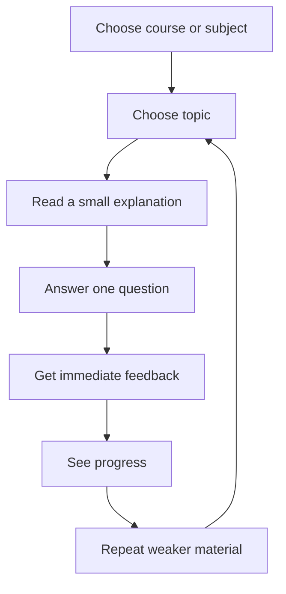

# 01 — Seneca Public Product Flow

## Scope

This is a public-product architecture study only. It does not claim to know Seneca's internal codebase, database schema, algorithms, or services.

## Observable learning pattern

Seneca-style revision works because the learner journey is short, repeatable, and low-friction:



## Product principles worth learning from

| Principle | Why it works | Switch adaptation |
|----------|--------------|-------------------|
| Small chunks | Reduces overwhelm | Short topic cards and one-question-at-a-time lesson flow |
| Immediate feedback | Keeps the learner engaged | Feedback after each practice question, not only at the end |
| Progress visible | Makes effort feel real | Power Grid, XP, mastery, readiness, streaks |
| Repeat weak areas | Improves retention | Recommendation engine should route weak topics back into practice |
| Low navigation friction | Student does not get lost | Dashboard should always show one primary next action |

## What not to copy

Do not copy Seneca visual identity, protected implementation details, exact lesson layout, brand wording, progression names, or any non-public internal logic.

## What to use as inspiration

Use the broad structure:

```text
Subject → Topic → Learn → Question → Feedback → Progress → Repeat
```

For The Switch, convert it into:

```text
Dashboard → Subject → Topic → Learn → Practice → Save → Results → Power Grid → Recommendation
```

## Design implication

The Switch should feel less like a document library and more like a guided study engine. The student should not need to decide from ten equal options. The product should choose the next sensible step based on saved progress, weak topics, exam date, and Power Grid state.
