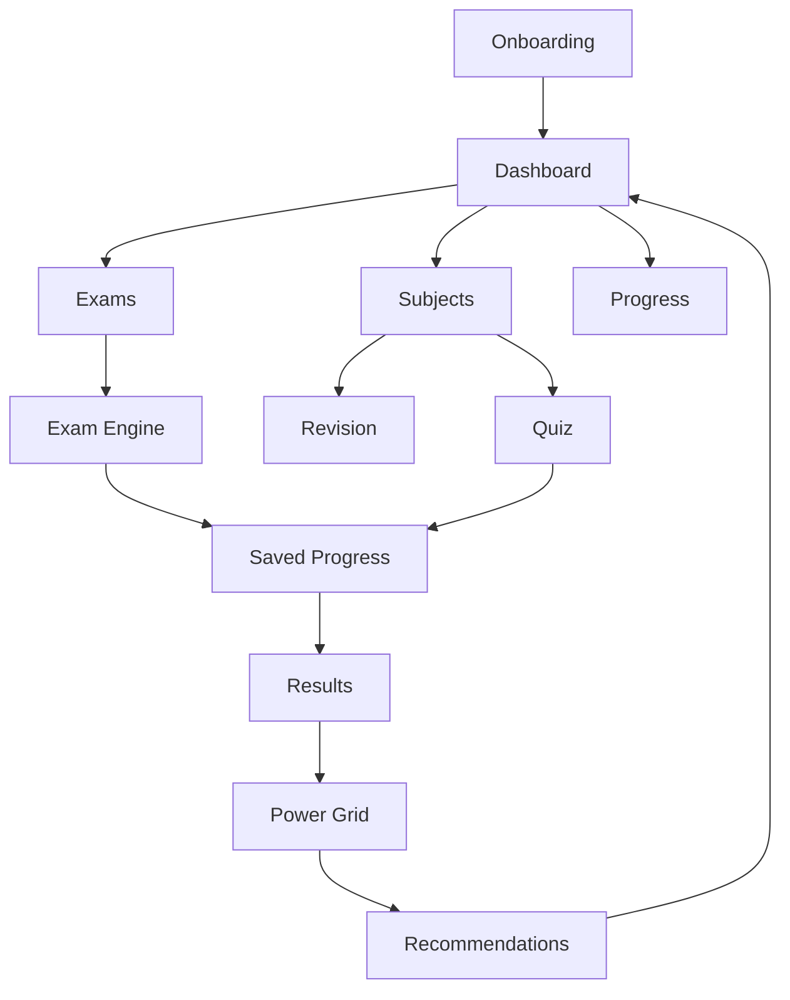

# 02 — Switch Current Architecture

## Current product shape

The Switch is already built around the correct modular pattern:

```text
src/app        = visible website routes
src/app/api    = thin API delivery layer
src/modules    = product logic and business rules
src/components = reusable interface pieces
src/data       = seeded content and inventory
```

## Main route map

| Route | Main job | Should connect to |
|------|----------|-------------------|
| `/` | Public homepage | `/login`, product explanation, trust signals |
| `/login` | Sign in | onboarding or dashboard |
| `/onboarding` | Build learner setup | dashboard, subjects, exam board filtering |
| `/dashboard` | One clear next action | subjects, exams, progress, saved work |
| `/subjects` | Start learning and practice | topic learning, quiz, mock exam |
| `/exams` | Full GCSE/iGCSE exam mode | saved progress, results, Power Grid |
| `/assessments` | Timed checkpoint practice | saved progress, results, recommendations |
| `/progress` | Readiness and Power Grid | weak-topic recommendations |
| `/saved-progress` | Resume or review work | exams, assessments, results |
| `/results` | Understand performance | review, retry, Power Grid, recommendations |
| `/recommendations` | Next best action | subject/topic/exam route |
| `/accessibility` | Support settings | exams, assessments, read aloud, saved sessions |
| `/account` | Profile and account | settings, support, saved work |

## Current strongest modules



## Current architecture strength

The Switch already has an advantage over a simple revision site because it combines:

- onboarding setup
- exam-board-aware paper availability
- full exam mode
- timed assessments
- saved progress
- results interpretation
- Power Grid progress
- accessibility and access arrangements
- recommendations

## Current design risk

The biggest risk is not missing modules. The risk is that pages can feel like separate areas instead of one connected learner journey.

The pre-launch design job is therefore:

> Make every route feel like one part of the same study engine.

## Practical rule

A page should never end in a dead end. Every route should finish with one of these actions:

- continue learning
- resume saved work
- practise weak topic
- start exam paper
- review results
- update support settings
- return to dashboard
