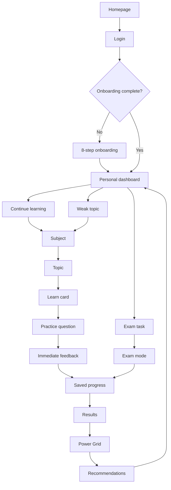
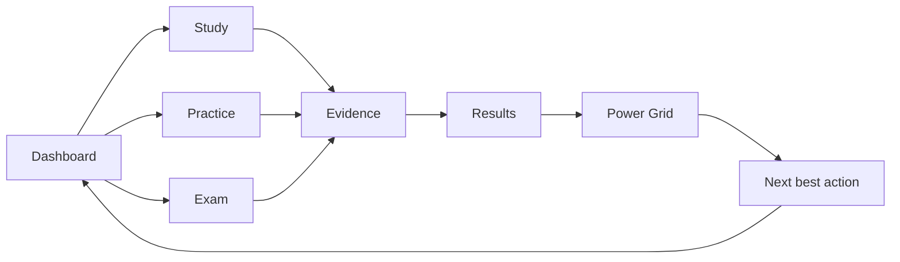

# 03 — Connected Website Map

## Goal

Before launch, The Switch should feel like one connected product, not a set of separate pages.

The core loop should be:

```text
Sign in → Onboarding → Dashboard → Study → Practice → Save → Results → Power Grid → Recommendations → Study again
```

## Full learner journey



## Page connection rules

| Page | Must receive from | Must send to |
|------|-------------------|--------------|
| Homepage | public product story | login |
| Login | auth provider | onboarding or dashboard |
| Onboarding | learner setup choices | dashboard, exam filtering |
| Dashboard | saved progress, Power Grid, recommendations | one primary next action |
| Subjects | catalog, onboarding subjects | topic learning |
| Topic/Lesson | content, quiz, saved state | feedback and next practice |
| Exams | inventory, access arrangements | saved progress and results |
| Timed assessments | assessment definitions | saved progress and results |
| Saved progress | exam/assessment snapshots | resume or review |
| Results | submitted work | Power Grid and recommendations |
| Power Grid | saved evidence and results | next improvement action |
| Recommendations | weak-topic and continuity data | the most useful route |
| Accessibility | access profile | exam/practice support defaults |

## One-primary-action rule

Every signed-in page should have one visually dominant next step.

Examples:

- Dashboard: `Continue Algebra`
- Subject page: `Start next topic`
- Topic page: `Practise now`
- Exam page: `Resume paper`
- Results page: `Review mistakes`
- Power Grid page: `Improve weakest topic`

Secondary actions should still exist, but they should not compete visually.

## Connection failures to avoid

Do not allow:

- Dashboard cards that do not lead to a real route
- Recommendations without a clear action
- Results that only show a score and no follow-up
- Progress that shows XP but not how to improve
- Topic pages that end without practice
- Exam pages that do not feed Power Grid
- Accessibility settings that do not affect active work

## Best website mental model

The Switch should behave like a command centre:



## Practical design outcome

The student should feel:

> I know where I am, I know what I just did, and I know what to do next.
