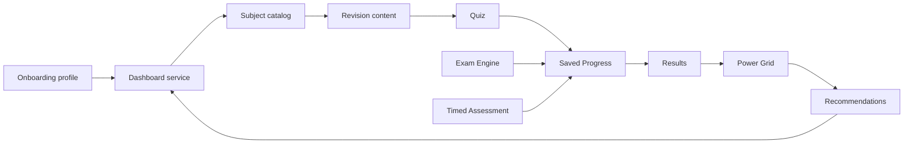
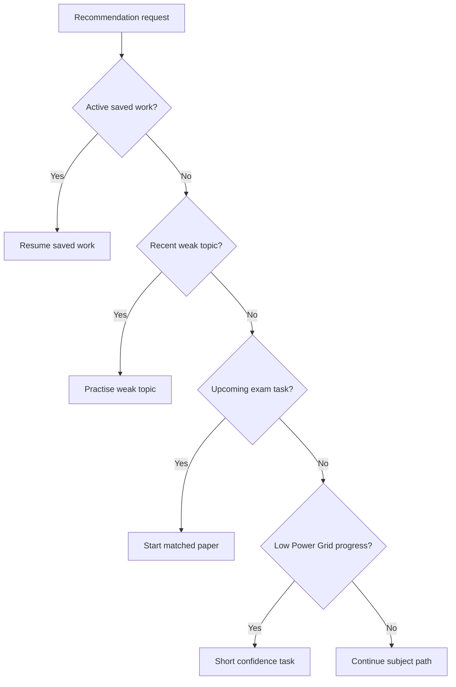

# 05 — Data Flow and Modules

## Main data flow

The Switch should keep page components thin and let modules own product rules.



## Core module responsibilities

| Module | Owns | Must not own |
|--------|------|--------------|
| `onboarding` | learner setup, qualification, board, subjects, support choices | exam scoring |
| `dashboard` | combined learner view model | detailed exam logic |
| `content` | reviewed subject/topic material | progress calculations |
| `quiz` | practice questions and explanations | final exam timing |
| `exam-engine` | paper sessions, timing, submission | Power Grid levels |
| `timed-assessment` | checkpoint practice and duration rules | full paper inventory ownership |
| `saved-progress` | autosave, resume, review state | content publishing |
| `results` | scores, outcomes, review summaries | recommendation ranking alone |
| `power-grid` | XP, level, readiness translation | raw content delivery |
| `recommendations` | next best action | storing exam answers |
| `accessibility` | support preferences | assessment content |
| `access-arrangements` | timing/support adjustments | page layout |

## Recommended evidence model

The Switch should treat every learner action as evidence.

```text
Question answered
→ saved progress event
→ result evidence
→ Power Grid change
→ recommendation update
→ dashboard next action
```

## Minimum evidence fields for future work

When expanding the code later, each practice/exam record should support:

```text
userId
subjectId
topicId
qualificationPath
examBoard
activityType
questionId
answerGiven
isCorrect
marksAwarded
timeSpentSeconds
supportSnapshot
completedAt
sourceRoute
```

## Recommendation logic hierarchy

The recommendation engine should choose the next action in this order:



## Design implication

The website should not ask the student to make all decisions manually. The system should surface the best action using:

- onboarding choices
- saved work
- correctness
- time spent
- missed questions
- Power Grid level
- access support settings
- exam board and subject route

## Architecture guardrail

Do not build page-only logic for:

- XP
- exam timing
- access arrangements
- recommendation ranking
- saved progress
- result scoring
- content visibility

Those rules must stay inside modules so the future app can reuse them.
