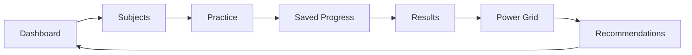

# 06 — Pre-Launch Design Actions

## Purpose

Use this checklist before launch to turn the current MVP into a connected, practical, premium study product.

This is a design and practicality checklist, not a new feature list.

## Phase 1 — Page purpose audit

For every route, write one sentence:

```text
This page exists so the student can ________.
```

If the sentence is unclear, simplify the page.

Routes to audit:

- `/`
- `/login`
- `/onboarding`
- `/dashboard`
- `/subjects`
- `/assessments`
- `/exams`
- `/progress`
- `/saved-progress`
- `/results`
- `/recommendations`
- `/accessibility`
- `/account`

## Phase 2 — One-primary-action pass

Every route must have one dominant call to action.

| Route | Primary action |
|------|----------------|
| Dashboard | Continue highest-value task |
| Subjects | Continue selected topic |
| Exams | Resume or start matched paper |
| Results | Review mistakes |
| Power Grid | Improve weakest area |
| Recommendations | Start recommended action |
| Accessibility | Save support settings |

## Phase 3 — Connection pass

Check that every page links to the next useful step.



No dead ends.

## Phase 4 — Learning loop pass

For topics and practice, enforce this rhythm:

```text
Short explanation → worked example → question → immediate feedback → next question or review
```

Do not create long, static lesson pages before launch.

## Phase 5 — Power Grid integration pass

Power Grid must explain:

- current level
- XP/progress
- what improved
- what is holding the student back
- what to do next

Power Grid should not be decoration. It should guide behaviour.

## Phase 6 — Saved Progress glue pass

Saved Progress should connect:

- active exams
- active timed assessments
- submitted review sessions
- dashboard resume cards
- results review actions
- recommendations

If a student answers work, it should leave a trail.

## Phase 7 — Recommendation brain pass

Recommendations should become the clearest answer to:

> What should I do now?

Ranking order:

1. resume active saved work
2. review recently submitted mistakes
3. practise weakest topic
4. start matched exam paper
5. complete missing setup/support step

## Phase 8 — Visual declutter pass

Remove or demote:

- repeated cards
- duplicated CTAs
- long intro text
- internal developer language
- equal-weight competing sections
- decorative stats that do not change the next action

Keep:

- page title
- short explanation
- progress signal
- one main action
- supporting links

## Phase 9 — Mobile practicality pass

Check every key route on mobile:

- primary action visible without hunting
- cards not too tall
- nav does not hide important actions
- touch targets at least 44px
- quiz answers easy to tap
- exam controls sticky and obvious

## Phase 10 — Launch-ready definition

This workstream is complete when:

- every route has one purpose
- every route has one primary action
- every route connects to the next useful step
- recommendations are evidence-led
- Power Grid changes after real work
- saved progress is visible before and after work
- results lead to action, not just scores
- accessibility settings appear in real study flows
- the product feels like one connected learning engine

## Operator instruction for Cursor/Codex

```text
Read HANDOFF.md first.
Then read docs/design/09_SENECA_ARCHITECTURE_COMPARISON/README.md.
Use this folder as a design/practicality reference before changing live routes.
Keep The Switch unique through Power Grid, exam readiness, saved progress, accessibility, and onboarding-driven dashboard creation.
```
