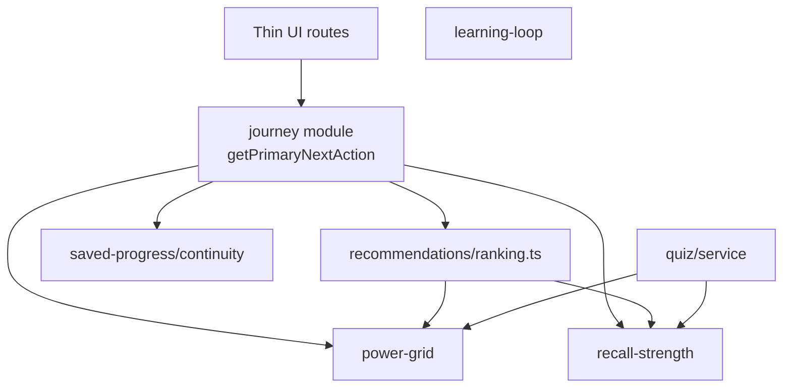

# Codex Full Implementation Pack — Connected Learning Architecture

> **Send this entire file to Codex.** It is self-contained: principles, architecture, phases, file paths, and **copy-paste-ready code**.
>
> **Repo:** `https://github.com/tech-fresh/the-switch-platform`  
> **Folder:** `/Users/lloydnwagbara/Documents/THE SWITCH 3`  
> **Live:** `https://theswitchplatform.com` (Fly.io only)  
> **Created:** 2026-07-06

---

## 0. Codex session prompt (paste at start of every session)

```text
Read HANDOFF.md first.
Execute ONE phase from docs/design/09_SENECA_ARCHITECTURE_COMPARISON/CODEX-FULL-IMPLEMENTATION-PACK.md.
Read PLATFORM-GUIDE.md → Architecture + Module reference.
Extend existing modules — do not greenfield-replace Fly/OIDC/SQLite/onboarding.
Do not rebalance XP in src/modules/power-grid/service.ts unless operator approves.
After the phase: npm run lint && npm run type-check && npm run test.
Update HANDOFF.md + AGENTS.md + README Ordered Build Record.
```

### Execution order

```text
Phase 0 → 1 → 2 → 3 → 5 → 4 → 6 → 7 → 8 → 9
```

### Non-negotiable guardrails

| Rule | Detail |
|------|--------|
| Architecture gate | `Route → thin page → module service → API → persistence` |
| XP / ranks | Backend: `src/modules/power-grid/service.ts`. Presentation: `src/lib/power-grid/rank-presentation.ts` |
| Onboarding | 8 steps unchanged |
| Deploy | Fly.io only — `docs/DEPLOYMENT-FLY-ONLY.md` |
| One phase per session | Complete + verify before next phase |

### Operator decision (blocks Phase 5)

**Recall Strength naming:** default `Recall Strength`. Alternatives in `07_RECOMMENDATION_ADDENDUM.md`: Switch Strength, Recharge Time, etc. Lock before Phase 5.

---

## 1. Eight architecture principles (what you are building)

| # | Principle | Target |
|---|-----------|--------|
| 8 | Modular architecture | Business logic in `src/modules/*` only — never in page components |
| 1 | Connected Website | Every signed-in route ends with **one primary CTA** |
| 7 | Saved Progress glue | Continuity graph is source of truth for resume/review |
| 6 | Recommendations brain | Weighted ranking engine — pages consume ranked output only |
| 2 | Recall Strength | Spaced-repetition signal per topic (new module) |
| 3 | Power Grid engine | All activity types emit `ProgressionEvent` → existing XP rules |
| 4 | Learning Loop | Topic flow: Learn → Question → Feedback → Progress → Next |
| 5 | Dashboard simplification | Above fold: Continue · Weak Topic · Next Exam · Power Grid only |

### Standard next-action vocabulary

| ID | Label | Typical source |
|----|-------|----------------|
| `continue-learning` | Continue Learning | Dashboard · Saved Progress |
| `resume-saved-work` | Resume Saved Work | Saved Progress |
| `practise-weak-topic` | Practise Weak Topic | Power Grid · Recall Strength |
| `start-timed-assessment` | Start Timed Assessment | Timed Assessment |
| `start-exam-paper` | Start Exam Paper | Exam Engine |
| `review-mistakes` | Review Mistakes | Results |
| `improve-power-grid` | Improve Power Grid | Power Grid · `/progress` |
| `return-to-dashboard` | Return to Dashboard | Fallback |

### Journey precedence rules (v1)

1. Active saved exam/assessment session → Resume Saved Work  
2. Review-ready results → Review Mistakes  
3. Recall Strength due topic → Practise Weak Topic  
4. Power Grid `nextBestAction`  
5. Top ranked recommendation  
6. Continue Learning / Return to Dashboard fallback  

---

## 2. Target architecture



### New modules

- `src/modules/journey/`
- `src/modules/recall-strength/`
- `src/modules/learning-loop/`

### New API routes

| Route | Method |
|-------|--------|
| `/api/journey/next-action` | GET |
| `/api/recommendations/ranked` | GET |
| `/api/recall-strength/snapshot` | GET |
| `/api/recall-strength/review` | POST |
| `/api/learning-loop/[topicId]` | GET, POST |

### New persistence stores

- `src/lib/persistence/progression-event-store.ts`
- `src/lib/persistence/recall-strength-store.ts`
- `src/lib/persistence/learning-loop-store.ts`

### Existing code to extend (do not replace)

| File | Role |
|------|------|
| `src/modules/power-grid/service.ts` | XP, readiness, `nextBestAction` |
| `src/modules/saved-progress/continuity-service.ts` | `getLearnerContinuityOverview` — extend into graph |
| `src/modules/recommendations/service.ts` | Card list — add `ranking.ts` |
| `src/modules/quiz/service.ts` | `submitQuizAnswer` — hook recall + progression events |
| `src/lib/api/server.ts` | Add `getJourneyNextActionApiData()` |
| `src/lib/server/api.ts` | `withAuthenticatedSwitchRequestContext` pattern |

### API route pattern (existing — match this)

```typescript
// src/app/api/recommendations/route.ts (existing)
import { withAuthenticatedSwitchRequestContext } from "@/lib/server/api";
import { getStudentRecommendations } from "@/modules/recommendations/service";

export async function GET() {
  return withAuthenticatedSwitchRequestContext(async (context) => ({
    recommendations: await getStudentRecommendations(context.userId),
  }));
}
```

### Persistence store pattern (existing — match this)

```typescript
// src/lib/persistence/quiz-progress-store.ts (existing pattern)
import type { QuizProgressRecord } from "@/modules/quiz/types";
import { createJsonFileCollectionStore } from "./json-file-store";
import { createMemoryCollectionStore } from "./memory-store";
import { getPersistenceRuntimeConfig } from "./runtime";
import { createSqliteCollectionStore } from "./sqlite-store";

const runtimeConfig = getPersistenceRuntimeConfig();
const store =
  runtimeConfig.driver === "memory"
    ? createMemoryCollectionStore<QuizProgressRecord>("quiz-progress.records")
    : runtimeConfig.driver === "sqlite"
      ? createSqliteCollectionStore<QuizProgressRecord>({
          collectionKey: "quiz-progress.records",
          databasePath: runtimeConfig.primaryStorePath,
          backupDatabasePath: runtimeConfig.backupStorePath,
        })
      : createJsonFileCollectionStore<QuizProgressRecord>({
          filename: "quiz-progress.json",
          collectionKey: "records",
          directory: runtimeConfig.dataDirectory,
          backupDirectory: runtimeConfig.backupDirectory,
        });

export async function readQuizProgressRecords(): Promise<QuizProgressRecord[]> {
  return store.read();
}

export async function writeQuizProgressRecords(records: QuizProgressRecord[]): Promise<void> {
  return store.write(records);
}
```

### Test pattern (existing — match this)

```javascript
// tests/power-grid-rank-presentation.test.mjs (existing pattern)
import test from "node:test";
import assert from "node:assert/strict";
import { getJourneyVocabulary } from "../src/modules/journey/vocabulary.ts";

test("journey vocabulary IDs are unique", () => {
  const vocabulary = getJourneyVocabulary();
  const ids = vocabulary.map((entry) => entry.id);
  assert.equal(new Set(ids).size, ids.length);
});
```

---

## 3. Phase 0 — Shared contracts

**Goal:** Types compile. No route changes.

### 3.1 `src/modules/journey/types.ts`

```typescript
export type JourneySourceModule =
  | "saved-progress"
  | "recommendations"
  | "power-grid"
  | "exam-engine"
  | "recall-strength"
  | "results"
  | "dashboard";

export type JourneyActionId =
  | "continue-learning"
  | "resume-saved-work"
  | "practise-weak-topic"
  | "start-timed-assessment"
  | "start-exam-paper"
  | "review-mistakes"
  | "improve-power-grid"
  | "return-to-dashboard";

export interface PrimaryNextAction {
  id: string;
  actionId: JourneyActionId;
  label: string;
  href: string;
  reason: string;
  sourceModule: JourneySourceModule;
  priority: number;
}

export interface SecondaryNextAction {
  id: string;
  actionId: JourneyActionId;
  label: string;
  href: string;
  reason: string;
  sourceModule: JourneySourceModule;
  priority: number;
}

export interface JourneyContext {
  userId: string;
  generatedAt: string;
  primaryAction: PrimaryNextAction;
  secondaryActions: SecondaryNextAction[];
}
```

### 3.2 `src/modules/journey/contracts.ts`

```typescript
import type { JourneyContext } from "./types";

export interface JourneyNextActionApiResponse {
  journey: JourneyContext;
}
```

### 3.3 `src/modules/journey/vocabulary.ts`

```typescript
import type { JourneyActionId } from "./types";

export interface JourneyVocabularyEntry {
  id: JourneyActionId;
  label: string;
  description: string;
}

export function getJourneyVocabulary(): JourneyVocabularyEntry[] {
  return [
    { id: "continue-learning", label: "Continue Learning", description: "Pick up the next topic in your study path." },
    { id: "resume-saved-work", label: "Resume Saved Work", description: "Return to an in-progress exam or assessment." },
    { id: "practise-weak-topic", label: "Practise Weak Topic", description: "Strengthen a topic that needs more work." },
    { id: "start-timed-assessment", label: "Start Timed Assessment", description: "Open a timed practice session." },
    { id: "start-exam-paper", label: "Start Exam Paper", description: "Begin or continue a full exam paper." },
    { id: "review-mistakes", label: "Review Mistakes", description: "Review submitted work and learn from errors." },
    { id: "improve-power-grid", label: "Improve Power Grid", description: "Build readiness and XP on the progress route." },
    { id: "return-to-dashboard", label: "Return to Dashboard", description: "Go back to your study home." },
  ];
}

export function getJourneyVocabularyLabel(actionId: JourneyActionId): string {
  const entry = getJourneyVocabulary().find((item) => item.id === actionId);
  if (!entry) {
    throw new Error(`Unknown journey action id: ${actionId}`);
  }
  return entry.label;
}
```

### 3.4 `src/modules/recall-strength/types.ts`

```typescript
export interface RecallStrengthTopicRecord {
  userId: string;
  topicId: string;
  subjectId: string;
  strength: number; // 0–100
  lastReviewedAt: string | null;
  nextReviewAt: string | null;
  reviewCount: number;
  updatedAt: string;
}

export interface RecallStrengthSnapshot {
  userId: string;
  generatedAt: string;
  dueCount: number;
  topics: RecallStrengthTopicRecord[];
  weakestTopic?: RecallStrengthTopicRecord;
  nextDueTopic?: RecallStrengthTopicRecord;
}

export type RecallReviewOutcome = "correct" | "partial" | "incorrect";
```

### 3.5 `src/modules/recall-strength/contracts.ts`

```typescript
import type { RecallReviewOutcome, RecallStrengthSnapshot } from "./types";

export interface RecallStrengthSnapshotApiResponse {
  snapshot: RecallStrengthSnapshot;
}

export interface RecallStrengthReviewRequest {
  topicId: string;
  subjectId: string;
  outcome: RecallReviewOutcome;
}

export interface RecallStrengthReviewApiResponse {
  snapshot: RecallStrengthSnapshot;
}
```

### 3.6 `src/modules/learning-loop/types.ts`

```typescript
export type LearningLoopStage =
  | "learn"
  | "question"
  | "feedback"
  | "progress"
  | "next"
  | "complete";

export interface LearningLoopSession {
  userId: string;
  topicId: string;
  subjectId: string;
  stage: LearningLoopStage;
  updatedAt: string;
}
```

### 3.7 Test: `tests/journey-vocabulary.test.mjs`

```javascript
import test from "node:test";
import assert from "node:assert/strict";
import { getJourneyVocabulary } from "../src/modules/journey/vocabulary.ts";

test("journey vocabulary entries are unique and non-empty", () => {
  const vocabulary = getJourneyVocabulary();
  const ids = vocabulary.map((entry) => entry.id);
  assert.equal(new Set(ids).size, ids.length);
  assert.ok(vocabulary.every((entry) => entry.label.trim().length > 0));
  assert.equal(vocabulary.length, 8);
});
```

### Phase 0 done when

- [ ] All type files compile
- [ ] `tests/journey-vocabulary.test.mjs` passes
- [ ] No route or UI changes

---

## 4. Phase 1 — Journey orchestrator

**Goal:** One module owns “what next?” — `/api/journey/next-action` live.

### 4.1 `src/modules/journey/ranking.ts`

```typescript
import type { PrimaryNextAction, SecondaryNextAction } from "./types";
import { getJourneyVocabularyLabel } from "./vocabulary";

export interface JourneyRankingInput {
  activeSessionHref?: string;
  activeSessionTitle?: string;
  reviewSessionHref?: string;
  reviewSessionTitle?: string;
  hasReviewReadyResults: boolean;
  resultsHref?: string;
  recallDueHref?: string;
  recallDueTopicLabel?: string;
  powerGridNextAction?: string;
  powerGridNextActionHref?: string;
  topRecommendationHref?: string;
  topRecommendationLabel?: string;
  topRecommendationReason?: string;
}

export function rankPrimaryNextAction(input: JourneyRankingInput): {
  primary: PrimaryNextAction;
  secondary: SecondaryNextAction[];
} {
  const secondary: SecondaryNextAction[] = [];

  if (input.activeSessionHref) {
    return {
      primary: {
        id: "primary-resume-saved-work",
        actionId: "resume-saved-work",
        label: getJourneyVocabularyLabel("resume-saved-work"),
        href: input.activeSessionHref,
        reason: input.activeSessionTitle
          ? `You have an in-progress session: ${input.activeSessionTitle}.`
          : "You have saved work ready to resume.",
        sourceModule: "saved-progress",
        priority: 100,
      },
      secondary,
    };
  }

  if (input.hasReviewReadyResults && input.resultsHref) {
    return {
      primary: {
        id: "primary-review-mistakes",
        actionId: "review-mistakes",
        label: getJourneyVocabularyLabel("review-mistakes"),
        href: input.resultsHref,
        reason: "Submitted work is ready for review.",
        sourceModule: "results",
        priority: 90,
      },
      secondary,
    };
  }

  if (input.recallDueHref) {
    return {
      primary: {
        id: "primary-practise-weak-topic",
        actionId: "practise-weak-topic",
        label: getJourneyVocabularyLabel("practise-weak-topic"),
        href: input.recallDueHref,
        reason: input.recallDueTopicLabel
          ? `${input.recallDueTopicLabel} is due for review.`
          : "A topic is due for review.",
        sourceModule: "recall-strength",
        priority: 85,
      },
      secondary,
    };
  }

  if (input.powerGridNextActionHref && input.powerGridNextAction) {
    return {
      primary: {
        id: "primary-power-grid",
        actionId: "improve-power-grid",
        label: input.powerGridNextAction,
        href: input.powerGridNextActionHref,
        reason: "Power Grid suggests your next best study move.",
        sourceModule: "power-grid",
        priority: 30,
      },
      secondary,
    };
  }

  if (input.topRecommendationHref && input.topRecommendationLabel) {
    return {
      primary: {
        id: "primary-recommendation",
        actionId: "continue-learning",
        label: input.topRecommendationLabel,
        href: input.topRecommendationHref,
        reason: input.topRecommendationReason ?? "Your top recommendation is ready.",
        sourceModule: "recommendations",
        priority: 20,
      },
      secondary,
    };
  }

  return {
    primary: {
      id: "primary-continue-learning",
      actionId: "continue-learning",
      label: getJourneyVocabularyLabel("continue-learning"),
      href: "/subjects",
      reason: "Start or continue learning from your subjects.",
      sourceModule: "dashboard",
      priority: 10,
    },
    secondary: [
      {
        id: "secondary-dashboard",
        actionId: "return-to-dashboard",
        label: getJourneyVocabularyLabel("return-to-dashboard"),
        href: "/dashboard",
        reason: "Return to your study home.",
        sourceModule: "dashboard",
        priority: 5,
      },
    ],
  };
}
```

### 4.2 `src/modules/journey/service.ts`

```typescript
import { getMockPowerGridSummary } from "@/modules/power-grid/service";
import { getResultsOverview } from "@/modules/results/service";
import { getSavedProgressOverview } from "@/modules/saved-progress/overview-service";
import { getStudentRecommendations } from "@/modules/recommendations/service";

import type { JourneyContext } from "./types";
import { rankPrimaryNextAction } from "./ranking";

export async function getJourneyContext(userId: string): Promise<JourneyContext> {
  const [savedProgress, results, powerGrid, recommendations] = await Promise.all([
    getSavedProgressOverview({ userId }),
    getResultsOverview(userId),
    getMockPowerGridSummary({ userId }),
    getStudentRecommendations(userId),
  ]);

  const topRecommendation = recommendations[0];
  const { primary, secondary } = rankPrimaryNextAction({
    activeSessionHref: savedProgress.continuity.activeSession?.href,
    activeSessionTitle: savedProgress.continuity.activeSession?.title,
    reviewSessionHref: savedProgress.continuity.reviewSession?.href,
    reviewSessionTitle: savedProgress.continuity.reviewSession?.title,
    hasReviewReadyResults: results.readyForReviewCount > 0,
    resultsHref: "/results",
    powerGridNextAction: powerGrid.nextBestAction,
    powerGridNextActionHref: powerGrid.nextBestActionHref,
    topRecommendationHref: topRecommendation?.href,
    topRecommendationLabel: topRecommendation?.title,
    topRecommendationReason: topRecommendation?.description,
  });

  return {
    userId,
    generatedAt: new Date().toISOString(),
    primaryAction: primary,
    secondaryActions: secondary,
  };
}

export async function getPrimaryNextAction(userId: string) {
  const context = await getJourneyContext(userId);
  return context.primaryAction;
}
```

### 4.3 `src/app/api/journey/next-action/route.ts`

```typescript
import { withAuthenticatedSwitchRequestContext } from "@/lib/server/api";
import { getJourneyContext } from "@/modules/journey/service";

export async function GET() {
  return withAuthenticatedSwitchRequestContext(async (context) => ({
    journey: await getJourneyContext(context.userId),
  }));
}
```

### 4.4 Add to `src/lib/api/server.ts`

```typescript
import type { JourneyContext } from "@/modules/journey/types";

export async function getJourneyNextActionApiData(): Promise<JourneyContext> {
  const response = await fetchApiJson<{ journey: JourneyContext }>("/api/journey/next-action");
  return response.journey;
}
```

### 4.5 Wire dashboard — `src/modules/dashboard/service.ts`

Delegate primary CTA to journey (add import + use `getPrimaryNextAction` for `continueLearning` field when dashboard types are extended in Phase 7).

### 4.6 Test: `tests/journey-next-action.test.mjs`

```javascript
import test from "node:test";
import assert from "node:assert/strict";
import { rankPrimaryNextAction } from "../src/modules/journey/ranking.ts";

test("active saved session wins precedence", () => {
  const result = rankPrimaryNextAction({
    activeSessionHref: "/exams?examId=maths-1",
    activeSessionTitle: "GCSE Maths Paper 1",
    hasReviewReadyResults: true,
    resultsHref: "/results",
    powerGridNextActionHref: "/progress",
    powerGridNextAction: "Improve Power Grid",
  });
  assert.equal(result.primary.actionId, "resume-saved-work");
  assert.equal(result.primary.href, "/exams?examId=maths-1");
});

test("review-ready results beat power grid", () => {
  const result = rankPrimaryNextAction({
    hasReviewReadyResults: true,
    resultsHref: "/results",
    powerGridNextActionHref: "/progress",
    powerGridNextAction: "Improve Power Grid",
  });
  assert.equal(result.primary.actionId, "review-mistakes");
});

test("fallback continues learning on subjects", () => {
  const result = rankPrimaryNextAction({ hasReviewReadyResults: false });
  assert.equal(result.primary.actionId, "continue-learning");
  assert.equal(result.primary.href, "/subjects");
});
```

### Phase 1 done when

- [ ] `GET /api/journey/next-action` returns `journey.primaryAction`
- [ ] Dashboard API uses journey for primary CTA
- [ ] Tests pass

---

## 5. Phase 2 — Saved Progress continuity graph

**Goal:** Formal `ContinuityGraph` type; journey reads it first.

### 5.1 Extend `src/modules/saved-progress/types.ts`

```typescript
import type { LearnerContinuityOverview } from "./continuity-service";

export interface ContinuityGraph {
  overview: LearnerContinuityOverview;
  lastTopicId?: string;
  lastSubjectId?: string;
  lastRoute?: string;
  generatedAt: string;
}
```

### 5.2 `src/modules/saved-progress/continuity-graph.ts` (new)

```typescript
import type { SavedProgressSessionSummary } from "./types";
import { getLearnerContinuityOverview } from "./continuity-service";
import type { ContinuityGraph } from "./types";

export function getContinuityGraph(sessions: SavedProgressSessionSummary[]): ContinuityGraph {
  const overview = getLearnerContinuityOverview(sessions);
  const latest = overview.latestSession;

  return {
    overview,
    lastTopicId: latest?.topicId,
    lastSubjectId: latest?.subjectId,
    lastRoute: latest?.href,
    generatedAt: new Date().toISOString(),
  };
}
```

### 5.3 Update `overview-service.ts`

```typescript
import { getContinuityGraph } from "./continuity-graph";

// Inside getSavedProgressOverview return object, add:
continuityGraph: getContinuityGraph(sessions),
```

### 5.4 UI (Cursor after API) — `src/components/journey/journey-next-step-panel.tsx`

```tsx
"use client";

import Link from "next/link";
import type { JourneyContext } from "@/modules/journey/types";

interface JourneyNextStepPanelProps {
  journey: JourneyContext;
}

export function JourneyNextStepPanel({ journey }: JourneyNextStepPanelProps) {
  const { primaryAction, secondaryActions } = journey;

  return (
    <section className="rounded-2xl border border-white/10 bg-white/5 p-4" aria-label="What to do next">
      <p className="text-sm text-white/70">What to do next</p>
      <Link href={primaryAction.href} className="mt-2 block text-lg font-semibold text-white">
        {primaryAction.label}
      </Link>
      <p className="mt-1 text-sm text-white/60">{primaryAction.reason}</p>
      {secondaryActions.length > 0 ? (
        <ul className="mt-3 flex flex-wrap gap-2">
          {secondaryActions.map((action) => (
            <li key={action.id}>
              <Link href={action.href} className="text-sm text-sky-300 underline-offset-2 hover:underline">
                {action.label}
              </Link>
            </li>
          ))}
        </ul>
      ) : null}
    </section>
  );
}
```

Wire on ≥3 routes: `/subjects`, `/exams`, `/saved-progress` — fetch via `getJourneyNextActionApiData()` in server components or client fetch.

### Phase 2 done when

- [ ] `continuityGraph` in saved-progress overview API
- [ ] Journey uses `continuityGraph.overview` inputs
- [ ] `JourneyNextStepPanel` on ≥3 routes

---

## 6. Phase 3 — Recommendations ranking brain

**Goal:** `getRankedRecommendations(userId)` with documented weights.

### 6.1 `src/modules/recommendations/ranking.ts`

```typescript
import type { Recommendation } from "./types";

export interface RankingSignal {
  id: string;
  weight: number;
  recommendation: Recommendation;
}

export const RECOMMENDATION_SIGNAL_WEIGHTS = {
  activeSavedSession: 100,
  reviewReadyResults: 90,
  recallStrengthDue: 85,
  weakestTopic: 80,
  nextExamInPlanner: 70,
  onboardingGap: 60,
  revisionStreak: 50,
  accessibilityFriendly: 40,
  powerGridNextBestAction: 30,
} as const;

export function sortRankingSignals(signals: RankingSignal[]): RankingSignal[] {
  return [...signals].sort((left, right) => right.weight - left.weight);
}

export function getTopRankedRecommendation(signals: RankingSignal[]): Recommendation | undefined {
  return sortRankingSignals(signals)[0]?.recommendation;
}
```

### 6.2 Extend `service.ts`

Add `buildRankingSignals(userId)` that collects signals from saved-progress, results, power-grid, weekly-planner, onboarding, accessibility — then:

```typescript
export async function getRankedRecommendations(userId: string): Promise<Recommendation[]> {
  const signals = await buildRankingSignals(userId);
  return sortRankingSignals(signals).map((signal) => signal.recommendation);
}
```

### 6.3 `src/app/api/recommendations/ranked/route.ts`

```typescript
import { withAuthenticatedSwitchRequestContext } from "@/lib/server/api";
import { getRankedRecommendations } from "@/modules/recommendations/service";

export async function GET() {
  return withAuthenticatedSwitchRequestContext(async (context) => {
    const recommendations = await getRankedRecommendations(context.userId);
    return {
      recommendations,
      topPick: recommendations[0] ?? null,
    };
  });
}
```

Update existing `/api/recommendations/route.ts` to delegate to `getRankedRecommendations`.

### 6.4 Update `journey/service.ts`

Use `getRankedRecommendations(userId)[0]` instead of `getStudentRecommendations(userId)[0]`.

### 6.5 Test: `tests/recommendations-ranking.test.mjs`

```javascript
import test from "node:test";
import assert from "node:assert/strict";
import { sortRankingSignals } from "../src/modules/recommendations/ranking.ts";

test("higher weight signals sort first", () => {
  const sorted = sortRankingSignals([
    { id: "a", weight: 30, recommendation: { id: "a", title: "Low", href: "/a" } },
    { id: "b", weight: 100, recommendation: { id: "b", title: "High", href: "/b" } },
  ]);
  assert.equal(sorted[0].id, "b");
});
```

### Phase 3 done when

- [ ] `/api/recommendations/ranked` live
- [ ] Journey uses ranked top pick
- [ ] ≥6 signal types in `buildRankingSignals`

---

## 7. Phase 5 — Recall Strength module

**Operator must lock naming before starting.**

### 7.1 `src/modules/recall-strength/decay.ts`

```typescript
import type { RecallReviewOutcome } from "./types";

export function computeNextStrength(currentStrength: number, outcome: RecallReviewOutcome): number {
  const delta = outcome === "correct" ? 12 : outcome === "partial" ? 6 : -10;
  return Math.max(0, Math.min(100, currentStrength + delta));
}

export function computeNextReviewAt(strength: number, reviewedAt: string): string {
  const days = strength >= 80 ? 7 : strength >= 50 ? 3 : 1;
  const next = new Date(reviewedAt);
  next.setDate(next.getDate() + days);
  return next.toISOString();
}

export function isTopicDue(nextReviewAt: string | null, now = new Date()): boolean {
  if (!nextReviewAt) return true;
  return new Date(nextReviewAt).getTime() <= now.getTime();
}
```

### 7.2 `src/lib/persistence/recall-strength-store.ts`

```typescript
import type { RecallStrengthTopicRecord } from "@/modules/recall-strength/types";
import { createJsonFileCollectionStore } from "./json-file-store";
import { createMemoryCollectionStore } from "./memory-store";
import { getPersistenceRuntimeConfig } from "./runtime";
import { createSqliteCollectionStore } from "./sqlite-store";

const runtimeConfig = getPersistenceRuntimeConfig();
const store =
  runtimeConfig.driver === "memory"
    ? createMemoryCollectionStore<RecallStrengthTopicRecord>("recall-strength.records")
    : runtimeConfig.driver === "sqlite"
      ? createSqliteCollectionStore<RecallStrengthTopicRecord>({
          collectionKey: "recall-strength.records",
          databasePath: runtimeConfig.primaryStorePath,
          backupDatabasePath: runtimeConfig.backupStorePath,
        })
      : createJsonFileCollectionStore<RecallStrengthTopicRecord>({
          filename: "recall-strength.json",
          collectionKey: "records",
          directory: runtimeConfig.dataDirectory,
          backupDirectory: runtimeConfig.backupDirectory,
        });

export async function readRecallStrengthRecords(): Promise<RecallStrengthTopicRecord[]> {
  return store.read();
}

export async function writeRecallStrengthRecords(records: RecallStrengthTopicRecord[]): Promise<void> {
  return store.write(records);
}
```

### 7.3 `src/modules/recall-strength/service.ts`

```typescript
import { readRecallStrengthRecords, writeRecallStrengthRecords } from "@/lib/persistence/recall-strength-store";
import type { RecallReviewOutcome, RecallStrengthSnapshot, RecallStrengthTopicRecord } from "./types";
import { computeNextReviewAt, computeNextStrength, isTopicDue } from "./decay";

export async function getRecallStrengthSnapshot(userId: string): Promise<RecallStrengthSnapshot> {
  const topics = (await readRecallStrengthRecords()).filter((record) => record.userId === userId);
  const dueTopics = topics.filter((topic) => isTopicDue(topic.nextReviewAt));
  const weakestTopic = [...topics].sort((a, b) => a.strength - b.strength)[0];
  const nextDueTopic = dueTopics[0];

  return {
    userId,
    generatedAt: new Date().toISOString(),
    dueCount: dueTopics.length,
    topics,
    weakestTopic,
    nextDueTopic,
  };
}

export async function recordReview(
  userId: string,
  input: { topicId: string; subjectId: string; outcome: RecallReviewOutcome },
): Promise<RecallStrengthSnapshot> {
  const records = await readRecallStrengthRecords();
  const now = new Date().toISOString();
  const existing = records.find(
    (record) => record.userId === userId && record.topicId === input.topicId,
  );
  const strength = computeNextStrength(existing?.strength ?? 40, input.outcome);
  const updated: RecallStrengthTopicRecord = {
    userId,
    topicId: input.topicId,
    subjectId: input.subjectId,
    strength,
    lastReviewedAt: now,
    nextReviewAt: computeNextReviewAt(strength, now),
    reviewCount: (existing?.reviewCount ?? 0) + 1,
    updatedAt: now,
  };
  const nextRecords = [
    ...records.filter((record) => !(record.userId === userId && record.topicId === input.topicId)),
    updated,
  ];
  await writeRecallStrengthRecords(nextRecords);
  return getRecallStrengthSnapshot(userId);
}
```

### 7.4 API routes

```typescript
// src/app/api/recall-strength/snapshot/route.ts
import { withAuthenticatedSwitchRequestContext } from "@/lib/server/api";
import { getRecallStrengthSnapshot } from "@/modules/recall-strength/service";

export async function GET() {
  return withAuthenticatedSwitchRequestContext(async (context) => ({
    snapshot: await getRecallStrengthSnapshot(context.userId),
  }));
}
```

```typescript
// src/app/api/recall-strength/review/route.ts
import { withAuthenticatedSwitchRequestContext, withSwitchRouteErrorBoundary } from "@/lib/server/api";
import { recordReview } from "@/modules/recall-strength/service";
import type { RecallStrengthReviewRequest } from "@/modules/recall-strength/contracts";

export async function POST(request: Request) {
  return withSwitchRouteErrorBoundary({
    run: async () =>
      withAuthenticatedSwitchRequestContext(async (context) => {
        const body = (await request.json()) as RecallStrengthReviewRequest;
        return {
          snapshot: await recordReview(context.userId, body),
        };
      }),
    badRequestMessage: "Invalid recall strength review payload.",
  });
}
```

### 7.5 Hook quiz — `src/modules/quiz/service.ts`

After successful `submitQuizAnswer` save:

```typescript
import { recordReview } from "@/modules/recall-strength/service";

// Map quiz correctness to outcome, then:
await recordReview(userId, {
  topicId,
  subjectId,
  outcome: result.isCorrect ? "correct" : "incorrect",
});
```

### 7.6 Wire journey — add to `rankPrimaryNextAction` input in `journey/service.ts`

```typescript
recallDueHref: snapshot.nextDueTopic
  ? `/subjects?subjectId=${snapshot.nextDueTopic.subjectId}&topicId=${snapshot.nextDueTopic.topicId}`
  : undefined,
recallDueTopicLabel: snapshot.nextDueTopic?.topicId,
```

### Phase 5 done when

- [ ] Store + service + APIs complete
- [ ] Quiz updates recall strength
- [ ] Recommendations ranking includes recall due signal
- [ ] Journey precedence rule 3 active

---

## 8. Phase 4 — Power Grid progression events

**Goal:** Append-only event log; existing XP formulas unchanged.

### 8.1 `src/modules/power-grid/progression-events.ts`

```typescript
export type ProgressionEventType =
  | "quiz.completed"
  | "assessment.progress"
  | "assessment.submitted"
  | "exam.progress"
  | "exam.submitted"
  | "topic.viewed"
  | "recommendation.completed"
  | "recall-strength.reviewed";

export interface ProgressionEvent {
  id: string;
  userId: string;
  type: ProgressionEventType;
  subjectId?: string;
  topicId?: string;
  xpDelta?: number;
  occurredAt: string;
}

export function createProgressionEvent(
  input: Omit<ProgressionEvent, "id" | "occurredAt"> & { occurredAt?: string },
): ProgressionEvent {
  return {
    id: `${input.userId}:${input.type}:${input.topicId ?? "global"}:${Date.now()}`,
    occurredAt: input.occurredAt ?? new Date().toISOString(),
    ...input,
  };
}
```

### 8.2 `src/lib/persistence/progression-event-store.ts`

Same store pattern as recall-strength — collection key `progression-events.records`.

```typescript
export async function appendProgressionEvent(event: ProgressionEvent): Promise<void> {
  const records = await readProgressionEvents();
  await writeProgressionEvents([...records, event]);
}
```

### 8.3 Emit from services

| Module | When |
|--------|------|
| `quiz/service.ts` | After `submitQuizAnswer` persists |
| `exam-engine/service.ts` | On progress save + submit |
| `timed-assessment/service.ts` | On progress save + submit |
| `recall-strength/service.ts` | After `recordReview` |

```typescript
import { appendProgressionEvent } from "@/lib/persistence/progression-event-store";
import { createProgressionEvent } from "@/modules/power-grid/progression-events";

await appendProgressionEvent(
  createProgressionEvent({
    userId,
    type: "quiz.completed",
    subjectId,
    topicId,
  }),
);
```

**Do not change XP formulas** — events are audit trail + future analytics. Existing quiz → Power Grid XP path must still pass `power-grid-quiz-progress.test.mjs`.

### Phase 4 done when

- [ ] Quiz, exam, assessment emit events
- [ ] Existing Power Grid XP tests still pass

---

## 9. Phase 6 — Learning loop

**Goal:** Per-topic stage machine on subjects.

### 9.1 `src/lib/persistence/learning-loop-store.ts`

Store `LearningLoopSession` records — same pattern as recall-strength store.

### 9.2 `src/modules/learning-loop/service.ts`

```typescript
import { readLearningLoopSessions, writeLearningLoopSessions } from "@/lib/persistence/learning-loop-store";
import type { LearningLoopSession, LearningLoopStage } from "./types";

const STAGE_ORDER: LearningLoopStage[] = ["learn", "question", "feedback", "progress", "next", "complete"];

export async function getLearningLoopSession(
  userId: string,
  topicId: string,
): Promise<LearningLoopSession> {
  const existing = (await readLearningLoopSessions()).find(
    (session) => session.userId === userId && session.topicId === topicId,
  );
  if (existing) return existing;
  return {
    userId,
    topicId,
    subjectId: "",
    stage: "learn",
    updatedAt: new Date().toISOString(),
  };
}

export async function advanceLearningLoopStage(
  userId: string,
  topicId: string,
  subjectId: string,
): Promise<LearningLoopSession> {
  const current = await getLearningLoopSession(userId, topicId);
  const index = STAGE_ORDER.indexOf(current.stage);
  const nextStage = STAGE_ORDER[Math.min(index + 1, STAGE_ORDER.length - 1)];
  const updated: LearningLoopSession = {
    ...current,
    subjectId,
    stage: nextStage,
    updatedAt: new Date().toISOString(),
  };
  const records = (await readLearningLoopSessions()).filter(
    (session) => !(session.userId === userId && session.topicId === topicId),
  );
  await writeLearningLoopSessions([...records, updated]);
  return updated;
}
```

### 9.3 `src/app/api/learning-loop/[topicId]/route.ts`

```typescript
import { withAuthenticatedSwitchRequestContext } from "@/lib/server/api";
import { advanceLearningLoopStage, getLearningLoopSession } from "@/modules/learning-loop/service";

export async function GET(
  _request: Request,
  context: { params: Promise<{ topicId: string }> },
) {
  const { topicId } = await context.params;
  return withAuthenticatedSwitchRequestContext(async (authContext) => ({
    session: await getLearningLoopSession(authContext.userId, topicId),
  }));
}

export async function POST(
  request: Request,
  context: { params: Promise<{ topicId: string }> },
) {
  const { topicId } = await context.params;
  const body = (await request.json()) as { subjectId: string };
  return withAuthenticatedSwitchRequestContext(async (authContext) => ({
    session: await advanceLearningLoopStage(authContext.userId, topicId, body.subjectId),
  }));
}
```

### 9.4 UI (Cursor)

Update `src/app/subjects/subject-experience.tsx`:

- Step rail: Learn · Worked Example · Practice · Exam Questions
- On quiz submit success → `POST /api/learning-loop/[topicId]` + fetch journey next-action

### Phase 6 done when

- [ ] GCSE Maths (or one subject) demonstrates full loop
- [ ] Stage persists on reload

---

## 10. Phase 7 — Dashboard simplification

**Goal:** Four primary signals above fold only.

### 10.1 Extend `src/modules/dashboard/types.ts`

```typescript
import type { PrimaryNextAction } from "@/modules/journey/types";
import type { PowerGridSummary } from "@/modules/power-grid/types";
import type { PowerGridRankPresentation } from "@/lib/power-grid/rank-presentation";

export interface WeakTopicSignal {
  topicId: string;
  subjectId: string;
  label: string;
  href: string;
  strength?: number;
}

export interface ExamTaskSignal {
  title: string;
  href: string;
  dueLabel?: string;
}

export interface DashboardPrimarySignals {
  continueLearning: PrimaryNextAction;
  weakTopic: WeakTopicSignal;
  nextExamTask: ExamTaskSignal;
  powerGrid: Pick<PowerGridSummary, "xpTotal" | "examReadinessScore"> & PowerGridRankPresentation;
}
```

### 10.2 `dashboard/service.ts`

Build `primarySignals` from journey + recall-strength + exam-inventory + power-grid rank presentation.

### 10.3 UI (Cursor)

| File | Action |
|------|--------|
| `dashboard-home.tsx` | Remove duplicate continue panels |
| `mark32-hero-row.tsx` | Map 1:1 to four signals |
| Below-fold | Collapse planner/SEND/routes into “More” accordion |

### Phase 7 done when

- [ ] Hero row = only dominant decision surface above fold
- [ ] `tests/dashboard-primary-signals.test.mjs` passes

---

## 11. Phase 8 — Connected routes

**Goal:** `JourneyNextStepPanel` on every signed-in route.

| Route | Primary CTA owner |
|-------|-------------------|
| `/dashboard` | journey |
| `/subjects` | journey |
| `/subjects?topic=…` | learning-loop + journey |
| `/exams` | journey |
| `/assessments` | journey |
| `/progress` | journey |
| `/results` | journey |
| `/saved-progress` | journey |
| `/recommendations` | journey |
| `/accessibility` | journey |
| `/account` | static “Return to dashboard” |

Extend `tests/mvp-route-clickability.test.mjs` — each route response includes navigable `primaryNextAction.href`.

### Phase 8 done when

- [ ] All routes in table have journey panel
- [ ] Clickability tests pass

---

## 12. Phase 9 — Verification and deploy

### 12.1 Commands (run in order)

```bash
npm run lint
npm run type-check
npm run test
npm run build
npm run test:smoke
npm run test:e2e
npm run verify:local-launch-readiness
npm run deploy:fly
curl -I https://theswitchplatform.com
```

### 12.2 Optional script: `scripts/verify-connected-journey.mjs`

```javascript
#!/usr/bin/env node
import assert from "node:assert/strict";

const baseUrl = process.env.SWITCH_LIVE_BASE_URL ?? "http://localhost:3000";
const response = await fetch(`${baseUrl}/api/journey/next-action`, {
  headers: {
    cookie: process.env.SWITCH_LIVE_STUDENT_COOKIE ?? "",
  },
});

assert.equal(response.status, 200);
const payload = await response.json();
assert.ok(payload.journey?.primaryAction?.href);
console.log("Connected journey verification passed:", payload.journey.primaryAction.label);
```

### 12.3 Documentation updates (every phase)

| File | Update |
|------|--------|
| `HANDOFF.md` | Live session state + phase completion |
| `AGENTS.md` | Operator sync |
| `README.md` | Ordered Build Record |
| `ARCHITECTURE-PRINCIPLES.md` | Mark principles implemented |
| `11_UI_UX_MASTER_GUIDE.md` | Implementation status table |

### 12.4 Definition of done (all eight principles)

| # | Principle | Done criteria |
|---|-----------|---------------|
| 1 | Connected Website | Journey panel on all signed-in routes |
| 2 | Recall Strength | Module + API + quiz + ranking |
| 3 | Power Grid engine | Progression events from quiz, exams, assessments |
| 4 | Learning Loop | State machine + UI on ≥1 subject |
| 5 | Dashboard simplification | Four signals above fold |
| 6 | Recommendations brain | Ranked API with weights |
| 7 | Saved Progress glue | Continuity graph drives journey |
| 8 | Modular architecture | No business logic in pages |

---

## 13. Complete file inventory

### Create (new files)

```
src/modules/journey/types.ts
src/modules/journey/contracts.ts
src/modules/journey/vocabulary.ts
src/modules/journey/ranking.ts
src/modules/journey/service.ts
src/modules/journey/README.md
src/modules/recall-strength/types.ts
src/modules/recall-strength/contracts.ts
src/modules/recall-strength/decay.ts
src/modules/recall-strength/service.ts
src/modules/recall-strength/README.md
src/modules/learning-loop/types.ts
src/modules/learning-loop/service.ts
src/modules/learning-loop/README.md
src/modules/recommendations/ranking.ts
src/modules/power-grid/progression-events.ts
src/modules/saved-progress/continuity-graph.ts
src/lib/persistence/progression-event-store.ts
src/lib/persistence/recall-strength-store.ts
src/lib/persistence/learning-loop-store.ts
src/app/api/journey/next-action/route.ts
src/app/api/recommendations/ranked/route.ts
src/app/api/recall-strength/snapshot/route.ts
src/app/api/recall-strength/review/route.ts
src/app/api/learning-loop/[topicId]/route.ts
src/components/journey/journey-next-step-panel.tsx
tests/journey-vocabulary.test.mjs
tests/journey-next-action.test.mjs
tests/saved-progress-continuity-graph.test.mjs
tests/recommendations-ranking.test.mjs
tests/recall-strength.test.mjs
tests/power-grid-progression-events.test.mjs
tests/learning-loop.test.mjs
tests/dashboard-primary-signals.test.mjs
scripts/verify-connected-journey.mjs
```

### Modify (existing files)

```
src/modules/dashboard/service.ts
src/modules/dashboard/types.ts
src/modules/recommendations/service.ts
src/modules/saved-progress/types.ts
src/modules/saved-progress/overview-service.ts
src/modules/quiz/service.ts
src/modules/exam-engine/service.ts (progression hooks)
src/modules/timed-assessment/service.ts (progression hooks)
src/lib/api/server.ts
src/app/api/recommendations/route.ts
src/components/dashboard-home.tsx
src/app/subjects/subject-experience.tsx
tests/mvp-route-clickability.test.mjs
```

### Do not modify without operator approval

```
src/modules/power-grid/service.ts   (XP formulas)
src/modules/onboarding/*            (8-step flow)
Fly deploy config only              (no Vercel/Netlify)
```

---

## 14. Quick reference — what exists today vs what you add

| Capability | Today | After all phases |
|------------|-------|------------------|
| Next action | Scattered in dashboard, recommendations, power-grid | Single `journey` API |
| Continuity | `continuity-service.ts` partial | Formal `ContinuityGraph` |
| Recommendations | Card list, partial signals | Weighted `ranking.ts` |
| Memory / decay | None | `recall-strength` module |
| Activity audit | None | `progression-event-store` |
| Topic flow | Quiz only | Full learning loop stages |
| Dashboard | Hero + clutter below | Four signals only above fold |
| Route endings | Mixed | `JourneyNextStepPanel` everywhere |

---

## 15. Send-to-Codex checklist

Copy this block into Codex with the file:

```text
Implement Phase [N] from CODEX-FULL-IMPLEMENTATION-PACK.md.

Repository: tech-fresh/the-switch-platform
Branch: main (or feature branch if operator prefers)

Requirements:
- Use the exact code templates in the pack where provided
- Match existing API and persistence patterns
- Add tests listed for the phase
- Run: npm run lint && npm run type-check && npm run test
- Update HANDOFF.md, AGENTS.md, README build record

Do not:
- Rebalance XP in power-grid/service.ts
- Put business logic in page components
- Add Vercel/Netlify deploy paths
- Skip the architecture gate
```

---

*End of Codex Full Implementation Pack.*
