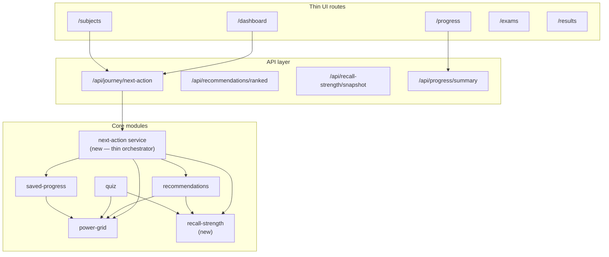

# Connected Learning Architecture — Technical Implementation Plan (Codex)

> **Status:** active execution plan for Codex  
> **Created:** 2026-07-06  
> **Authority:** implements [`ARCHITECTURE-PRINCIPLES.md`](./ARCHITECTURE-PRINCIPLES.md)  
> **Audience:** Codex (service logic, modules, APIs, tests) + Cursor (UI wiring)

Plain English: this is the **step-by-step build plan** to turn the eight architecture principles from documentation into working code. Work **one phase at a time**. Do not skip the architecture gate. Do not rebalance XP unless the operator explicitly approves.

---

## 0. Before you start (Codex session prompt)

```text
Read HANDOFF.md first.
Read docs/design/09_SENECA_ARCHITECTURE_COMPARISON/ARCHITECTURE-PRINCIPLES.md.
Read this file (IMPLEMENTATION-PLAN.md) — execute ONE phase only.
Read PLATFORM-GUIDE.md → Architecture + Module reference.
Extend existing modules — do not greenfield-replace Fly/OIDC/SQLite/onboarding.
After the phase: npm run lint && npm run type-check && npm run test; update HANDOFF.md + AGENTS.md + README build record.
```

### Non-negotiable guardrails

| Rule | Detail |
|------|--------|
| Architecture gate | `Route → thin page → module service → API → persistence` |
| XP / ranks | Keep `power-grid/service.ts` XP rules; presentation stays in `rank-presentation.ts` |
| Onboarding | 8 steps unchanged |
| Deploy | Fly.io only — `docs/DEPLOYMENT-FLY-ONLY.md` |
| One module focus | Complete one phase before starting the next |

### Current baseline (already shipped)

| Area | Live today |
|------|------------|
| Power Grid backend | `src/modules/power-grid/service.ts` — readiness, XP, voltage, `nextBestAction` |
| Power Grid presentation | `src/lib/power-grid/rank-presentation.ts` — six ranks from `xpTotal` |
| Saved Progress | Autosave, resume, overview — `saved-progress/` |
| Recommendations | Card list — `recommendations/service.ts` (partial brain) |
| Quiz loop | `/api/quiz/attempts/[topicId]` → Power Grid quiz integration |
| Dashboard hero | `Mark32HeroRow` — four signals (below-fold still cluttered) |

### Target end state

All eight principles **implemented in code** with shared contracts, one primary CTA per route, Recall Strength module, unified recommendation ranking, learning loop on subjects, simplified dashboard, and verification tests.

---

## 1. Architecture overview (target)



**Design decision:** add a thin **`journey`** (or **`next-action`**) orchestrator module that returns **one** primary CTA + secondary options — consumed by all routes. Recommendations remains the ranking brain; journey composes its output for UI.

---

## 2. Shared contracts (Phase 0 — do first)

### 2.1 Create types

**New files:**

| File | Purpose |
|------|---------|
| `src/modules/journey/types.ts` | `PrimaryNextAction`, `SecondaryNextAction`, `JourneyContext` |
| `src/modules/journey/contracts.ts` | API request/response shapes |
| `src/modules/recall-strength/types.ts` | `RecallStrengthSnapshot`, per-topic strength |
| `src/modules/recall-strength/contracts.ts` | API shapes |
| `src/modules/learning-loop/types.ts` | `LearningLoopStage`, `LearningLoopSession` |

**`PrimaryNextAction` shape (minimum):**

```typescript
interface PrimaryNextAction {
  id: string;
  label: string;           // e.g. "Continue Learning"
  href: string;
  reason: string;            // plain English for UI
  sourceModule: "saved-progress" | "recommendations" | "power-grid" | "exam-engine" | "recall-strength";
  priority: number;
}
```

### 2.2 Standard next-action vocabulary

Map labels in **`src/modules/journey/vocabulary.ts`** — single source for UI copy:

- `continue-learning`
- `resume-saved-work`
- `practise-weak-topic`
- `start-timed-assessment`
- `start-exam-paper`
- `review-mistakes`
- `improve-power-grid`
- `return-to-dashboard`

### 2.3 Tests (Phase 0)

| Test file | Asserts |
|-----------|---------|
| `tests/journey-vocabulary.test.mjs` | All vocabulary IDs unique; labels non-empty |

### Phase 0 done when

- [ ] Types compile
- [ ] No route changes yet
- [ ] Tests pass

---

## 3. Phase 1 — Principle 8 + Journey orchestrator (foundation)

**Goal:** one module owns “what next?” composition; pages stop duplicating logic.

### 3.1 New module: `src/modules/journey/`

| File | Responsibility |
|------|------------------|
| `service.ts` | `getPrimaryNextAction(userId)`, `getJourneyContext(userId)` |
| `ranking.ts` | Merge inputs from SP, PG, REC with fixed precedence rules |
| `README.md` | Link to architecture principles |

**Precedence rules (v1):**

1. Active saved exam/assessment session → Resume Saved Work  
2. Review-ready results → Review Mistakes  
3. Recall Strength due topic (Phase 5+) → Practise Weak Topic  
4. Power Grid `nextBestAction`  
5. Top recommendation card  
6. Return to Dashboard / Continue Learning fallback  

### 3.2 API

| Route | Method | Service |
|-------|--------|---------|
| `src/app/api/journey/next-action/route.ts` | GET | `getPrimaryNextAction` |

Wire into `src/lib/api/server.ts` as `getJourneyNextActionApiData()`.

### 3.3 Refactor (minimal first pass)

| Consumer | Change |
|----------|--------|
| `dashboard/service.ts` | Read primary action from journey service (delegate, do not duplicate ranking) |
| `power-grid/service.ts` | Keep computing `nextBestAction`; journey may override display priority |

### 3.4 Tests

`tests/journey-next-action.test.mjs` — scenarios: active session, results ready, weak topic, fallback.

### Phase 1 done when

- [ ] `/api/journey/next-action` returns one primary CTA
- [ ] Dashboard home API uses journey for primary CTA field
- [ ] No ranking logic added to page components
- [ ] lint + type-check + test green

---

## 4. Phase 2 — Principle 7 (Saved Progress glue)

**Goal:** single continuity contract consumed by journey, dashboard, Power Grid, recommendations.

### 4.1 Extend Saved Progress module

| File | Change |
|------|--------|
| `saved-progress/types.ts` | Add `ContinuityGraph` — active, review, lastTopic, lastRoute |
| `saved-progress/overview-service.ts` | Expose `getContinuityGraph(userId)` |
| `saved-progress/contracts.ts` | Export continuity graph in overview API |

### 4.2 API

Ensure `GET /api/saved-progress/overview` includes continuity graph fields journey expects.

### 4.3 UI (Cursor — after Codex API)

Every signed-in route footer component: **`JourneyNextStepPanel`** reading `/api/journey/next-action`.

| Route | Primary CTA source |
|-------|-------------------|
| `/subjects` | journey API |
| `/exams` lobby | journey API |
| `/assessments` | journey API |
| `/results` | journey API |
| `/saved-progress` | journey API |
| `/recommendations` | journey API |

### 4.4 Tests

`tests/saved-progress-continuity-graph.test.mjs`

### Phase 2 done when

- [ ] Continuity graph in API
- [ ] Journey service uses it as first precedence input
- [ ] At least 3 routes show `JourneyNextStepPanel`

---

## 5. Phase 3 — Principle 6 (Recommendations brain)

**Goal:** centralized ranking with explicit weights; journey and pages consume ranked output only.

### 5.1 Extend `recommendations/service.ts`

**New file:** `src/modules/recommendations/ranking.ts`

| Input signal | Weight (v1) | Source |
|--------------|---------------|--------|
| Active saved session | 100 | saved-progress |
| Review-ready results | 90 | results |
| Recall Strength due | 85 | recall-strength (Phase 5) |
| Weakest topic | 80 | power-grid / reinforcement |
| Next exam in planner | 70 | weekly-planner + exam-inventory |
| Onboarding gap | 60 | onboarding profile |
| Revision streak maintenance | 50 | weekly-planner |
| Accessibility-friendly route | 40 | accessibility |
| Power Grid `nextBestAction` | 30 | power-grid |

**New function:** `getRankedRecommendations(userId): RankedRecommendation[]`

### 5.2 API

| Route | Purpose |
|-------|---------|
| `GET /api/recommendations/ranked` | Full ranked list + top pick |

Update existing `/api/recommendations` to delegate to ranked service.

### 5.3 Deprecate ad-hoc next steps

| File | Action |
|------|--------|
| `dashboard-home.tsx` | Remove duplicate “continue” panels that ignore journey API |
| `subject-experience.tsx` | Post-quiz next step from journey/recommendations only |

### 5.4 Tests

`tests/recommendations-ranking.test.mjs` — weight order, onboarding filter, exam board filter.

### Phase 3 done when

- [ ] Ranked API live
- [ ] Journey service uses top ranked item when no higher-precedence rule fires
- [ ] Tests cover ≥6 signal types

---

## 6. Phase 4 — Principle 3 (Power Grid progression engine)

**Goal:** every activity type emits a **`ProgressionEvent`** consumed by Power Grid (extend existing XP — do not replace).

### 6.1 Event model

**New file:** `src/modules/power-grid/progression-events.ts`

```typescript
type ProgressionEventType =
  | "quiz.completed"
  | "assessment.progress"
  | "assessment.submitted"
  | "exam.progress"
  | "exam.submitted"
  | "topic.viewed"
  | "recommendation.completed"
  | "recall-strength.reviewed";

interface ProgressionEvent {
  userId: string;
  type: ProgressionEventType;
  subjectId?: string;
  topicId?: string;
  xpDelta?: number;        // optional — service applies existing XP rules
  occurredAt: string;
}
```

### 6.2 Emit events from existing services

| Module | Hook point |
|--------|------------|
| `quiz/service.ts` | After successful attempt save |
| `exam-engine/service.ts` | On progress save + submit |
| `timed-assessment/service.ts` | On progress save + submit |
| `recommendations/service.ts` | When user completes suggested action (future tracking) |

### 6.3 Persistence

**New store:** `src/lib/persistence/progression-event-store.ts` (append-only log per user)  
**Optional:** aggregate into existing Power Grid summary read path — no schema break to XP totals.

### 6.4 Presentation

Ensure sidebar, dashboard card, `/progress` read updated `xpTotal` after events (already wired if XP rules fire).

### 6.5 Tests

`tests/power-grid-progression-events.test.mjs`

### Phase 4 done when

- [ ] Quiz + exam + assessment emit events
- [ ] XP totals still pass existing `power-grid-quiz-progress.test.mjs`
- [ ] No XP formula changes unless documented in HANDOFF with operator approval

---

## 7. Phase 5 — Principle 2 (Recall Strength module)

**Goal:** Switch-branded spaced-repetition signal — **operator must lock naming** before Codex starts (default: **Recall Strength**).

### 7.1 New module: `src/modules/recall-strength/`

| File | Purpose |
|------|---------|
| `types.ts` | Topic strength 0–100, `nextReviewAt`, `lastReviewedAt` |
| `service.ts` | `getRecallStrengthSnapshot(userId)`, `recordReview(userId, topicId, outcome)` |
| `decay.ts` | Simple decay curve (v1: step function from last review + quiz accuracy) |
| `README.md` | Module doc |
| `contracts.ts` | API types |

### 7.2 Persistence

**New store:** `src/lib/persistence/recall-strength-store.ts`  
SQLite file-backed like quiz-progress — **separate from Power Grid XP schema**.

### 7.3 Integration points

| Consumer | Use |
|----------|-----|
| `quiz/service.ts` | On attempt → `recordReview` |
| `recommendations/ranking.ts` | Boost topics with low strength / overdue review |
| `power-grid/service.ts` | Surface “due for review” count on summary (read-only field) |
| `weekly-planner/service.ts` | Suggest review slots (optional v1) |

### 7.4 API

| Route | Method |
|-------|--------|
| `/api/recall-strength/snapshot` | GET |
| `/api/recall-strength/review` | POST |

### 7.5 UI (Cursor)

- Weak topic card shows Recall Strength badge
- `/progress` panel: “Topics due for review”

### 7.6 Tests

`tests/recall-strength.test.mjs` — decay, review recording, ranking integration mock.

### Phase 5 done when

- [ ] Module + store + API complete
- [ ] Recommendations ranking uses Recall Strength
- [ ] Quiz updates strength on attempt
- [ ] Operator naming locked in types/copy (not Seneca terms)

---

## 8. Phase 6 — Principle 4 (Learning Loop on subjects)

**Goal:** standard topic flow UI + API state machine.

### 8.1 Loop state machine

**New file:** `src/modules/learning-loop/service.ts`

Stages: `learn` → `question` → `feedback` → `progress` → `next` → `complete`

Persist per-user per-topic stage in `src/lib/persistence/learning-loop-store.ts` (lightweight).

### 8.2 Subject experience refactor

| File | Change |
|------|--------|
| `src/app/subjects/subject-experience.tsx` | Tab/step rail: Learn · Worked Example · Practice · Exam Questions |
| `src/components/premium/premium-quiz-card.tsx` | On submit success → call journey next-action + advance loop stage |
| `src/app/api/learning-loop/[topicId]/route.ts` | GET/POST stage |

### 8.3 Content hooks

Use existing catalog fields in `mvp-content-catalog.json` — add optional `workedExample` / `examQuestionBridge` per topic if missing (content-only JSON, no CMS break).

### 8.4 Tests

`tests/learning-loop.test.mjs`

### Phase 6 done when

- [ ] One subject (e.g. GCSE Maths) demonstrates full loop end-to-end
- [ ] Post-question flow shows feedback → progress toast → single next CTA
- [ ] Loop stage persists on reload

---

## 9. Phase 7 — Principle 5 (Dashboard simplification)

**Goal:** above-fold = four signals only; below-fold collapsed or secondary.

### 9.1 Dashboard data contract

**Update** `dashboard/types.ts` + `dashboard/service.ts`:

```typescript
interface DashboardPrimarySignals {
  continueLearning: PrimaryNextAction;
  weakTopic: WeakTopicSignal;
  nextExamTask: ExamTaskSignal;
  powerGrid: Pick<PowerGridSummary, "xpTotal" | "examReadinessScore"> & RankPresentation;
}
```

### 9.2 UI refactor (Cursor)

| File | Action |
|------|--------|
| `dashboard-home.tsx` | Remove duplicate continue panel; collapse planner/SEND/routes into “More” accordion |
| `mark32-hero-row.tsx` | Maps 1:1 to four signals |
| `mark32-daily-quote.tsx` | Move below fold or rotate inside weak-topic card |

### 9.3 Tests

`tests/dashboard-primary-signals.test.mjs` — API returns exactly four primary blocks.

### Phase 7 done when

- [ ] Mark 4 audit P1 “duplicate next step” resolved on `/dashboard`
- [ ] Hero row is only dominant decision surface above fold

---

## 10. Phase 8 — Principle 1 (Connected Website — all routes)

**Goal:** no dead ends on signed-in routes.

### 10.1 Shared component

**New:** `src/components/journey/journey-next-step-panel.tsx`

Props: `primaryAction`, `secondaryActions[]` — from `/api/journey/next-action`.

### 10.2 Route checklist

| Route | Terminus CTA | Owner |
|-------|--------------|-------|
| `/dashboard` | Continue Learning | journey |
| `/subjects` | Next topic / quiz | journey |
| `/subjects?topic=…` | Next question or next topic | learning-loop + journey |
| `/exams` | Start/continue paper | journey |
| `/assessments` | Start/continue | journey |
| `/progress` | Improve Power Grid / weak topic | journey |
| `/results` | Review mistakes | journey |
| `/saved-progress` | Resume | journey |
| `/recommendations` | Top ranked | journey |
| `/accessibility` | Return to study | journey |
| `/account` | Return to dashboard | static secondary |

### 10.3 Tests

Extend `tests/mvp-route-clickability.test.mjs` — each route JSON includes `primaryNextAction.href`.

### Phase 8 done when

- [ ] All routes in checklist have journey panel
- [ ] Clickability tests pass
- [ ] Manual smoke: no route ends without a clear next link

---

## 11. Phase 9 — End-to-end verification & Fly deploy

### 11.1 Commands (required order)

```bash
npm run lint
npm run type-check
npm run test
npm run build
npm run test:smoke
npm run test:e2e
npm run verify:local-launch-readiness   # if available outside sandbox
npm run deploy:fly
curl -I https://theswitchplatform.com
```

### 11.2 New verification script (optional)

`scripts/verify-connected-journey.mjs` — hits `/api/journey/next-action` with test user; asserts primary CTA present.

### 11.3 Documentation updates (every phase + final)

| File | Update |
|------|--------|
| `HANDOFF.md` | Live session state + phase completion |
| `AGENTS.md` | Operator sync |
| `README.md` | Ordered Build Record |
| `ARCHITECTURE-PRINCIPLES.md` | Mark principles implemented vs planned |
| `11_UI_UX_MASTER_GUIDE.md` | Implementation status table |

### 11.4 Definition of done (all eight principles)

| # | Principle | Done criteria |
|---|-----------|---------------|
| 1 | Connected Website | All signed-in routes have journey panel; clickability tests pass |
| 2 | Recall Strength | Module + API + quiz integration + ranking input |
| 3 | Power Grid engine | Progression events from quiz, exams, assessments |
| 4 | Learning Loop | Subject topic flow state machine + UI on ≥1 subject |
| 5 | Dashboard simplification | Four primary signals only above fold |
| 6 | Recommendations brain | Ranked API with documented weights |
| 7 | Saved Progress glue | Continuity graph drives journey precedence |
| 8 | Modular architecture | No business logic in pages; lint rule / test guard |

---

## 12. Recommended Codex execution order

```text
Phase 0 → Phase 1 → Phase 2 → Phase 3 → Phase 5 → Phase 4 → Phase 6 → Phase 7 → Phase 8 → Phase 9
```

**Rationale:** journey foundation first; Saved Progress + recommendations before Recall Strength; Power Grid events after quiz/recall hooks exist; UI-heavy phases 6–8 often pair with Cursor after Codex APIs land.

---

## 13. File inventory summary

### New modules

- `src/modules/journey/`
- `src/modules/recall-strength/`
- `src/modules/learning-loop/`

### New persistence stores

- `progression-event-store.ts`
- `recall-strength-store.ts`
- `learning-loop-store.ts`

### New API routes

- `/api/journey/next-action`
- `/api/recommendations/ranked`
- `/api/recall-strength/snapshot`
- `/api/recall-strength/review`
- `/api/learning-loop/[topicId]`

### Primary files to modify

- `src/modules/recommendations/service.ts` + `ranking.ts`
- `src/modules/power-grid/service.ts` + `progression-events.ts`
- `src/modules/saved-progress/overview-service.ts`
- `src/modules/dashboard/service.ts`
- `src/modules/quiz/service.ts`
- `src/lib/api/server.ts`
- `src/lib/server/repositories.ts`

### UI (Cursor agent)

- `src/components/journey/journey-next-step-panel.tsx`
- `src/components/dashboard-home.tsx`
- `src/app/subjects/subject-experience.tsx`

---

## 14. Risks and operator decisions

| Decision | Options | Blocker for |
|----------|---------|-------------|
| Recall Strength naming | Recall Strength vs Switch Strength (see `07_RECOMMENDATION_ADDENDUM.md`) | Phase 5 |
| XP event deltas | Keep existing formulas only vs add small bonuses for Recall review | Phase 4 |
| Dashboard “More” UX | Accordion vs separate `/planner` route only | Phase 7 |
| Learning loop content | Seed worked examples in JSON vs CMS later | Phase 6 |

---

## 15. Related documents

| Document | Role |
|----------|------|
| [`ARCHITECTURE-PRINCIPLES.md`](./ARCHITECTURE-PRINCIPLES.md) | What to build |
| [`README.md`](./README.md) | Folder index |
| [`../../ideas/MARK-4-ROUTE-UX-AUDIT.md`](../../ideas/MARK-4-ROUTE-UX-AUDIT.md) | Route punch list |
| [`../11_UI_UX_MASTER_GUIDE.md`](../11_UI_UX_MASTER_GUIDE.md) | UI constraints |
| [`../../PLATFORM-GUIDE.md`](../../PLATFORM-GUIDE.md) | Module rules |
