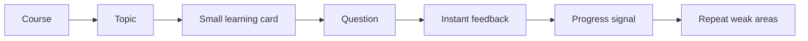
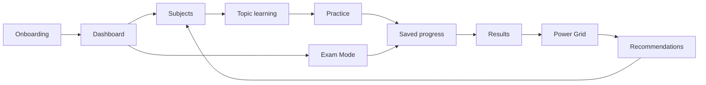

# 09 — Seneca Architecture Comparison

> **Purpose:** understand Seneca Learning's public product flow as inspiration only, map it against The Switch Platform's existing architecture, and document connected-learning principles for pre-launch redesign.  
> **Status:** documentation only — no implementation  
> **Updated:** 2026-07-06

Plain English: this folder records **how the platform should feel connected** — not a feature spec and not a Seneca clone. Principles extend the live Fly / OIDC / SQLite / module architecture. They do **not** replace auth, persistence, onboarding, or existing modules.

---

## Non-copy rule

This workstream must **not** copy Seneca private code, branding, UI assets, copy, database design, or proprietary implementation. Study observable public product principles only:

- short learning chunks
- course/topic structure
- instant quiz feedback
- adaptive repetition
- progress visibility
- simple next-step routing

The Switch must remain distinct through **Power Grid**, GCSE/iGCSE exam readiness, full paper and timed assessment flow, saved progress and resume, onboarding-driven dashboard creation, and accessibility / access-arrangements support.

---

## Read order

1. **[`ARCHITECTURE-PRINCIPLES.md`](./ARCHITECTURE-PRINCIPLES.md)** — eight principles (what to build)
2. **[`IMPLEMENTATION-PLAN.md`](./IMPLEMENTATION-PLAN.md)** — **Codex execution plan** (phases 0–9, code, APIs, tests)
3. [`01_Seneca_Product_Flow.md`](./01_Seneca_Product_Flow.md) → [`07_RECOMMENDATION_ADDENDUM.md`](./07_RECOMMENDATION_ADDENDUM.md) — comparison detail
3. [`../11_UI_UX_MASTER_GUIDE.md`](../11_UI_UX_MASTER_GUIDE.md) — UI expression of journey rules
4. [`../../PLATFORM-GUIDE.md`](../../PLATFORM-GUIDE.md) → Connected learning architecture
5. [`../../ideas/MARK-4-UI-UX-IMPLEMENTATION-PLAN.md`](../../ideas/MARK-4-UI-UX-IMPLEMENTATION-PLAN.md) — phased execution

---

## Files in this folder

| File | Purpose |
|------|---------|
| **`ARCHITECTURE-PRINCIPLES.md`** | Eight Switch-native principles (documentation) |
| **`IMPLEMENTATION-PLAN.md`** | **End-to-end technical plan for Codex** — phases, code, APIs, tests |
| `01_Seneca_Product_Flow.md` | Public-product learning loop and what can be learned from it |
| `02_Switch_Current_Architecture.md` | Current Switch modules and route connections |
| `03_Connected_Website_Map.md` | How the whole website should connect before launch |
| `04_Page_By_Page_Recommendations.md` | Practical recommendations for each major page |
| `05_Data_Flow_And_Modules.md` | Module/data flow: content → quiz → saved progress → results → Power Grid → recommendations |
| `06_Pre_Launch_Design_Actions.md` | Action checklist for design/practicality before launch |
| `07_RECOMMENDATION_ADDENDUM.md` | Required recommendations summary + **Switch-branded naming** options |

---

## Principle index

| # | Principle | Summary |
|---|-----------|---------|
| 1 | Connected Website | Every route leads to the next logical action — no dead ends |
| 2 | Recall Strength | Switch-branded memory/mastery system (documented future scope) |
| 3 | Power Grid engine | Central motivation — all activity feeds progression |
| 4 | Learning Loop Standard | Learn → Question → Feedback → Progress → Next → Power Grid → Recommendation |
| 5 | Dashboard Simplification | Four primary dashboard signals only above the fold |
| 6 | Recommendations brain | Decision engine ranking future navigation |
| 7 | Saved Progress glue | Continuity service linking every study route |
| 8 | Modular Architecture | Business logic in modules only — thin pages |

Full detail: [`ARCHITECTURE-PRINCIPLES.md`](./ARCHITECTURE-PRINCIPLES.md).

---

## Main conclusion

Seneca's strength is a tight study loop:

The Switch should keep that simplicity but connect it to a stronger GCSE command centre:

## Design rule

Every page should answer one question:

> What should the student do next?

If a page does not make that obvious, it needs redesign or simplification.

---

## Agent rule

At session start, after `HANDOFF.md`, read **`ARCHITECTURE-PRINCIPLES.md`**. For implementation work, read **`IMPLEMENTATION-PLAN.md`** and execute **one phase only**.

---

## What this is not

- Not a request to copy Seneca layout, branding, or terminology
- Not a greenfield rebuild or auth/persistence change
- Not implemented code — future sessions implement against these principles inside existing modules
