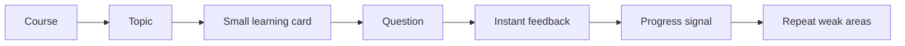
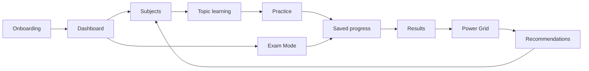

# Seneca Architecture Comparison — The Switch Platform

> **Purpose:** understand Seneca Learning's public product flow as inspiration only, then map it against The Switch Platform's existing architecture so the pre-launch redesign focuses on practicality, connection, and learner momentum.

## Non-copy rule

This workstream must **not** copy Seneca private code, branding, UI assets, copy, database design, or proprietary implementation. It should only study observable public product principles:

- short learning chunks
- course/topic structure
- instant quiz feedback
- adaptive repetition
- progress visibility
- simple next-step routing

The Switch must remain distinct through:

- **Power Grid** progress
- GCSE/iGCSE exam readiness
- full paper and timed assessment flow
- saved progress and resume
- onboarding-driven dashboard creation
- accessibility and access-arrangements support

## Files in this folder

| File | Purpose |
|------|---------|
| `01_Seneca_Product_Flow.md` | Public-product learning loop and what can be learned from it |
| `02_Switch_Current_Architecture.md` | Current Switch modules and route connections |
| `03_Connected_Website_Map.md` | How the whole website should connect before launch |
| `04_Page_By_Page_Recommendations.md` | Practical recommendations for each major page |
| `05_Data_Flow_And_Modules.md` | Module/data flow: content → quiz → saved progress → results → Power Grid → recommendations |
| `06_Pre_Launch_Design_Actions.md` | Action checklist for design/practicality before launch |

## Main conclusion

Seneca's strength is a tight study loop:

The Switch should keep that simplicity but connect it to a stronger GCSE command centre:

## Design rule for this workstream

Every page should answer one question:

> What should the student do next?

If a page does not make that obvious, it needs redesign or simplification.
