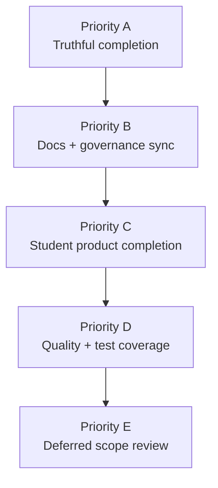

# Final Phase Plan — Full Completion Audit

> **Status:** **CURRENT MVP COMPLETE** — this is the single completion plan for the repository; Priorities A, B, C, and D are closed; **The Switch Platform v4 UI/UX Redesign** is in progress as a usability layer; Priority E remains deferred expansion scope
> **Created:** 2026-06-24
> **Purpose:** stop partial closeout; list everything still required for an honest full-completion claim
> **Live site:** https://theswitchplatform.com

Plain English: this file now tracks the remaining cleanup and quality work after the Priority A closeout. Keep it as the one place that says what is still open, what is historical, what is being actively improved under **The Switch Platform v4 UI/UX Redesign**, and what is still deferred.

This file replaces the older UI-only Final Phase roadmap with one full audit. It covers:

1. what must be done before the project can honestly be called **fully complete**
2. what product work is still unfinished in the current app
3. what repo/docs/governance cleanup is still needed
4. what is deferred scope rather than a current blocker

Read order every session:

1. [`HANDOFF.md`](../../HANDOFF.md)
2. **This file**
3. [`PLATFORM-GUIDE.md`](../../PLATFORM-GUIDE.md)
4. relevant `README.md` sections only when needed

---

## Audit verdict

### Current honest status

- **Documented status:** all 22 launch items are complete on Fly production
- **Audit status:** Priority A is **airtight enough to close** as of 26 June 2026; canonical evidence is recorded
- **Product status:** live MVP with active-plan closeout complete and only deferred expansion scope remaining

### Completion snapshot

| Lane | Status |
|------|--------|
| **Priority A** | **8 / 8 complete** |
| **Priority B** | **4 / 4 complete** |
| **Priority C** | **10 / 10 complete** |
| **Priority D** | **6 / 6 complete** |
| **Overall active plan (A+B+C+D)** | **28 / 28 complete — 100%** |

### What remains open now

The repo no longer has a truthful-completion proof gap or an open active-plan blocker. What remains is operational discipline:

- keep future release reruns synced with the canonical closeout evidence
- treat Priority E as deferred scope, not current MVP incompleteness
- treat **The Switch Platform v4 UI/UX Redesign** as the active usability/design improvement lane for the current MVP

### MVP usability plan — Area 9 progress (appended 29 June 2026)

Tracked in [`MVP-USABILITY-LAUNCH-READINESS-PLAN.md`](./MVP-USABILITY-LAUNCH-READINESS-PLAN.md) → **Area 9 — The Switch Platform v4 UI/UX Redesign (Mark 3.2 live surfaces)**.

| Step | Status |
|------|--------|
| UI masterplan (`docs/design/UI-UX-MASTERPLAN.md`) | **Complete** |
| Mark 3.2 `/dashboard` hero + subject + weakest-topics zones | **Complete** |
| Below-fold MVP dashboard sections preserved | **Complete** |
| `StudentAppShell` greeting rail (study days + Power Grid badge) | **Complete** |
| Fly production deploy | **Complete** |
| Docs sync (HANDOFF, AGENTS, README, PLATFORM-GUIDE, FINAL-PHASE-PLAN) | **Complete** |
| Mark 3.2 Cursor Agent build handoff ingested | **Complete** — `docs/design/MARK-3.2-CURSOR-AGENT-BUILD-HANDOFF.md` |
| Extend Mark 3.2 to other student routes | **Complete** — `/`, `/progress`, `/subjects`, `/assessments`, `/exams` |
| Full-route visual consistency audit | **Complete** — recommendations, results, saved-progress, accessibility, account, support |

**Area 9 summary:** `10 / 10` steps complete — Mark 3.2 UI/UX redesign lane closed for MVP.

### Completion rule

Do **not** reopen a truthful-completion blocker unless new evidence breaks the 26 June 2026 closeout. Keep docs and evidence synced when re-running closeout for new releases.

Product polish alone is not enough.

---

## Priority order



---

## Priority A — Truthful completion — **COMPLETE (26 June 2026)**

**Status: CLOSED.** All A-1–A-8 items below are done. Canonical evidence: `release-evidence/2026-06-26-priority-a-canonical-closeout.md`. `verify:live-onboarding` is recorded as API-assisted regression outside strict A-4 (browser proof remains in `release-evidence/2026-06-25-priority-a-truth-audit.md`). Re-run: `npm run verify:priority-a-closeout`. Do not reopen A unless new evidence breaks the closeout or the operator explicitly asks for it.

These were the blockers to an honest full-completion claim. They are now closed.

### A-1. Prove real live OIDC sign-in end to end without launch-verification bypass

**Historical problem**

- [`scripts/live-walkthrough-utils.mjs`](../../scripts/live-walkthrough-utils.mjs) prefers launch-verification headers when `SWITCH_LAUNCH_VERIFICATION_SECRET` is present.
- [`src/modules/auth/request.ts`](../../src/modules/auth/request.ts) accepts those headers as an authenticated session before normal auth.

**Required outcome**

- A final proof run must use the real deployed OIDC path, not synthetic launch headers.
- Evidence must show:
  - auth start
  - provider redirect
  - callback
  - session creation
  - protected route access
  - sign-out
  - protected route rejection after sign-out

**Done when**

- There is a date-stamped evidence file showing a real browser-authenticated run against production.
- The final proof path explicitly records that launch-verification bypass was **off**.

### A-2. Add a final live walkthrough mode that forbids launch-verification auth

**Historical problem**

- Current walkthrough tooling can pass even when real auth has not been exercised.

**Required work**

- Add a strict mode for final-path verification:
  - fail if `SWITCH_LAUNCH_VERIFICATION_SECRET` is present
  - require real student/admin cookies for OIDC mode
  - clearly label output as “real live auth proof”

**Done when**

- `verify:live-walkthrough` or a new explicit final-live command cannot silently use synthetic auth for completion evidence.

### A-3. Prove real deployed sign-out, session invalidation, and protected-route lockout

**Historical problem**

- Current local rehearsal covers sign-out better than the production closeout path.
- Current final evidence leans on manual/operator notes rather than a strict production proof chain.

**Required work**

- Capture real production evidence for:
  - authenticated session exists
  - sign-out clears/invalidates it
  - the same user is denied on protected routes afterward

**Done when**

- The release evidence bundle includes this explicitly.

### A-4. Prove a fresh learner completes onboarding through real auth, not synthetic headers

**Historical problem**

- [`scripts/verify-live-onboarding.mjs`](../../scripts/verify-live-onboarding.mjs) requires `SWITCH_LAUNCH_VERIFICATION_SECRET` and drives a synthetic user through API updates.

**Required work**

- Record one real new-learner production proof:
  - sign in
  - incomplete learner redirected into onboarding
  - all 8 steps
  - dashboard unlock
  - returning learner not sent back into onboarding

**Done when**

- Item 3 has real production evidence that does not rely on synthetic auth headers.

### A-5. Prove persistence recovery on the real deployed storage path

**Historical problem**

- [`scripts/persistence-recovery-check.mjs`](../../scripts/persistence-recovery-check.mjs) checks the runtime where the script executes.
- That is useful, but not enough by itself unless the script is run in the true deployed environment or against the true mounted store.

**Required work**

- Run the recovery proof on Fly production or the true production data mount.
- Capture:
  - driver
  - data directory
  - backup directory
  - recovery-ready status
  - restore/recovery result

**Done when**

- The evidence clearly ties the recovery check to the real `/data` path on production.

### A-6. Create one canonical release-evidence bundle for full completion

**Historical problem**

- Evidence is split across multiple files and older contradictory evidence still exists.

**Required work**

- Run the canonical closeout recorder:

```bash
npm run verify:priority-a-closeout
```

- That command writes `release-evidence/<date>-priority-a-canonical-closeout.md` and includes:
  - launch-status
  - live-readiness (via `verify:launch-complete`)
  - persistence-recovery (Fly delegate on `/data`)
  - real-auth walkthrough
  - referenced browser-authenticated onboarding proof from the interim truth audit
  - launch-signoff (Fly delegate)
  - launch-complete
  - live-truth-match (A-8 explicit rerun)
  - browser/manual notes (referenced from interim audit)

**Prerequisite:** refresh `SWITCH_LIVE_STUDENT_COOKIE` and `SWITCH_LIVE_ADMIN_COOKIE` — run `npm run verify:check-live-cookies` first.

**Done when**

- `npm run verify:priority-a-closeout` passes end to end.
- The new evidence file supersedes earlier partial evidence.
- Older evidence remains in repo but is marked historical/superseded where necessary.
- The canonical bundle does not imply that API-assisted onboarding regression coverage is part of the strict real-auth chain.

### A-7. Make launch-status and governance surfaces tell the current truth

**Historical problem**

- [`scripts/launch-status.mjs`](../../scripts/launch-status.mjs) still prints “remaining live-only items” as static closeout output.
- Governance service still contains seeded “remaining” closeout language and near-launch framing.

**Required work**

- Decide whether Final Path Mark 2 is truly closed or reopened.
- Align:
  - `launch-status`
  - governance final path summary
  - admin launch view
  - README/HANDOFF/AGENTS/PLATFORM-GUIDE wording

**Done when**

- No core surface says “complete” while another core surface still says “remaining live-only items” or “near-launch”.

### A-8. Re-run item 22 truth-match after A-1 to A-7 are complete

**Required work**

- Run `npm run verify:live-truth-match` after truth cleanup, or run the full closeout:

```bash
npm run verify:priority-a-closeout
```

**Done when**

- Item 22 is true in both content and proof, not only in mirrored docs.
- `verify:live-truth-match` is green inside the canonical closeout bundle.

---

## Priority B — Repo, docs, and governance sync

These items stop the repo from contradicting itself.

### B-1. Remove stale “still to prove live” notes that conflict with later completion claims

**Examples**

- [`README.md`](../../README.md) still contains older “still to prove live” language near the item 3 section.

**Done when**

- Historical notes are preserved but clearly marked superseded.

### B-2. Remove stale “near-launch” / “not yet complete” wording from active truth surfaces

**Examples**

- `README.md` still contains many historic near-launch statements.
- governance/service copy still contains seeded remaining-work language.

**Required work**

- Keep build history intact.
- Add explicit “historical context” framing where old closeout notes remain.
- Make active summary sections point to the current truth only.

### B-3. Sync the “single active roadmap” references to this full audit

**Why this is open**

- Several docs currently point to `FINAL-PHASE-PLAN.md`, but that file used to be UI-only.

**Required work**

- Ensure all references to the plan now mean full completion, not only redesign polish.

### B-4. Update `HANDOFF.md` live state to reflect audit-first reality

**Required outcome**

- The next session should start from:
  - truthful completion blockers first
  - then product completion

### B-5. Append README build record only when behavior changes, not for audit-only doc work

**Required discipline**

- Preserve build history signal quality.

---

## Priority C — Product completion work — **COMPLETE (24 June 2026)**

**Status: CLOSED.** All C-1–C-10 items below are done. Agents must not reopen this lane unless the operator explicitly requests an exception. Priority **A** is also **complete** (26 June 2026).

**Architecture gate:** all shipped C work follows `route → module service → API → persistence`. See `AGENTS.md` → Priority C completion record for module paths.

These were real product gaps; all are now resolved in code and verified (102/102 tests, 24 June 2026).

### C-1. Shell rollout on remaining signed-in student routes — **complete (2026-06-24)**

**Shipped**

| Route | Notes |
|-------|--------|
| [`/results`](../../src/app/results/page.tsx) | `StudentAppShell`, slim summary |
| [`/saved-progress`](../../src/app/saved-progress/page.tsx) | `StudentAppShell`, resume list |
| [`/recommendations`](../../src/app/recommendations/page.tsx) | `StudentAppShell` |
| [`/account`](../../src/app/account/page.tsx) | Shell when signed in; standalone layout when signed out |
| [`/accessibility`](../../src/app/accessibility/page.tsx) | `StudentAppShell`, dedicated settings experience |

**Already shipped before C-1:** `/dashboard`, `/subjects`, `/assessments`, `/progress`

**Out of C-1 scope (separate items):** `/exams` (C-2), `/support` (C-3)

**Done when** — signed-in student workflow routes above use shared chrome; exceptions documented in C-2/C-3.

### C-2. Decide the `/exams` shell model — **complete (2026-06-24)**

**Shipped:** lobby in `StudentAppShell`; active papers use focus mode (`focus=1` or `questionId` with `examId`) without study rail. Helpers: `src/lib/exams/focus-mode.ts`. Documented in `src/modules/exam-engine/README.md`.

### C-3. Decide whether `/support` is a public marketing surface or a signed-in student route — **complete (2026-06-24)**

**Shipped:** public marketing hub via `PublicMarketingPage` on `/support`.

### C-4. Apply marketing header/footer consistently on public routes — **complete (2026-06-24)**

**Shipped:** `PublicMarketingPage` on `/support`, `/how-it-works`, `/login`; homepage already had marketing chrome.

### C-5. Complete planner persistence — **complete (2026-06-24)**

**Shipped:** `PlannerPromptCard` dismiss persisted per user via `/api/dashboard/ui-preferences` and `dashboard-ui-preferences-store`.

### C-6. Build a real weekly planner backed by app data — **complete (2026-06-24)**

**Shipped:** `src/modules/weekly-planner/` + `/api/planner/week`; same `WeeklyPlannerGrid` on dashboard and `/progress`.

### C-7. Use onboarding/catalog subject signals in planner and route summaries — **complete (2026-06-24)**

**Shipped:** `src/lib/subjects/tone.ts` — catalog-backed tone chips on dashboard, planner, and progress.

### C-8. Finish account/auth UX alignment — **complete (2026-06-24)**

**Shipped:** `/account` in shell when signed in; `/login` on marketing chrome.

### C-9. Accessibility route consistency pass — **complete (2026-06-24)**

**Shipped:** `/accessibility` in `StudentAppShell` (C-1).

### C-10. Recovery and empty-state consistency pass — **complete (2026-06-24)**

**Shipped:** shared `StudentRouteRecovery` on exams, progress, and saved-progress empty state.

---

## Priority D — Quality, operations, and test coverage

These items reduce hidden risk.

### D-1. Add tests for strict real-auth final proof mode

**Required tests**

- final live verification fails when launch-verification secret is present
- cookie-mode/auth-mode selection is explicit

### D-2. Add tests for real sign-out and protected-route denial assumptions

**Required tests**

- session exists
- sign-out clears it
- protected route no longer works

### D-3. Add tests for planner dismiss persistence

**Required tests**

- dismissal persists across refresh
- persists per user

### D-4. Add tests for shell coverage rules

**Required work**

- Assert the intended route list for `StudentAppShell`
- Catch accidental regression back to standalone pages

### D-5. Content/editorial quality pass

**Why this is still open**

- CMS/service copy still references broader missing-data and product-pass gaps.
- Content/operations surfaces still mention broader coverage limitations.

**Required work**

- Audit route-level copy for:
  - “not yet”
  - “future”
  - placeholder product explanations
- Decide what is acceptable MVP truth vs what needs implementation

### D-6. Admin/governance surface copy pass

**Required work**

- Ensure admin view describes the live system accurately.
- Remove mixed “done” and “remaining” signals unless intentionally historical.

---

## Priority E — Deferred scope (list it, but do not confuse it with current blockers)

**Related live lane:** the practical work to improve usability, clickability, route stability, and student-facing polish is now tracked separately as **The Switch Platform v4 UI/UX Redesign** in [`MVP-USABILITY-LAUNCH-READINESS-PLAN.md`](./MVP-USABILITY-LAUNCH-READINESS-PLAN.md). Priority E below remains future expansion scope, not the current in-progress redesign lane.

These are still real future tasks, but they are **not** blockers to current truthful completion if the scope remains the current MVP.

### E-1. GCSE Wales and Northern Ireland onboarding routes

- currently signposted as “coming later”
- blocked by explicit MVP scope lock

### E-2. Parent and teacher onboarding variants

- visible in role thinking, not yet delivered as full separate journeys

### E-3. Admin restyle to full Study Atelier language

- useful, but not a current launch-truth blocker

### E-4. i18n-ready copy centralisation

- good platform work, not current blocker

### E-5. Broader exam/content coverage beyond current launch subjects

- some ops/content copy still hints at broader future coverage
- treat as scope expansion, not current MVP honesty blocker

---

## File-backed audit notes

Use these references when executing the plan.

### Auth and final proof

- [`scripts/live-walkthrough-utils.mjs`](../../scripts/live-walkthrough-utils.mjs)
- [`scripts/verify-live-onboarding.mjs`](../../scripts/verify-live-onboarding.mjs)
- [`scripts/live-readiness.mjs`](../../scripts/live-readiness.mjs)
- [`scripts/persistence-recovery-check.mjs`](../../scripts/persistence-recovery-check.mjs)
- [`scripts/live-truth-match.mjs`](../../scripts/live-truth-match.mjs)
- [`src/modules/auth/request.ts`](../../src/modules/auth/request.ts)

### Governance and truth surfaces

- [`scripts/launch-status.mjs`](../../scripts/launch-status.mjs)
- [`src/modules/governance/service.ts`](../../src/modules/governance/service.ts)
- [`src/app/admin/page.tsx`](../../src/app/admin/page.tsx)
- [`release-evidence/2026-06-21-final-path-mark-2-local-live-check.md`](../../release-evidence/2026-06-21-final-path-mark-2-local-live-check.md)
- [`release-evidence/2026-06-23-final-path-mark-2-item-22-complete.md`](../../release-evidence/2026-06-23-final-path-mark-2-item-22-complete.md)

### Student routes — shell status

| Route | Status |
|-------|--------|
| `/dashboard`, `/subjects`, `/assessments`, `/progress` | Shipped (prior) |
| `/results`, `/saved-progress`, `/recommendations`, `/account`*, `/accessibility` | **Shipped 2026-06-24** |
| `/exams` | C-2 — **focus mode** (lobby in shell, active paper without shell) |
| `/support` | C-3 — **public marketing hub** via `PublicMarketingPage` |

\* `/account` uses shell when signed in; signed-out keeps standalone layout.

---

## Execution checklist

Mark these only when evidence exists.

### Truthful completion

- [x] A-1 Real OIDC sign-in proof recorded without synthetic auth
- [x] A-2 Final live verification forbids launch-verification bypass
- [x] A-3 Real sign-out + route rejection proof recorded
- [x] A-4 Real fresh-learner onboarding proof recorded
- [x] A-5 Persistence recovery proven on true production storage path
- [x] A-6 Canonical final release-evidence bundle created
- [x] A-7 Launch-status / governance / docs all tell the same truth
- [x] A-8 Final truth-match rerun and green

### Product completion

- [x] **Priority C lane complete (24 June 2026)** — C-1 through C-10 closed; do not reopen unless operator requests
- [x] C-1 Remaining student route shell rollout complete (exams/support → C-2/C-3)
- [x] C-2 `/exams` shell/focus rule decided and implemented (lobby in shell; `focus=1` active papers)
- [x] C-3 `/support` route model clarified and implemented (public marketing hub)
- [x] C-4 Public marketing chrome consistent (`/`, `/how-it-works`, `/login`, `/support`)
- [x] C-5 Planner dismiss persistence complete (`/api/dashboard/ui-preferences`)
- [x] C-6 Weekly planner API-backed (`/api/planner/week`; dashboard + `/progress`)
- [x] C-7 Subject tone/data integration complete (`src/lib/subjects/tone.ts`)
- [x] C-8 Account/auth UX aligned (signed-in account in shell; login on marketing chrome)
- [x] C-9 Accessibility route aligned (C-1 shell rollout)
- [x] C-10 Recovery/empty-state consistency pass complete (`StudentRouteRecovery`)

### Quality and sync

- [x] B-1 stale “still to prove live” notes cleaned up
- [x] B-2 stale “near-launch” active truth surfaces cleaned up
- [x] B-3 all roadmap references point to this full audit
- [x] B-4 handoff state reflects audit-first priority
- [x] D-1 strict real-auth proof tests added
- [x] D-2 sign-out/session denial tests added (`tests/auth-session-lifecycle.test.mjs`)
- [x] D-3 planner persistence tests added (`tests/final-phase-product.test.mjs`)
- [x] D-4 shell coverage tests added (`tests/student-app-shell-coverage.test.mjs`)
- [x] D-5 content/editorial quality pass complete
- [x] D-6 admin/governance copy pass complete

---

## Definition of done

The project can only be called **fully complete** when:

1. every Priority A item is done
2. every Priority C item intended for the current MVP is done or deliberately documented as an exception
3. active truth surfaces no longer contradict each other
4. the release evidence bundle proves the real deployed system, not a synthetic shortcut

Those conditions are now met for the current MVP closeout. Priority E remains a deferred expansion list, not a reopened truthful-completion blocker.

---

## Changelog

| Date | Change |
|------|--------|
| 2026-06-24 | Rewritten as full completion audit (Priorities A–E) |
| 2026-06-24 | **Priority C complete** — C-1 through C-10 closed; lane marked authoritative in HANDOFF / AGENTS / README |
| 2026-06-24 | **C-1 complete** — shell on saved-progress, recommendations, account, accessibility |
