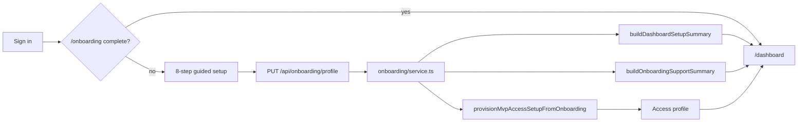

# Streamline website plan — Study Atelier

> **Status:** In progress (homepage + dashboard declutter shipped 2026-06-24)  
> **Build priority:** #5 Dashboard  
> **Related:** [`MOCK-IDEA-BUILD-REFERENCE.md`](../MOCK-IDEA-BUILD-REFERENCE.md) · [`MOCK-IDEA-AI-IDEAS.md`](../MOCK-IDEA-AI-IDEAS.md)

Plain English: make the public site and signed-in home **clear and calm** — one place for each idea — **without** touching the 8-step onboarding that builds each student’s dashboard.

---

## Product decision — onboarding stays

**Operator decision (2026-06-24):** Onboarding is **not** a candidate for declutter or step reduction.

Onboarding is the **dashboard factory** for every new learner:

| Onboarding captures | Dashboard / platform consumes |
|---------------------|-------------------------------|
| Qualification path + year group | Subject filter, setup summary, route personalisation |
| Selected MVP subjects (`selectedSubjectIds`) | Focus cards, subject routes, planner defaults |
| Support / SEND / access choices (step 5) | `supportPreferenceChips`, `SendSupportRail`, accessibility seeds |
| Guardian + consent (steps 6–7) | Gate to first dashboard; compliance path preserved |
| `complete: true` on profile API | `provisionMvpAccessSetupFromOnboarding()` → access profile |
| Incomplete profile | `/dashboard` redirects to `/onboarding` |



**Do not:**

- Merge steps 5–6 (support + guardian) without operator sign-off
- Remove the dashboard gate or make dashboard generic before setup
- Re-ask for subjects, qualification, or support on the dashboard — consume onboarding outcomes via `getDashboardHomeData()` and onboarding helpers only
- Move onboarding business rules into page components

**Code touchpoints (agents):**

- `src/modules/onboarding/service.ts` — step order, validation, `buildDashboardSetupSummary`, `buildOnboardingSupportSummary`, `provisionMvpAccessSetupFromOnboarding`
- `src/app/onboarding/` — thin UI only
- `src/app/dashboard/page.tsx` — redirect if `!onboarding.isComplete`
- `src/modules/dashboard/service.ts` — reads onboarding overview for chips and setup copy

**Live proof:** Item 3 complete — `npm run verify:live-onboarding` (evidence in `release-evidence/2026-06-23-final-path-mark-2-item-3-complete.md`).

---

## Problem we are solving

The platform was **visually complete** but **cognitively crowded**:

- Homepage and dashboard shared one mega-component with duplicate metrics, support blocks, route grids, and dev-only mockups
- Signed-in shell repeated support chips that `SendSupportRail` already showed
- Preview / app mockup sections belonged on gallery routes, not the live student path

Onboarding was **never** the clutter source — it is a separate gated flow with a clear job: **build the learner context the dashboard needs**.

---

## Phase 1 — Homepage + dashboard declutter ✅ Shipped 2026-06-24

| Area | Done | Notes |
|------|------|-------|
| Homepage `/` | ✅ | Hero + next step, one route grid, compact motivation |
| Dashboard `/dashboard` | ✅ | Recommended-now strip, metrics, routes, sessions, subject focus |
| Removed from live paths | ✅ | Website preview mockup, phone mockup, duplicate heroes, architecture dev copy |
| `StudentAppShell` | ✅ | `showSendSideRail={false}` on dashboard when `SendSupportRail` present |
| Onboarding | ✅ **Unchanged** | All 8 steps; gate intact |

**Gallery routes keep rich mockups:**

- `/mock-idea-preview` — Study Atelier visual reference
- `/app-preview` — website + app concept from real data model

---

## Phase 2 — Consistent student shell ✅ Shipped 2026-06-24

Apply `StudentAppShell` to high-traffic signed-in routes so nav is not rebuilt per page.

| Route | Priority | Wrap in shell | Onboarding data |
|-------|----------|---------------|-----------------|
| `/subjects` | High | ✅ Yes | Highlights `selectedSubjectIds`; prefers onboarding subject on load |
| `/assessments` | High | ✅ Yes | Support chips from onboarding profile |
| `/progress` | High | ✅ Yes | Planner destination; auth + onboarding gate |
| `/dashboard` | — | ✅ (prior) | Uses shared `requireStudentAppRouteContext()` |
| `/results` | Medium | Planned | Slim summary layout |
| `/accessibility` | Medium | Optional | Settings — may keep dedicated layout |
| `/support` | Medium | Optional | Signposting-only |
| `/onboarding` | — | **No** | Uses `OnboardingShell` only |

**Rule:** extend shell; do not duplicate `STUDENT_NAV_ITEMS` or SEND rails on each page.

---

## Phase 3 — Planner + dismiss persistence (planned)

| Item | Description | Module boundary |
|------|-------------|-----------------|
| Planner week grid | Bento links to `/progress`; slots from saved progress + exams API | Dashboard / planner module — not page-only logic |
| Dismiss persistence | Remember closed planner prompt per user | Saved progress or account settings API |
| Subject colour chips | Planner events use subject tone colours | Read from onboarding/catalog — do not re-pick subjects |

Onboarding **already** supplies subject IDs; planner UI should **read** them, not ask again.

---

## Phase 4 — Marketing trim (planned)

Safe to simplify **public** surfaces only:

| Item | Action |
|------|--------|
| Marketing header | Keep 3–4 links max: How it works, Support, Log in, Get started |
| Homepage CTAs | One primary CTA; secondary links in footer |
| Footer | Keep SEND swatches + core links — already compact |

**Not in scope:** shortening onboarding, removing guardian/consent, or skipping **secondary school** capture.

### Onboarding MVP qualification scope (2026-06-24)

| Selectable now | Deferred (Coming later) |
|----------------|-------------------------|
| GCSE (England) | GCSE (Wales) |
| iGCSE | GCSE (Northern Ireland) |

School step: **secondary school** name, **England** nation only during MVP. Full detail: `src/modules/onboarding/README.md`.

---

## Phase 5 — Verify and deploy (planned)

```bash
npm run lint && npm run type-check && npm run test
npm run verify:live-onboarding   # onboarding → dashboard path still green
npm run verify:live-walkthrough  # signed-in routes after shell rollout
```

Manual checks:

- [ ] New learner: sign in → 8 steps → personalised dashboard (subjects + support chips visible)
- [ ] Returning learner: `/dashboard` loads without re-onboarding
- [ ] Homepage: no duplicate route grids or mockup blocks
- [ ] `/mock-idea-preview` still documents full visual direction

---

## Agent session prompt (streamline work)

```text
Read HANDOFF.md first.
Read docs/ideas/STREAMLINE-WEBSITE-PLAN.md.
Read docs/MOCK-IDEA-BUILD-REFERENCE.md.

Rules:
- Onboarding stays: 8 steps, dashboard gate, no re-asking setup on dashboard.
- Streamline marketing shell and dashboard chrome only.
- Reuse StudentAppShell and mock-idea components.
- Business logic in modules/API — thin page components.
```

---

## Changelog

| Date | Change |
|------|--------|
| 2026-06-24 | Created plan; recorded operator decision to keep onboarding; Phase 1 marked shipped |
